# Análise de Tarefas

## 1. Introdução

Uma análise de tarefas é feita com o objetivo de buscar um entendimento sobre qual é o trabalho que os usuários exercem, como eles o realizam e por quê. Com isso, o trabalho é definido com base nos objetivos alcançáveis e necessários que os usuários devem apresentar no uso do sistema.

A análise pode ser utilizada em três atividades habituais, em IHC. A primeira é a análise da situação atual (apoiada ou não por um sistema computacional), a segunda é para o (re)design de um sistema computacional e, por fim, para a avaliação do resultado de uma intervenção que inclua a introdução de um (novo) sistema computacional.

Definir os objetivos das pessoas, em termos psicológicos, é um dos primeiros passos a serem feitos numa análise de tarefas. Ou seja, para cada objetivo, é feito uma listagem das atividades/ações feitas por um agente para alcançar esse objetivo. Segundo Diaper [1], quando há múltiplo agentes, recomenda-se representar as ações de cada agente a parte um do outro, fazendo isso em colunas diferentes. Além disso, Diaper ainda ressalta que, independentemente da forma como os dados para uma análise de tarefas forem coletados, só teremos uma simulação das verdadeiras tarefas de interesse. Já que apenas uma pequena porção do trabalho pode ser observada e também porque existem uma quantidade potencialmente infinita de tarefas realizadas por diferentes pessoas.

Para o escopo do site escolhido pelo grupo, as tarefas foram avaliadas por meio da Análise Hierárquica de Tarefas (HTA - Hierarchical Task Analysis) e Objetivos, Operadores, Métodos e Regras de Seleção (GOMS) para analisar o desempenho de usuários competentes de sistemas computacionais.

## 2. Análise Hierárquica de Tarefas (HTA)

Essa análise foi desenvolvida para compreender as competências e habilidades exibidas em tarefas complexas e não repetitivas, bem como para auxiliar na identificação de problemas de desempenho, seus elementos podem ser observados na figura 1.[1]

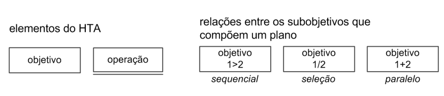
**Figura 1: Análise Hierárquica de Tarefas[1] (Fonte: adaptado de BARBOSA (2021)).**

## 3. Diagrama das Tarefas

A análise foi realizada com o uso do site do DETRAN GO [2], sendo que parte das funcionalidades precisam de login para serem acessadas, outras podem ser utilizadas sem realizar essa autenticação As atividades para análise foram divididas em 2 seções principais:

* Atividades de acesso na plataforma logada
* Atividades fora do escopo de acesso da plataforma logada

O diagrama completo pode ser observado na figura 2 e as seções nas figuras 3 e 4.

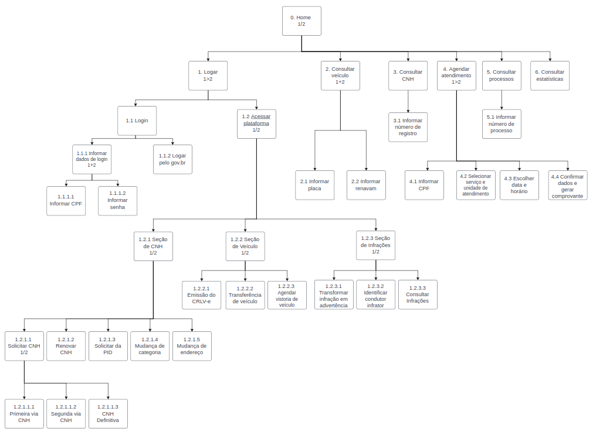

**Figura 2: Diagrama de tarefas[3] (Fonte: Autores).**

### 3.1 Atividades de acesso na plataforma logada

Na plataforma logada, as principais tarefas que o usuário pode realizar dependem de cada sessão em questão, sendo possível ter uma visão geral delas por meio do diagrama apresentado na figura 3. Assim, dividimos as tarefas em 3 seções, cada uma com objetivos específicos do usuário. Assim, temos 3 seções a serem analisadas: 

* Seção de CNH
* Seção de veículo 
* Seção de infrações.

 

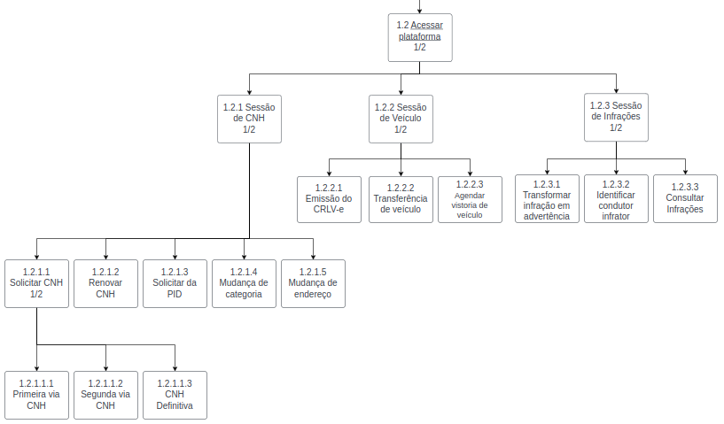

**Figura 3: Diagrama para Atividades de acesso na plataforma logada[3] (Fonte: Autores, 2023).**

### 3.1.1 Tarefas da seção de CNH

As tarefas possíveis nesta seção estão relacionadas com os objetivos que são apresentados na tabela e na figura 4 a seguir.

### Representação em Tabela dos objetivos da seção de CNH

| Objetivos/Operações | Descrição |
|---------------------|---------------------------|
| 1.2.1.1 Solicitar CNH | pode ser feita com a solicitação da primeira ou segunda via, além de ser possível solicitar a CNH definitiva |
| 1.2.1.2 Renovar CNH | Pedido de renovação do CNH |
| 1.2.1.3 Solicitar da PID | Pedido de solicitação da PID |
| 1.2.1.4 Mudança de categoria |  Mudar categoria da CNH |
| 1.2.1.5 Mudança de endereço | Mudar endereço do usuário |

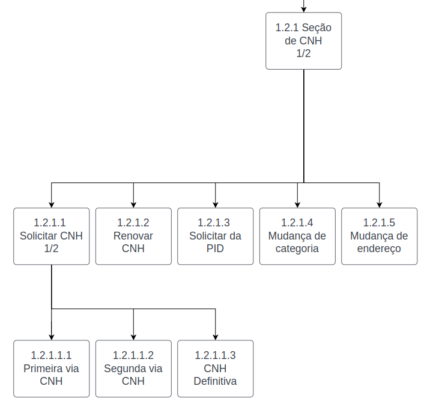

**Figura 4: Diagrama para atividades na seção de CNH[3] (Fonte: Autores, 2023).**

### 3.1.2 Tarefas da seção de veículo

As tarefas possíveis nesta seção estão relacionadas com os objetivos que são apresentados na tabela e na figura 5 a seguir.

### Representação em Tabela dos objetivos da seção de veículo

| Objetivos/Operações | Descrição |
|---------------------|---------------------------|
| 1.2.2.1 Emissão do CRLV-e| Emitir CRLV-e |
| 1.2.2.2 Transferência de veículo | Pedido para transferência do veículo |
| 1.2.2.3 Agendar vistoria de veículo | agendamento para a vistoria |

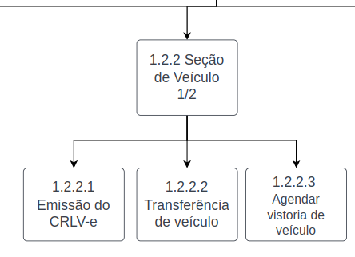

**Figura 5: Diagrama para atividades na seção de veículo[3] (Fonte: Autores, 2023).**

### 3.1.3 Tarefas da seção de infrações

As tarefas possíveis nesta seção estão relacionadas com os objetivos que são apresentados na tabela e na figura 6 a seguir.

### Representação em Tabela dos objetivos da seção de infrações

| Objetivos/Operações | Descrição |
|---------------------|---------------------------|
| 1.2.3.1 Transformar infração em advertência| Transformação da infração em advertência |
| 1.2.3.2 Identificar condutor infrator | Identificação do condutor infrator |
| 1.2.3.3 Consultar infrações | Verificar quais infrações foram feitas |

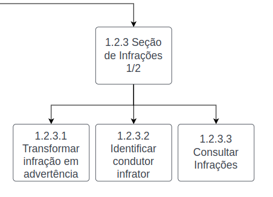

**Figura 6: Diagrama para atividades na seção de infrações[3] (Fonte: Autores, 2023).**

### 3.2 Atividades fora do escopo de acesso da plataforma logada

As atividades fora do escopo estão descritas a seguir na figura 7, onde o usuário possui 5 ações possíveis:

* Consultar veículo
* Consultar CNH
* Agendar atendimento
* Consultar processos
* Consultar estatísticas

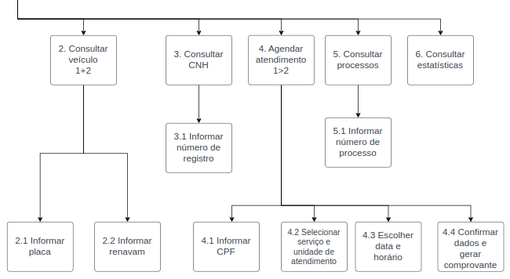

**Figura 7: Diagrama para Atividades fora do escopo de acesso da plataforma logada[3] (Fonte: Autores).**

### 3.2.1 Tarefa para consultar veículo

Essas tarefas dependem do usuário informar a placa do veículo em questão assim como o renavam que o mesmo apresenta. Está representado essa tarefa a seguir na figura 8.

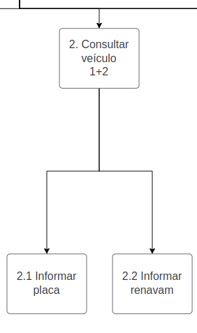

**Figura 8: Diagrama para tarefa de consultar veículo[3] (Fonte: Autores, 2023).**

### 3.2.2 Tarefa para consultar CNH

Essas tarefa depende apenas do usuário informar o número de registro do documento, como pode ser visto na figura 9. Com isso, ele vai poder ser direcionado para uma página contendo a CNH na qual deseja consultar.

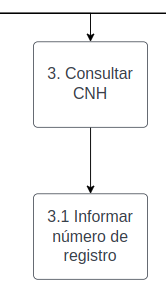

**Figura 9: Diagrama para consultar CNH[3] (Fonte: Autores, 2023).**

### 3.2.3 Tarefa para agendar atendimento

Para realizar essa tarefa é preciso realizar ações sequenciais, descritas na figura 10. Vão desde informar o CPF até a ação de confirmar os dados para a geração de comprovante.

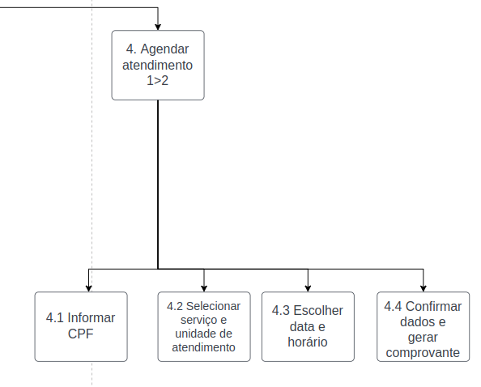

**Figura 10: Diagrama para agendar atendimento[3] (Fonte: Autores, 2023).**

### 3.3 Atividades dos funcionários do Detran

Os funcionários do Detran são pessoas importantes para o funcionamento do Detran, pois as informações que o público têm acesso na plataforma precisam ser inseridas de alguma maneira, no caso do Detran, os funcionários possuem uma plataforma exclusiva e não vinculada diretamente ao sítio que estamos analisando, porém ambas plataformas utilizamos o mesmo banco de dados, é importante mencionar quais são as tarefas que estes fazem para manipular os dados, mas como a plataforma que utilizam não faz parte do escopo de análise desta equipe, nos limitaremos a apenas a análise de tarefas que pode ser observada na figura 12.

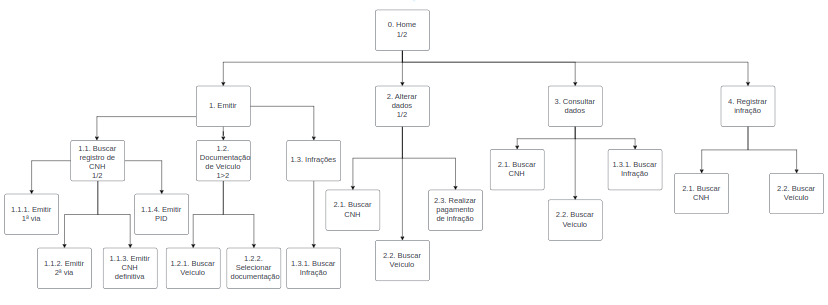

**Figura 12: Diagrama para Atividades dos funcionários do Detran (Fonte: Autores).**

## 4. Objetivos, Operadores, Métodos e Regras de Seleção (GOMS)
De acordo com Barbosa et al[1], este é um método para descrever uma tarefa e o conhecimento do usuário sobre como realizá-la em termos de objetivos (*goals*), operadores (*operators*), métodos (*methods*) e regras de seleção (*selection rules*). 

Em termos gerais, os **objetivos** representam o que o usuário quer realizar utilizando o software, os **operadores** são as ações que o usuário pode fazer (primitivas internas/cognitivas) e as ações que o software permite que o usuário faça (primitivas externas). Os **métodos** são sequências bem conhecidas de subobjetivos e operadores que permitem atingir um objetivo maior. Quando há mais do que um método para atingir um mesmo objetivo, são necessárias **regras de seleção**, que representam tomadas de decisão dos usuários sobre qual método utilizar numa determinada situação.

Com isso, dentre o conjunto de modelos GOMS (*Goals*, *Operators*, *Methods and Selection Rules* - Objetivos, Operadores, Métodos e Regras de Seleção), foi escolhido o modelo CMN-GOMS[1] o qual foi proposto para dividir as tarefas de acordo com os objetivos, onde cada objetivo apresenta um método e cada método descreve operações a serem realizadas, também podendo apresentar as regras de seleção. 

Dessa forma, esse modelo foi utilizado pensando nos seguintes objetivos: 

* Consultar Veículo
* Consultar CNH
* Solicitar CNH

Essas tarefas foram analisadas a seguir:

### 4.1 Consultar Veículo

GOAL 0: Consultar Veículo

GOAL 1: encontrar a seção de veículos da plataforma

OP. 1.1: posicionar o cursor do mouse em cima do botão "Veículos" no topo da tela

OP. 1.2: clicar no botão "Veículos" 

GOAL 2: entrar na aba de consulta de veículos 

OP. 2.1: posicionar o cursor do mouse em cima sobre o botão "Consultar" 

OP. 2.2: clicar no botão "Consultar" 

GOAL 3: inserir informações de placa e renavam para consultar veículo 

OP. 3.1: inserir dado da placa do veículo no campo estabelecido

OP. 3.2: inserir dado do renavam do veículo no campo estabelecido 

OP. 3.3: clicar no botão "Consultar" 

### 4.2 Consultar CNH

GOAL 0: Consultar CNH

GOAL 1: encontrar a seção de habilitação da plataforma

METHOD 1.A: Scroll(deslizar) do mouse para baixo ou cima

(SEL. RULE: o usuário está na página de veículos e prefere descer para baixo utilizando o scroll do mouse)

OP. 1.A.1: Deslizar o scroll do mouse para baixo

METHOD 1.B: Botão na barra de navegação 

(SEL. RULE: o usuário está na página de veículos e prefere clicar em um botão)

OP. 1.B.1: posicionar o cursor do mouse em cima do botão "Habilitação" no topo da tela

OP. 1.B.2: clicar no botão "Habilitação" 

GOAL 2: inserir número de registro da CNH para consulta 

OP. 2.1: inserir dado do número de registro da CNH no campo estabelecido 

OP. 2.2: clicar no botão "Consultar" 

### 4.3 Solicitar CNH

GOAL 0: Solicitar CNH

GOAL 1: encontrar a seção de habilitação da plataforma

METHOD 1.A: Scroll(deslizar) do mouse para baixo ou cima

(SEL. RULE: o usuário está na página de veículos e prefere descer para baixo utilizando o scroll do mouse)

OP. 1.A.1: Deslizar o scroll do mouse para baixo

METHOD 1.B: Botão na barra de navegação 

(SEL. RULE: o usuário está na página de veículos e prefere clicar em um botão)

OP. 1.B.1: posicionar o cursor do mouse em cima do botão "Habilitação" no topo da tela

OP. 1.B.2: clicar no botão "Habilitação" 

GOAL 2: Começar em botão a solicitação da primeira CNH 

OP. 2.1: clicar no link "Primeira CNH" dentro da aba de "Outros Serviços" 

OP. 2.2: clicar no botão "Avançar" na página de Primeira CNH 

GOAL 3: Identificar-se para o sistema 

OP. 3.1: Preencher campo de CPF 

OP. 3.2: Preencher campo de data de nascimento 

OP. 3.3: Preencher campo de nome 

OP. 3.4: Preencher campo de nome da mãe 

OP. 3.5: clicar no botão "Avançar" 

GOAL 4: Preencher dados  pessoais e endereço 

OP. 4.1: Preencher campo de nome do Pai 

OP. 4.2: Preencher campo de identidade 

OP. 4.3: Preencher campo de orgão expedidor 

OP. 4.4: Preencher campo de UF expedidor 

OP. 4.5: Preencher campo de data de expedição 

OP. 4.6: Preencher campo de sexo 

OP. 4.7: Preencher campo de estado civil 

OP. 4.8: Preencher campo de Nacionalidade

OP. 4.9: Preencher campo de UF nascimento 

OP. 4.10: Preencher campo de profissão 

OP. 4.11: Preencher campo de escolaridade 

OP. 4.12: Preencher campo de CEP 

OP. 4.13: Preencher campo de complemento

OP. 4.14: Preencher campo de número

OP. 4.15: Preencher campo de telefone 

OP. 4.16: Preencher campo de E-mail 

OP. 4.17: clicar no botão "Avançar" 

GOAL 5: Informar categoria da CNH 

OP. 5.1: escolher por meio das opções do botão a categoria 

OP. 5.2: clicar no botão "Avançar" 

GOAL 6: Escolher CFC (Opcional) 

OP. 6.1: escolher por meio das opções do botão a CFC 

OP. 6.2: clicar no botão "Avançar" 

GOAL 7: Emitir boleto para pagamento 

OP. 7.1: Clicar no botão para emitir o boleto 

## 5. Conclusão
Com isso, pensando nas ações que os usuários definidos pelo [artefato de perfil de usuário](./perfilUsuario.md), foi possível realizar a análise das principais tarefas que os usuários podem realizar dentro do site do Detran-GO por meio das duas técnicas propostas neste artefato.

## 6. Bibliografia

> [1] Barbosa, S. D. J.; Silva, B. S. da; Silveira, M. S.; Gasparini, I.; Darin, T.; Barbosa, G. D. J. (2021) Interação Humano-Computador e Experiência do usuário. Capítulo 8.4: Análise de Tarefas, páginas 177 - 189 Autopublicação. ISBN: 978-65-00-19677-1.

> [2] Sítio DetranGO: https://www.detran.go.gov.br/psw/#/pages/pagina-inicial, Acesso em 5 de Maio de 2023.

> [3] Diagrama de Análise de Trefas: https://drive.google.com/file/d/1YK7c3eFxmlE0aQsIR92aZc3gM6g7ZTfv/view?usp=sharing, Acesso em 25 de Junho de 2023.

## 7. Histórico de Versão

| Versão | Data       | Descrição                          | Autor(es)     |  Revisor(es)  |
| ------ | ---------- | ---------------------------------- | ------------- | ------------- |
| `1.0`  | 29/04/2023 | Criação do documento.              | Pedro H. |  João M. |
| `1.1`  | 05/05/2023 | Adição inicial do Diagrama da HTA  | Pedro H. e João M. |  Carlos E. |
| `1.2`  | 05/05/2023 | Adição das imagens e atividades dos funcionários  | Pedro H. e João M. |  Carlos E. |
| `1.3`  | 08/05/2023 | Descrição das atividades e correção de erros  | Pedro H. e João M. |  Carlos E. |
| `1.4`  | 25/06/2023 | Adição de outra análise de tarefas  | Pedro H. |  Felipe M. |
