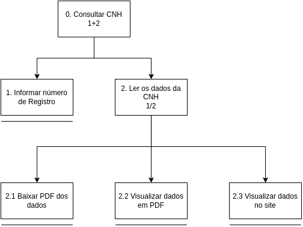
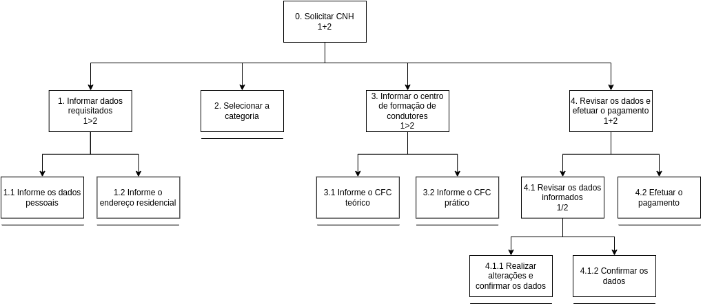
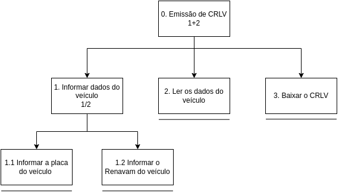

# Análise de Tarefas

## 1. Introdução

Uma análise de tarefas é feita com o objetivo de buscar um entendimento sobre qual é o trabalho que os usuários exercem, como eles o realizam e por quê. Com isso, o trabalho é definido com base nos objetivos alcançáveis e necessários que os usuários devem apresentar no uso do sistema.

A análise pode ser utilizada em três atividades habituais, em IHC. A primeira é a análise da situação atual (apoiada ou não por um sistema computacional), a segunda é para o (re)design de um sistema computacional e, por fim, para a avaliação do resultado de uma intervenção que inclua a introdução de um (novo) sistema computacional.

Definir os objetivos das pessoas, em termos psicológicos, é um dos primeiros passos a serem feitos numa análise de tarefas. Ou seja, para cada objetivo, é feito uma listagem das atividades/ações feitas por um agente para alcançar esse objetivo. Segundo Diaper [1], quando há múltiplo agentes, recomenda-se representar as ações de cada agente a parte um do outro, fazendo isso em colunas diferentes. Além disso, Diaper ainda ressalta que, independentemente da forma como os dados para uma análise de tarefas forem coletados, só teremos uma simulação das verdadeiras tarefas de interesse. Já que apenas uma pequena porção do trabalho pode ser observada e também porque existem uma quantidade potencialmente infinita de tarefas realizadas por diferentes pessoas.

Para o escopo do site escolhido pelo grupo, as tarefas foram avaliadas por meio da Análise Hierárquica de Tarefas (HTA - Hierarchical Task Analysis) e Objetivos, Operadores, Métodos e Regras de Seleção (GOMS) para analisar o desempenho de usuários competentes de sistemas computacionais.

## 2. Análise Hierárquica de Tarefas (HTA)

Essa análise foi desenvolvida para compreender as competências e habilidades exibidas em tarefas complexas e não repetitivas, bem como para auxiliar na identificação de problemas de desempenho, seus elementos podem ser observados na figura 1.[1]

**Figura 1: Análise Hierárquica de Tarefas[1] (Fonte: adaptado de BARBOSA (2021)).**

## 3. Diagrama das Tarefas

### 3.1 Consulta de CNH

| **Objetivos / Operações**      | **Problemas e Recomendações**                                                                                                                                                                                                                                                                                                 |
|--------------------------------|-------------------------------------------------------------------------------------------------------------------------------------------------------------------------------------------------------------------------------------------------------------------------------------------------------------------------------|
| 0. Consultar CNH (1+2)         | input: Formulário de consulta de CNH, com o número de registro feedback: Os dados da CNH consultada é exibida para o usuário plano: Realizar a consulta baseado no número de registro e **depois** visualizar e permitir o download dos dados em PDF recomendação: permitir a visualização do PDF antes de baixar |
| 1. Informar número de Registro |                                                                                                                                                                                                                                                                                                                               |
| 2. Ler os dados da CNH (1/2)   | plano: Disponibilizar os dados para visualização e permitir o download dos dados em PDF                                                                                                                                                                                                                                       |
| 2.1 Baixar PDF dos dados       | problema: Não é possível visualizar o PDF antes de realizar o download recomendação: Criar um input para visualização do PDF                                                                                                                                                                                              |
| 2.2 Visualizar dados em PDF    |                                                                                                                                                                                                                                                                                                                               |
| 2.3 Visualizar dados no site   | problema: Inconsistência em como os dados são apresentados em relação ao PDF gerado recomendação: Padronizar a apresentação dos dados no PDF e no site                                                                                                                                                                    |

**Tabela 1: HTA da consulta de CNH em tabela (Fonte: Autor (2023)).**

**Figura 2: Diagrama de consulta de CNH (Fonte: Autor (2023)).**

### 3.2 Solicitação de CNH

| **Objetivos / Operações**                                  | **Problemas e Recomendações**                                                                                                                                                                                                                                                                                                                                                   |
|------------------------------------------------------------|---------------------------------------------------------------------------------------------------------------------------------------------------------------------------------------------------------------------------------------------------------------------------------------------------------------------------------------------------------------------------------|
| 0. Solicitar CNH (1+2)                                     | input: Formulário de solicitação de CNH, com informações pessoais e endereço de moradia feedback: Tela informando a confirmação da solicitação plano: Informar todos os dados necessários e **depois** enviar a mensagem de confirmação da solicitação recomendação: Salvar os dados que foram inseridos para caso haja interrupção do preenchimento do formulário  |
| 1. Informar dados requisitados (1>2)                       | plano: Informar dados pessoais (Nome completo, CPF, Data de nascimento, Nome da Mãe, Nome do Pai, RG, Sexo, Estado civil, Nacionalidade, Telefone, Email) e endereço residencial (CEP, Logradouro, Bairro, Município, Unidade federativa)                                                                                                                                       |
| 1.1 Informe os dados pessoais                              | problema: Caso o usuário seja interrompido de alguma maneira, os dados preenchidos anteriormente se perderão recomendação: Realizar o armazenamento local dos dados inseridos antes de efetuar a solicitação                                                                                                                                                                |
| 1.2 Informe o endereço residencial                         | problema: Caso o usuário seja interrompido de alguma maneira, os dados preenchidos anteriormente se perderão recomendação: Realizar o armazenamento local dos dados inseridos antes de efetuar a solicitação                                                                                                                                                                |
| 2. Selecionar categoria                                    |                                                                                                                                                                                                                                                                                                                                                                                 |
| 3. Informar o centro de formação de condutores (CFC) (1>2) | plano: Informar qual centro de formação de condutores (CFC) o usuário realizou suas aulas                                                                                                                                                                                                                                                                                       |
| 3.1 Informe o CFC técnico                                  | problema: O CFC precisa estar cadastrado no sistema do DETRAN para ser válido recomendação: Fornecer uma lista de CFCs cadastrados e seleciona-los a partir de uma pesquisa                                                                                                                                                                                                 |
| 3.2 Informe o CFC prático                                  | problema: O CFC precisa estar cadastrado no sistema do DETRAN para ser válido recomendação: Fornecer uma lista de CFCs cadastrados e seleciona-los a partir de uma pesquisa                                                                                                                                                                                                 |
| 4. Revisar os dados e efetuar o pagamento (1+2)            | plano: Disponibilizar todos os dados informados para revisão e informar como realizar o pagamento                                                                                                                                                                                                                                                                               |
| 4.1 Revisar os dados informados (1/2)                      | plano: Disponibilizar inputs com os dados inseridos para revisar e a possibilidade de retornar para alterá-los                                                                                                                                                                                                                                                                  |
| 4.1.1 Realizar alterações e confirmar os dados             | problema: Dependendo do caso, é necessário retornar várias etapas para realizar as alterações recomendação: Permitir que os dados sejam alterados na tela de confirmação                                                                                                                                                                                                    |
| 4.1.2 Confirmar os dados                                   |                                                                                                                                                                                                                                                                                                                                                                                 |
| 4.2 Efetuar o pagamento                                    |                                                                                                                                                                                                                                                                                                                                                                                 |

**Tabela 2: HTA da solicitação de CNH em tabela (Fonte: Autor (2023)).**

**Figura 3: Diagrama de solicitação de CNH (Fonte: Autor (2023)).**

### 3.3 Emissão de CRLV

| **Objetivos / Operações**          | **Problemas e Recomendações**                                                                                                                                                                                                                                                                                                                       |
|------------------------------------|-----------------------------------------------------------------------------------------------------------------------------------------------------------------------------------------------------------------------------------------------------------------------------------------------------------------------------------------------------|
| 0. Emissão de CRLV (1+2)           | input: Formulário de busca por veículo, com a placa do veículo e o Renvam feedback: Apresentar os dados do veículo e informar que a emissão foi feita com sucesso plano: Informar dados do veículo e **depois** enviar a mensagem de confirmação de emissão do CRLV recomendação: Permitir que todo o processo seja realizado pelo site |
| 1. Informar dados do veículo (1/2) | plano: Informar os dados do veículo para realizar a busca                                                                                                                                                                                                                                                                                           |
| 1.1 Informar a placa do veículo    | problema: A placa deve ser inserida na formatação correta  recomendação: Alterar a formatação do texto conforme o usuário digita                                                                                                                                                                                                                |
| 1.2 Informar o Renavam do veículo  | problema: O Renavam deve ser inserida na formatação correta  recomendação: Alterar a formatação do texto conforme o usuário digita                                                                                                                                                                                                              |
| 2. Ler os dados do veículo         |                                                                                                                                                                                                                                                                                                                                                     |
| 3. Baixar o CRLV                   |                                                                                                                                                                                                                                                                                                                                                     |

**Tabela 3: HTA da emissão de CRLV em tabela (Fonte: Autor (2023)).**

**Figura 4: Diagrama de emissão de CRLV (Fonte: Autor (2023)).**

### 3.4 Atividades dos funcionários do Detran

Os funcionários do Detran são pessoas importantes para o funcionamento do Detran, pois as informações que o público têm acesso na plataforma precisam ser inseridas de alguma maneira, no caso do Detran, os funcionários possuem uma plataforma exclusiva e não vinculada diretamente ao sítio que estamos analisando, porém ambas plataformas utilizamos o mesmo banco de dados, é importante mencionar quais são as tarefas que estes fazem para manipular os dados, mas como a plataforma que utilizam não faz parte do escopo de análise desta equipe, nos limitaremos a apenas a jornada de usuário que pode ser observada na figura 5.

**Figura 5: Jornada do usuário - Funcionário do DETRAN (Fonte: Autores).**

## 4. Objetivos, Operadores, Métodos e Regras de Seleção (GOMS)
De acordo com Barbosa et al[1], este é um método para descrever uma tarefa e o conhecimento do usuário sobre como realizá-la em termos de objetivos (*goals*), operadores (*operators*), métodos (*methods*) e regras de seleção (*selection rules*). 

Em termos gerais, os **objetivos** representam o que o usuário quer realizar utilizando o software, os **operadores** são as ações que o usuário pode fazer (primitivas internas/cognitivas) e as ações que o software permite que o usuário faça (primitivas externas). Os **métodos** são sequências bem conhecidas de subobjetivos e operadores que permitem atingir um objetivo maior. Quando há mais do que um método para atingir um mesmo objetivo, são necessárias **regras de seleção**, que representam tomadas de decisão dos usuários sobre qual método utilizar numa determinada situação.

Com isso, dentre o conjunto de modelos GOMS (*Goals*, *Operators*, *Methods and Selection Rules* - Objetivos, Operadores, Métodos e Regras de Seleção), foi escolhido o modelo CMN-GOMS[1] o qual foi proposto para dividir as tarefas de acordo com os objetivos, onde cada objetivo apresenta um método e cada método descreve operações a serem realizadas, também podendo apresentar as regras de seleção. 

Dessa forma, esse modelo foi utilizado pensando nos seguintes objetivos: 

* Emitir CRLV-e
* Consultar CNH
* Solicitar CNH

Essas tarefas foram analisadas a seguir:

### 4.1 Emitir CRLV-e

GOAL 0: Emitir CRLV-e

GOAL 1: navegar até a seção de veículos da plataforma

OP. 1.1: posicionar o cursor do mouse em cima do botão "Veículos" no topo da tela

OP. 1.2: clicar no botão "Veículos" 

GOAL 2: consultar a Emissão de CRLV 

OP. 2.1: inserir dado de placa do veículo no campo obrigatório 

OP. 2.2: inserir dado de RENAVAM do veículo no campo obrigatório 

OP. 2.3: posicionar o cursor do mouse em cima sobre o botão "Consultar" 

OP. 2.4: clicar no botão "Consultar" 

GOAL 3: baixar o CRLV-A4  

OP. 3.1: clicar no botão "Emitir CRLV-A4"

OP. 3.2: clicar no botão "Baixar CRLV-A4" 

### 4.2 Consultar CNH

GOAL 0: Consultar CNH

GOAL 1: navegar até a seção de habilitação da plataforma

METHOD 1.A: Scroll(deslizar) do mouse para baixo ou cima

(SEL. RULE: o usuário está na página de veículos e prefere descer para baixo utilizando o scroll do mouse)

OP. 1.A.1: Deslizar o scroll do mouse para baixo

METHOD 1.B: Botão na barra de navegação 

(SEL. RULE: o usuário está na página de veículos e prefere clicar em um botão)

OP. 1.B.1: posicionar o cursor do mouse em cima do botão "Habilitação" no topo da tela

OP. 1.B.2: clicar no botão "Habilitação" 

GOAL 2: inserir número de registro da CNH para consulta 

OP. 2.1: inserir dado do número de registro da CNH no campo estabelecido 

OP. 2.2: clicar no botão "Consultar" 

### 4.3 Solicitar CNH

GOAL 0: Solicitar CNH

GOAL 1: navegar até a seção de habilitação da plataforma

METHOD 1.A: Scroll(deslizar) do mouse para baixo ou cima

(SEL. RULE: o usuário está na página de veículos e prefere descer para baixo utilizando o scroll do mouse)

OP. 1.A.1: Deslizar o scroll do mouse para baixo

METHOD 1.B: Botão na barra de navegação 

(SEL. RULE: o usuário está na página de veículos e prefere clicar em um botão)

OP. 1.B.1: posicionar o cursor do mouse em cima do botão "Habilitação" no topo da tela

OP. 1.B.2: clicar no botão "Habilitação" 

GOAL 2: Começar em botão a solicitação da primeira CNH 

OP. 2.1: clicar no link "Primeira CNH" dentro da aba de "Outros Serviços" 

OP. 2.2: clicar no botão "Avançar" na página de Primeira CNH 

GOAL 3: Identificar-se para o sistema 

OP. 3.1: Preencher campo de CPF 

OP. 3.2: Preencher campo de data de nascimento 

OP. 3.3: Preencher campo de nome 

OP. 3.4: Preencher campo de nome da mãe 

OP. 3.5: clicar no botão "Avançar" 

GOAL 4: Preencher dados  pessoais e endereço 

OP. 4.1: Preencher campo de nome do Pai 

OP. 4.2: Preencher campo de identidade 

OP. 4.3: Preencher campo de orgão expedidor 

OP. 4.4: Preencher campo de UF expedidor 

OP. 4.5: Preencher campo de data de expedição 

OP. 4.6: Preencher campo de sexo 

OP. 4.7: Preencher campo de estado civil 

OP. 4.8: Preencher campo de Nacionalidade

OP. 4.9: Preencher campo de UF nascimento 

OP. 4.10: Preencher campo de profissão 

OP. 4.11: Preencher campo de escolaridade 

OP. 4.12: Preencher campo de CEP 

OP. 4.13: Preencher campo de complemento

OP. 4.14: Preencher campo de número

OP. 4.15: Preencher campo de telefone 

OP. 4.16: Preencher campo de E-mail 

OP. 4.17: clicar no botão "Avançar" 

GOAL 5: Informar categoria da CNH 

OP. 5.1: escolher por meio das opções do botão a categoria 

OP. 5.2: clicar no botão "Avançar" 

GOAL 6: Escolher CFC (Opcional) 

OP. 6.1: escolher por meio das opções do botão a CFC 

OP. 6.2: clicar no botão "Avançar" 

GOAL 7: Emitir boleto para pagamento 

OP. 7.1: Clicar no botão para emitir o boleto 

## 5. Conclusão
Com isso, pensando nas ações que os usuários definidos pelo [artefato de perfil de usuário](./perfilUsuario.md), foi possível realizar a análise das principais tarefas que os usuários podem realizar dentro do site do Detran-GO por meio das duas técnicas propostas neste artefato.

## 6. Bibliografia

> [1] Barbosa, S. D. J.; Silva, B. S. da; Silveira, M. S.; Gasparini, I.; Darin, T.; Barbosa, G. D. J. (2021) Interação Humano-Computador e Experiência do usuário. Capítulo 8.4: Análise de Tarefas, páginas 177 - 189 Autopublicação. ISBN: 978-65-00-19677-1.

> [2] Sítio DetranGO: https://www.detran.go.gov.br/psw/#/pages/pagina-inicial, Acesso em 5 de Maio de 2023.

> [3] Diagrama de Análise de Trefas: https://drive.google.com/file/d/1YK7c3eFxmlE0aQsIR92aZc3gM6g7ZTfv/view?usp=sharing, Acesso em 25 de Junho de 2023.

## 7. Histórico de Versão

| Versão | Data       | Descrição                          | Autor(es)     |  Revisor(es)  |
| ------ | ---------- | ---------------------------------- | ------------- | ------------- |
| [`1.0`](./analise_de_tarefas.md)  | 29/04/2023 | Criação do documento.              | Pedro H. |  João M. |
| `1.1`  | 05/05/2023 | Adição inicial do Diagrama da HTA  | Pedro H. e João M. |  Carlos E. |
| `1.2`  | 05/05/2023 | Adição das imagens e atividades dos funcionários  | Pedro H. e João M. |  Carlos E. |
| `1.3`  | 08/05/2023 | Descrição das atividades e correção de erros  | Pedro H. e João M. |  Carlos E. |
| `1.4`  | 25/06/2023 | Adição de outra análise de tarefas  | Pedro H. |  Felipe M. |
| `2.0`  | 30/06/2023 | Adição de outra análise de tarefas  | Pedro H., João M. e Carlos E. |  Pedro M. |
