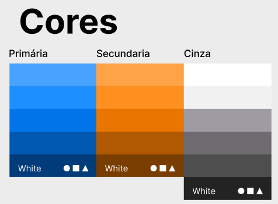
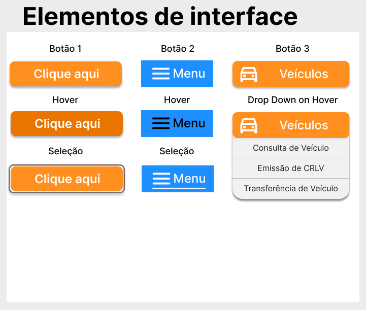
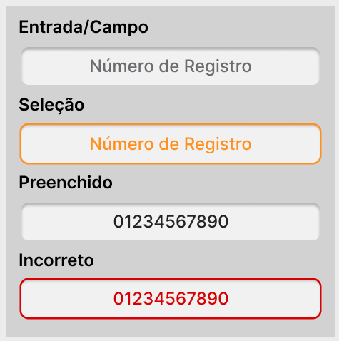

# Guia de Estilo

## 1. Introdução
O guia de estilo reúne as diretrizes e princípios utilizados no projeto e registra as principais decisões de design tomadas. Isso é feito com o intuito de evitar a perda dessas informações e permitir que elas sejam facilmente acessíveis para serem implementadas no produto final e reutilizadas durante as etapas de extensão do projeto. Esse documento também pode ser usado para facilitar a comunicação entre a equipe de design e a equipe de desenvolvimento. Neste caso, as diretrizes serão aplicadas ao sítio eletrônico DetranGO, levando em consideração as [Metas de Usabilidade](./metas_de_usabilidade.md) do ciclo de vida para engenharia de usabilidade de Mayhew [1].

## 2. Objetivo
O objetivo desse documento é compreender o design proposto para o projeto, analisando elementos como:

- Elementos de interface (Design de telas, visualização de informações, disposição espacial e grid (layout), elementos de interface (widgets), janelas, tipografia, símbolos, logo e cores)

- Elementos de interação (estilos de interação, seleção de um estilo e aceleradores (teclas de atalho))

- Elementos de ação (preenchimento de campos, seleção e ativação) com o intuito de documentá-los e com esse entendimento propor melhorias para alguns elementos. Para que no futuro seja possível dar prosseguimento ao projeto nas etapas de design, avaliação e desenvolvimento.

### 2.1 Organização e conteúdo do guia de estilo
O guia de estilo seguirá a estrutura comum adotada por Mayhew, na seguinte organização:

- **Introdução**
    * Objetivo
    * Organização e Conteúdo
    * Público-alvo
    * Como Utilizar e Manter o Guia de Estilo
- **Análise do Ambiente de Trabalho**
- **Elementos de Interface**
    * Janelas
    * Tipografia
    * Cores
- **Elementos de Interação**
    * Estilos de Interação
    * Seleção de Estilos
    * Aceleradores (teclas de atalho)
- **Elementos de Ação**
    * Preenchimento de Campos
    * Seleção
    * Ativação
- **Vocabulário e Padrões**
    * Terminologia
    * Sequência de Diálogos

### 2.2 Público-alvo do guia de estilo
O público-alvo deste guia de estilo são os alunos da disciplina de Interação Humano Computador, grupo responsável pela análise da plataforma DetranGO no escopo da matéria, que por meio deste poderá realizar as outras etapas do projeto.

### 2.3 Como utilizar e manter o guia
O guia de estilo é essencial para garantir consistência no projeto e deve ser atualizado regularmente. Ele é a fonte primária de estilização da aplicação e deve ser consultado para decisões de design. Sempre que novas ideias surgirem, o guia deve ser atualizado para garantir que seja a base principal para artefatos de prototipação.

## 3. Análise do Ambiente de Trabalho
Antes da realização do Guia de estilo em si é importante entender o contexto de trabalho do usuário para saber quais elementos devem ser trabalhados, assim foi feita uma análise dos principais recursos que o usuário tem acesso dentro do site. O usuário precisa que o ambiente seja minimalista e, principalmente, com boa disposição dos elementos para que se tenha um bom entendimento das funcionalidades. Dessa forma, foram escolhidos dois componentes para serem analisados nesta etapa que estão destacados na figura 1.

Figura 1 - Página inicial DetranGO (fonte: [DetranGO](https://www.detran.go.gov.br/psw/#/pages/pagina-inicial), Acesso: 11 de maio de 2023).

## 4. Elementos de Interface
Uma das partes importantes do guia de estilo são os elementos de interface. Esses elementos são responsáveis por compor as interfaces gráficas que os usuários terão contato durante o uso do sistema. Segue abaixo cada um dos elementos trabalhados neste tópico.

### 4.1 Janelas
Foram consideradas pelo grupo as janelas sendo todo o espaço que contempla a interface de uma das páginas do site. Para garantir a padronização dos diferentes ambientes foi pensado em um modelo simples, escalável e que facilite as atividades do usuário para orientar os designers no momento de pensar em uma interface para o sistema. O modelo feito é o apresentado na figura 2.

Figura 2 - Modelo de janelas (fonte: autores, 2023).

### 4.2 Tipografia
A tipografia escolhida foi a fonte Inter. A escolha da fonte foi pensada por ter uma boa leitura, para apresentar as informações, além de ser uma fonte mais moderna para o site. Segue abaixo uma ilustração mostrando os diferentes pesos, contextos e suas aplicações da fonte escolhida, na Figura 3.

Figura 3 - Tipografia utilizadas(fonte: autores, 2023).

### 4.3 Cores
As cores são um elemento essencial no guia de estilo e são responsáveis por grande parte da mensagem comunicada pela interface ao usuário. Para a escolha das cores foi pensada em uma paleta minimalista focando em apenas 3 cores, com suas respectivas variações para garantir a adaptação em diferentes contextos do sistema. Segue abaixo a ilustração mostrando cada uma das cores definidas, na Figura 4.

 Figura 4 - Cores escolhidas(fonte: autores, 2023).

#### 4.3.1 Primária
A cor primária escolhida foi o azul, já identificado na interface do site atual. Foram escolhidas diversas tonalidades a partir da cor para garantir a versatilidade da sua aplicação em diferentes contextos do sistema.

#### 4.3.2 Secundária
O laranja ficou como cor secundária por conta do contraste que conseguimos com o azul, utilizada para dar destaque a elementos específicos. Também foram escolhidas tonalidades para serem utilizadas em diferentes contextos.

#### 4.3.3 Cinza
O cinza, uma cor neutra característica de ambientes digitais voltada para a aplicação no de telas e em demais contextos onde é necessário baixo contraste.

## 5. Elementos de Interação

### 5.1 Estilos de Interação
O usuário interage com o sítio por meio de ícones, botões e formulários.

### 5.2 Seleção de um estilo
O estilo escolhido para botões, ícones e formulários foi pensado para ser objetivo e simples, visando uma padronização em como a interface e suas interações são feitas no sistema.

### 5.3 Aceleradores (teclas de atalho)
No sistema existem teclas de atalho, como aquelas voltadas para as abas mais acessadas e que serão utilizadas, as abas são:

* Veículos
* Habilitação
* CNH Social
* Atendimento
* Processos
* Educação
* Notícias
* Barra de pesquisa

Todos os atalhos podem ser visualizados pelo menu superior do sítio do Detran GO [2], pela figura que pode ser visualizada a seguir.

Figura 5 - Teclas de atalho do DetranGO (fonte: [DetranGO](https://www.detran.go.gov.br/psw/#/pages/pagina-inicial), Acesso: 11 de maio de 2023).

## 6. Elementos de Ação
São elementos os quais o usuário interage para realizar alguma determinada ação dentro do sistema. Ou seja, são formados por um conjunto de componentes para que o usuário realize uma ação. A seguir estão listados os principais elementos de ação determinados em conjuntos e com seus modelos fixos para a reprodução do design das interfaces. Isso a partir de como a ação é desempenhada pelo usuário.

### 6.1 Botões
A figura 6 lista os modelos de botões que foram definidos para utilização.

Figura 6 - Botões (fonte: autores, 2023).

### 6.2 Ícones
A figura 7 ilustra os ícones escolhidos para o sítio, visando incluir as ações que o usuário pode tomar no sistema, em complemento com os botões.

Figura 7 - Ícones (fonte: autores, 2023).

### 6.3 Entrada / *Input*
A Figura 8 ilustra os modelos de entrada/*input* que foram escolhidos para o sistema. Além disso, os modelos quando o *input* está em modo de: seleção, preenchido ou incorreto foram considerados para a construção desses elementos.

Figura 8 - *Input* (fonte: autores, 2023).

## 7. Vocabulário e Padrões

### 7.1 Terminologia
O sistema conta com nomenclaturas e termos que são normalmente compreendidos por usuários que já tiveram contato com algum serviço do DETRAN, como CNH e Renavam, o que pode ser um fator limitante para um determinado público.

### 7.2 Tipos de tela (para tarefas comuns)
As telas vão seguir este guia de estilo, para o protótipo de baixa e alta fidelidade. Em geral, vão seguir as especificações dos elementos de interface, como as janelas que foram definidas. Em geral, as telas a serem definidas vão estar baseadas na tela de *menu* principal do sítio do [DETRAN GO](https://www.detran.go.gov.br/psw/#/pages/pagina-inicial).

### 7.3 Sequência de diálogos 
Os diálogos a serem feitos com o usuário por meio dos elementos de interface serão feitos de forma padronizada. Isso, por exemplo, com o uso de botões de confirmação e cancelamento que buscam serem semelhantes durante todas as sequências de diálogos possíveis. Um exemplo disso pode ser visualizado na figura 9 a seguir, que apresenta diálogo com o usuário para preenchimento de um campo obrigatório ao tentar uma ação de consulta sem ter preenchido o campo obrigatório.

Figura 9 - Diálogo com o usuário (fonte: [DetranGO](https://www.detran.go.gov.br/psw/#/pages/pagina-inicial), Acesso: 12 de maio de 2023).

## 8. Figma

<iframe style="border: 1px solid rgba(0, 0, 0, 0.1);" width="800" height="450" src="https://www.figma.com/embed?embed_host=share&url=https%3A%2F%2Fwww.figma.com%2Ffile%2F9lfSdxdTpmmXDPyIMOEQeq%2FGuia-de-Estilo---Grupo-do-Detran-GO%3Ftype%3Ddesign%26node-id%3D1%253A3%26t%3Dau8AjasrviLCFuY4-1" allowfullscreen></iframe>

## Bibliografia

> [1] BARBOSA, Simone; DINIZ, Bruno. Interação Humano-Computador. Editora Elsevier, Rio de Janeiro, 2010

> [2] Sítio DetranGO: <https://www.detran.go.gov.br/psw/#/pages/pagina-inicial>, Acesso em 11 de maio de 2023

# Histórico de Versão

| Versão | Data       | Descrição                          | Autor(es)     |  Revisor(es)  |
| ------ | ---------- | ---------------------------------- | ------------- | ------------- |
| `1.0`  | 09/05/2023 | Criação do documento.              | Carlos Eduardo, João Morbeck, Pedro Henrique | Pedro Muniz |
| `1.1`  | 12/05/2023 | Adição das janelas, Figma, Vocabulário e Padrões, Elementos de interação e ação        | Carlos Eduardo, João Morbeck, Pedro Henrique | Pedro Muniz |
