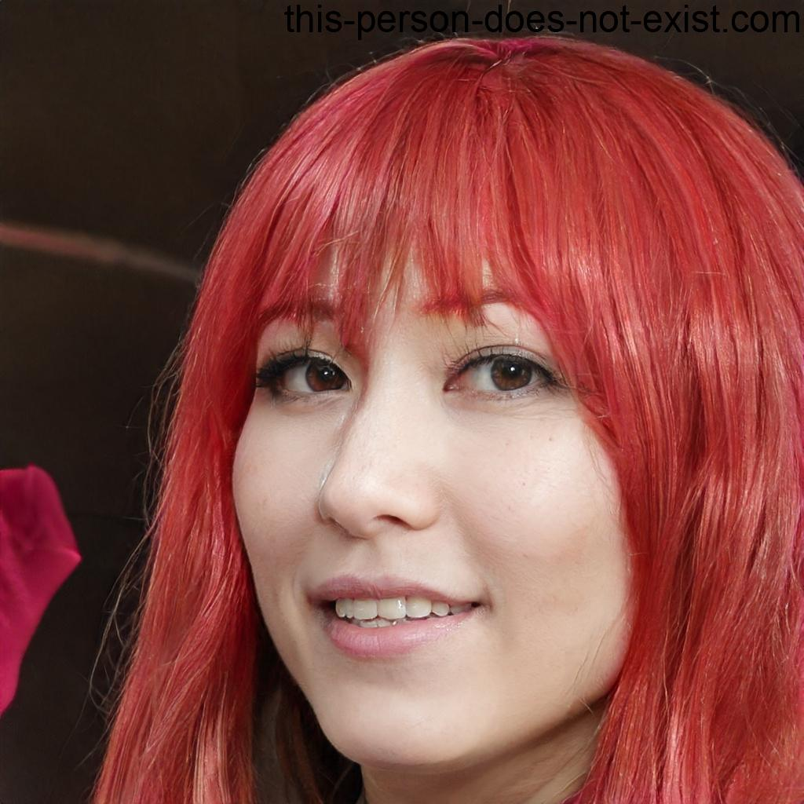

# Personas

## 1. Introdução

A utilização e modelagem de personas é interessante para o processo de avaliação de IHC visto que o propósito das personas é criar arquétipos realistas de segmentos importantes da audiência (i. e. o perfil de usuário do sistema) para se basear em e se apoiar em argumentações sobre o design a fim de se manter o foco [1, 2].
Assim, representar o perfil de usuário a partir de personas auxilia no processo de desenvolvimento da avaliação de IHC e prepara satisfatoriamente para artefatos futuros neste baseados.

## 2. Metodologia

As personas serão definidas neste artefato com o auxílio do artefato de [perfil de usuário](perfilUsuario.md) e terão as seguintes características:

* Identidade: Dados demográficos da persona.
* Status: Se a persona é primária, secundária, antipersona ou outra parte interessada.
* Objetivos: Objetivos não limitados ao produto.
* Habilidades: Competências, educação e treinamento não limitados ao escopo do produto.
* Tarefas: Tarefas básicas ou críticas da persona.
* Relacionamentos: Com quem a persona interage.
* Requisitos: O que a persona precisa.
* Expectativas: Como a persona imagina ou espera que o produto funcione.

[1]

## 3. Elenco de personas

Como detalhado por Courage e Baxter (2005), deve*se criar ao menos uma persona por papel de usuário, e o elenco de personas deve ter de 3 a 12 personas [1]. Também é importante para Cooper (1999, 2014) que o sistema não seja projetado para uma gama ampla de personas, mas sim para uma persona em específico [1]. Assim, este artefato detalhará 5 personas, sendo duas delas **primárias** e outras duas **secundárias** (a depender da sua importância para o direcionamento do projeto) e uma **antipersona** para quem o sistema não é direcionado. Foram utilizadas 5 personas por termos muitas atividades no site e precisarmos direcionar nosso foco nas principais, além de ser uma quantidade ideal para criação de cenarios.

## 4. Personas primárias

### 4.1 Letícia Ferreira Souza

 Figura 1: Foto de rosto de Letícia Ferreira Souza(Fonte: This Person Does Not Exist, 2023).

* **Identidade**
    * **Nome**: Letícia Ferreira Souza.
    * **Idade**: 20 Anos.
    * **Profissão**: Estudante Universitária.
    * **Moradia**: Mora em um apartamento com os pais.
    * **Veículos**: Não possui, dirige o carro dos pais.
* **Status**: Persona primária.
* **Objetivos**: Letícia é estudante de economia e deseja terminar a faculdade, conseguir um emprego, comprar um carro e conquistar a independência dos pais, ela ama os pais, mas deseja conseguir viver como quiser, e pra ela o primeiro passo é sair da casa dos pais.
* **Habilidades**: Letícia é uma pessoa que aprende rápido e é muito criativa, porém se distrai com frequência, adquiriu recentemente sua carteira de motorista tipo B.
* **Tarefas**: Recentemente Letícia passou no teste de habilitação e recebeu a sua CNH provisória, ainda precisa pegar sua CNH definitiva e eventualmente a 1ª via, ela possui preferência em resolver esses tramites pela internet e apenas receber sua carteira de motorista pelo correio, por isso ela utiliza o site do Detran GO para fazer suas solicitações.
* **Relacionamentos**: Possui poucos amigos na faculdade e se relaciona muito bem com os pais, apesar de se preocuparem com ela.
* **Requisitos**: Letícia precisa fazer o pedido de sua CNH definitiva, e acompanhar como está o processo, depois de algum tempo ela irá solicitar a 1ª via do documento, e o processo não pode ser muito complicado de fazer ou acompanhar.
* **Expectativas**: Letícia espera que o sistema seja rápido e intuitivo, caso perca sua CNH e precise fazer a 2ª via, precisa que o processo não seja muito diferente de quando pediu as outras carteiras.
* **Frase**: "Dirigir é liberdade, mas liberdade só é bom quando se pode aproveitá-la."

### 4.2 Francisco Oliveira Santos

 Figura 2: Foto de rosto de Francisco Oliveira Santos(Fonte: This Person Does Not Exist, 2023).

* **Identidade**
    * **Nome**: Francisco Oliveira Santos
    * **Idade**: 57 anos
    * **Profissão**: Autônomo
    * **Moradia**: Mora em uma pequena casa que divide lote com uma oficina.
    * **Veículos**: Possui diversos veículos, porém nenhum pessoal.
* **Status**: Persona primária
* **Objetivos**: Francisco deseja juntar dinheiro para ajudar a família, se mudar para uma casa maior e ajudar o filho que faz faculdade e mora em outro estado.
* **Habilidades**: Muito hábil com ferramentas e um excelente vendedor.
* **Tarefas**: Francisco não trabalha regido pela CLT, ele compra veículos usados de leilões, faz a manutenção e vende para obter lucro, por isso ele sempre lida com muitos veículos diferentes e suas documentações, Francisco gostaria de poder consultar sobre os veículos que pretende adquirir e lidar com suas respectivas documentações de maneira mais fácil e rápida, porém ele têm dificuldade para utilizar o site do Detran GO ou qualquer outra plataforma digital.
* **Relacionamentos**: Francisco conhece muitas pessoas, isso se deve por falar com pessoas diferentes ao comprar e vender carros, por ser carismático, consegue fazer novas amizades facilmente.
* **Requisitos**: Francisco precisa realizar consultas de veículos, fazer transferência e solicitar vistorias, mas a plataforma precisa ser de fácil uso, pois Francisco não utiliza computadores com muita frequência.
* **Expectativas**: Francisco espera que o sistema seja fácil de aprender a usar, intuitivo e simples
* **Frase**: "Existe o carro certo para a pessoa certa, eu só preciso encontra-los."

## 5. Personas secundárias

### 5.1 Igor Castro Gomes

 Figura 3: Foto de rosto de Igor Castro Gomes (Fonte: This Person Does Not Exist, 2023).

* **Identidade**
    * **Nome**: Igor Castro Gomes.
    * **Idade**: 30 anos.
    * **Profissão**: Vendedor.
    * **Moradia**: Mora em uma casa pequena.
    * **Veículos**: Um carro popular.
* **Status**: Persona secundária
* **Objetivos**: Igor quer começar uma família e se manter estável no emprego, além de conseguir levar esposa, amigos e parentes para vários lugares com seu carro que tem há alguns anos.
* **Habilidades**: Igor é um vendedor com boas habilidades comunicativas e usa o computador em seu trabalho. Tem CNH para veículos do tipo B, mas nunca se interessou em ampliar o escopo por ter medo de andar de moto.
* **Tarefas**: Quando o mês do vencimento de sua carteira de motorista chega perto, Igor procura como realizar o processo online e descobre como utilizar o site Detran GO de maneira correta. Então, vai para o site e realiza a solicitação. Também verifica a situação de seu veículo para com o Detran ao menos uma vez ao mês, e sabe o número de seu Renavam quase todo.
* **Relacionamentos**: Igor conhece vários clientes da empresa, mas é de falar pouco com os colegas.
* **Requisitos**: Igor precisa poder verificar o status do veículo para o Detran GO, poder sanar suas dívidas caso tenha sido multado e poder renovar a CNH quando necessário.
* **Expectativas**: Igor espera que o sistema seja fácil de utilizar e que não imponha a ele um obstáculo maior do que visitar um posto de atendimento em pessoa em um fim de semana.
* **Frase**: "A melhor forma de vender é resolver os problemas de seus clientes."

### 5.2 Fernanda Araújo Carvalho

 Figura 4: Foto de rosto de Fernanda Araújo Carvalho (Fonte: This Person Does Not Exist, 2023).

* **Identidade**
    * **Nome**: Fernanda Araújo Carvalho.
    * **Idade**: 35 anos.
    * **Profissão**: Funcionária pública no Vapt Vupt de Goiânia GO.
    * **Moradia**: Mora em um condomínio.
    * **Veículos**: Um carro sedan.
* **Status**: Persona secundária
* **Objetivos**: Fernanda quer ser promovida e não mais ser atendente nos serviços do Vapt Vupt de Goiânia. Quer matricular a filha em uma escola particular e quer economizar dinheiro para viajar para outro país.
* **Habilidades**: Fernanda é muito boa com computadores e utiliza muitos atalhos de teclado do Windows pra realizar suas tarefas no trabalho. Também domina Excel e outras ferramentas Office.
* **Tarefas**: Fernanda atende solicitações de renovação de CNH agendadas pelo site do Detran GO, verificando as informações fornecidas pelo solicitante com antecedência e agilizando o processo.
* **Relacionamentos**: Fernanda conhece todos que trabalham no setor dela e tem amizade com quase todos. Não tem filtro quanto a críticas sobre experiências da vida dela.
* **Requisitos**: Fernanda deve ser capaz de obter e organizar as informações do solicitante de um atendimento relacionado ao Detran GO sem que a interface seja empecilho que afete sua agilidade.
* **Expectativas**: Fernanda espera não ter problemas em copiar, organizar e catalogar as informações de solicitantes de maneira ágil.
* **Frase**: "Se tem atalho, é pra usar."

## 6. Antipersona

### 6.1 Ana Carolina Costa Hanamura

 Figura 5: Foto de rosto de Ana Carolina Costa Hanamura(Fonte: This Person Does Not Exist, 2023).

* **Identidade**
    * **Nome**: Ana Carolina Costa Hanamura.
    * **Idade**: 22 anos.
    * **Profissão**: Bartender.
    * **Moradia**: Apartamento do tipo Studio.
    * **Veículos**: Não possui.
* **Status**: Antipersona.
* **Objetivos**: Ana trabalha nas noites de quarta a sábado e no tempo livre estuda em uma faculdade pública, ela pretende terminar a faculdade para obter um trabalho melhor, mas ela ainda gosta de trabalhar como bartender.
* **Habilidades**: Comunicativa e atenciosa, os clientes da Ana gostam do seu serviço pelo seu profissionalismo e carisma.
* **Tarefas**: Ana possui uma carteira de motorista, porém ela não dirige, ela utiliza transporte público como principal meio de locomoção, Ana possui medo de dirigir, ela fica nervosa facilmente e não consegue superar esse medo, apesar de que se dirigisse sua rotina ficaria melhor.
* **Relacionamentos**: Ana têm muitos amigos, tanto colegas de trabalho, clientes e na faculdade.
* **Requisitos**: Ana precisa de conteúdos que ajudam a ela perder o medo de dirigir, aulas e dicas de direção.
* **Expectativas**: Ana espera encontrar facilmente informações sobre como superar seu medo e um canal de conversas para outras pessoas assim como ela, têm medo de dirigir.
* **Frase**: "Faça o que ama, e ame o que vier."

## 7. Bibliografia

> [1] BARBOSA, Simone; DINIZ, Bruno. Interação Humano*Computador. Editora Elsevier, Rio de Janeiro, 2010.

> [2] USABILITY.GOV (Estados Unidos). Personas. Disponível em: https://www.usability.gov/how-to-and-tools/methods/personas.html. Acesso em: 06 maio 2023.

> [3] *This Person Does Not Exist*: <https://this-person-does-not-exist.com>, Acesso em 06 de Maio de 2023

## 8. Histórico de Versão

| Versão | Data     | Descrição                                 | Autor(es)           | Revisor(es) |
| ---- | ---- | ---- | ----| ---- |
| `1.0`  | 05/05/23 | Criação do documento e adição do conteúdo | João M. e Felipe M. | Carlos E.   |
| `1.1`  | 06/05/23 | Criação de personas secundárias | João M. e Felipe M. | Carlos E.   |
| `1.2`  | 07/05/23 | Criação de personas primárias e antipersona | João M. e Felipe M. | Carlos E.   |
| `1.3`  | 01/06/23 | Adição explicação número de personas | Carlos E. | Amanda N. |