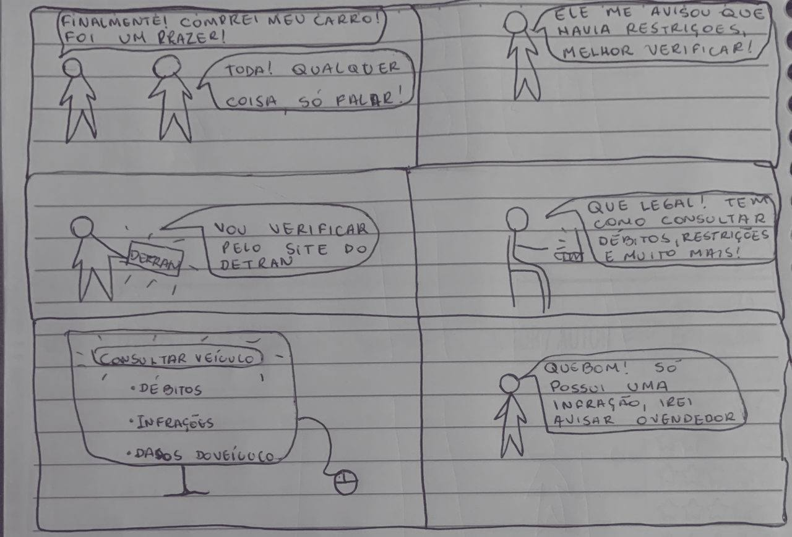

# Storyboard 

## 1. Introdução

Este artefato apresenta os storyboards desenvolvidos no projeto, levando em consideração, a configuração "Quem está envolvido?","Quais tarefas realizar?", a sequência "Quais são os passos a serem realizados na tarefa?" e por fim temos a satisfação, onde ligamos a configuração e as tarefas em como solucionar o problema citado dentro de um storyboard.

## 2. Objetivo

Este artefato tem como objetivo documentar a criação dos storyboards e resignificar as tarefas a serem realizadas durante o desenvolvimento do projeto. Os critérios a serem atendidos dentro de cada storyboard é a fidelidade dos storyboards com a realizade, as necessidades dos usuários representados e caso não sejam atendidas, é necessário a mudança dos mesmos.

## 3. Storyboards 

### 3.1 Storyboard - Consulta de CNH
Storyboard retratado na figura 1 representa a jornada do usuário ao consultar a CNH, onde o usuário consegue consultar informações sobre a mesma, contendo informações como, infrações de trânsito, dados da CNH, e pontuação na CNH.

Figura 1 - Storyboard Consulta de CNH (Fonte: 
Carlos Eduardo, 2023)

### 3.2 Storyboard - Consulta de Veículo
O Storyboard retratado na figura 2 representa a joranada do usuário ao consultar o veículo, onde as informações a serem visualizadas, são: débitos, infrações de trânsito, e dados do veículo.

Figura 2 - Storyboard Consulta de Veículo (Fonte: 
Amanda Noda, 2023)

### 3.3 Storyboard - Agendar atendimento
Storyboard retratado na figura 3 representa a jornada do usuário ao agendar atendimento dentro do Detran GO.

Figura 3 - Storyboard Agendar atendimento (Fonte: 
Pedro Muniz, 2023)

### 3.4 Storyboard - Solicitação de Segunda Via de CNH
Storyboard retratado na figura 4 representa a jornada do usuário ao solicitar a segunda via da CNH no Detran GO.

Figura 4 - Storyboard Solicitação de Segunda Via de CNH (Fonte: 
João Morberck, 2023)

### 3.5 Storyboard - Emissão de CRLV
Storyboard retratado na figura 5 representa a jornada do usuário ao emitir o CRLV dentro do site do Detran GO.

Figura 5 - Storyboard Emissão de CRLV (Fonte: 
Felipe Mastromauro, 2023)

### 3.6 Storyboard - Transferência de Veículo
Storyboard retratado na figura 6 representa a jornada do usuário ao transferir veículo dentro do site do Detran GO.

Figura 6 - Storyboard Transferência de veículo (Fonte: 
Pedro Henrique, 2023)

## 4. Referências Bibliográficas

> [1] Artefato Planejamento do relato dos resultados da avaliação do storyboard, acesso em 27 de maio de 2023. Para mais informações acesse: [link](./planejamento_relato_resultados.md).

> [2] Artefato Perfil de usuário, acesso em 27 de maio de 2023. Para mais informações acesse: [link](../../../analise_requisitos/perfilUsuario.md).

> [3] Barbosa, S. D. J.; Silva, B. S. da; Silveira, M. S.; Gasparini, I.; Darin, T.; Barbosa, G. D. J. (2021) Interação Humano-Computador e Experiência do usuário. Autopublicação. ISBN: 978-65-00-19677-1. Acesso em: 27 mai. 2023.

> [4] Storyboards, Paper Prototypes and Mockups - Scott Klemmer / Univ. Califórnia em Berkeley (Coursera)

## 5. Histórico de Versão

| Versão | Data     | Descrição                                 | Autor(es)    | Reviso(es) |
| ------ | -------- | ----------------------------------------- | ------------ | ----------- |
| `1.0`  | 02/07/23 | Criação do documento e adição do conteúdo | Amanda N. | Carlos E. |

