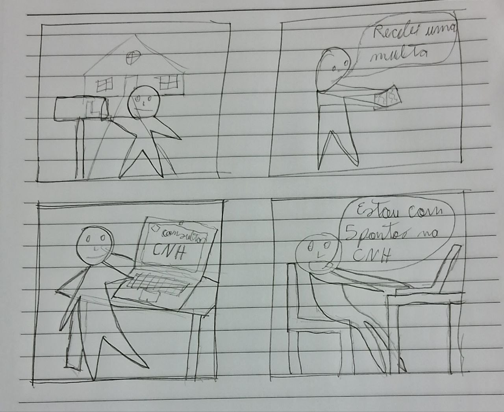
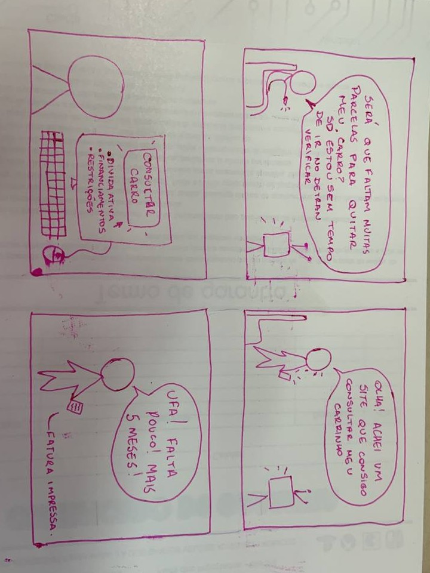
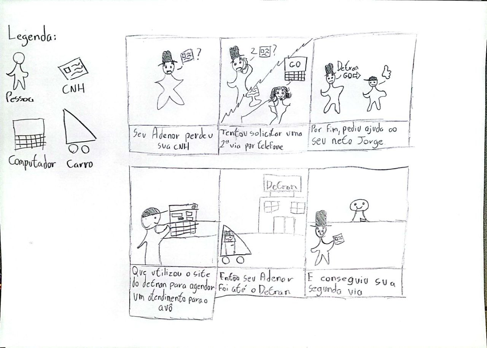
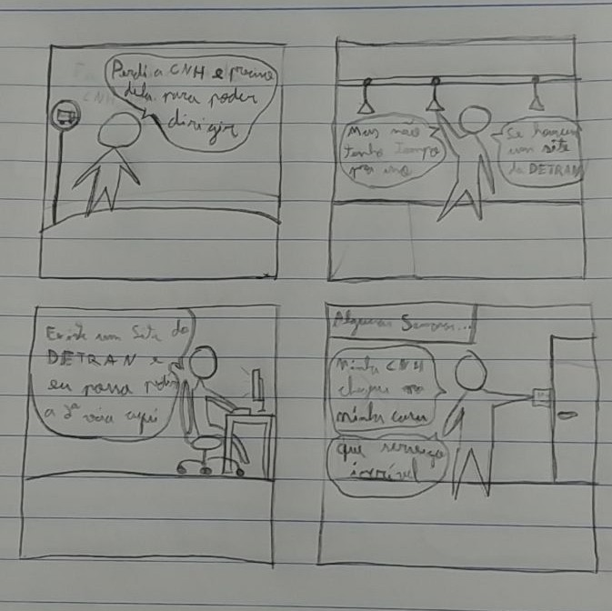
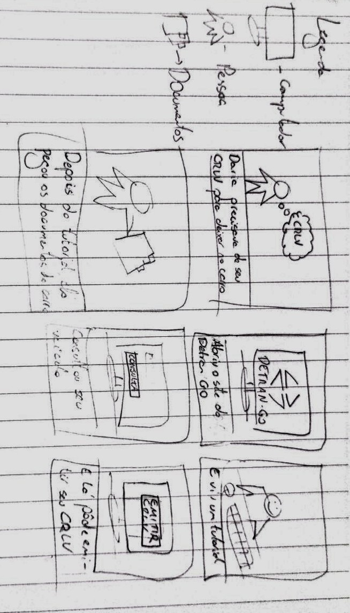
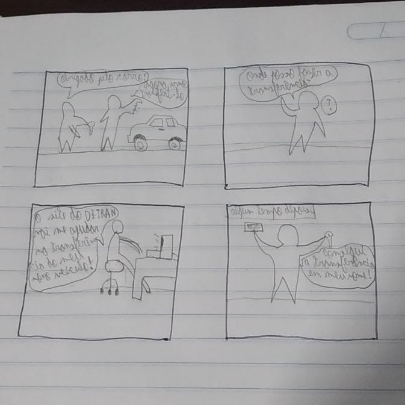

# Storyboard 

## 1. Introdução

76
Este artefato apresenta os storyboards desenvolvidos no projeto, levando em consideração, a configuração "Quem está envolvido?","Quais tarefas realizar?", a sequência "Quais são os passos a serem realizados na tarefa?" e por fim temos a satisfação, onde ligamos a configuração e as tarefas em como solucionar o problema citado dentro de um storyboard.

## 2. Objetivo

Este artefato tem como objetivo documentar a criação dos storyboards e resignificar as tarefas a serem realizadas durante o desenvolvimento do projeto. Os critérios a serem atendidos dentro de cada storyboard é a fidelidade dos storyboards com a realizade, as necessidades dos usuários representados e caso não sejam atendidas, é necessário a mudança dos mesmos.

## 3. Storyboards 

### 3.1 Storyboard - Consulta de CNH

### 3.2 Storyboard - Consulta de Veículo

### 3.3 Storyboard - Agendar atendimento

76

### 3.4 Storyboard - Solicitação de Segunda Via de CNH

### 3.5 Storyboard - Emissão de CRLV

### 3.6 Storyboard - Transferência de Veículo

## 4. Referências Bibliográficas

> [1] Artefato Aspectos éticos, acesso em 27 de maio de 2023. Para mais informações acesse: [link](../../../
analise_requisitos/aspectos_eticos.md).
76

> [2] Artefato Planejamento do relato dos resultados da avaliação do storyboard, acesso em 27 de maio de 2023. Para 
mais informações acesse: [link](./planejamento_relato_resultados.md).

> [3] Artefato Perfil de usuário, acesso em 27 de maio de 2023. Para mais informações acesse: [link](../../../
analise_requisitos/perfilUsuario.md).

> [4] Barbosa, S. D. J.; Silva, B. S. da; Silveira, M. S.; Gasparini, I.; Darin, T.; Barbosa, G. D. J. (2021) 
Interação Humano-Computador e Experiência do usuário. Autopublicação. ISBN: 978-65-00-19677-1. Acesso em: 27 mai. 2023.

> [5] CamScanner, acesso em: 27 de maio de 2023. Para mais informações acesse: [link](https://www.camscanner.com/).

> [6] OBS, acesso em: 27 de maio de 2023. Para mais informações acesse: [link](https://obsproject.com/pt-br/download/).

> [7] Storyboards, Paper Prototypes and Mockups - Scott Klemmer / Univ. Califórnia em Berkeley (Coursera)

## 5. Histórico de Versão

76
| Versão | Data     | Descrição                                 | Autor(es)    | Revisor(es) |
| ------ | -------- | ----------------------------------------- | ------------ | ----------- |
| `1.0`  | 19/05/23 | Criação do documento e adição do conteúdo | João M. | Amanda N. |
| `1.1`  | 21/05/23 | Adição do framework DECIDE e storyboards  | João M. | Amanda N. |
| `1.2`  | 16/06/23 | Alterações de padronização                | Pedro M.  | Amanda N. |
