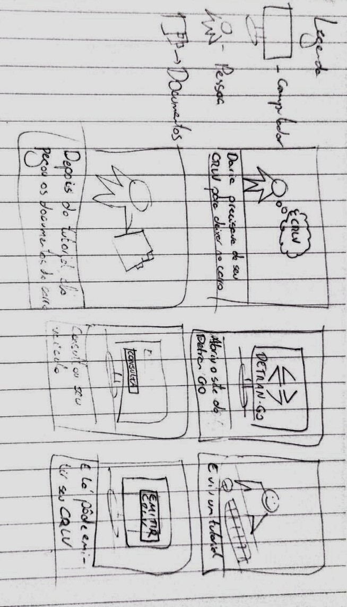
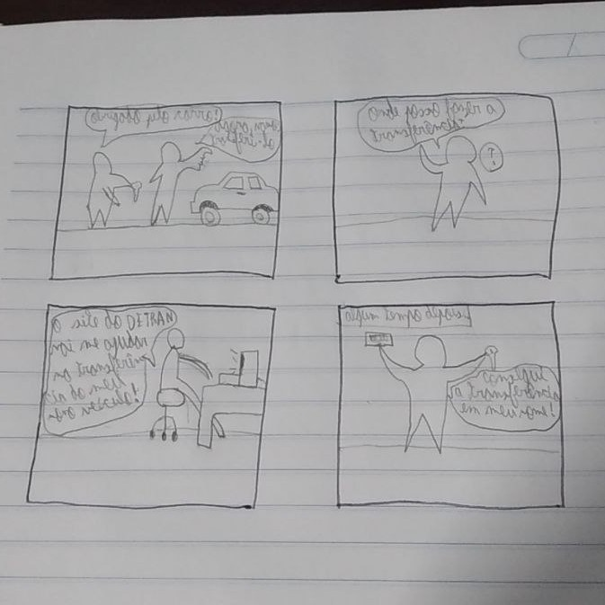

# Storyboard - Relato de Resultados da Avaliação

## 1. Introdução
Este artefato tem o objetivo de relatar os resultados obtidos da avaliação dos storyboards, que foi realizada por meio de uma metodologia que segue o planejamento do relato que foi desenvolvido anteriormente.

## 2. Teste Piloto
No dia 26/05/2023 o grupo realizou um teste piloto para a entrevista a respeito dos *Storyboards*, sendo que dois deles foram escolhidos em relação à análise de tarefas no site do Detran GO. As tarefas escolhidas foi a de consulta de veículo e a de agendar um atendimento.

### 2.1 Gravação do Teste Piloto

<iframe width="560" height="315" src="https://www.youtube.com/embed/giXta8euVgY" title="YouTube video player" frameborder="0" allow="accelerometer; autoplay; clipboard-write; encrypted-media; gyroscope; picture-in-picture; web-share" allowfullscreen></iframe>

## 3. Objetivos da Avaliação
A avaliação seguiu os objetivos que foram estabelecidos no [planejamento da avaliação dos *storyboards*](planejamento_avaliacao.md), sendo eles:

* Compreender se os *storyboards* cumprem seu objetivo e se condizem com a realidade ou não;
* Avaliar se as tarefas propostas são, de fato, realizadas e concluídas para cumprir as necessidades do usuário no sistema;
* Avaliar pontos e sugestões de melhorias aos *storyboards*.

## 4. Metodologia
A metodologia utilizada pelo grupo foi a de entrevistas, na qual foi realizada de acordo com o [planejamento dos *storyboards*.](planejamento_avaliacao.md)

## 5. Avaliadores e Participantes
Os avaliadores escolhidos foram os estudantes Felipe Mastroumaro  e Pedro Muniz e o participante da entrevista foi Leornado Jesus. Como proposto, o entrevistado é um usuário do sistema do Detran GO e por isso foi escolhido para a entrevista.

## 6. Gravação da Entrevista

<iframe width="560" height="315" src="https://www.youtube.com/embed/_jQ1AbOWpC4" title="YouTube video player" frameborder="0" allow="accelerometer; autoplay; clipboard-write; encrypted-media; gyroscope; picture-in-picture; web-share" allowfullscreen></iframe>

## 7. Respostas da Entrevista
As respostas seguiram o modelo que foi proposto no planejamento, nas quais também podem ser vistos na planilha a seguir:

<iframe width="1050" height="700" src="https://docs.google.com/spreadsheets/d/1tRjL5EIgvGvKqWDRjfXqcQpfBH7xV2gXwwPweXK_st4/edit#gid=0"></iframe>

## 8. Sugestões e problemas encontrados
Foram encontrados alguns pontos que deveriam ser mudados nos *storyboards*. Em geral temos que no *storyboard* de consultar CNH a indicação de que é díficil receber multas pelo correio. Já no de consultar veículo, foi passado que o site do Detran GO não apresenta certas funcionalidades que contribuem para a questão financeira do veículo. Por fim, na tarefa de solicitar CNH foi apontado a existência de ambiguidade no ato de "perder a CNH".

## 9. Bibliografia

> [1] BARBOSA, Simone; DINIZ, Bruno. Interação Humano-Computador. Editora Elsevier, Rio de Janeiro, 2010.

## Histórico de Versão

| Versão | Data     | Descrição                                                        | Autor(es) | Revisor(es) |
| ------ | -------- | --------------------------------------------------------------- | --------- | ----------- |
| `1.0`  | 25/05/23 | Criação do documento | Pedro H. e Carlos E. | Amanda Noda |
| `1.1`  | 29/05/23 | Adição de metodologia, teste piloto, relato e problemas encontrados | Pedro H. e Carlos E. | Amanda Noda |
|

## Storyboards desenvolvidos

Os storyboards desenvolvidos podem ser vistos nas figuras 1 a 6.

Figura 1 - Storyboard Consulta de CNH (Fonte: Carlos Eduardo, 2023)

Figura 2 - Storyboard Consulta de Veículo (Fonte: Amanda Noda, 2023)

Figura 3 - Storyboard Agendar atendimento (Fonte: Pedro Muniz, 2023)

Figura 4 - Storyboard Solicitar CNH (Fonte: João Morbeck, 2023)

Figura 5 - Storyboard Emissão de CRLV (Fonte: Felipe Mastromauro, 2023)

Figura 6 - Storyboard Transferência de Veículo (Fonte: Pedro Henrique, 2023)

