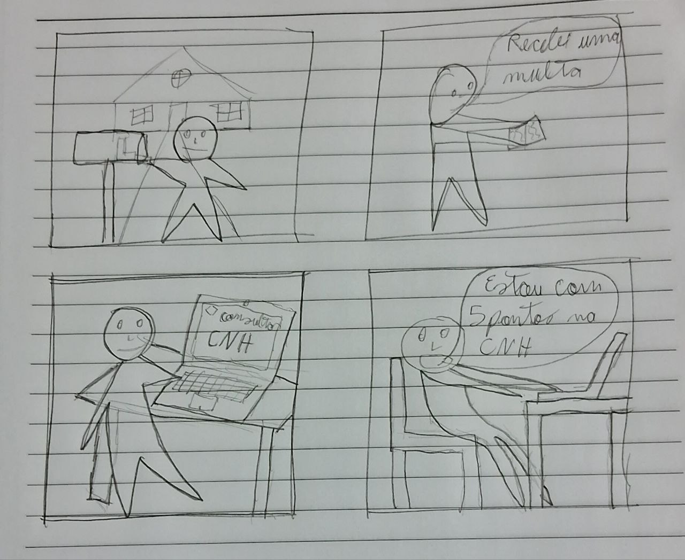
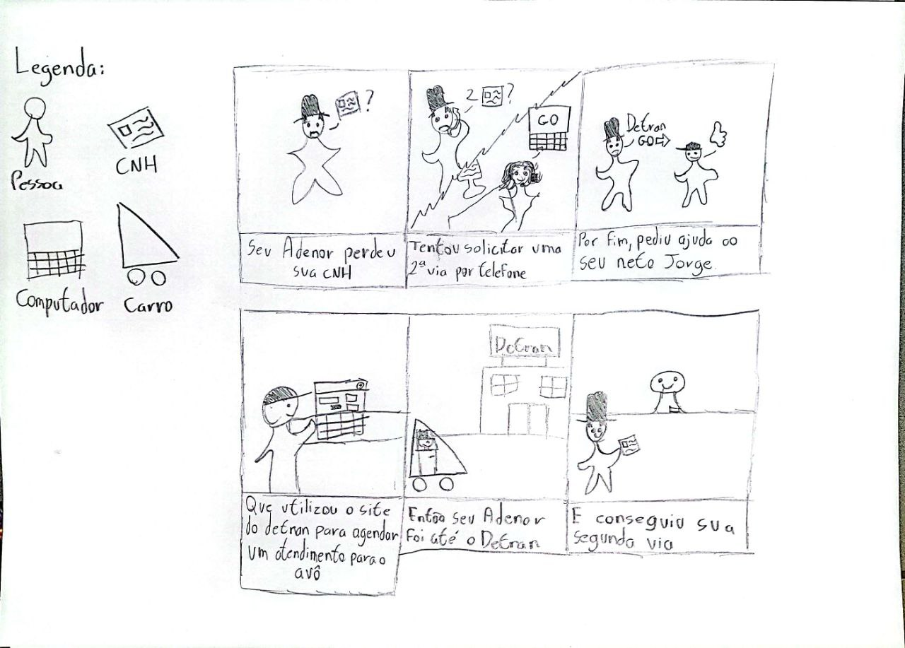
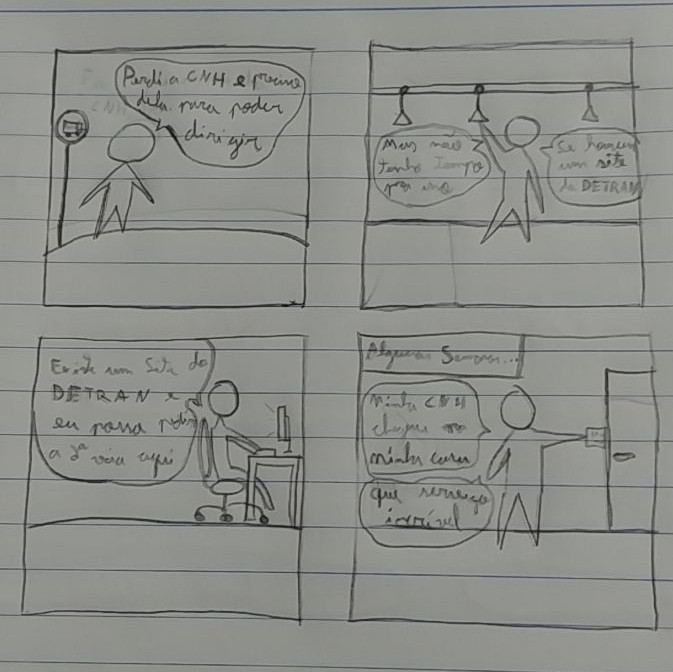

# Storyboard - Relato de Resultados da Avaliação

## 1. Introdução
A criação de storyboards é uma técnica de prototipação de baixa fidelidade amplamente utilizada para a representação das tarefas realizadas pelos usuários no sistema. Busca auxiliar na comunicação entre a equipe de desenvolvimento e os _stakeholders_ do projeto.[]

## 2. Objetivo

Este artefato tem o objetivo de relatar os resultados obtidos da avaliação dos storyboards, que foi realizada por meio de uma metodologia que segue o planejamento do relato que foi desenvolvido anteriormente.

A avaliação seguiu os objetivos que foram estabelecidos no [planejamento da avaliação dos *storyboards*](planejamento_avaliacao.md), buscando confirmar se:

- A fidelidade dos storyboards com a realidade é atendida.
- As necessidades dos usuários representados são satisfeitas.
- Existe a necessidade de alteração.

## 3. Metodologia
A metodologia utilizada pelo grupo foi a de entrevistas, na qual foi realizada de acordo com o [planejamento dos *storyboards*.](planejamento_avaliacao.md).

## 3.1 Aspectos éticos
Sendo uma pesquisa com a participação de pessoas, a avaliação utilizou um termo de consentimento elaborado anteriormente e presente no [artefato](../../../analise_requisitos/aspectos_eticos.md)[1] correspondente, abaixo se encontra o mesmo.

#### 
Termo de Consentimento Livre e Esclarecido

---

Somos estudantes de Engenharia de software da Universidade de Brasília e estamos conduzindo uma pesquisa sobre o DetranGO, sitio da internet que busca oferecer serviços para a população do Goiás mas possui as mesmas funcionalidades do Detran de outros estados, como parte de nosso projeto na disciplina de Interação Humano Computador. Sua participação neste formulário é de caráter voluntário e todas as perguntas serão mantidas para fins acadêmicos e não serão compartilhados para terceiros.

Para decidir sobre o seu consentimento, é importante que você conheça as seguintes informações sobre a pesquisa:

-   Nossa equipe tem o compromisso de divulgar os resultados de nossas pesquisas para o cliente.
-   O consentimento para a participação na atividade é uma escolha livre, feita mediante a prestação de todos os esclarecimentos necessários sobre a pesquisa.
-   A atividade pode ser interrompida a qualquer momento, segundo a sua disponibilidade e vontade.
-   Será necessário gravar a atividade, e as gravações efetuadas serão divulgadas nos resultados do projeto.
-   Os dados coletados durante a atividade destinam-se estritamente a atividades de análise e elaboração de melhorias para o sistema do DetranGO.

Diante das explicações, é necessário que você esteja de acordo com a pesquisa que será realizada e concorda de livre e espontânea vontade em participar, como colaborador? Caso o participante seja menor de idade é necessária a permissão do responsável legal.

( ) Sim, estou de acordo.  
( ) Não estou de acordo.

---

## 4. Cronograma e participantes

### 4.1 Participantes

Na tabela 1 se encontram os participantes do teste piloto realizado.

| Atividade | Participante | Papel |
|-|-|-|
| Teste piloto | Felipe Mastromauro | Testador |
| Teste piloto | Pedro Muniz | Testador |

Tabela 1: Participantes do teste piloto realizado(Fonte: Autor).

Na tabela 2 se encontram os participantes da entrevista realizada.

| Atividade | Participante | Papel |
|-|-|-|
| Entrevista | Felipe Mastromauro | Entrevistador |
| Entrevista | Pedro Muniz | Relator |
| Entrevista | Leonardo Jesus | Entrevistado |

Tabela 2: Participantes da entrevista realizada(Fonte: Autor).

### 4.2 Cronograma

Na tabela 3 estão detalhados os cronogramas das atividades realizadas.

| Atividade | Local | Data | Horário |
|-|-|-|-|
| Teste piloto | Remoto (Google meet) | 26/05/2023 | 18:00 |

Tabela 3: Cronograma das atividades realizadas(Fonte: Autor).

### 5. Storyboards desenvolvidos
Abaixo estão representados os storyboards desenvolvidos pela equipe.

Figura 1 - Storyboard Consulta de CNH (Fonte: Carlos Eduardo, 2023)

Figura 2 - Storyboard Consulta de Veículo (Fonte: Amanda Noda, 2023)

Figura 3 - Storyboard Agendar atendimento (Fonte: Pedro Muniz, 2023)

Figura 4 - Storyboard Solicitar CNH (Fonte: João Morbeck, 2023)

Figura 5 - Storyboard Emissão de CRLV (Fonte: Felipe Mastromauro, 2023)

Figura 6 - Storyboard Transferência de Veículo (Fonte: Pedro Henrique, 2023)

## 6. Respostas das perguntas
Visando sumarizar os dados obtidos através da avaliação, as tabelas a seguir detalham as respostas do entrevistado para as perguntas elaboradas anteriormente, discriminadas por objetivo de avaliação. Para cada storyboard desenvolvido, foram feitas todas as perguntas elaboradas anteriormente.

### 6.1 Consulta de CNH

Abaixo se encontram as respostas do entrevistado para as perguntas acerca do storyboard de consulta de CNH.

#### 6.1.1 Fidelidade dos storyboards com a realidade

| Número | Pergunta                                                                      | Resposta |
|--------|-------------------------------------------------------------------------------|----------|
| 1      | Quanto aos storyboards, você acha que eles estão condizentes com a realidade? | Sim      |
| 2      | Por que este storyboard não condiz com a realidade?                           | -        |
| 3      | Ficou clara a motivação do usuário para usar a aplicação do Detran GO?        | Sim      |

Tabela 4: Respostas para as perguntas elaboradas para o objetivo 1 do storyboard de consulta de CNH(Fonte: Autor, 2023).

#### 6.1.2 Satisfação das necessidades do usuário

| Número | Pergunta                                                                       | Resposta |
|--------|--------------------------------------------------------------------------------|----------|
| 1      | A sequência de ações do storyboard fez sentido para você?                      | Sim      |
| 2      | Você considera que o ator principal concluiu seu objetivo na história contada? | Sim      |

Tabela 5: Respostas para as perguntas elaboradas para o objetivo 2 do storyboard de consulta de CNH(Fonte: Autor, 2023).

#### 6.1.3 Necessidade de alteração

| Número | Pergunta                                                                | Resposta                                                          |
|--------|-------------------------------------------------------------------------|-------------------------------------------------------------------|
| 1      | Você tem algum ponto que acha que deveria ser alterado nas storyboards? | Hoje em dia, é muito difícil que se receba uma multa pelo correio |

Tabela 6: Respostas para as perguntas elaboradas para o objetivo 3 do storyboard de consulta de CNH(Fonte: Autor, 2023).

### 6.2 Consulta de veículo
Abaixo se encontram as respostas do entrevistado para as perguntas acerca do storyboard de consulta de veículo.

#### 6.2.1 Fidelidade dos storyboards com a realidade

| Número | Pergunta                                                                      | Resposta                                                                        |
|--------|-------------------------------------------------------------------------------|---------------------------------------------------------------------------------|
| 1      | Quanto aos storyboards, você acha que eles estão condizentes com a realidade? | Não                                                                             |
| 2      | Por que este storyboard não condiz com a realidade?                           | Parcelas do carro não se consulta no detran, e sim com o financiamento bancário |
| 3      | Ficou clara a motivação do usuário para usar a aplicação do Detran GO?        | Não                                                                             |

Tabela 7: Respostas para as perguntas elaboradas para o objetivo 1 do storyboard de consulta de veículo(Fonte: Autor, 2023).

#### 6.2.2 Satisfação das necessidades do usuário

| Número | Pergunta                                                                       | Resposta |
|--------|--------------------------------------------------------------------------------|----------|
| 1      | A sequência de ações do storyboard fez sentido para você?                      | Não      |
| 2      | Você considera que o ator principal concluiu seu objetivo na história contada? | Não      |

Tabela 8: Respostas para as perguntas elaboradas para o objetivo 2 do storyboard de consulta de veículo(Fonte: Autor, 2023).

#### 6.2.3 Necessidade de alteração

| Número | Pergunta                                                                | Resposta                                                                                                                               |
|--------|-------------------------------------------------------------------------|----------------------------------------------------------------------------------------------------------------------------------------|
| 1      | Você tem algum ponto que acha que deveria ser alterado nas storyboards? | O site do detran não possui as funções para consulta de dívidas, financiamento, etc... Apenas restrições, multas e impostos do veículo |

Tabela 9: Respostas para as perguntas elaboradas para o objetivo 3 do storyboard de consulta de veículo(Fonte: Autor, 2023).

### 6.3 Agendamento de atendimento
Abaixo se encontram as respostas do entrevistado para as perguntas acerca do storyboard de agendamento de atendimento.

#### 6.3.1 Fidelidade dos storyboards com a realidade

| Número | Pergunta                                                                      | Resposta |
|--------|-------------------------------------------------------------------------------|----------|
| 1      | Quanto aos storyboards, você acha que eles estão condizentes com a realidade? | Sim      |
| 2      | Por que este storyboard não condiz com a realidade?                           | -        |
| 3      | Ficou clara a motivação do usuário para usar a aplicação do Detran GO?        | Sim      |

#### 6.3.2 Satisfação das necessidades do usuário

| Número | Pergunta                                                                       | Resposta |
|--------|--------------------------------------------------------------------------------|----------|
| 1      | A sequência de ações do storyboard fez sentido para você?                      | Sim      |
| 2      | Você considera que o ator principal concluiu seu objetivo na história contada? | Sim      |

Tabela 11: Respostas para as perguntas elaboradas para o objetivo 2 do storyboard de agendamento de atendimento(Fonte: Autor, 2023).

#### 6.3.3 Necessidade de alteração

| Número | Pergunta                                                                | Resposta |
|--------|-------------------------------------------------------------------------|----------|
| 1      | Você tem algum ponto que acha que deveria ser alterado nas storyboards? | Não      |

Tabela 10: Respostas para as perguntas elaboradas para o objetivo 3 do storyboard de agendamento de atendimento(Fonte: Autor, 2023).

### 6.4 Solicitação de CNH
Abaixo se encontram as respostas do entrevistado para as perguntas acerca do storyboard de solicitação de CNH.

#### 6.4.1 Fidelidade dos storyboards com a realidade

| Número | Pergunta                                                                      | Resposta |
|--------|-------------------------------------------------------------------------------|----------|
| 1      | Quanto aos storyboards, você acha que eles estão condizentes com a realidade? | Sim      |
| 2      | Por que este storyboard não condiz com a realidade?                           | -        |
| 3      | Ficou clara a motivação do usuário para usar a aplicação do Detran GO?        | Sim      |

Tabela 13: Respostas para as perguntas elaboradas para o objetivo 1 do storyboard de solicitação de CNH(Fonte: Autor, 2023).

#### 6.4.2 Satisfação das necessidades do usuário

| Número | Pergunta                                                                       | Resposta |
|--------|--------------------------------------------------------------------------------|----------|
| 1      | A sequência de ações do storyboard fez sentido para você?                      | Sim      |
| 2      | Você considera que o ator principal concluiu seu objetivo na história contada? | Sim      |

Tabela 14: Respostas para as perguntas elaboradas para o objetivo 2 do storyboard de solicitação de CNH(Fonte: Autor, 2023).

#### 6.4.3 Necessidade de alteração

| Número | Pergunta                                                                | Resposta                             |
|--------|-------------------------------------------------------------------------|--------------------------------------|
| 1      | Você tem algum ponto que acha que deveria ser alterado nas storyboards? | Ambiguidade no ato de "perder a CNH" |

Tabela 15: Respostas para as perguntas elaboradas para o objetivo 3 do storyboard de solicitação de CNH(Fonte: Autor, 2023).

### 6.5 Emissão de CRLV
Abaixo se encontram as respostas do entrevistado para as perguntas acerca do storyboard de emissão de CRLV.

#### 6.5.1 Fidelidade dos storyboards com a realidade

| Número | Pergunta                                                                      | Resposta |
|--------|-------------------------------------------------------------------------------|----------|
| 1      | Quanto aos storyboards, você acha que eles estão condizentes com a realidade? | Sim      |
| 2      | Por que este storyboard não condiz com a realidade?                           | -        |
| 3      | Ficou clara a motivação do usuário para usar a aplicação do Detran GO?        | Sim      |

Tabela 16: Respostas para as perguntas elaboradas para o objetivo 1 do storyboard de emissão de CRLV(Fonte: Autor, 2023).

#### 6.5.2 Satisfação das necessidades do usuário

| Número | Pergunta                                                                       | Resposta |
|--------|--------------------------------------------------------------------------------|----------|
| 1      | A sequência de ações do storyboard fez sentido para você?                      | Sim      |
| 2      | Você considera que o ator principal concluiu seu objetivo na história contada? | Sim      |

Tabela 17: Respostas para as perguntas elaboradas para o objetivo 2 do storyboard de emissão de CRLV(Fonte: Autor, 2023).

#### 6.5.3 Necessidade de alteração

| Número | Pergunta                                                                | Resposta |
|--------|-------------------------------------------------------------------------|----------|
| 1      | Você tem algum ponto que acha que deveria ser alterado nas storyboards? | Não      |

Tabela 18: Respostas para as perguntas elaboradas para o objetivo 3 do storyboard de emissão de CRLV(Fonte: Autor, 2023).

### 6.6 Transferência de veículo
Abaixo se encontram as respostas do entrevistado para as perguntas acerca do storyboard de transferência de veículo.

#### 6.6.1 Fidelidade dos storyboards com a realidade

| Número | Pergunta                                                                      | Resposta |
|--------|-------------------------------------------------------------------------------|----------|
| 1      | Quanto aos storyboards, você acha que eles estão condizentes com a realidade? | Sim      |
| 2      | Por que este storyboard não condiz com a realidade?                           | -        |
| 3      | Ficou clara a motivação do usuário para usar a aplicação do Detran GO?        | Sim      |

Tabela 19: Respostas para as perguntas elaboradas para o objetivo 1 do storyboard de transferência de veículo(Fonte: Autor, 2023).

#### 6.6.2 Satisfação das necessidades do usuário

| Número | Pergunta                                                                       | Resposta |
|--------|--------------------------------------------------------------------------------|----------|
| 1      | A sequência de ações do storyboard fez sentido para você?                      | Sim      |
| 2      | Você considera que o ator principal concluiu seu objetivo na história contada? | Sim      |

Tabela 20: Respostas para as perguntas elaboradas para o objetivo 2 do storyboard de transferência de veículo(Fonte: Autor, 2023).

#### 6.6.3 Necessidade de alteração

| Número | Pergunta                                                                | Resposta |
|--------|-------------------------------------------------------------------------|----------|
| 1      | Você tem algum ponto que acha que deveria ser alterado nas storyboards? | Não      |

Tabela 21: Respostas para as perguntas elaboradas para o objetivo 3 do storyboard de transferência de veículo(Fonte: Autor, 2023).

## 7. Gravações

### 7.1 Teste piloto
No vídeo abaixo se encontra a gravação em vídeo do teste piloto realizado.

<iframe width="560" height="315" src="https://www.youtube.com/embed/giXta8euVgY" title="YouTube video player" frameborder="0" allow="accelerometer; autoplay; clipboard-write; encrypted-media; gyroscope; picture-in-picture; web-share" allowfullscreen></iframe>

### 7.2 Entrevista
No vídeo abaixo se encontra a gravação em vídeo da entrevista realizada.

<iframe width="560" height="315" src="https://www.youtube.com/embed/_jQ1AbOWpC4" title="YouTube video player" frameborder="0" allow="accelerometer; autoplay; clipboard-write; encrypted-media; gyroscope; picture-in-picture; web-share" allowfullscreen></iframe>

## 8. Análise dos dados coletados
Foram encontrados alguns pontos que deveriam ser mudados nos *storyboards*. Em geral temos que no *storyboard* de consultar CNH a indicação de que é díficil receber multas pelo correio. Já no de consultar veículo, foi passado que o site do Detran GO não apresenta certas funcionalidades que contribuem para a questão financeira do veículo. Por fim, na tarefa de solicitar CNH foi apontado a existência de ambiguidade no ato de "perder a CNH".

## 9. Correções possíveis
São necessárias correções quanto a funcionalidades erroneamente representadas, como no storyboard que representa a consulta de veículo, onde o usuário reclamou do fato de que a tarefa representada não é realizada no site do Detran, mas sim em outras páginas da web.

## 10. Conclusão
Após a análise dos dados, pode-se concluir que os objetivos da avaliação foram cumpridos, contudo os storyboards cumpriram parcialmente seus objetivos, falhando parcialmente em representar corretamente a realidade.

## 11. Bibliografia

> [1] BARBOSA, Simone; DINIZ, Bruno. Interação Humano-Computador. Editora Elsevier, Rio de Janeiro, 2010.

## 12. Histórico de Versão

| Versão | Data     | Descrição                                                        | Autor(es) | Revisor(es) |
| ------ | -------- | --------------------------------------------------------------- | --------- | ----------- |
| `1.0`  | 25/05/23 | Criação do documento | Pedro H. e Carlos E. | Amanda N. |
| `1.1`  | 29/05/23 | Adição de metodologia, teste piloto, relato e problemas encontrados | Pedro H. e Carlos E. | Amanda N. |
| `1.2`  | 19/06/23 | Alterações de padronização | Pedro M. | Amanda N. |

