# Protótipo de Alta Fidelidade 

## 1. Introdução
O protótipo de alta fidelidade é uma ferramenta que permite aos membros de um projeto analisarem as modificações feitas em um nível técnicos avançado antes que o projeto esteja efetivamente concluído. Ao avaliar essas alterações, é possível verificar se correspondem às expectativas estabelecidas, tornando a análise mais objetiva e conclusiva em relação às modificações no produto final.

## 2. Objetivo
O protótipo de alta fidelidade tem como objetivo demonstrar como o sistema pretende ficar no projeto final. Sendo assim, demonstra efetivamente as tarefas a serem implementadas no sistema e como elas vão se comportar dentro do projeto.

## 3. Protótipo de Alta Fidelidade 

Para a elaboração do protótipo de alta fidelidade, foi utilizado o software Figma afim de criar os elementos gráficos do mesmo, abiaxo se encontra o protótipo desenvolvido.

<iframe style="border: 1px solid rgba(0, 0, 0, 0.1);" width="800" height="450" src="https://www.figma.com/embed?embed_host=share&url=https%3A%2F%2Fwww.figma.com%2Ffile%2F9lfSdxdTpmmXDPyIMOEQeq%2FGrupo-do-Detran-GO%3Ftype%3Ddesign%26node-id%3D344%253A2%26mode%3Ddesign%26t%3DrMfo5Mur199wn5zC-1" allowfullscreen></iframe>

### 3.1 Página Inicial
Abaixo será mostrado as figuras de 1 à 16 que representam os fluxos de tarefas que foram implementados no protótipo de alta fidelidade no projeto do Detran GO.

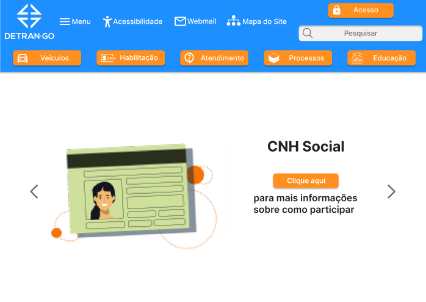

Figura 1: Página inicial 1 - passo 1 (Fonte: Autor, 2023)

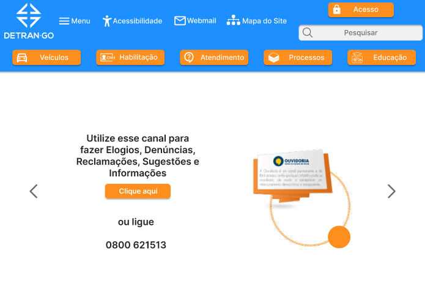

Figura 2: Página inicial 2 - passo 2 (Fonte: Autor, 2023)

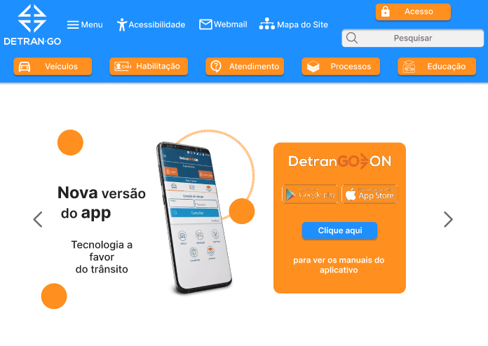

Figura 3: Página inicial 3 - passo 3 (Fonte: Autor, 2023)

### 3.2 Consulta de CNH

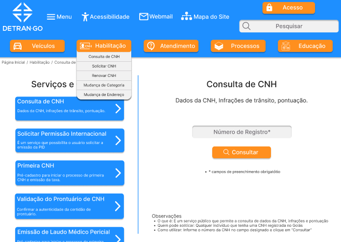

Figura 4: Consulta CNH 1 - passo 1 (Fonte: Autor, 2023)

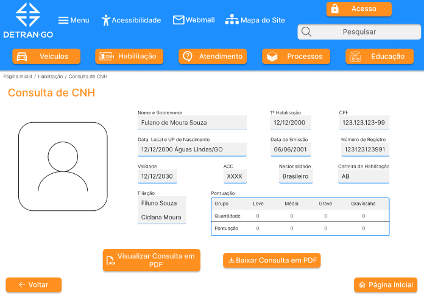

Figura 5: Consulta CNH 2 - passo 2 (Fonte: Autor, 2023)

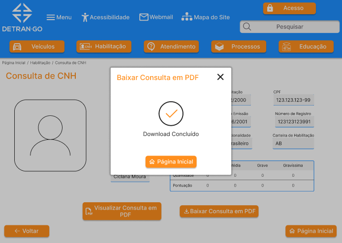

Figura 6: Consulta CNH 3 - passo 3 (Fonte: Autor, 2023)

### 3.3 Solicitação de CNH

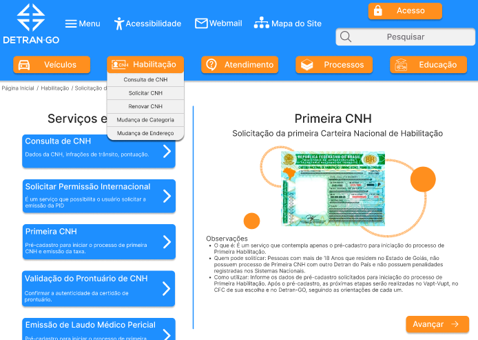

Figura 7: Solicitação de CNH 1 - passo 1 (Fonte: Autor, 2023)

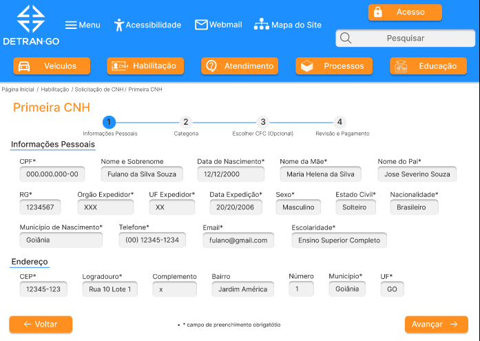

Figura 8: Solicitação de CNH 2 - passo 2 (Fonte: Autor, 2023)

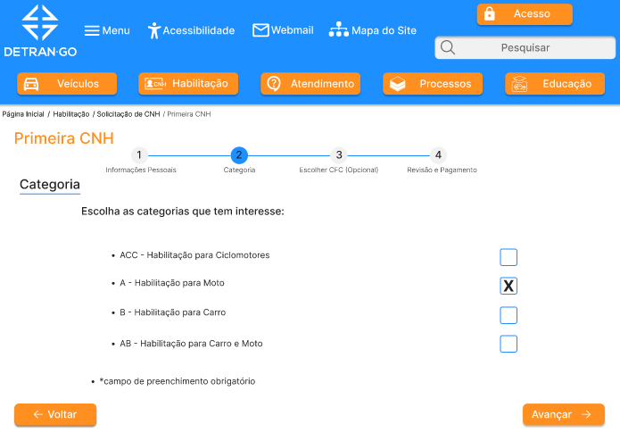

Figura 9: Solicitação de CNH 3 - passo 3 (Fonte: Autor, 2023)

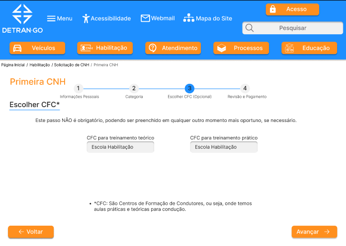

Figura 10: Solicitação de CNH - passo 4 (Fonte: Autor, 2023)

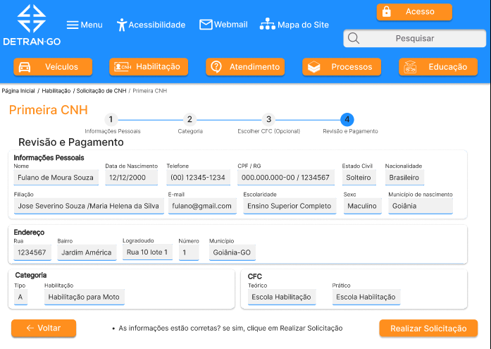

Figura 11: Solicitação de CNH - passo 5 (Fonte: Autor, 2023)

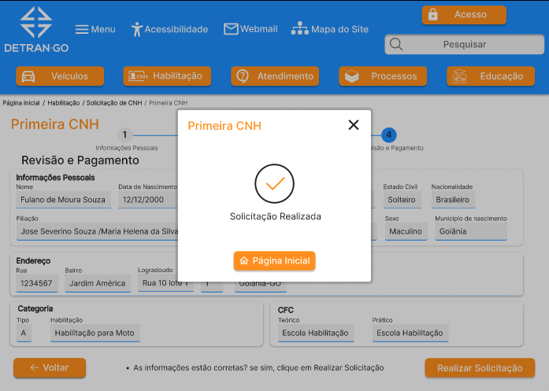

Figura 12: Solicitação de CNH - passo 6 (Fonte: Autor, 2023)

### 3.3 Emissão de CRLV

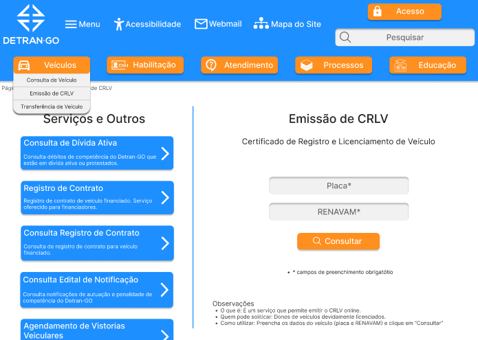

Figura 13: Solicitação de CRLV - passo 1 (Fonte: Autor, 2023)

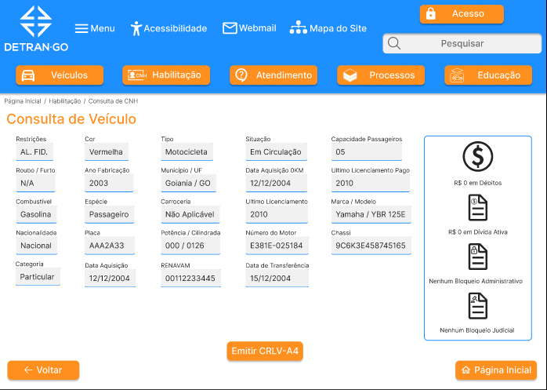

Figura 14: Solicitação de CRLV - passo 2 (Fonte: Autor, 2023)

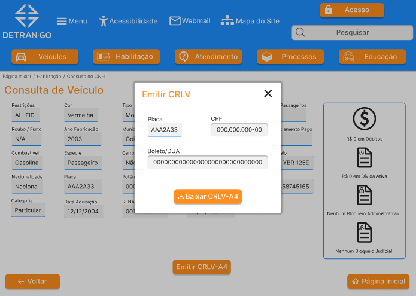

Figura 15: Solicitação de CRLV - passo 3 (Fonte: Autor, 2023)

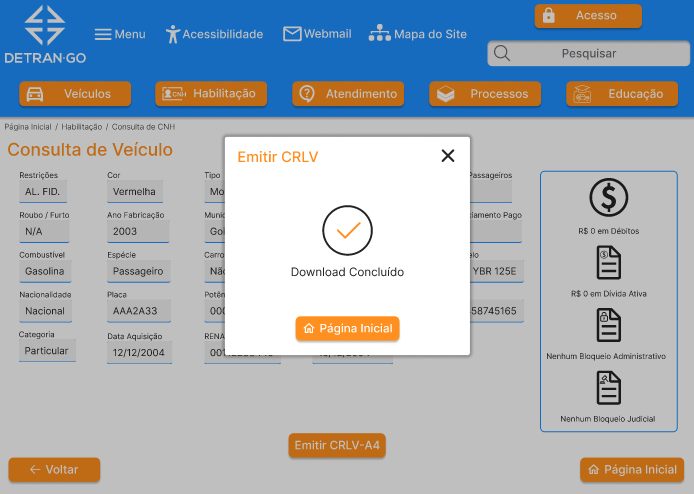

Figura 16: Solicitação de CRLV - passo 4 (Fonte: Autor, 2023)

## 4. Referências Bibliográficas

> [1] Artefato Planejamento do relato dos resultados da avaliação do storyboard, acesso em 27 de maio de 2023. Para mais informações acesse: [link](./planejamento_relato_resultados.md).

> [2] Artefato Perfil de usuário, acesso em 27 de maio de 2023. Para mais informações acesse: [link](../../../analise_requisitos/perfilUsuario.md).

> [3] Barbosa, S. D. J.; Silva, B. S. da; Silveira, M. S.; Gasparini, I.; Darin, T.; Barbosa, G. D. J. (2021) Interação Humano-Computador e Experiência do usuário. Autopublicação. ISBN: 978-65-00-19677-1.Acesso em: 27 mai. 2023.

> [4] Storyboards, Paper Prototypes and Mockups - Scott Klemmer / Univ. Califórnia em Berkeley (Coursera)

## 5. Histórico de Versão

| Versão | Data     | Descrição                          | Autor(es)    | Revisor(es) | 
| ------ | -------- | ----------------------------------------- | ------------ |----------- |
| `1.0`  | 02/07/23 | Criação do documento e adição do conteúdo | Amanda N. | Carlos E. |

