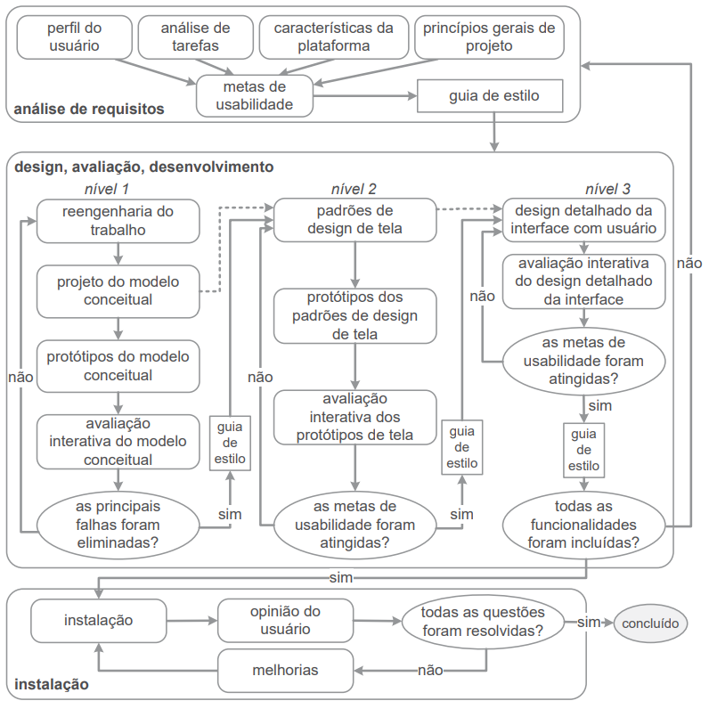

# Entrega Final

## 1. Site selecionado para o projeto

Este projeto consiste na análise e avaliação de IHC de algum site que possui problemas de usabilidade, padronização ou qualquer problema que dificulte a utilização adequada do site, para uma escolha adequada de um site e um estudo mais efetivo de melhorias para as interfaces, seguimos o trabalho de Simone Barbosa[2] para definir quais seriam as diretrizes e princípios que o projeto deve seguir, entender os objetivos e servir de base para a avaliação de IHC.
Portanto, após fazer uma análise de diferentes sites e compará-los qual seria mais adequado para se tratar no projeto, foi decidido o site do [DetranGO](https://www.detran.go.gov.br/psw/#/pages/pagina-inicial) para o projeto, neste site foi encontrado diversos problemas de design, interação e falhas quanto aos princípios e diretrizes citadas a seguir.

### 1.1. Princípios e diretrizes gerais do projeto

Princípios e diretrizes são como uma base para a esta pesquisa, estes buscam tornar claro quais são os objetivos de uma interface, como deve ser projetada e quais questões devem ser levados em consideração na hora de criar um design de interação, segundo Norman (1988) um sistema deve ser projetado a partir de um modelo conceitual que o usuário possa compreender e aprender seu uso sem dificuldades, a partir disso entendemos que este modelo deve corresponder às relações do sistema com o mundo real, na lista a seguir está presente os 9 princípios e diretrizes comumente utilizados em uma avaliação de IHC e que são base deste projeto.

- Correspondência com as expectativas dos usuários;
- Simplicidade nas estruturas das tarefas;
- Equilíbrio entre controle e liberdade do usuário;
- Consistência e padronização;
- Promoção da eficiência do usuário;
- Antecipação das necessidades do usuário;
- Visibilidade e reconhecimento;
- Conteúdo relevante e expressão adequada;
- Projeto para erros.

Mais informações sobre os princípios e diretrizes e como estes estão relacionados ao site escolhido para o projeto podem ser encontrados no [artefato de princípios e diretrizes do projeto](./analise_requisitos/principios.md).

### 1.2. Justificativa para escolha do site

O site do DetranGO foi selecionado com base em critérios adicionais, além da análise dos princípios e diretrizes mencionados anteriormente. A equipe considerou esses critérios como facilitadores para a execução do projeto. Ao escolher o site do DetranGO, levamos em conta fatores como os apresentados nos tópicos a seguir:

#### 1.2.1. Usuário
Os usuários foram definidos a partir das tarefas comuns no site, e a que público deve servir, que seriam pessoas de 18 a 65 anos que possuem uma carteira de habilitação ou estão em processo de adquirir uma, além de possuir um veículo ou esteja adquirindo um. Vale ressaltar que no Brasil não existe uma idade máxima para se conduzir um veículo, e a idade de 65 foi escolhida por ser a idade mínima de aposentadoria e poder limitar de alguma maneira os usuários a serem entrevistados.

#### 1.2.2. Funcionalidades

Por se tratar de um site do DETRAN, as funcionalidades não se diferem muito em outros estados, pois é um departamento público que todos estados possuem e que fornece o mesmo tipo de serviço, portanto, não teria problemas para avaliar a usabilidade de um protótipo se o usuário não fosse do estado do Goiás.

#### 1.2.3. Semelhanças com outros sites

O DETRAN é um órgão que existe em todos os estados do Brasil, e por isso possui diferentes sites e aplicações, a partir disso, podemos utilizar os sites e aplicações de outros estados como base de pesquisa ou sugestão de design para propor melhorias para o site do DetranGO.

#### 1.2.4. Usabilidade

Apesar de já ter sido analisado na seção de princípios e diretrizes, a usabilidade foi um critério fundamental para a decisão, pois é notado o quão frustrante pode ser utilizar o site por diversos pontos que fogem da norma comum de sites atuais, por exemplo a rolagem de tela que é seccionada e como muitas palavras estão próximas e confunde a leitura.

## 2. Ciclo de vida
Para a execução do projeto, foi utilizado o ciclo de vida para a engenharia de usabilidade proposto por Mayhew (1999), o qual divide o projeto de IHC em fases detalhadas. Na figura 1 a seguir, se encontra o diagrama que representa tal ciclo.

Figura 1: Ciclo de vida para a engenharia de usabilidade (Fonte: adaptado de Mayhew, 1999).

Na primeira fase do ciclo, a análise de requisitos, são elicitados dados importantes acerca dos *stakeholders* do projeto, assim como questões pertinentes à plataforma e organização onde o sistema será executado. Após a coleta de tais dados, é possível elaborar metas de usabilidade para o sistema, as quais serão utilizadas na formação de um guia de estilo que será utilizado para orientar a execução das fases seguintes.

A segunda fase, design, avaliação e desenvolvimento, é dividida em três níveis distintos, cada sendo que sua execução é incremental, onde um nível sempre complementa o que foi desenvolvido no nível anterior. No nível 1, se encontram o projeto e prototipagem do modelo conceitual para o design do projeto, buscando eliminar as falhas encontradas em designs anteriores. No nível 2, são executados o projeto dos padrões de design de tela e a prototipagem de baixa fidelidade para o design, buscando atender as metas de usabilidade elaboradas na fase anterior. No nível 3, é projetado o design detalhado das telas do sistema, assim como a prototipagem de alta fidelidade do design, sendo que esta etapa busca incluir todas as funcionalidades necessárias no projeto, ao mesmo passo que atende às metas de usabilidade propostas.

A terceira fase, instalação, representa o momento onde o sistema pronto é implementado para o uso por parte dos usuários, sendo que possui o objetivo de colher as opiniões dos *stakeholders* acerca do projeto pronto, caso hajam pendências são executadas melhorias no sistema, caso não existam problemas o projeto é concluído.

O ciclo de vida de Mayhew (1999) foi escolhido para o projeto devido ao seu grande nível de detalhamento acerca das etapas de desenvolvimento para um projeto de IHC,  evitando assim confusões ou erros na execução do projeto por conta de inexperiência. Além disso, o modelo de Mayhew (1999) é recomendado para projetos de caráter estudantil, já que auxilia na pesquisa e aprendizagem das etapas do processo de design.[1]

## 3. Cronograma final

Esta seção contém o cronograma final do projeto, descrevendo cada atividade realizada durante seu período de desenvolvimento, as datas de entrega planejadas e reais e os autores e revisores planejados e reais. Estas informações estão compiladas na tabela 1 abaixo.

| Atividade | Data de entrega planejada | Data de entrega executada | Autor Planejado | Autor Executado | Revisor Planejado | Revisor Executado |
|--|--|--|--|--|--|--|
| Avaliar lista de sites | 10/04/2023 | 13/04/2023 | Amanda N., Carlos E., Felipe M., Pedro F., Pedro H., João M. | Amanda N., Carlos E., Felipe M., Pedro F., Pedro H., João M. | Amanda N., Carlos E., Felipe M., Pedro F., Pedro H., João M. | Amanda N., Carlos E., Felipe M., Pedro F., Pedro H., João M. |
| Criar GitHub Pages | 10/04/2023 | 07/04/2023 | Carlos E. | Carlos E. | Pedro H. | Pedro H. |
| Definir cronograma | 10/04/2023 | 17/04/2023 | Amanda N., Felipe M., Pedro F., João M. | Amanda N., Felipe M., Pedro F., João M. | Amanda N., Felipe M., Pedro F., João M. | Amanda N., Felipe M., Pedro F., João M. |
| Definir site escolhido | 10/04/2023 | 13/04/2023 | Amanda N., Carlos E., Felipe M., Pedro F., Pedro H., João M. | Amanda N., Carlos E., Felipe M., Pedro F., Pedro H., João M. | Amanda N., Carlos E., Felipe M., Pedro F., Pedro H., João M. | Amanda N., Carlos E., Felipe M., Pedro F., Pedro H., João M. |
| Definir metodologia | 17/04/2023 | 13/04/2023 | Carlos E. | Carlos E. | João M. | João M. |
| Definir Ferramentas | 17/04/2023 | 17/04/2023 | Pedro H. | Pedro H. | Carlos E. | Carlos E. |
| Definir Processo de design | 17/04/2023 | 17/04/2023 | Pedro F. | Pedro F. | Felipe M. | Felipe M. |
| Gravar a apresentação da primeira etapa | 20/04/2023 | 21/04/2023 | Felipe M. | Felipe M. | Amanda N. | Amanda N. |
| Editar a apresentação da primeira etapa | 22/04/2023 | 22/04/2023 | João M. | João M. | Pedro H. | Pedro H. |
| Revisão da primeira etapa | 24/04/2023 | 24/04/2023 | Amanda N., Carlos E., Felipe M., Pedro F., Pedro H., João M. | Amanda N., Carlos E., Felipe M., Pedro F., Pedro H., João M. | Amanda N., Carlos E., Felipe M., Pedro F., Pedro H., João M. | Amanda N., Carlos E., Felipe M., Pedro F., Pedro H., João M. |
| Definição do perfil do usuário | 26/04/2023 | 01/05 | Amanda N. | Amanda N. | Pedro H. | Pedro H. |
| Detalhamento de aspectos éticos de pesquisas envolvendo pessoas | 25/04/2023 | 02/05 | Carlos E. | Carlos E. | Pedro F. | Pedro F. |
| Detalhamento de personas | 28/04/2023 | 08/05 | Felipe M. | Felipe M., João M. | João M. | Carlos E. |
| Cenários | 29/04/2023 | 07/05 | Pedro F. | Pedro F. | Felipe M. | Felipe M. |
| Análise de tarefas | 01/05/2023 | 07/05 | Pedro H. | Pedro H., João M. | Carlos E. | Carlos E. |
| Gravar a apresentação da etapa 2 | 04/05/2023 | 08/05 | Felipe M. | Felipe M. | Amanda N. | Amanda N. |
| Editar a apresentação da etapa 3 | 06/05/2023 | 08/05 | João M. | João M. | Amanda N. | Amanda N. |
| Revisão da segunda etapa etapa | 09/05/2023 | 09/05/2023 | Amanda N., Carlos E., Felipe M., Pedro F., Pedro H., João M. | Amanda N., Carlos E., Felipe M., Pedro F., Pedro H., João M. | Amanda N., Carlos E., Felipe M., Pedro F., Pedro H., João M. | Amanda N., Carlos E., Felipe M., Pedro F., Pedro H., João M. |
| Princípios gerais do projeto | 10/05/2023 | 14/05 | Amanda N. | Amanda N., Pedro H. | João M. | Felipe M. |
| Características para a plataforma do projeto | 09/05/2023 | 12/05 | Carlos E. | Pedro F, Felipe M. | Felipe M. | João M. |
| Metas de Usabilidade do projeto | 10/05/2023 | 12/05 | Pedro F. | Amanda N, Pedro H. | Pedro H. | Felipe M. |
| Guia de Estilo do projeto | 10/05/2023 | 11/05 | João M. | Pedro F, Felipe M. | Amanda N. | Carlos E. |
| Gravar a apresentação | 12/05/2023 | 13/05 | Amanda N. e Felipe M. | Pedro H., João M e Carlos E. | Carlos E. | Pedro F. |
| Editar a apresentação | 13/05/2023 | 14/05 | João M. | Felipe M. | Amanda N. | Carlos E. |
| Revisão da terceira etapa | 14/05/2023 | 14/05 | Amanda N., Carlos E., Felipe M., Pedro F., Pedro H., João M. | Amanda N., Carlos E., Felipe M., Pedro F., Pedro H., João M. | Amanda N., Carlos E., Felipe M., Pedro F., Pedro H., João M. | Amanda N., Carlos E., Felipe M., Pedro F., Pedro H., João M. |
| Storyboard - Planejamento da avaliação | 15/05 | 19/05 | João M. | João M. | Amanda N. | Amanda N. |
| Análise de tarefas - Planejamento da avaliação | 15/05 | 21/05 | Felipe M. | Felipe M. | Carlos E. | Carlos E. |
| Storyboard - Planejamento do relato dos resultados da avaliação | 16/05 | 19/05 | Carlos E. | Amanda N., Carlos E. | Pedro F. | Pedro F. |
| Análise de tarefas - Planejamento do relato dos resultados da avaliação | 16/05 | 19/05 | Pedro H. | Pedro H. | Amanda N. | Amanda N. |
| Gravar a apresentação | 17/05 | 22/05 | Felipe M. | Carlos E. | João M. | Felipe M. |
| Editar a apresentação | 18/05 | 22/05 | Carlos E. | Carlos E. | Amanda N. | Felipe M. |
| Revisão da quarta etapa | 21/05/2023 | 22/05 | Amanda N., Carlos E., Felipe M., Pedro F., Pedro H., João M. | Amanda N., Carlos E., Felipe M., Pedro F., Pedro H., João M. | Amanda N., Carlos E., Felipe M., Pedro F., Pedro H., João M. | Amanda N., Carlos E., Felipe M., Pedro F., Pedro H., João M. |
| Storyboard - Relato de resultados | 22/05/2023 | 21/05/2023 | Pedro F. | João M. | Amanda N. | Amanda N. |
| Análise de tarefas - Relato de resultados | 22/05/2023 | 22/05/2023 | Pedro H. | Felipe M. | Felipe M. | Carlos E. |
| Protótipo de papel - Planejamento da avaliação | 23/05/2023 | 22/05/2023 | Carlos E. | Amanda N., Carlos E. | Pedro F. | Pedro F. |
| Protótipo de papel - Planejamento do relato dos resultados da avaliação | 23/05/2023 | 22/05/2023 | Amanda N. | Pedro H. | Pedro H. | Amanda N. |
| Gravar a apresentação | 25/05/2023 | 22/05/2023 | Felipe M. | Carlos E. | João M. | Felipe M. |
| Editar a apresentação | 27/05/2023 | 27/05/2023 | João M. | João M. | Carlos E. | Carlos E. |
| Revisão da quinta etapa | 30/05/2023 | 30/05/2023 | Amanda N., Carlos E., Felipe M., Pedro F., Pedro H., João M. | Amanda N., Carlos E., Felipe M., Pedro F., Pedro H., João M. | Amanda N., Carlos E., Felipe M., Pedro F., Pedro H., João M. | Amanda N., Carlos E., Felipe M., Pedro F., Pedro H., João M. |
| Verificação de artefatos - Perfil de usuário | 02/06/2023 | 05/06 | Amanda N. | Pedro M. | Felipe M. | Felipe M. |
| Verificação de artefatos - Aspectos éticos | 02/06/2023 | 05/06 | João M. | Pedro M. | Pedro F. | Felipe M. |
| Verificação de artefatos - Personas | 02/06/2023 | 05/06 | Carlos E. | Pedro M. | Pedro H. | Felipe M. |
| Verificação de artefatos - Análise de tarefas | 02/06/2023 | 05/06 | Pedro H. | Felipe M. | Amanda N. | Pedro M. |
| Verificação de artefatos - Princípios gerais do projeto. | 02/06/2023 | 05/06 | Pedro F. | Amanda N. | Carlos E. | Carlos E. |
| Verificação de artefatos - Metas de usabilidade | 02/06/2023 | 05/06 | Felipe M. | Pedro H. | João M. | Carlos E. |
| Gravar a apresentação | 02/06/2023 | 05/06 | Amanda N. e Carlos E. | Todos os integrantes | Felipe M. | Todos os integrantes |
| Editar a apresentação | 04/06/2023 | 05/06/2023 | João M. | Todos os integrantes | Pedro H. | Todos os integrantes |
| Revisão da etapa 6.1 | 06/06/2023 | 06/06/2023 | Amanda N., Carlos E., Felipe M., Pedro F., Pedro H., João M. | Amanda N., Carlos E., Felipe M., Pedro F., Pedro H., João M. | Amanda N., Carlos E., Felipe M., Pedro F., Pedro H., João M. | Amanda N., Carlos E., Felipe M., Pedro F., Pedro H., João M. |
| Verificação de artefatos - Guia de estilo | 15/06/2023 | 16/06/2023 | Amanda N. | Amanda N. | Felipe M. | Carlos E. |
| Verificação de artefatos - Características da plataforma | 15/06/2023 | 18/06/2023 | João M. | Felipe M. | Pedro F. | Pedro M. |
| Verificação de artefatos - Avaliação, relato e resultados do Storyboard | 15/06/2023 | 18/06/2023 | Carlos E. | Carlos E., Felipe M | Pedro H. | Pedro H., Pedro M. |
| Verificação de artefatos - Avaliação, relato e resultados da análise de tarefas | 15/06/2023 | 15/06/2023 | Pedro H. | Carlos E. | Amanda N. | Pedro H. |
| Verificação de artefatos - Avaliação, relato e resultados do protótipo de papel | 15/06/2023 | 16/06/2023 | Pedro F. | Pedro F. | Carlos E. | Carlos E. |
| Verificação de artefatos - Avaliação e relato do protótipo de alta fidelidade | 15/06/2023 | 26/06/2023 | Felipe M. | Pedro H., Pedro M. | João M. | João M. |
| Gravar a apresentação | 15/06/2023 | 19/06/2023 | Amanda N. e Carlos E. | Amanda N. e Carlos E. | Felipe M. | Felipe M. |
| Editar a apresentação | 18/06/2023 | 19/06/2023 | João M. | João M. | Pedro H. | Pedro H. |
| Revisão da etapa 6.2 | 28/06/2023 | 28/06/2023 | Amanda N., Carlos E., Felipe M., Pedro F., Pedro H., João M. | Amanda N., Carlos E., Felipe M., Pedro F., Pedro H., João M. | Amanda N., Carlos E., Felipe M., Pedro F., Pedro H., João M. | Amanda N., Carlos E., Felipe M., Pedro F., Pedro H., João M. |
| Relato dos resultados do Protótipo de Papel | 09/06/2023 | 19/05 | Amanda N. | Pedro M. | João M. | Amanda N. |
| Planejamento da avaliação do Protótipo de alta fidelidade | 09/06/2023 | 09/06 | Pedro F. | Carlos E. | Carlos E. | Pedro H. |
| Planejamento do relato dos resultados da avaliação do protótipo de alta fidelidade | 09/06/2023 | 29/05 | Carlos E. | Pedro M., Pedro H. | Amanda N. | Amanda N., João M. |
| Gravação da apresentação | 09/06/2023 | 12/06 | Pedro H. | Todos os integrantes. | João M. | Todos os integrantes. |
| Edição da apresentação | 09/06/2023 | 12/06 | Felipe M. | Todos os integrantes. | Pedro F. | Todos os integrantes. |
| Revisão da sétima etapa | 11/06/2023 | 13/06/2023 | Amanda N., Carlos E., Felipe M., Pedro F., Pedro H., João M. | Amanda N., Carlos E., Felipe M., Pedro F., Pedro H., João M. | Amanda N., Carlos E., Felipe M., Pedro F., Pedro H., João M | Amanda N., Carlos E., Felipe M., Pedro F., Pedro H., João M |
| Relato dos resultados do Protótipo de alta fidelidade | 12/06/2023 | 26/06 | Amanda N. e Felipe M. | Pedro M.. | Pedro F. e Pedro H. | João M. |
| Gravação da apresentação | 12/06/2023 | 26/06 | Carlos E. e João M. | Todos os integrantes. | Amanda N. e Felipe M. | Amanda N. e Felipe M. |
| Edição da apresentação | 12/06/2023 | 26/06 | Pedro F. e Pedro H. | Pedro F. e Pedro H. | Carlos E. e João M. | Todos os integrantes. |
| Revisão da oitava etapa | 25/06/2023 | 27/06/2023 | Amanda N., Carlos E., Felipe M., Pedro F., Pedro H., João M. | Amanda N., Carlos E., Felipe M., Pedro F., Pedro H., João M. | Amanda N., Carlos E., Felipe M., Pedro F., Pedro H., João M. | Amanda N., Carlos E., Felipe M., Pedro F., Pedro H., João M. |
| Entrega da apresentação Final | 26/06/2023 | 05/07 | Amanda N., Carlos E., Felipe M., Pedro F., Pedro H., João M. | Amanda N., Carlos E., Felipe M., Pedro F., Pedro H., João M. | Amanda N., Carlos E., Felipe M., Pedro F., Pedro H., João M. | Amanda N., Carlos E., Felipe M., Pedro F., Pedro H., João M. |
| Gravação da apresentação | 26/06/2023 | 05/07 | Amanda N., Carlos E., Felipe M., Pedro F., Pedro H., João M. | Amanda N., Carlos E., Felipe M., Pedro F., Pedro H., João M. | Amanda N., Carlos E., Felipe M., Pedro F., Pedro H., João M. | Amanda N., Carlos E., Felipe M., Pedro F., Pedro H., João M. |
| Edição da apresentação | 26/06/2023 | 05/07 | Amanda N., Carlos E., Felipe M., Pedro F., Pedro H., João M. | Amanda N., Carlos E., Felipe M., Pedro F., Pedro H., João M. | Amanda N., Carlos E., Felipe M., Pedro F., Pedro H., João M. | Amanda N., Carlos E., Felipe M., Pedro F., Pedro H., João M. |
| Revisão da nona etapa | 03/07/2023 | 05/07 | Amanda N., Carlos E., Felipe M., Pedro F., Pedro H., João M. | Amanda N., Carlos E., Felipe M., Pedro F., Pedro H., João M. | Amanda N., Carlos E., Felipe M., Pedro F., Pedro H., João M. | Amanda N., Carlos E., Felipe M., Pedro F., Pedro H., João M. |

Tabela 1: Cronogramas planejado e executado (Fonte: Felipe Mastromauro, 2023).

## 4. Execução do projeto
Para utilizar o ciclo de vida no projeto, foram necessárias algumas adaptações. Como o sistema analisado no projeto se trata de um sítio real e já implementado na web, as fases 1 e 3 foram fundidas em apenas uma fase, onde as atividades referentes à análise de requisitos foram priorizadas. Após esta adaptação, o cronograma do projeto foi elaborado de forma a cumprir as etapas do ciclo de vida, a seguir se encontra um resumo da execução de cada fase do projeto.

### 4.1 Análise de requisitos
Nesta fase, são elaboradas metas de usabilidade a partir de dados coletados a partir de dados retirados de um perfil de usuário, uma análise das tarefas realizadas pelo sistema, as características da plataforma onde o sistema será executado e os princípios gerais para o projeto. Após a elaboração de tais metas, as mesmas são sumarizadas em um guia de estilo que será utilizado como direcionador para as demais fases do projeto. Na tabela 2 a seguir se encontram os artefatos elaborados nesta fase do projeto.

| Artefato | Autor(es) | Revisor(es) |
|--|--|--|
| [Aspectos éticos](./analise_requisitos/aspectos_eticos.md) | Carlos E. | Pedro M. |
| [Perfil do usuário](./analise_requisitos/perfilUsuario.md) | Amanda N. | Pedro H. |
| [Princípios e diretrizes do projeto](./analise_requisitos/principios.md) | Pedro M. e Felipe M. | João M. |
| [Personas](./analise_requisitos/personas.md) | João M. e Felipe M. | Carlos E. |
| [Análise de tarefas](./analise_requisitos/analise_de_tarefas2.md) | Pedro H., João M. e Carlos E. | Pedro M. |
| [Cenários](./analise_requisitos/cenarios.md) | Pedro M. | Felipe M. |
| [Caraterísticas da plataforma](./analise_requisitos/caracteristicas_para_plataforma.md) | Amanda N. e Pedro H. | Pedro M. |
| [Guia de estilo](./analise_requisitos/guia_estilo.md) | Carlos E., João M. e Pedro H. | Pedro M. |
| [Mapa de empatia](./analise_requisitos/mapa_de_empatia.md) | Pedro M. e Felipe M. | Carlos E. |
| [Metas de usabilidade](./analise_requisitos/metas_de_usabilidade.md) | Amanda N. | Felipe M. |

Tabela 2: Artefatos elaborados da fase de análise de requisitos (Fonte: Pedro Muniz, 2023).

### 4.2 Design, avaliação, desenvolvimento
Nesta fase, são elaborados diferentes prototipagens para o design do projeto, sendo tais protótipos elaborados em três níveis incrementais. Sendo que cada nível possui um ciclo próprio de elaboração, avaliação e resolução dos problemas encontrados. Abaixo se encontram os níveis executados no projeto.

#### 4.2.1 Nível 1
No nível 1, é elaborado o modelo conceitual para o design do projeto, ou seja, é realizado uma modelagem do sistema focada nas tarefas realizadas pelo mesmo, sem se preocupar muito com a interface ou interação do mesmo com o usuário, para realizar tal modelagem, foram utilizadas duas técnicas: storyboarding e análise de tarefas com HTA e GOMS. Na tabela 3 abaixo se encontram os artefatos elaborados neste nível.

| Artefato | Autor(es) | Revisor(es) |
|--|--|--|
| [Storyboards](./design_avaliacao/nivel1/storyboards/storyboard.md) | Amanda N.(artefato), todos os integrantes(Storyboards) | Carlos E. |
| [Planejamento da avaliação dos storyboards](./design_avaliacao/nivel1/storyboards/planejamento_avaliacao2.md) | João M.(versão anterior) e Pedro M. | Carlos E. |
| [Planejamento do relato de resultados da avaliação dos storyboards](./design_avaliacao/nivel1/storyboards/planejamento_relato_resultados.md) | Pedro H. e Pedro M. | João M. |
| [Relato dos resultados da avaliação dos storyboards](./design_avaliacao/nivel1/storyboards/storyboard_relato2.md) | Pedro H. e Carlos E.(versão anterior) e Pedro M. | Amanda N. |
| [Planejamento da avaliação da análise de tarefas](./design_avaliacao/nivel1/analise_tarefas/planejamento_analise_tarefas.md) | Felipe M. | Carlos E. e Amanda N. |
| [Planejamento do relato de resultados da avaliação da análise de tarefas](./design_avaliacao/nivel1/analise_tarefas/planejamento_relato_resultados.md) | Pedro H. e Pedro M.(versão anterior) e Felipe M. | João M. |
| [Relato dos resultados da avaliação da análise de tarefas](./design_avaliacao/nivel1/analise_tarefas/relato_resultados_tarefas.md) | Amanda N. e João M.(versão anterior) e Felipe M. | Pedro H. |

Tabela 3: Artefatos elaborados no nível 1 da fase de design, avaliação e desenvolvimento (Fonte: Pedro Muniz, 2023).

#### 4.2.2 Nível 2
No nível 2, é iniciado o projeto do design das telas do sistema, se preocupando principalmente com as metas de usabilidade a serem atingidas no projeto, apresentando apenas um modelo simples e pouco detalhado da interface e interação do sistema com o usuário. Para realizar os procedimentos deste nível, foi utilizada a técnica da prototipagem em papel. Na tabela 4 abaixo se encontram os artefatos elaborados neste nível.

| Artefato | Autor(es) | Revisor(es) |
|--|--|--|
| [Protótipo de papel](./design_avaliacao/nivel2/prototipoPapel/prototipoPapel.md) | Amanda N.(artefato), Felipe M. e Pedro H.(protótipo) | Pedro M. |
| [Planejamento da avaliação do protótipo de papel](./design_avaliacao/nivel2/prototipoPapel/planejamentoAvaliacao.md) | Pedro M. | Felipe M. e Amanda N. |
| [Planejamento do relato de resultados da avaliação do protótipo de papel](./design_avaliacao/nivel2/prototipoPapel/planejamentoRelatoResultados.md) | Pedro H. e Pedro M. | João M. |
| [Relato dos resultados da avaliação do protótipo de papel](./design_avaliacao/nivel2/prototipoPapel/relatoResultados.md) | Pedro M. e Amanda N. | Carlos E. e Amanda N. |

Tabela 4: Artefatos elaborados no nível 2 da fase de design, avaliação e desenvolvimento (Fonte: Pedro Muniz, 2023).

#### 4.2.3 Nível 3
No nível 3, é executado o projeto das interfaces do sistema, finalmente tendo foco nas interfaces e na interação do sistema com os usuários, ao passo que resolve problemas na prototipagem anterior e busca atender de forma satisfatória as metas de usabilidade. Para realizar os procedimentos deste nível, foi utilizada a técnica da prototipagem de alta fidelidade. Na tabela 5 abaixo se encontram os artefatos elaborados neste nível.

| Artefato | Autor(es) | Revisor(es) |
|--|--|--|
| [Protótipo de alta fidelidade](./design_avaliacao/nivel3/prototipoAlta/prototipoAlta.md) | Amanda N.(artefato), João M., Carlos E., Amanda N.(protótipo) | Pedro M. |
| [Planejamento da avaliação do protótipo de alta fidelidade](./design_avaliacao/nivel3/prototipoAlta/plan_avaliacao.md) | Carlos E.(versão anterior) e Pedro M. | Pedro H. e Carlos E. |
| [Planejamento do relato de resultados da avaliação do protótipo de alta fidelidade](./design_avaliacao/nivel3/prototipoAlta/plan_relato.md) | Pedro H. e Pedro M. | João M. |
| [Relato dos resultados da avaliação do protótipo de alta fidelidade](./design_avaliacao/nivel3/prototipoAlta/relato_resultados.md) | Pedro M. | João M. |

Tabela 5: Artefatos elaborados no nível 3 da fase de design, avaliação e desenvolvimento (Fonte: Pedro Muniz, 2023).

## 5. Resultados Alcançados 

### 5.1. Introdução
Nesta seção serão apresentados os objetivos do projeto e quais deles foram alcançados durante a execução do projeto de interação humano computador realizado pelo grupo 6 visando avaliar o sítio do DetranGO. Além disso, identificamos as razões do sucesso ou insucesso do cumprimento dos objetivos.

### 5.2. Objetivo do Projeto
Esse trabalho teve como objetivo principal contribuir de forma prática na aquisição de conhecimento dos integrantes do Grupo 6, com a realização de atividades práticas, para isso foi escolhido um sistema web no qual o grupo pode exercer os conhecimentos adquiridos ao longo do semestre na disciplina de Interação Humano-Computador de forma prática, avaliando com diversas formas e métodos baseados na bibliografia da disciplina.

Dessa forma, inicialmente o grupo [definiu a plataforma do DetranGO](./planejamento/site_escolhido.md) como objeto de estudo, tendo em base os conceitos e técnicas que foram apresentados ao longo do semestre na disciplina de interação humano computador, foi feita uma análise utilizando questionário respondidos por usuários reais da plataforma para entender melhor as necessidades levantadas por esses usuários e, assim, propor melhorias para a plataforma.

Em seguida, começamos o [planejamento do projeto](./planejamento/cronograma.md), onde criamos os documentos que especificam os objetivos e todas as etapas de execução do trabalho. Assim, cada membro do grupo tinha suas tarefas bem definidas e podia usar esses documentos como um guia durante o semestre.

O grupo então iniciou a fase [análise de requisitos](./analise_requisitos/principios.md), a qual teve como principais objetivos: identificar os usuários e suas necessidades, bem como definir as metas de usabilidade e os princípios gerais do projeto.

A fase de [avaliação e desenvolvimento](./design_avaliacao/nivel1/storyboards/storyboard.md), foi dividida em 3 níveis, onde o objetivo do primeiro era elaborar o modelo conceitual do projeto com storyboards e análise de tarefas. No segundo nível tivemos como objetivos elaborar um protótipo de baixa fidelidade, utilizando a técnica de prototipação em papel, o qual foi avaliado por usuários para obter um feedback. Por fim, na terceira fase foi desenvolvido um protótipo de alta fidelidade, o qual foi em seguida avaliado por meio de testes de usabilidade  e verificado utilizando checklists.

Finalmente, durante a etapa de [verificação](./verificacao/planejamentoVerificacao.md), nossa meta foi criar checklists de verificação abrangentes para todos os documentos produzidos durante o projeto, a fim de avaliá-los de maneira eficaz ao longo do processo.

### 5.3. Resultados
Durante a execução do projeto, tivemos a chance de realizar uma análise aprofundada da plataforma DetranGO. Para isso, nossa equipe aplicou diversas técnicas aprendidas nas aulas de Interação Humano-Computador. Através dessa análise, conseguimos identificar várias questões problemáticas na plataforma, levando em consideração o escopo da disciplina, bem como os princípios e diretrizes comumente utilizados em IHC como: a simplicidade das tarefas, o equilíbrio entre controle e liberdade, a consistência e padronização, entre outros.

Com base no conhecimento adquirido em sala de aula, o grupo foi capaz de desenvolver artefatos para abordar e melhorar essas questões. Entre os artefatos produzidos, destacam-se o perfil de usuário, o guia de estilo, as metas de usabilidade e o protótipo de alta fidelidade. Além de criar esses artefatos essenciais para a refatoração da plataforma, também aplicamos com sucesso as metodologias aprendidas em aula para realizar entrevistas e questionários. Essas abordagens foram utilizadas para coletar respostas, sugestões e críticas de usuários reais, a fim de garantir que o sistema atendesse às suas necessidades.

Consequentemente, nosso principal objetivo no projeto foi alcançado, uma vez que criamos artefatos que servirão como base para qualquer pessoa que planeja implementar mudanças e melhorias no site do DetranGO. Por fim, podemos afirmar que ao longo do projeto adquirimos conhecimentos diversos, incluindo conceitos, técnicas e metodologias que serão úteis em futuros projetos relacionados à área de Interação Humano-Computador.

## 6. Ferramentas utilizadas no projeto
Na tabela 6 a seguir estão descritas as ferramentas utilizadas em cada etapa do projeto, juntamente com a motivação da utilização de cada uma delas. Para mais detalhes sobre a escolha das ferramentas, isso pode ser encontrado neste [link](./planejamento/ferramentas.md).

| Ferramentas | Etapa Utilizada | Motivo da Utilização | 
|:-:|:-:|:-:|
| GitHub | Durante todo o projeto | Versionamento do projeto, criação da documentação e onde o projeto pode ser encontrado dentro do repositório |
| Mkdocs Material | Durante todo o projeto  | Criação e controle das páginas da GitPages |
| Microsoft Teams | Reuniões, Apresentações e Entrevistas | Gravações das reuniões do grupo e para gravações de entrevistas |
| Visual Studio Code | Durante todo o projeto  | Desenvolvimento do projeto por meio da criação de arquivos para formação de artefatos |
| Telegram | Durante todo o projeto  | Principal meio de comunicação utilizado pelo grupo |
| Figma | Entrega da Etapa 3 e Etapa 7   | Criação do Guia de Estilo e criação do protótipo de alta fidelidade  |
| This Person Doesn't Exist | Etapa 2  | Criação de imagens para personas do projeto |
| Diagrams.net | Etapa 2  | Criação de diagramas para análise de tarefas |
| Google Forms | Etapa 2  | Criação de formulário para identificação de perfil de usuário |

Tabela 6: Síntese do artefato de Ferramentas (Fonte: autor, 2023).

## 7. Técnicas Utilizadas
Nesta seção, será apresentada a relação das técnicas utilizadas através de tabela 7 que irá apresentar cada artefato, a técnica utilizada e o autor designado para a atividade.

| Artefato | Técnica | Autor(es) | 
| :-: | :-: | :-: |
| Perfil de Usuário | Questionário | Amanda N. Felipe M. |
| Avaliação dos Storyboards | Entrevistas  | João M. Amanda N. Pedro M. Carlos E. |
| Avaliação da Análise de Tarefas|Entrevistas | Felipe M. Carlos E. Pedro M. João M. Amanda N.|
| Avaliação do Protótipo de Papel| Entrevistas | Pedro M. Amanda N. Pedro H.|
| Avaliação do Protótipo de Alta fidelidade | Entrevistas.| Carlos E. Pedro H. Pedro M. Amanda N. |
| Análise de Requisitos |Aspectos Éticos, Princípios Gerais, Perfil de Usuário, Personas, Metas de usabilidade, Mapa de Empatia|Amanda N. Carlos E. Felipe M. João M. Pedro M. Pedro H. |
| Análise de Tarefas| Análise Hierárquica de Tarefas(HTA), e GOMS (Goals,Operators, Methods And Selection Rules) | João M. Pedro H. Carlos E|
| Verificações | Inspeção, Modelo de Fagan, checklist| Amanda N. Carlos E. Felipe M. João M. Pedro M. Pedro H.|
| Apresentações| Gravações| Amanda N. Carlos E. Felipe M. João M. Pedro M. Pedro H.|

Tabela 7: Técnicas Utilizadas.(fonte: Autor, 2023).

## 8. Artefatos produzidos

Nesta seção são apresentados todos os artefatos produzidos separados por etapas com suas datas de finalização, autores e revisores.

### 8.1. Etapa 1 

A tabela 8 apresenta os artefatos produzidos na primeira etapa do projeto.

|  Data de finalização | Artefato elaborado | Autor(es) | Revisor(es) |
|--|--|--|--|
| 13/04/2023 | [Sítios avaliados](https://interacao-humano-computador.github.io/2023.1-DetranGO/planejamento/sites_avaliados/sites_avaliados/) | Amanda N., Carlos E., Felipe M., Pedro F., Pedro H., João M. | Amanda N., Carlos E., Felipe M., Pedro F., Pedro H., João M. |
| 07/04/2023 | [Página do projeto](https://interacao-humano-computador.github.io/2023.1-DetranGO/) | Carlos E. | Pedro H. |
| 20/04/2023 | [Cronograma](https://interacao-humano-computador.github.io/2023.1-DetranGO/planejamento/cronograma/) | Amanda N., Felipe M., Pedro F., João M. | Amanda N., Felipe M., Pedro F., João M. |
| 13/04/2023 | [Sítio escolhido](https://interacao-humano-computador.github.io/2023.1-DetranGO/planejamento/site_escolhido/) | Amanda N., Carlos E., Felipe M., Pedro F., Pedro H., João M. | Amanda N., Carlos E., Felipe M., Pedro F., Pedro H., João M. |
| 13/04/2023 | [Metodologia](https://interacao-humano-computador.github.io/2023.1-DetranGO/planejamento/metodologia/) | Carlos E. | João M. |
| 18/04/2023 | [Ferramentas](https://interacao-humano-computador.github.io/2023.1-DetranGO/planejamento/ferramentas/) | Pedro H. | Carlos E. |
| 18/04/2023 | [Processo de design](https://interacao-humano-computador.github.io/2023.1-DetranGO/planejamento/design/) | Pedro F. | Felipe M. |
| 23/04/2023 | [Apresentação da primeira etapa](https://interacao-humano-computador.github.io/2023.1-DetranGO/apresentacoes/1a_apresentacao/) | Todos os integrantes| Todos os integrantes. |

Tabela 8: Artefatos da primeira etapa. (Fonte: Autor, 2023).

### 8.2. Etapa 2 

A tabela 9 apresenta os artefatos produzidos na segunda etapa do projeto.

| Data de finalização | Artefato elaborado | Autor(es) | Revisor(es) |
|--|--|--|--|
| 05/05 | [Perfil do usuário](https://interacao-humano-computador.github.io/2023.1-DetranGO/analise_requisitos/perfilUsuario/) | Amanda N. | Pedro H. |
| 03/05 | [Aspectos Éticos](https://interacao-humano-computador.github.io/2023.1-DetranGO/analise_requisitos/aspectos_eticos/) | Carlos E. | Pedro F. |
| 08/05 | [Personas](https://interacao-humano-computador.github.io/2023.1-DetranGO/analise_requisitos/personas/) | Felipe M., João M. | Carlos E. |
| 08/05 | [Cenários](https://interacao-humano-computador.github.io/2023.1-DetranGO/analise_requisitos/cenarios/) | Pedro F. | Felipe M. |
| 08/05 | [Análise de tarefas](https://interacao-humano-computador.github.io/2023.1-DetranGO/analise_requisitos/analise_de_tarefas/) | Pedro H., João M. | Carlos E. |
| 08/05 | [Apresentação da segunda etapa](https://interacao-humano-computador.github.io/2023.1-DetranGO/apresentacoes/2a_apresentacao/) | Todos os integrantes | Todos os integrantes

Tabela 9: Artefatos da segunda etapa. (Fonte: Autor, 2023).

### 8.3. Etapa 3 

A tabela 10 apresenta os artefatos produzidos na terceira etapa do projeto.

| Data de finalização | Artefato elaborado | Autor(es) | Revisor(es) |
|--|--|--|--|
| 15/05 | [Características para Plataforma](https://interacao-humano-computador.github.io/2023.1-DetranGO/analise_requisitos/caracteristicas_para_plataforma/) | Amanda N., Pedro H. | Felipe M. |
| 14/05 | [Princípios e Diretrizes](https://interacao-humano-computador.github.io/2023.1-DetranGO/analise_requisitos/principios/) | Pedro F, Felipe M. | João M. |
| 13/05 | [Metas de Usabilidade](https://interacao-humano-computador.github.io/2023.1-DetranGO/analise_requisitos/metas_de_usabilidade/) | Amanda N, Pedro H. | Felipe M. |
| 12/05 | [Mapa de Empatia](https://interacao-humano-computador.github.io/2023.1-DetranGO/analise_requisitos/mapa_de_empatia/) | Pedro F, Felipe M. | Carlos E. |
| 14/05 | [Guia de Estilo](https://interacao-humano-computador.github.io/2023.1-DetranGO/analise_requisitos/guia_estilo/) | Pedro H., João M e Carlos E. | Pedro F. |
| 15/05 | [Apresentação da terceira etapa](https://interacao-humano-computador.github.io/2023.1-DetranGO/apresentacoes/3a_apresentacao/) | Todos os integrantes | Todos os integrantes |

Tabela 10: Artefatos da terceira etapa. (Fonte: Autor, 2023).

### 8.4. Etapa 4 

A tabela 11 apresenta os artefatos produzidos na quarta etapa do projeto.

| Data de finalização | Artefato elaborado | Autor(es) | Revisor(es) |
|--|--|--|--|
| 03/07/2023 | [Storyboard - Planejamento da avaliação](https://interacao-humano-computador.github.io/2023.1-DetranGO/design_avaliacao/nivel1/storyboards/planejamento_avaliacao/) | João M. | Amanda N. |
| 03/07/2023 | [Análise de tarefas - Planejamento da avaliação](https://interacao-humano-computador.github.io/2023.1-DetranGO/design_avaliacao/nivel1/analise_tarefas/planejamento_analise_tarefas/) | Felipe M. | Carlos E. |
| 22/05/2023 | [Storyboard - Planejamento do relato dos resultados da avaliação](https://interacao-humano-computador.github.io/2023.1-DetranGO/design_avaliacao/nivel1/storyboards/storyboard_relato/) | Amanda N., Carlos E. | Pedro F. |
| 22/05/2023 | [Análise de tarefas - Planejamento do relato dos resultados da avaliação](https://interacao-humano-computador.github.io/2023.1-DetranGO/design_avaliacao/nivel1/analise_tarefas/relato_resultados_tarefas/) | Pedro H. | Amanda N. |
| 22/05/2023 | [Apresentação da quarta etapa](https://interacao-humano-computador.github.io/2023.1-DetranGO/apresentacoes/4a_apresentacao/) | Carlos E. | Felipe M. |

Tabela 11: Artefatos da quarta etapa. (Fonte: Autor, 2023).

### 8.5. Etapa 5 

A tabela 12 apresenta os artefatos produzidos na primeira etapa do projeto.

| Data de finalização | Artefato elaborado | Autor(es) | Revisor(es) |
|--|--|--|--|
| 29/05/2023 | [Storyboard - Relato de resultados](https://interacao-humano-computador.github.io/2023.1-DetranGO/design_avaliacao/nivel1/storyboards/storyboard_relato/) | Pedro H., Carlos E. | Amanda N. |
| 29/05/2023 | [Análise de tarefas - Relato de resultados](https://interacao-humano-computador.github.io/2023.1-DetranGO/design_avaliacao/nivel1/analise_tarefas/relato_resultados_tarefas/) | Amanda N., João M. | Pedro H. |
| 28/05/2023 | [Protótipo de papel - Planejamento da avaliação](https://interacao-humano-computador.github.io/2023.1-DetranGO/design_avaliacao/nivel2/prototipoPapel/planejamentoAvaliacao/) | Pedro M. | Felipe M. |
| 29/05/2023 | [Protótipo de papel - Planejamento do relato dos resultados da avaliação](https://interacao-humano-computador.github.io/2023.1-DetranGO/design_avaliacao/nivel2/prototipoPapel/planejamentoRelatoResultados/) | Felipe M. | Pedro M. |
| 29/05/2023 | [Apresentação da quinta etapa](https://interacao-humano-computador.github.io/2023.1-DetranGO/apresentacoes/5a_apresentacao/) | Pedro M. | Felipe M. |

Tabela 12: Artefatos da quinta etapa. (Fonte: Autor, 2023).

### 8.6. Etapa 6.1 

A tabela 13 apresenta os artefatos produzidos na etapa 6.1 do projeto.

| **Data de finalização** | **Artefato elaborado** | **Autor(es)** | **Revisor(es)** |
|:-:|:-:|:-:|:-:|
| 05/06/2023 | [Verificação Grupo 07 - Perfil do usuário](./verificacao/teste/perfil_de_usuario.md) |Pedro M. | Felipe M. |
| 05/06/2023 | [Verificação Grupo 07 - Aspectos Éticos](./verificacao/teste/aspectos_eticos.md) |Pedro M. | Felipe M. |
| 05/06/2023 | [Verificação Grupo 07 - Personas](./verificacao/teste/personas.md) | Pedro M. | Felipe M. |
| 05/06/2023 | [Verificação grupo 07 - Análise de tarefas](./verificacao/teste/analise_de_tarefas.md) |Felipe M. | Pedro M. |
| 05/06/2023 |[Verificação Grupo 07 - Princípios gerais do projeto](./verificacao/teste/principios_gerais_de_projeto.md) |Amanda N. | Carlos E. |
| 05/06/2023 |  [Verificação Grupo 07 - Metas de Usabilidade do projeto ](./verificacao/teste/metas_de_usabilidade.md)| Pedro H. | Carlos E. |
| 05/06/2023 |[Apresentação da etapa 6.1](./apresentacoes/6-1a_apresentacao.md) | Todos os integrantes | Todos os integrantes |

Tabela 13: Artefatos da etapa 6.1. (Fonte: Autor, 2023).

### 8.7. Etapa 6.2 

A tabela 14 apresenta os artefatos produzidos na etapa 6.2 do projeto.

| **Data de finalização** | **Artefato elaborado** | **Autor(es)** | **Revisor(es)** |
|:-:|:-:|:-:|:-:|
| 16/06/2023 | [Verificação - Guia de estilo do projeto ](./verificacao/guia_de_estilo.md)| Amanda N. | Carlos E. |
| 18/06/2023 | [Verificação - Características para a plataforma do projeto ](./verificacao/caract_da_plataforma.md)| Felipe M. | Pedro M. |
| 18/06/2023 | [Verificação - Storyboard - Planejamento da avaliação](./verificacao/planejamentoA_storyboard.md)| Carlos E. | Pedro H. |
| 18/06/2023 | [Verificação - Storyboard - Relato de resultados](./verificacao/relato_storyboard.md) | Felipe M | Pedro M. |
| 15/06/2023 | [Verificação - Análise de tarefas - Planejamento da avaliação](./verificacao/planejamentoA_tarefas.md) | Carlos E. | Pedro H. |
| 15/06/2023 | [Verificação - Análise de tarefas - Relato de resultados](./verificacao/relato_tarefas.md) | Carlos E. | Pedro H. |
| 16/06/2023 | [Verificação - Protótipo de papel - Planejamento da avaliação](./verificacao/planejamentoA_papel.md) | Pedro F. | Carlos E. |
| 16/06/2023 |  [Verificação - Protótipo de papel - Relato de resultados](./verificacao/relato_papel.md) | Pedro F. | Carlos E. |
| 26/06/2023 |  [Verificação - Protótipo de alta fidelidade - Planejamento da avaliação](./verificacao/planejamentoA_alta.md),  | Pedro H.| João M. |
| 26/06/2023 | [Protótipo de alta fidelidade - Relato de resultados](./design_avaliacao/nivel3/prototipoAlta/relato_resultados.md) | Pedro M. | João M. |
| 19/06/2023 | [Apresentação da etapa 6.2](./apresentacoes/6-2a_apresentacao.md)|Todos os integrantes | Todos os integrantes |

Tabela 14: Artefatos da etapa 6.2. (Fonte: Autor, 2023).

### 8.8. Etapa 7 

A tabela 15 apresenta os artefatos produzidos na sétima etapa do projeto.

| **Data de finalização** | **Artefato elaborado** | **Autor(es)** | **Revisor(es)** |
|:-:|:-:|:-:|:-:|
| 19/06/2023 | [Relato dos resultados do Protótipo de Papel](./design_avaliacao/nivel2/prototipoPapel/relatoResultados.md) | Pedro M. | Amanda N. |
| 09/06/2023 | [Planejamento da avaliação do Protótipo de alta fidelidade](./design_avaliacao/nivel3/prototipoAlta/plan_avaliacao.md) |Carlos E.| Pedro H.  |
| 19/06/2023 | [Planejamento do relato dos resultados da avaliação do protótipo de alta fidelidade](./design_avaliacao/nivel3/prototipoAlta/plan_relato.md) | Pedro M., Pedro H. | Amanda N., João M. |
 12/06/2023 | [Apresentação da sétima etapa](./apresentacoes/7a_apresentacao.md) | Todos os integrantes. | Todos os integrantes. |

Tabela 15: Artefatos da sétima etapa. (Fonte: Autor, 2023).

### 8.1. Etapa 8 

A tabela 16 apresenta os artefatos produzidos na oitava etapa do projeto.

| **Data de finalização** | **Artefato elaborado** | **Autor(es)** | **Revisor(es)** |
|:-:|:-:|:-:|:-:|
| 26/06/2023 | [Protótipo de alta fidelidade - Relato de resultados](./design_avaliacao/nivel3/prototipoAlta/relato_resultados.md) | Pedro M. |João M. |
| 26/06/2023 | [Apresentação da oitava etapa](./apresentacoes/8a_apresentacao.md) | Todos os integrantes. | Todos os integrantes |

Tabela 16: Artefatos da oitava etapa. (Fonte: Autor, 2023).

### 8.1. Etapa 9 

A tabela 17 apresenta os artefatos produzidos na nona etapa do projeto. 

| **Data de finalização** | **Artefato elaborado** | **Autor(es)** | **Revisor(es)** |
|:-:|:-:|:-:|:-:|
| 05/07/2023 | [Entrega final]() | Todos os integrantes |Todos os integrantes. |
| 05/07/2023 | [Apresentação da oitava etapa](./apresentacoes/8a_apresentacao.md) | Todos os integrantes. | Todos os integrantes |

Tabela 17: Artefatos da nona etapa. (Fonte: Autor, 2023).

## 9. Avaliações dos protótipos de alta fidelidade e de papel 
Nesta seção, será apresentada as avaliações dos protótipos que foram realizadas com avaliadores os quais foram os encarregados de realizar as entrevistas. Assim como o número de participantes com os nomes de cada integrante do grupo que participaram de cada avaliação e as datas de execução das avaliações. Dessa forma, as informações listada estão presentes na tabela 18 a seguir:

| Avaliação | Avaliadores | Número de entrevistados | Data de execução | 
|:-:|:-:|:-:|:-:|
| [Avaliação da Análise de Tarefas](./design_avaliacao/nivel1/analise_tarefas/relato_resultados_tarefas.md) | Amanda Noda | 1 | 27/05/2023 |
| [Avaliação - Storyboard](./design_avaliacao/nivel1/storyboards/storyboard_relato.md) | Felipe Mastromauro e Pedro Muniz | 1 | 27/05/2023 |
| [Avaliação - Protótipo de Papel](./design_avaliacao/nivel2/prototipoPapel/relatoResultados.md) | Felipe Mastromauro e Pedro Muniz | 3 | 18/06/2023 |
| [Avaliação - Protótipo de Alta Fidelidade](./design_avaliacao/nivel3/prototipoAlta/relato_resultados.md) | Amanda Noda, Carlos Eduardo e Pedro Henrique | 3 | 25/06/2023 |

Tabela 18: Síntese do artefato de avaliações do projeto (Fonte: autor, 2023).

## 10. Métodos de verificaçãos
Nessa seção, será apresentada a verificação de todos os artefatos criados contendo o autor e revisor de cada atividade. Onde foi utilizado a técnica de inspeção, com base na proposta de Fagan, utilizando um checklist de erros mais comuns a serem encontrados em  projetos, tomando como base projetos anteriores da disciplina de Interação Humano Computador, o livro da simone, o plano de ensino e feedbacks recebidos durante a disciplina. A tabela 19 sintetiza os responsáveis pelo desenvolvimento de cada artefato, assim como cada revisor.

| Artefato | Autor(es)  | Revisor(es) | 
| :-: | :-: | :-: |
| Planejamento da verificação | Pedro M. | Carlos E. |
| Verificação - Planejamento | Carlos E. | Pedro H. |
| Verificação - Aspectos Gerais| João M. | Felipe M. |
| Verificação - Processo de Design | Pedro H | João M.|
| Verificação - Perfil de Usuário | Felipe M.| Pedro M. |
| Verificação - Personas | Pedro H  | João M. |
| Verificação - Aspectos Éticos| Pedro M. | Felipe M.|
| Verificação - Análise de Tarefas | Felipe M. | Amanda N.|
| Verificação - Metas de Usabilidade | Pedro H. | João M. |
| Verificação - Características da Plataforma | Felipe M. | Pedro M. |
| Verificação - Princípios do Projeto| Carlos E. | Pedro M. |
| Verificação - Guia de Estilo | Amanda N. | Carlos E..|
| Verificação - Planejamento da avaliação da Análise de Tarefas | Carlos E.| Pedro H. |
| Verificação - Planejamento do relato da Análise de Tarefa| Amanda N.  | Carlos E. |
| Verificação - Relato dos Resultados da Análise de Tarefas | Carlos E. | Pedro H.|
| Verificação - Storyboards | Carlos E. | João M.|
| Verificação - Planejamento da avaliação dos Storyboards| Carlos E. | Pedro H. |
| Verificação - Planejamento do relato dos resultados dos Storyboards | Felipe M. | Pedro M. |
| Verificação - Relato dos resultados dos Storyboards | Felipe M. | Pedro M. |
| Verificação - Protótipo de Papel| Pedro H. | Felipe M.|
| Verificação - Planejamento da avaliação do Protótipo de Papel| Pedro H.| João M. |
| Verificação - Planejamento do relato dos resultados do Protótipo de Papel| Felipe M. | Pedro M. |
| Verificação - Relato dos resultados do Protótipo de Papel| Amanda N.. | Carlos E..|
| Verificação - Protótipo de Alta Fidelidade|João M. | Amanda N.|
| Verificação - Planejamento da avaliação do Protótipo de Alta Fidelidade | Pedro H.. | João M.|
| Verificação - Planejamento do relato dos resultados do Protótipo de Alta Fidelidade |João M. | Amanda N.|

Tabela 19: Métodos de verificação.(fonte: Autor, 2023).

## 11. Apresentações das Etapas
Esta seção destina-se a sintetizar as apresentações de cada etapa e seus participantes na tabela 20. O documento de cada etapa pode ser encontrado na seção de [Apresentações](./apresentacoes/1a_apresentacao.md).

| Etapa | Data de Apresentação | Participantes do Grupo | 
| :-: | :-: | :-: |
| [Primeira Etapa](./apresentacoes/1a_apresentacao.md) | `20/04/2023` | Amanda N. Carlos E. Felipe M. João M. Pedro M. Pedro H. |
| [Segunda Etapa](./apresentacoes/2a_apresentacao.md) | `08/05/2023` | Amanda N. Carlos E. Felipe M. João M. Pedro M. Pedro H. |
| [Terceira Etapa](./apresentacoes/3a_apresentacao.md) | `14/05/2023` | Carlos E. Felipe M. João M. Pedro M. Pedro H. |
| [Quarta Etapa](./apresentacoes/4a_apresentacao.md) | `22/05/2023` | Amanda N. Carlos E. Felipe M. João M. Pedro M. Pedro H. |
| [Quinta Etapa](./apresentacoes/5a_apresentacao.md) | `29/05/2023` | Amanda N. Felipe M. João M. Pedro M. Pedro H. |
| [Sexta.1 Etapa](./apresentacoes/6-1a_apresentacao.md) | `05/06/2023` | Amanda N. Carlos E. Felipe M. João M. Pedro M. Pedro H. |
| [Sexta.2 Etapa](./apresentacoes/6-2a_apresentacao.md) | `19/06/2023` | Amanda N. Carlos E. Felipe M. João M. Pedro M. Pedro H. |
| [Sétima Etapa](./apresentacoes/7a_apresentacao.md) | `12/06/2023` | Carlos E. Felipe M. João M. Pedro M. Pedro H. |
| [Oitava Etapa](./apresentacoes/8a_apresentacao.md) | `26/06/2023` | Amanda N. Carlos E. Felipe M. João M. Pedro M. Pedro H. |

Tabela 20: Apresentações das Etapas (fonte: Autor, 2023).

## 12. Aprendizado

### 12.1 Facilidades 

Alguns fatores facilitaram nosso trabalho durante o decorrer do projeto, foram eles: 
Grande quantidade de bibliografia, permitindo uma ampla gama de fontes para pesquisa dos conceitos utilizados no projeto.
Bom relacionamento do grupo, sempre ajudando uns aos outros.
Feedbacks do professor e dos monitores com os grupos, ajudando no desenvolvimento de artefatos do projeto.

### 12.2 Dificuldades

Durante a execução do projeto, enfrentamos alguns desafios. O curto período de tempo entre as etapas, uma semana geralmente, fez com que tivéssemos que agilizar algumas coisas, outra dificuldade foi a sobrecarga de alguns membros com outras atividades que também acarretou em atrasos. Além disso, marcar reuniões e entrevistas também foram uma dificuldade devido aos horários dos membros do grupo e dos entrevistados.

## 13. Agradecimentos
- Ao professor André Barros, pelas aulas, feedbacks e materiais disponibilizados.
- À monitora Laura Pinos, pelos feedbacks e sugestões de correção.
- Aos participantes do grupo 05 pelas verificações e erros apontados.
- Aos participantes do grupo 06 pela dedicação ao projeto.

## 14. Bibliografia 

> [1] SALES, André Barros. Plano de ensino da disciplina. Disponível em: [https://aprender3.unb.br/pluginfile.php/2523360/mod_resource/content/33/Plano_de_Ensino%20FIHC%20202301%20Turma%202.pdf](https://aprender3.unb.br/pluginfile.php/2523360/mod_resource/content/33/Plano_de_Ensino%20FIHC%20202301%20Turma%202.pdf). Acesso em: 4 de julho de 2023;

> [2] Barbosa, S. D. J.; Silva, B. S. da; Silveira, M. S.; Gasparini, I.; Darin, T.; Barbosa, G. D. J. (2021) Interação Humano-Computador e Experiência do usuário. Autopublicação. ISBN: 978-65-00-19677-1

> [3] Repositório Lichess do semestre 2022.2, acesso em: 4 de julho de 2023. Para mais informações acesse: https://github.com/Requisitos-de-Software/2022.2-Lichess

## 14. Histórico de Versão

| Versão | Data  | Descrição | Autor(es) | Revisor(es) |
| :-: | :-: | :-: | :-: | :-: |
| `1.0`  | 04/07/23 | Resultados Alcançados e Apresentações das Etapas | Carlos E. | João M. |
| `1.1`  | 04/07/23 | Síntese do artefato de avaliações e do artefato de Ferramentas | Pedro H.. | Carlos E. |
| `1.2`  | 05/07/23 |  Cronograma final e artefatos do projeto | Felipe M. | Carlos E. |
| `1.3`  | 05/07/23 | Processo de design e execução do projeto | Felipe M. | Carlos E. |
| `1.4`  | 05/07/23 |  Ciclo de vida utilizado no projeto | Pedro M. | Carlos E. |
| `1.5`  | 05/07/23 | Processo de design e execução do projeto | Pedro M. | Carlos E. |
| `1.6`  | 05/07/23 |  Síntese de técnicas | Amanda N. | Carlos E. |
| `1.7`  | 05/07/23 | Síntese de verificações | Amanda N. | Carlos E. |
| `1.8`  | 05/07/23 | Explicação do site escolhido para o projeto | João M. | Carlos E. |

