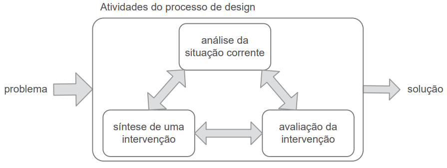

# Processo de design

## Introdução
Os processos de design em IHC definem e detalham diversas formas de executar as atividades relacionadas ao design de um projeto de software. O processo de design possui 3 atividades básicas: análise da situação atual, síntese de uma intervenção e avaliação da intervenção. Estas 3 atividades possuem um ciclo genérico de execução, como mostrado na figura 1.

Figura 1: Ciclo genérico de atividades do processo de design (Fonte: adaptado de (Lawson, 2006)).

## Processos analisados

* Ciclo de vida simples (Sharp et al., 2019).
* Ciclo de vida em estrela (Hix e Hartson, 1993).
* Engenharia de Usabilidade de Nielsen (1994).
* Engenharia de Usabilidade de Mayhem (1999).
* Design Contextual (Beyer e Holtzblatt, 1997; Holtzblatt et al., 2004).
* Design baseado em Cenários (Rosson e Carroll, 2002; Carroll, 1995).
* Design dirigido por Objetivos (Cooper et al., 2014).
* Design centrado na Comunicação (Barbosa et al., 2005).

## Processo escolhido - Mayhem

Cada processo de design analisado propõe uma abordagem diferente para a execução do design de um projeto, cada um tendo seu objetivo, tipo de projeto e tipo de profissional únicos. Destes, a Engenharia de Usabilidade de Mayhem (1999) se mostra a melhor opção para um projeto de caráter educacional, por conta de seu grande detalhamento do processo de design. O ciclo de vida da Engenharia de Usabilidade de Mayhem (1999) pode ser observado no diagrama presente na figura 2.

Figura 2: Ciclo de vida para a engenharia de usabilidade (adaptado de Mayhew, 1999).

## Ciclo de vida

A Engenharia de Usabilidade de Mayhem (1999) divide o processo de design em 3 grandes fases:

### Análise de requisitos

Nesta fase são elicitadas as necessidades e limitações do sistema para criar as metas de usabilidade do projeto representadas pelo guia de estilo.

### Design, avaliação e desenvolvimento

Esta fase tem o objetivo de sintetizar uma solução de design satisfatória para o sistema, é dividida em 3 níveis, criando uma espécie de "evolução" entre os níveis onde o nível 1 é responsável pelo projeto da intervenção e criação de protótipos de baixa fidelidade, no nível 2 são criados padrões de design e protótipos de média fidelidade com o propósito de atingir as metas de usabilidade, no nível 3 o designer detalha e avalia a interface final do sistema.

### Instalação

Nesta fase o design é colocado em uso e os _feedbacks_ relacionadas à ele são coletados com o objetivo de apontar novas necessidades ou funcionalidades não atingidas anteriormente.

## Conclusão

Devido ao grande nível de detalhamento e compatibilidade com o projeto escolhemos a Engenharia de Usabilidade de Mayhem para nosso projeto e desenvolvemos nosso cronograma pensando nas atividades detalhadas no ciclo de vida apresentado anteriormente.

## Bibliografia
> [1] Barbosa, S. D. J.; Silva, B. S. da; Silveira, M. S.; Gasparini, I.; Darin, T.; Barbosa, G. D. J. (2021) Interação Humano-Computador e Experiência do usuário. Autopublicação. ISBN: 978-65-00-19677-1. 

## Histórico de Versão

|  Versão  |   Data   |                      Descrição                      |    Autor(es)   |  Revisor(es)  |
| -------- | -------- | --------------------------------------------------- | -------------- | ------------- |
|  `1.0`   | 17/04/23 | Criação do documento e adição do conteudo           | Pedro Ferreira | Felipe Mastromauro |