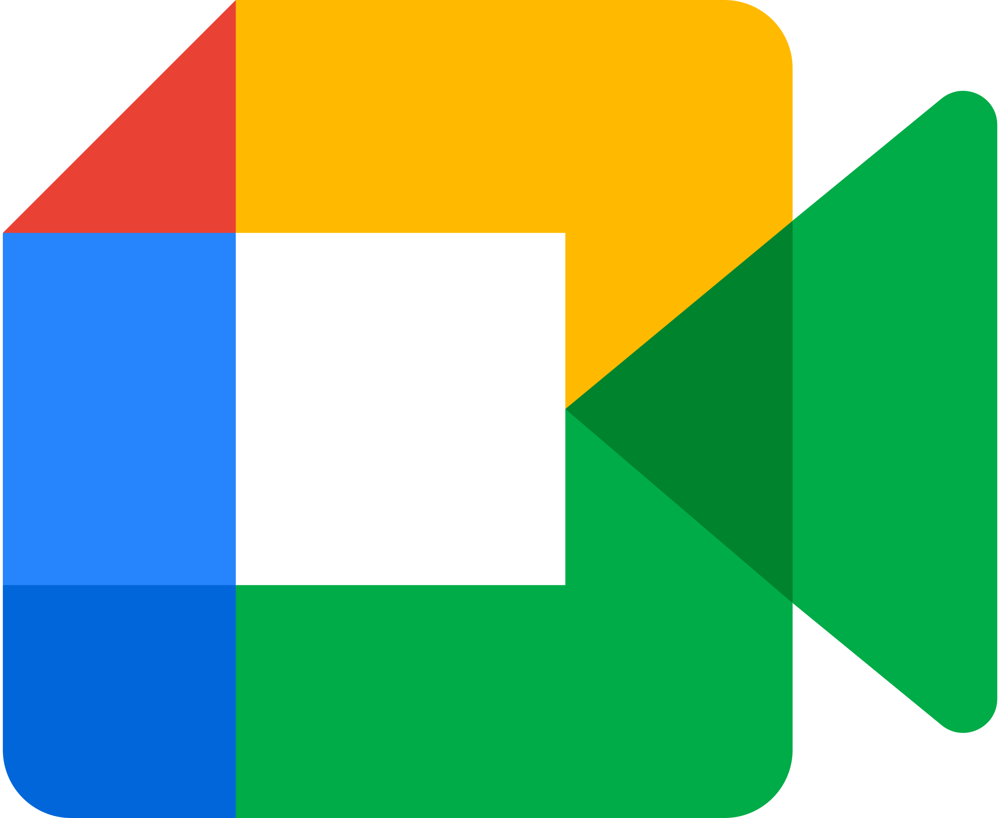
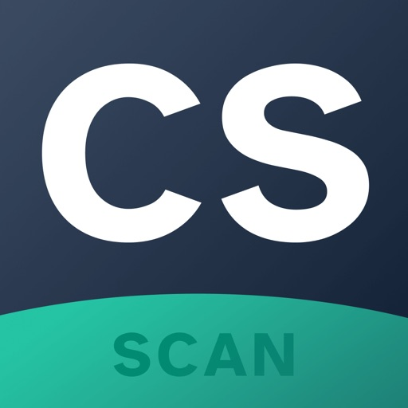

# Ferramentas 

## 1. Introdução
As ferramentas para o uso do projeto da disciplina foram escolhidas de acordo com as necessidades do grupo. Isso em relação a comunicação do grupo e também com o objetivo de facilitar a documentação e a gestão do trabalho. A escolha foi feita baseada na familiarização dos membros de acordo com cada ferramenta. Para que cada uma possa ser usada de maneira efetiva durante a disciplina.

## 2. Ferramentas utilizadas

Cada uma das ferramentas escolhidas estão listadas na Tabela 1, detalhando a finalidade e como é cada ferramenta.

|                                                                                         Logo                                                              | Ferramenta  | Finalidade                                                                                                                                                                                      |
|:------------------------------------------------------------------------------------------------------------------------------------------------------------------------------------:|:-----------:| ----------------------------------------------------------------------------------------------------------------------------------------------------------------------------------------------- |
| {width="40%"} |   Github    | Utilizado para documentação e desenvolvimento do projeto                                                                                                    |
| {width="60%"}  | Mkdocs Material  | Biblioteca utilizada para formatação e template da GitPages da disciplina                                     |
|  {width="40%"}   |   Teams  | Software no qual a equipe realiza reuniões semanais e também gravações                                                                 |
| {width="30%"} |   VsCode    | Principal IDE utilizada para o desenvolvimento dos arquivos e pastas |
|       {width="40%"}      | Figma  | Utilizado para o desenvolvimento de protótipos                                                                                                                  |
|     {width="40%"}     |   Discord   | Utilizado para comunicações e trabalho executado em grupo                                                                                                                      |
|     {width="40%"}     |  Telegram   | Utilizado para comunicações do grupo e também para contato para monitoria                                                                          |
|     {width="70%"}     |  Canva   | Utilizado para criação de designs para apresentações ou trabalho relacionado ao projeto                                                                         |
|     {width="50%"}     |  YouTube   | Utilizado para salvar gravações realizadas pelo grupo na GitPages da disciplina                                                                        |
|     {width="50%"}     |  This Person Does Not Exist   | Utilizado para gerar imagens a serem utilizadas para as personas                                                                        |
| {width="50%"} | Google Meet | Utilizado para entrevistas com usuários remotamente |
| {width="50%"}  | CamScanner | Utilizado para digitalizar documentos e protótipos em papel |
| {width="50%"} | OBS | Utilizado para gravação de tela e entrevistas com usuários |

Tabela 1: Ferramentas utilizadas no projeto (Fonte: autor, 2023).

## 3. Bibliografia

[1] Wiki IHC - Planejamento - Ferramentas. Disponível no [link](https://interacao-humano-computador.github.io/2022.2-Lichess/planejamento/tools/). Acesso em: 22 de abril de 2023.

## 4. Histórico de Versão

| Data  |    Data    |                            Descrição                            |   Autor(es)   |  Revisor(es)  |
| :---: | :--------: | :-------------------------------------------------------------: | :-----------: | :-----------: |
| `1.0` | 17/04/2023 |                Adição das ferramentas iniciais para o projeto               | Pedro H.  | Carlos E. |
| `1.1` | 22/04/2023 |                Adição de chamada da tabela no texto e inclusão das ferramentas YouTube e This Person Does Not Exist               | Pedro H.  | Pedro M. |