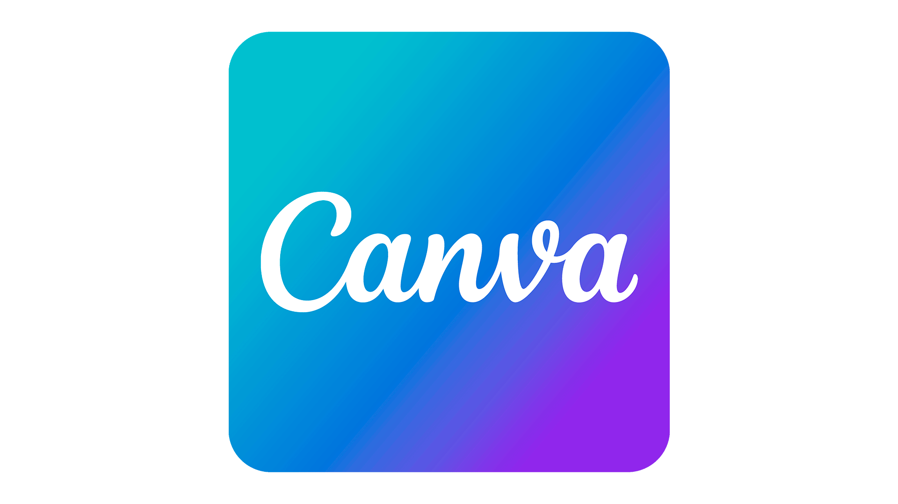

# Ferramentas 

## 1. Introdução
As ferramentas para o uso do projeto da disciplina foram escolhidas de acordo com as necessidades do grupo. Isso em relação a comunicação do grupo e também com o objetivo de facilitar a documentação e a gestão do trabalho. A escolha foi feita baseada na familiarização dos membros de acordo com cada ferramenta. Para que cada uma possa ser usada de maneira efetiva durante a disciplina.

## 2. Ferramentas utilizadas

Cada uma das ferramentas escolhidas estão listadas na Tabela 1, detalhando a finalidade e como é cada ferramenta.

| Logo | Ferramenta | Finalidade |
| :-: | :-: | :-: | 
| {width="40%"} | [Github](https://github.com/) | Utilizado para documentação e desenvolvimento do projeto |
| {width="60%"}  | [Mkdocs Material](https://squidfunk.github.io/mkdocs-material/) | Biblioteca utilizada para formatação e template da GitPages da disciplina |
| {width="40%"} | [Teams](https://www.microsoft.com/pt-br/microsoft-teams/log-in) | Software no qual a equipe realiza reuniões semanais e também gravações |
| {width="30%"} | [VsCode](https://code.visualstudio.com/) | Principal IDE utilizada para o desenvolvimento dos arquivos e pastas |
| {width="40%"} | [Figma](https://www.figma.com/) | Utilizado para o desenvolvimento de protótipos |
| {width="40%"} |   [Discord](https://discord.com/) | Utilizado para comunicações e trabalho executado em grupo |
| {width="40%"} | [Telegram](https://web.telegram.org/) | Utilizado para comunicações do grupo e também para contato para monitoria |
| {width="70%"} |  [Canva](https://www.canva.com/pt_br/) | Utilizado para criação de designs para apresentações ou trabalho relacionado ao projeto |
| {width="50%"} |  [YouTube](https://www.youtube.com/) | Utilizado para salvar gravações realizadas pelo grupo na GitPages da disciplina |
| {width="50%"} | [This Person Does Not Exist](https://thispersondoesnotexist.com/) | Utilizado para gerar imagens a serem utilizadas para as personas |
| {width="50%"} | [Diagrams.net](https://app.diagrams.net/) | Utilizado para gerar diagramas para análise de tarefas |
| {width="35%"} | [Google Forms](https://docs.google.com/forms//) | Utilizado para criação de formulários voltados para identificação do perfil de usuários |

Tabela 1: Ferramentas utilizadas no projeto (Fonte: autor, 2023).

## 3. Bibliografia

> [1] Wiki IHC - Planejamento - Ferramentas. Disponível no [link](https://interacao-humano-computador.github.io/2022.2-Lichess/planejamento/tools/). Acesso em: 22 de abril de 2023.

## 4. Histórico de Versão

| Data  |    Data    |                            Descrição                            |   Autor(es)   |  Revisor(es)  |
| :---: | :--------: | :-------------------------------------------------------------: | :-----------: | :-----------: |
| `1.0` | 17/04/2023 |                Adição das ferramentas iniciais para o projeto               | Pedro Henrique  | Carlos Eduardo |
| `1.1` | 22/04/2023 |                Adição de chamada da tabela no texto e inclusão das ferramentas YouTube e This Person Does Not Exist               | Pedro Henrique  | Pedro Muniz |
| `1.2` | 16/06/2023 | Adição de links para as ferramentas | Carlos E. | Pedro H. |
| `1.3` | 04/07/2023 | Adição de novas ferramentas | Pedro H. | Carlos E. |