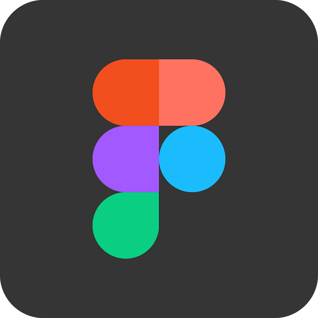

# Ferramentas 

## Introdução
As ferramentas para o uso do projeto da disciplina foram escolhidas de acordo com as necessidades do grupo. Isso em relação a comunicação do grupo e também com o objetivo de facilitar a documentação e a gestão do trabalho. A escolha foi feita baseada na familiarização dos membros de acordo com cada ferramenta. Para que cada uma possa ser usada de maneira efetiva durante a disciplina.

## Ferramentas utilizadas

|                                                                                         Logo                                                              | Ferramenta  | Finalidade                                                                                                                                                                                      |
|:------------------------------------------------------------------------------------------------------------------------------------------------------------------------------------:|:-----------:| ----------------------------------------------------------------------------------------------------------------------------------------------------------------------------------------------- |
| {width="50%"} |   Github    | Utilizado para documentação e desenvolvimento do projeto                                                                                                    |
| {width="75%"}  | Mkdocs Material  | Biblioteca utilizada para formatação e template da GitPages da disciplina                                     |
|  {width="50%"}   |   Teams  | Software no qual a equipe realiza reuniões semanais e também gravações                                                                 |
| {width="45%"} |   VsCode    | Principal IDE utilizada para o desenvolvimento dos arquivos e pastas |
|       {width="50%"}      | Figma  | Utilizado para o desenvolvimento de protótipos                                                                                                                  |
|     {width="50%"}     |   Discord   | Utilizado para comunicações e trabalho executado em grupo                                                                                                                      |
|     {width="50%"}     |  Telegram   | Utilizado para comunicações do grupo e também para contato para monitoria                                                                          |
|     {width="70%"}     |  Canva   | Utilizado para criação de designs para apresentações ou trabalho relacionado ao projeto                                                                         |

Tabela 1: Ferramentas utilizadas no projeto (Fonte: autor, 2023).

## Bibliografia

[1] Wiki IHC - 2022.2-Lichess - Planejamento - Ferramentas. Disponível em: <https://interacao-humano-computador.github.io/2022.2-Lichess/planejamento/tools/>. Acesso em: 17 de abril de 2023.

## Histórico de Versão

| Data  |    Data    |                            Descrição                            |   Autor(es)   |  Revisor(es)  |
| :---: | :--------: | :-------------------------------------------------------------: | :-----------: | :-----------: |
| `1.0` | 17/04/2023 |                Adição das ferramentas iniciais para o projeto               | Pedro Henrique  | Carlos Eduardo |