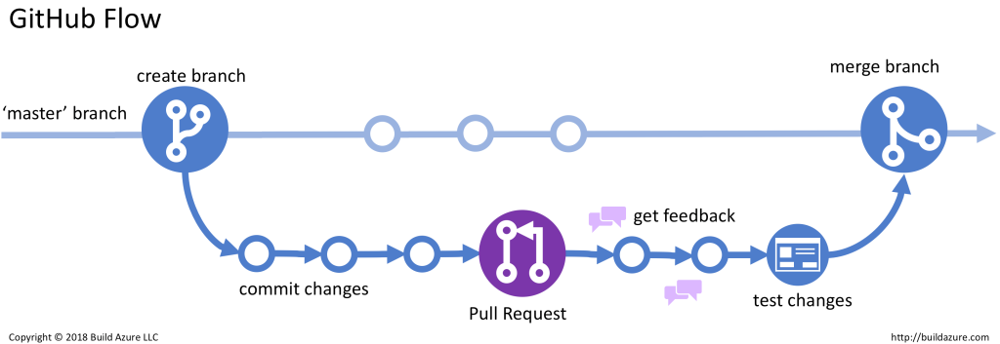

# Metodologia

## Introdução
Nós utilizamos diversas abordagens em nossa equipe, as quais de alguma maneira se complementam e otimizam nosso fluxo de desenvolvimento como um todo. Cabe ressaltar que este documento tem como objetivo apresentar nossas metodologias em diferentes situações, e de certa forma, explicar como nossa equipe se comunicou e trabalhou durante todo o processo.

## Scrum
Para garantir um fluxo consistente e ágil de entregas, optamos por adotar a metodologia SCRUM, visando a organização do tempo de nossa equipe. Foi estabelecido um timebox de uma semana para cada sprint, com início e término nas reuniões semanais realizadas às segundas-feiras, às 19:00.

As reuniões semanais têm como principais objetivos realizar a revisão (sprint review) da sprint concluída e planejar (sprint planning) as tarefas para a próxima sprint. A atribuição das tarefas foi realizada no início do projeto e está disponível no cronograma, sendo revisada em cada sprint planning para verificar a capacidade de cada membro de entregar a tarefa designada.

A organização das tarefas será feita por meio da criação de issues e a revisão dos artefatos será realizada durante o processo de pull request para cada funcionalidade adicionada. Dessa forma, é possível manter um registro claro das alterações e revisões efetuadas, garantindo a rastreabilidade do trabalho realizado.

{width="100%"}
Figura 1 - Scrum fluxo (Fonte: [link](https://www.wrike.com/project-management-guide/methodologies/), 2023).

## Políticas
Para maior controle sobre criação e mudanças de artefatos, definimos que os commit's devem seguir as regras: 

### Branch
Definimos a utilização de branches para realização de cada issue, ou mais de uma issue relacionadas, com isso temos maior liberdade para realização de tarefas em paralelo sem que haja conflito em uma mesma branch, além disso, temos maior controle do que está sendo realizado em cada atividade. Esse fluxo está representado na figura 2 - Fluxo branches.

{width="100%"}
Figura 2 - Fluxo de branches (Fonte: [link](https://build5nines.com/introduction-to-git-version-control-workflow/), 2023).

### Commit
Utilizamos quatro nomes reservados para identificar o tipo de alteração que foi feita:
- Create: criação de um artefato
- Update: mudanças em um artefato
- Delete: deletar um artefato
- Review: mudanças realizadas a partir de exigencia do revisor do artefato

> Exemplo
>
> `Create: documento de metodologias`
>
> `Update: política de commit no documento de metodologias`

### Pull Request
Para o projeto, implementamos uma política que simplifica o controle das atividades e oferece uma abordagem prática para a revisão dos artefatos. Quando um pull request é aberto, o revisor designado anteriormente é solicitado a avaliar as alterações feitas, permitindo o merge caso estejam corretas ou fornecendo feedback caso haja erros, juntamente com uma mensagem solicitando que o autor do pull request os corrija.

## Histórico de Versão

|  Versão  |   Data   |                      Descrição                      |    Autor(es)   |  Revisor(es)  |
| -------- | -------- | --------------------------------------------------- | -------------- | ------------- |
|  `1.0`   | 13/04/23 | Criação do documento e adição do conteúdo           | Carlos Eduardo | João Morbeck |
