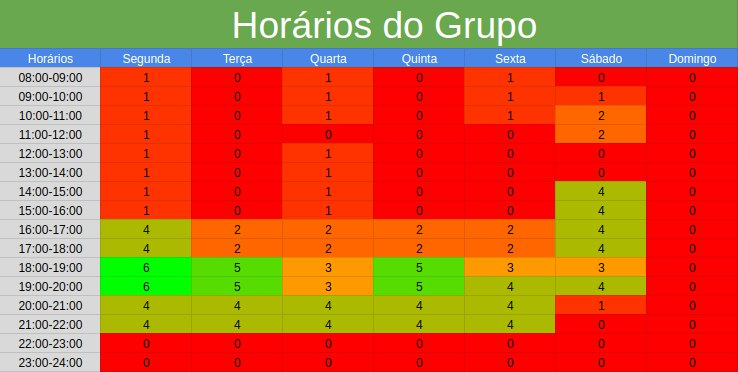

# Reuniões 

## 1. Introdução
Realizamos um estudo dos horários da equipe por meio de um mapa de calor, que nos ajudou a identificar os melhores momentos para agendar atividades e reuniões. A figura 1 apresenta os resultados obtidos, que foram usados para otimizar nosso cronograma e garantir a participação de todos os membros da equipe, resultando em maior eficiência e produtividade no trabalho conjunto.

{width="100%"}
Figura 1 - Tabela de horários do grupo (Fonte: autor, 2023).

Dessa forma, como podemos observar no mapa de calor, nossa reunião foi marcada para toda segunda-feira as 19:00 horas onde temos todos os membros do grupo disponiveis para maior eficiencia nas reuniões.

## Histórico de Versão

|  Versão  |   Data   |                      Descrição                      |    Autor(es)   |  Revisor(es)  |
| -------- | -------- | --------------------------------------------------- | -------------- | ------------- |
|  `1.0`   | 13/04/23 | Criação do documento                                | Carlos E. | Amanda N. |