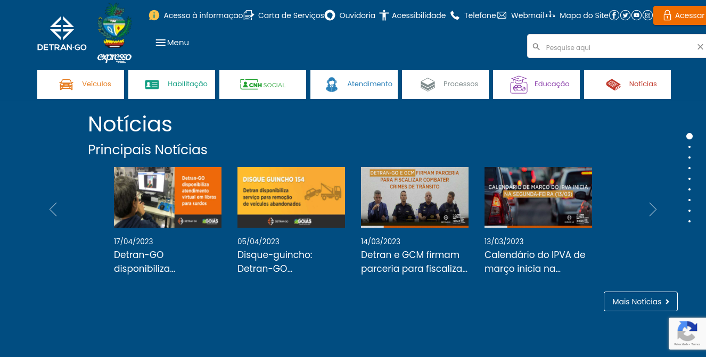
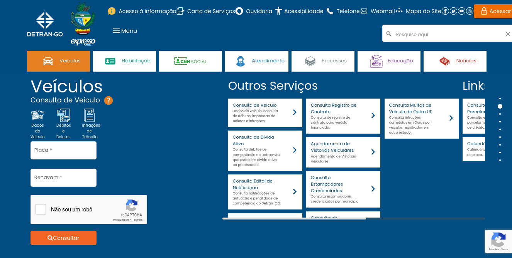

# Site selecionado para o projeto da disciplina

## Introdução

No decorrer dos trabalhos feitos para a entrega de artefatos da etapa 01, foi atribuído aos membros a escolha e avaliação de um site, os sites escolhidos pelos membros e suas respectivas avaliações podem ser encontrados neste [link](sites_avaliados/sites_avaliados.md), a escolha dos sites teve como foco, aqueles que pertencem a orgãos do governo e de outros estados, visto que a maioria dos sites que se encontram nessa descrição e são do Distrito Federal, já foi foco de trabalhos de outros grupos da disciplina de Interação Humano Computador, com base na avaliação, foram decidido entre os membros qual destes sites será trabalhado na disciplina.

## Site definido pela equipe

Ao analisar os sites escolhidos e suas respectivas avaliações, dois sites se destacaram como possíveis candidatos a serem trabalhados na disciplina, o site do Departamento de Trânsito do estado do Goiás, chamado de DetranGO, e o site do Serviço Autônomo de Água e Esgoto de Sorocaba, ambos os sites possuem problemas claros de usabilidade, mas a escolha final ficou para o site do Departamento de Trânsito devido a facilidade de se encontrar possíveis usuários, sendo que os usuários não precisam necessariamente viver no estado do Goiás, pois as mesmas funcionalidades desejadas no site do Detran do Goiás são cobiçadas em sites de outras unidades federativas.

## DetranGO

O site DetranGO possui diversas funcionalidades esperadas, a maioria de consulta de informações relacionadas ao departamento de trânsito ou de alguma documentação ou processo relacionado à Carteira Nacional de Habilitação ou o registro de um Veículo, porém é possível identificar diversos problemas de usabilidade, como dificuldade de encontrar informações desejadas e acesso à algumas funcionalidades ser difícil, nas figuras abaixo podemos observar rapidamente o quão complicada pode ser a navegação pelo site.

**Figura 1 - Tela principal(Fonte: [DETRAN GO](https://www.detran.go.gov.br/psw/#/pages/pagina-inicial), Acesso em 19 de Abril de 2023)**

Na figura 1 é possível identificar problemas com a disponibilização das funcionalidades, alguns estão muito juntos o que dificulta a visualização e o acesso, além dos elementos visuais estarem mal distribuídos pela página, com o uso do site se torna perceptível o quanto que se torna um incomodo a maneira que as seções são divididas e o acesso a elas através da barra de deslizamento.

**Figura 2 - Seção de Veículos(Fonte: [DETRAN GO](https://www.detran.go.gov.br/psw/#/pages/pagina-inicial), Acesso em 19 de Abril de 2023)**

Na figura 2 é identificado problemas de distribuição de funcionalidades, e a nomeação incorreta das seções, visto que na seção de outros serviços, dois deles não são identificáveis e seu acesso pode ser complicado devido a eles estarem "cortados", onde se diz outros serviços na verdade se encontra informações sobre estes, não há acesso a outros serviços a partir desta seção.

## Bibliografia

[1] Barbosa, S. D. J.; Silva, B. S. da; Silveira, M. S.; Gasparini, I.; Darin, T.; Barbosa, G. D. J. (2021) Interação Humano-Computador e Experiência do usuário. Autopublicação. ISBN: 978-65-00-19677-1.

[2] Site DetranGO: <https://www.detran.go.gov.br/psw/#/pages/pagina-inicial>, Acesso em 19 de Abril de 2023

## Histórico de versão

| Versão   | Data       | Descrição            | Autor(es)     | Revisor(es)    |
|:--------:|:----------:|:--------------------:|:-------------:|:--------------:|
| `1.0`    | 18/04/2023 | Criação do documento | João Morbeck  | Pedro Henrique |
