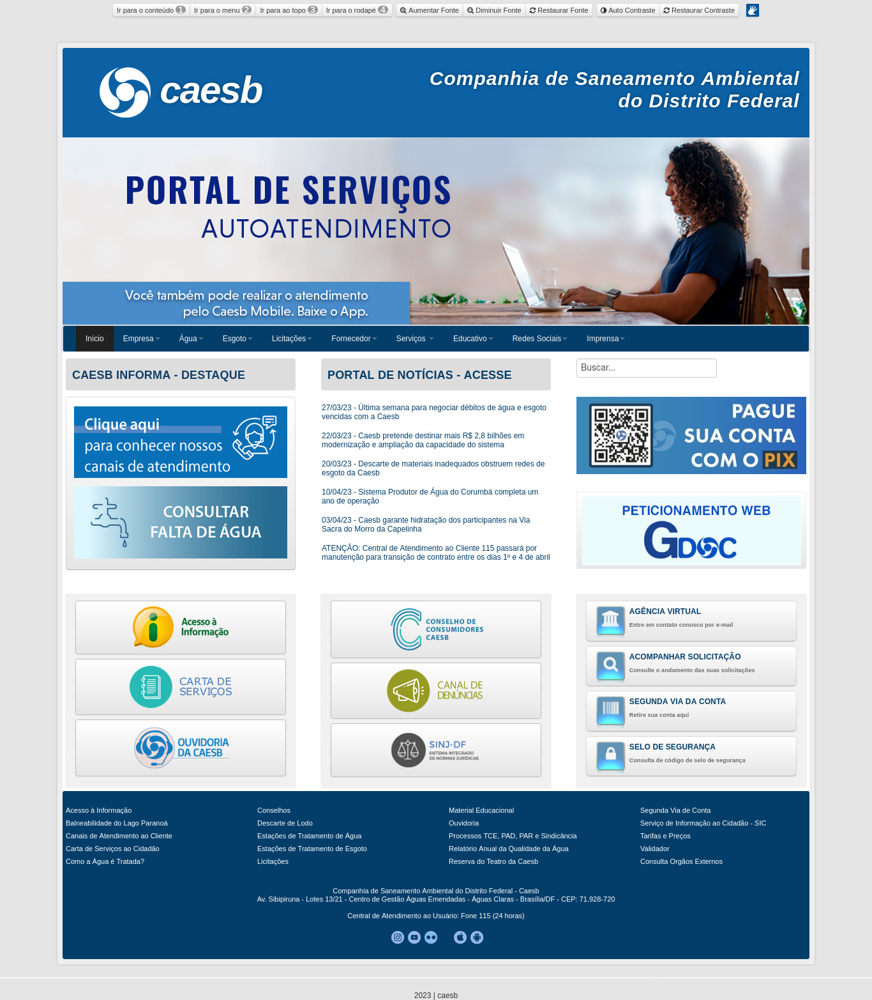
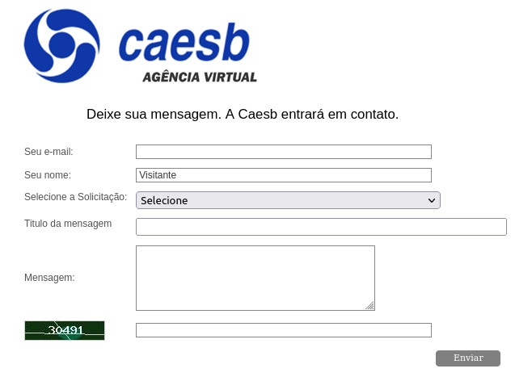
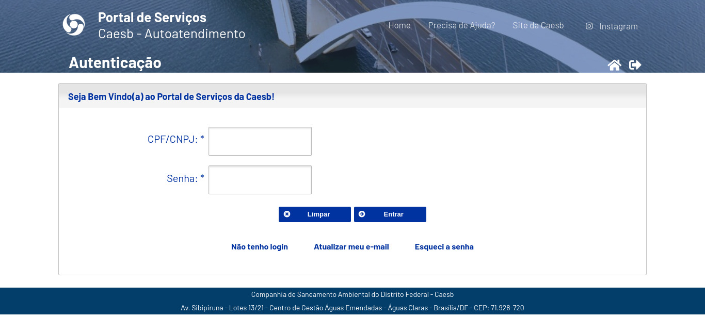

# Avaliação de IHC - CAESB

## Introdução

Este documento detalha a avaliação heurística do sítio da [CAESB - Companhia de Saneamento Ambiental do Distrito Federal](https://www.caesb.df.gov.br/), companhia responsável pela água e esgoto do Distrito Federal. Esta avaliação heurística segue um modelo adaptado para sítios descrito por Maciel et al. (2004)[1] que usa de formulários para classificar os problemas (marcados como perguntas no [planejamento da avaliação](../../assets/CAESB/avaliacaoCAESB.pdf)) de usabilidade a serem avaliados dentro de uma das 10 heurísticas de Nielsen e direcionar a avaliação de cada aspecto.

**Figura 1: Página principal do sítio da CAESB (Fonte: [CAESB](https://www.caesb.df.gov.br/))**

## Perguntas

Como descrito no planejamento da avaliação (disponível [aqui](../../assets/CAESB/avaliacaoCAESB.pdf)), as perguntas escolhidas são:

* O sítio segue o padrão da empresa?
* O sítio segue os padrões da W3C de acessibilidade?
* O status do sistema é claro para o usuário?
* A interface é insatisfatória?
* O usuário é capaz de atingir seu objetivo de maneira rápida?
* É possível oferecer esta tecnologia de modo mais interessante aos usuários?

## Formulários de avaliação

Como descrito no planejamento da avaliação e na introdução desta seção, serão utilizados formulários segundo o modelo sugerido por Maciel et el. (2004)[1].

## Avaliação

Para esta seção,os formulários preenchidos foram organizados pela ordem das heurísticas sob as quais as perguntas foram classificadas.

### Visibilidade do estado do sistema

| **1. Visibilidade do estado do sistema** |
| ---------------------------------------- |
| **Verificação:** O status do sistema é claro para o usuário? |
| **Grau de severidade:** [ ] 0 - Sem importância [ ] 1 - Cosmético [ ] 2 - Simples [X] 3 - Grave [ ] 4 - Catastrófico |
| **Natureza do problema:** [ ] Barreira [X] Obstáculo [ ] Ruído |
| **Perspectiva do usuário:** [ ] Problema Geral [X] Problema Preliminar [ ] Problema Especial |
| **Perspectiva da tarefa:** [X] Problema Principal [ ] Problema Secundário |
| **Descrição do Problema:**   **Contexto:** O usuário acessou o sítio e clicou no botão “Agência Virtual”, localizado no canto inferior direito da página. A página da figura 2 foi mostrada ao usuário.  **Causa:** Há páginas no sítio que não mostram o estado do sistema para o usuário.  **Efeitos sobre o usuário:** Desorientação e desconforto ao utilizar o sistema.  **Efeitos sobre a tarefa:** Confusão sobre localização dentro de uma tarefa, dificuldade na alternância de tarefas.  **Correção possível:** Padronizar as páginas do sítio, mantendo o estado do sistema sempre visível.|

**Figura 2: Página "Agência Virtual do sítio da CAESB" (Fonte: [CAESB](https://www.caesb.df.gov.br/))**

### Consistência e padrões

| **4. Consistência e padrões** |
| ---------------------------------------- |
| **Verificação:** O sítio segue o padrão da empresa? |
| **Grau de severidade:** [ ] 0 - Sem importância [X] 1 - Cosmético [ ] 2 - Simples [ ] 3 - Grave [ ] 4 - Catastrófico |
| **Natureza do problema:** [ ] Barreira [ ] Obstáculo [X] Ruído |
| **Perspectiva do usuário:** [X] Problema Geral [ ] Problema Preliminar [ ] Problema Especial |
| **Perspectiva da tarefa:** [ ] Problema Principal [X] Problema Secundário |
| **Descrição do Problema:**   **Contexto:** O usuário acessou o sítio e clicou no botão “Segunda via da conta”, localizado no canto inferior direito da página. A página de autenticação da Figura 3 foi mostrada ao usuário.  **Causa:** Há páginas no sítio que não mostram o estado do sistema para o usuário.  **Efeitos sobre o usuário:** Confusão e desconforto.  **Efeitos sobre a tarefa:** Nenhum.   **Correção possível:** Uniformização do padrão de páginas do sítio.|

**Figura 3: Página de autenticação do Portal de serviços - autoatendimento da CAESB (Fonte: [CAESB](https://www.caesb.df.gov.br/))**

| **4. Consistência e padrões** |
| ---------------------------------------- |
| **Verificação:** O sítio segue o padrão da empresa? |
| **Grau de severidade:** [ ] 0 - Sem importância [ ] 1 - Cosmético [ ] 2 - Simples [ ] 3 - Grave [X] 4 - Catastrófico |
| **Natureza do problema:** [X] Barreira [ ] Obstáculo [ ] Ruído |
| **Perspectiva do usuário:** [ ] Problema Geral [ ] Problema Preliminar [X] Problema Especial |
| **Perspectiva da tarefa:** [X] Problema Principal [ ] Problema Secundário |
| **Descrição do Problema:**   **Contexto:**O usuário acessou a página principal e utilizou-se de um leitor de tela para navegar pelo sítio.   **Causa:** O sítio não adere aos padrões de acessibilidade definidos pela W3C.  **Efeitos sobre o usuário:** De desorientação a impedimento do uso do sítio.   **Efeitos sobre a tarefa:** Grande dificuldade ou impossibilidade de realizá-la.   **Correção possível:**  Melhor uso de textos alternativos no sítio, implementação de opções de acessibilidade por todo o sítio. |

### Reconhecimento ao invés de lembrança

| **6. Reconhecimento ao invés de lembrança** |
| ---------------------------------------- |
| **Verificação:** O usuário é capaz de atingir seu objetivo de maneira rápida?
 |
| **Grau de severidade:** [ ] 0 - Sem importância [] 1 - Cosmético [ ] 2 - Simples [X] 3 - Grave [ ] 4 - Catastrófico |
| **Natureza do problema:** [ ] Barreira [X] Obstáculo [ ] Ruído |
| **Perspectiva do usuário:** [X] Problema Geral [ ] Problema Preliminar [ ] Problema Especial |
| **Perspectiva da tarefa:** [X] Problema Principal [ ] Problema Secundário |
| **Descrição do Problema:**   **Contexto:** O usuário acessou a página inicial do sítio (Figrua 1). O usuário acessou a “Agência virtual” (Figura 2) , mas não tem acesso a serviços imediatos do site. O usuário acessou a “Segunda via da conta”, localizada no canto inferior direito da página principal, e lá obteve acesso à uma página de autenticação (Figura 3) que o levou para a página “Portal de serviços” (Figura 4).  **Causa:** Há páginas no sítio que não mostram o estado do sistema para o usuário.  **Efeitos sobre o usuário:** Desorientação, confusão, frustração.  **Efeitos sobre a tarefa:** Maior tempo para sua realização de maneira eficiente já disponível.   **Correção possível:** Melhor organização do sítio para fácil reconhecimento de tarefas. |

**Figura 4: Página do Portal de serviços - autoatendimento da CAESB (Fonte: [CAESB](https://www.caesb.df.gov.br/))**

| **6. Reconhecimento ao invés de lembrança** |
| ---------------------------------------- |
| **Verificação:** A interface é insatisfatória?
 |
| **Grau de severidade:** [ ] 0 - Sem importância [] 1 - Cosmético [X] 2 - Simples [ ] 3 - Grave [ ] 4 - Catastrófico |
| **Natureza do problema:** [ ] Barreira [X] Obstáculo [ ] Ruído |
| **Perspectiva do usuário:** [X] Problema Geral [ ] Problema Preliminar [ ] Problema Especial |
| **Perspectiva da tarefa:** [ ] Problema Principal [X] Problema Secundário |
| **Descrição do Problema:**   **Contexto:** O usuário acessou a página principal do sítio (Figura 1). O usuário não sabe onde procurar para realizar tarefas.  **Causa:**  A interface não provê meios satisfatórios de indicar onde devem ser realizadas certas tarefas.  **Efeitos sobre o usuário:** Desorientação, frustração, insatisfação.  **Efeitos sobre a tarefa:** Nenhum.   **Correção possível:** Melhor organização da interface do sítio para mais fácil reconhecimento de tarefas e maior satisfação do usuário. |

### Estética e design minimalista

| **8. Estética e design minimalista** |
| ---------------------------------------- |
| **Verificação:** É possível oferecer esta tecnologia de modo mais interessante aos usuários? |
| **Grau de severidade:** [ ] 0 - Sem importância [X] 1 - Cosmético [ ] 2 - Simples [ ] 3 - Grave [ ] 4 - Catastrófico |
| **Natureza do problema:** [ ] Barreira [ ] Obstáculo [X] Ruído |
| **Perspectiva do usuário:** [X] Problema Geral [ ] Problema Preliminar [ ] Problema Especial |
| **Perspectiva da tarefa:** [ ] Problema Principal [X] Problema Secundário |
| **Descrição do Problema:**   **Contexto:** O usuário acessou o sítio e clicou no botão “Agência Virtual”, localizado no canto inferior direito da página. A página da figura 2 foi mostrada ao usuário.  **Causa:** A interface da página da figura 2 não tem atributos que guiem o usuário por seu uso.  **Efeitos sobre o usuário:** Desconforto, frustração.  **Efeitos sobre a tarefa:** Nenhum.   **Correção possível:** Criação de nova interface para a página de “Agência Virtual”, mantendo os padrões do sítio. |

## Conclusão

O sítio não apresenta problemas quanto à realização das tarefas em si. No entanto, diversos impedimentos e distrações foram encontrados nesta avaliação, indo de cosméticos; como a falta de atributos que guiem o uso do usuário em determinadas páginas, a catastróficos; como a falta de acessibilidade em diversas páginas do sítio que não a principal. Estas falhas, no geral, dificultam o uso eficiente e satisfatório das ferramentas do sítio pelo usuário.

## Referências bibliográficas
   > [1] MACIEL, C. et al. Avaliação Heurística de Sítios na Web. [s.d.].

   > [2] Barbosa, S. D. J.; Silva, B. S. da; Silveira, M. S.; Gasparini, I.; Darin, T.; Barbosa, G. D. J. (2021) Interação Humano-Computador e Experiência do usuário. Autopublicação. ISBN: 978-65-00-19677-1.
   > [3]  W3C. CARTILHA DE ACESSIBILIDADE NA WEB: Cartilha de Acessibilidade na Web. Brasil: Creative Commons, 2009. Disponível em: https://www.w3c.br/pub/Materiais/PublicacoesW3C/cartilha-w3cbr-acessibilidade-web-fasciculo-I.html. Acesso em: 09 abr. 2023.

## Histórico de versão

|  Versão  |   Data   |                      Descrição                      |    Autor(es)   |  Revisor(es)  |
| -------- | -------- | --------------------------------------------------- | -------------- | ------------- |
|  `1.0`   | 10/04/23 | Criação do documento e adição do conteúdo           | Felipe Mastromauro | Pedro Ferreira |