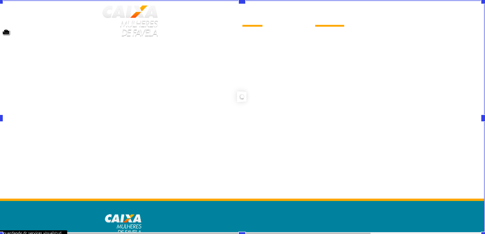
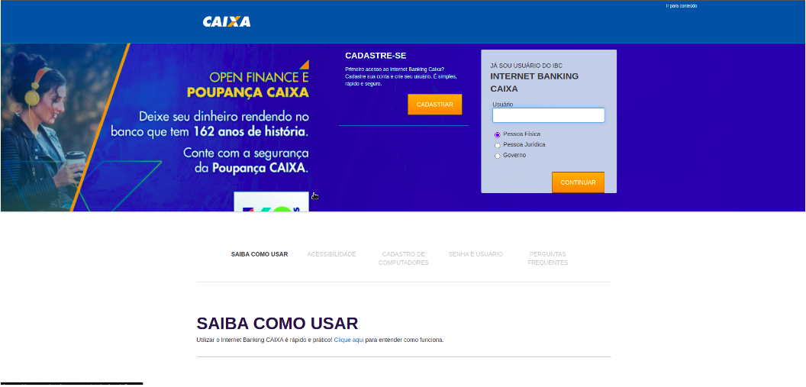
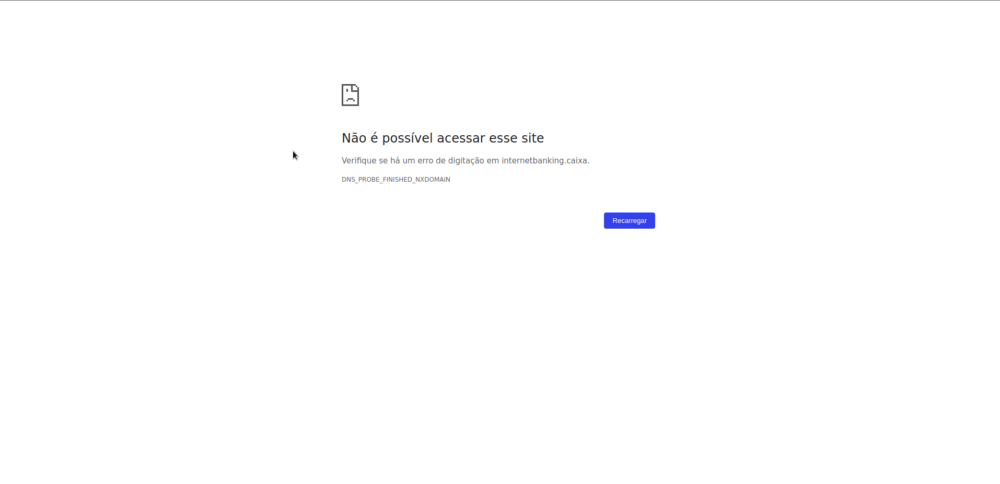
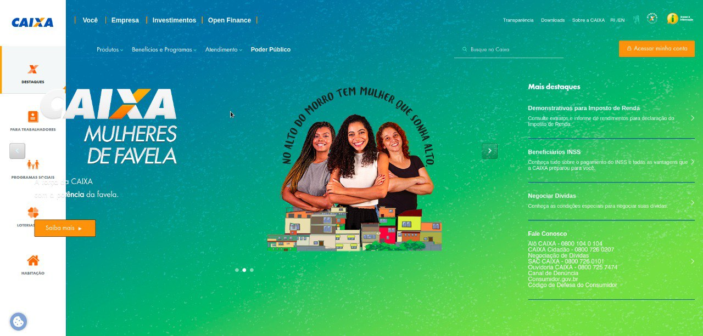
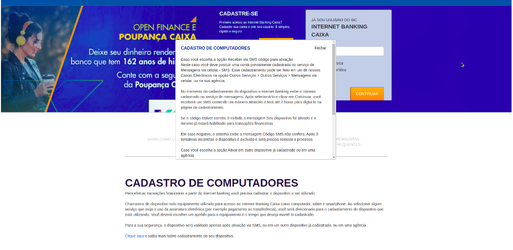
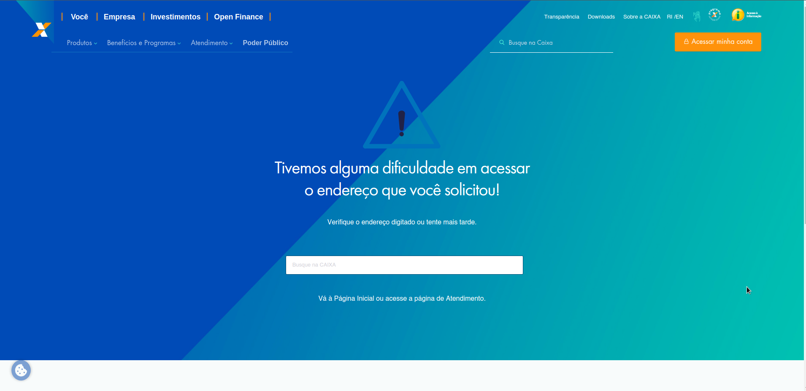

# Avaliação de IHC - Caixa Econômica Federal

## 1. Introdução

Este documento tem o objetivo de avaliar o site da [Caixa Econômica Federal](https://www.caixa.gov.br/Paginas/home-caixa.aspx) por meio do planejamento realizado com o framework DECIDE e a utilização da Avaliação Heurística de Nielsen. O site da Caixa Econômica Federal apresenta como finalidade fornecer informações e serviços relacionados a produtos e serviços bancários oferecidos pela instituição financeira CAIXA. Além disso, o site também oferece informações sobre programas sociais do governo brasileiro, como o Bolsa Família e o Minha Casa Minha Vida. Para informações detalhadas do planejamento para o sítio em questão, segue-se o [planejamento disponível](../../assets/CAIXA/PlojetoParteIndividualMetodoeAvali%C3%A7%C3%A3oPedroHenriqueDaSilvaMelo.pdf) para acesso.

## 2. Uso da Avaliação Heurística

Este é o método utilizado e planejado para a avaliação do sítio em questão. Dessa forma, as 10 heurísticas propostas por Nielsen vão ser utilizadas para o contexto da avaliação.

## 3. Status do Sistema

O usuário deve manter-se informado sobre o que está ocorrendo no sítio e suas ações que são realizadas. A princípio, a página inicial do sítio da Figura 1 não apresenta nenhum mecanismo que contribui diretamente para passar feedbacks ao usuário a respeito do status e ações no sistema.

|  
| :------------------------------: |

**Figura 1 - Página Inicial da Caixa Econômica Federal (Fonte: [Caixa Econômica Federal](https://www.caixa.gov.br/Paginas/home-caixa.aspx))**

|  
| :------------------------------: |

**Figura 2 - botão para mudança de informações da tela (Fonte: [Caixa Econômica Federal](https://www.caixa.gov.br/Paginas/home-caixa.aspx))**

| **1. Visibilidade do estado do sistema** |
| ---------------------------------------- |
| **Verificação:** O sistema tem a capacidade de manter o usuário informado do seu estado atual e suas ações? |
| **Grau de severidade:** [ ] 0 - Sem importância [ ] 1 - Cosmético [ ] 2 - Simples [X] 3 - Grave [ ] 4 - Catastrófico |
| **Natureza do problema:** [ ] Barreira [X] Obstáculo [ ] Ruído |
| **Perspectiva do usuário:** [ ] Problema Geral [X] Problema Preliminar [ ] Problema Especial |
| **Perspectiva da tarefa:** [ ] Problema Principal [X] Problema Secundário |
| **Descrição do Problema:**   **Contexto:** O usuário tentou mudar a perspectiva do visual da página em questão por meio do clique no botão da Figura 2.  **Causa:** o botão de mudança de visão não funciona quando a visão da página está configurada mais a esquerda ou mais a direita possível.  **Efeitos sobre o usuário:** Desconforto.  **Efeitos sobre a tarefa:** Impossibilita a capacidade do sistema reagir a ação do usuário.  **Correções possíveis:** Permitir o efeito do botão para ocorrer nos extremos da visualização da página em questão.|

**Tabela 1: Formulário para Avaliação Heurística - Visibilidade do estado do sistema (Fonte: autor, 2023)**

## 4. Compatibilidade entre o sistema e o mundo real
Em geral, o sítio apresenta uma linguagem compatível com o seu público-alvo, sendo fruto do trabalho que a marca CAIXA fornece para se comunicar com os seus stakeholders. O que significa que o sítio consegue exercer sua compatibilidade entre o sistema e o mundo real.

## 5. Controle do usuário e liberdade
O sítio apresenta muitas abas e possibilidades para o usuário navegar, porém foi percebido algumas ações que contribuem para problemáticas relacionadas ao controle do usuário e sua liberdade no uso do sistema.

|  |
| :----------------------------------------------------------------------: |

**Figura 3:  Página de inscrição para o CAIXA Mulheres de Favela (Fonte: [CAIXA Mulheres de Favela](https://mulheresdefavela.cufa.org.br/))**

| **3. Controle do usuário e liberdade** |
| ---------------------------------------- |
| **Verificação:** Os usuários conseguem ter a sensação de controle e que o sítio responde às suas ações? |
| **Grau de severidade:** [ ] 0 - Sem importância [ ] 1 - Cosmético [ ] 2 - Simples [X] 3 - Grave [ ] 4 - Catastrófico |
| **Natureza do problema:** [ ] Barreira [ ] Obstáculo [X] Ruído |
| **Perspectiva do usuário:** [X] Problema Geral [ ] Problema Preliminar [ ] Problema Especial |
| **Perspectiva da tarefa:** [X] Problema Principal [ ] Problema Secundário |
| **Descrição do Problema:**   **Contexto:** O usuário tentou acessar a página de inscrição do Mulheres de Favela e acabou encontrando problemas de carregamento da página.  **Causa:** Ao clicar para se inscrever para Mulheres de Favela ocorreu a problemática observada.  **Efeitos sobre o usuário:** Desconforto, impaciência durante o carregamento lento da página.  **Efeitos sobre a tarefa:** Dificuldades na navegação da página.  **Correções possíveis:** Buscar meios de acelerar o carregamento da página. |

**Tabela 2: Formulário para Avaliação Heurística - Controle e liberdade do usuário (Fonte: autor, 2023)**

## 6. Prevenção de Erros
Em certas páginas do sítio, o usuário não é informado e nem evitado de cometer erros em relação a suas ações durante a navegação.

|  | 

**Figura 4: Página de acesso ao cadastro do Internet Banking Caixa (Fonte: [Página de acesso do usuário](https://internetbanking.caixa.gov.br/sinbc/#!nb/login))**

|  | 

**Figura 5: Página não acessível ao clicar na aba que o mouse da figura 4 está por cima (Fonte: [Caixa Econômica Federal](https://internetbanking.caixa/sinbc/#!nb/login))**

| **4. Prevenção de Erros** |
| ---------------------------------------- |
| **Verificação:** O usuário tem a capacidade de cometer erros que poderiam ser prevenidos?  |
| **Grau de severidade:** [ ] 0 - Sem importância [ ] 1 - Cosmético [ ] 2 - Simples [X] 3 - Grave [ ] 4 - Catastrófico |
| **Natureza do problema:** [ ] Barreira [ ] Obstáculo [X] Ruído |
| **Perspectiva do usuário:** [X] Problema Geral [ ] Problema Preliminar [ ] Problema Especial |
| **Perspectiva da tarefa:** [X] Problema Principal [ ] Problema Secundário |
| **Descrição do Problema:**   **Contexto:** O usuário ao clicar em uma aba clicável da página de cadastro do Internet Banking Caixa acabou quebrando a página.  **Causa:** Uma aba clicável permitiu a quebra da página.  **Efeitos sobre o usuário:** Desconforto, confusão em relação ao porquê ocorreu a quebra, dificuldades em lidar com a situação.
.  **Efeitos sobre a tarefa:** Perda de tempo com a quebra da página.   **Correções possíveis:** Evidenciar a presença de uma aba clicável que leva para uma página quebrada e realizar uma nova modificação a ser planejada para isso. |

**Tabela 3: Formulário para Avaliação Heurística - Prevenção de Erros (fonte: autor, 2023)**

## 7.  Estética e design minimalista
Apesar do sítio apresentar informações e um design bem detalhado em certas partes da sua navegação e site, existe a utilização de elementos que possam confundir o usuário por não estarem coerentes com o restante da página e terem pouco destaque.

|  | 

**Figura 6: Aba de destaques e outras informações(Fonte: [Caixa Econômica Federal](https://www.caixa.gov.br/Paginas/home-caixa.aspx#itemUm))**

| **5. Estética e design minimalista** |
| ---------------------------------------- |
| **Verificação:** A hierarquia de informações está adequada na sua apresentação?  |
| **Grau de severidade:** [ ] 0 - Sem importância [ ] 1 - Cosmético [ ] 2 - Simples [X] 3 - Grave [ ] 4 - Catastrófico |
| **Natureza do problema:** [ ] Barreira [X] Obstáculo [ ] Ruído |
| **Perspectiva do usuário:** [X] Problema Geral [ ] Problema Preliminar [ ] Problema Especial |
| **Perspectiva da tarefa:** [X] Problema Principal [ ] Problema Secundário |
| **Descrição do Problema:**   **Contexto:** O usuário na página principal foi apresentado à interface correspondente a Figura X que não possui destaque. Isso acabou ocorrendo em momentos ocasionais, porém recorrentes, durante o uso da página.  **Causa:** A interface das abas não são chamativas o suficiente e são desorganizadas.  **Efeitos sobre o usuário:** Desconforto, confusão em relação às abas e a interface.  **Efeitos sobre a tarefa:** Dificuldades em se orientar nas ações possíveis do site.   **Correções possíveis:**  Criar uma nova interface para as abas e botões em específico que sejam coerentes com as outras interfaces do sistema. |

**Tabela 3: Formulário para Avaliação Heurística - Estética e design minimalista (Fonte: autor, 2023)**

## 8. Ajuda e documentação
Na página de login do Internet Banking Caixa as abas de ajuda sobre como usar a aplicação são muito mal formatadas. Isso fica visível por meio da Figura 7.

|  |

**Figura 7: Página para cadastro no Internet Banking Caixa (Fonte: [Caixa Econômica Federal](https://internetbanking.caixa.gov.br/sinbc/#!nb/login))**

|  |
| ---------------------------------------------- |

**Figura 8: Página para Perguntas Frequentes (Fonte: [Caixa Econômica Federal](https://www.caixa.gov.br/site/Paginas/PageNotFoundError.aspx?requestUrl=https://www.caixa.gov.br/atendimento/internet-banking/perguntas-frequentes/Paginas/default.aspx))**

| **6. Ajuda e documentação** |
| ---------------------------------------- |
| **Verificação:** Existem recursos bem visíveis que orientem o usuário em situações fora do comum? |
| **Grau de severidade:** [ ] 0 - Sem importância [ ] 1 - Cosmético [X] 2 - Simples [ ] 3 - Grave [ ] 4 - Catastrófico |
| **Natureza do problema:** [X] Barreira [ ] Obstáculo [ ] Ruído |
| **Perspectiva do usuário:** [X] Problema Geral [ ] Problema Preliminar [ ] Problema Especial |
| **Perspectiva da tarefa:** [X] Problema Principal [ ] Problema Secundário |
| **Descrição do Problema:**   **Contexto:** O usuário buscou a documentação e ajuda presente na página e teve dificuldades no entendimento, além de a página para perguntas frequentes não ser encontrada dentro do sítio da Caixa como visto na figura 8.  **Causa:** Interface de ajuda mal posicionada e alocada no layout da página.  **Efeitos sobre o usuário:** Desconforto em relação a forma de apresentação das informações, falta de orientação direcionada sobre as informações de ajuda.  **Efeitos sobre a tarefa:** Tempo adicional para entender a ajuda passada.  **Correções possíveis:** Criação de uma interface mais interativa com o usuário e que as informações sejam melhores apresentadas para o usuário e com uma página de perguntas frequentes que funcione. |

**Tabela 4: Formulário para Avaliação Heurística - Ajuda e documentação (Fonte: autor, 2023)**

## 9. Conclusão
Portanto, é perceptível que o sítio da Caixa Econômica Federal atende o seu propósito, mas que apresenta aspectos que podem melhorar a interação e a experiência do usuário no uso da interface do sítio como um todo. As falhas observadas durante a avaliação são de grande impacto e causam diferença na navegação e usabilidade do site em questão.

## 10. Referências bibliográficas
  > [1] MACIEL, C. _et al_. Avaliação Heurística de Sítios na Web. Niterói, RJ: UFF, 2004.

## 11. Histórico de Versão

|  Versão  |   Data   |                      Descrição                      |    Autor(es)   |  Revisor(es)  |
| -------- | -------- | --------------------------------------------------- | -------------- | ------------- |
|  `1.0`   | 12/04/23 | Criação do documento e adição do conteudo           | Pedro H. | Carlos E. |