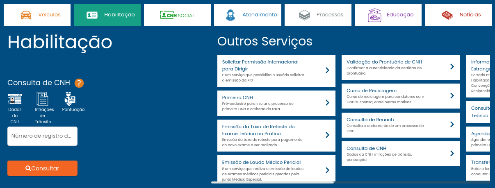
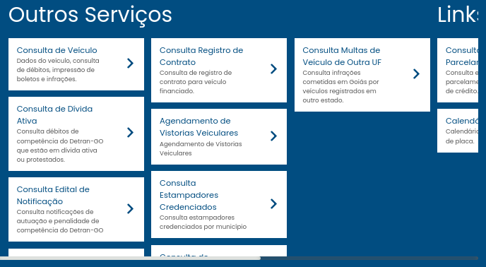

# Avaliação de IHC - DETRAN GO

## 1. Introdução

O sítio do [Detran GO](https://www.detran.go.gov.br/psw/#/pages/pagina-inicial) possui como objetivo principal, disponibilizar informações diversas, todas ligadas ao departamento de trânsito e aos serviços que são disponibilizados, estes separados em categorias como Habilitação, Veículo, Processo, Atendimento, Notícias, a princípio o usuário acessa o sítio para adquirir informações que são de posse do departamento de trânsito, seja sobre o próprio Detran ou sobre o veículo ou habilitação do usuário, e marcar atendimentos que serão feitos presencialmente, segue o [planejamento disponível](../../assets/DETRAN/ProjetoParteIndividualPlanejAvali%C3%A7%C3%A3oJo%C3%A3oPedroRodrigues.pdf).

## 2. Avaliação heurística

A avaliação heurística é o método de avaliação escolhido, consiste em o avaliador se colocar no papel do usuário e utilizar a aplicação, a fim de encontrar e avaliar problemas de usabilidade da interface, para avaliar, é utilizado uma série de heurísticas para determinar se o usuário é capaz de executar seus objetivos de maneira eficiente e satisfatória.

## 3. Compatibilidade do sistema com o mundo real

Em geral, o sítio do DETRAN possui uma boa compatibilidade com o mundo real, não existe termos ou jargões técnicos sendo utilizados pela interface e o uso de siglas é limitado e para aquelas em que o usuário já deve ter um certo grau de familiaridade, principalmente pelo fato de que o usuário deve utilizar os mesmos termos para fazer as buscas e chegar ao sítio do DETRAN.

## 4. Consistência e padrões

Na imagem abaixo, é possível identificar diversos problemas na interface, mas quanto à consistência de padrões, verificamos que existe a consulta de CNH à esquerda, mas na aba Outros Serviços existe uma aba de Consulta de CNH.

|  
| :------------------------------: |

**Figura 1 - Seção de Habilitação(Fonte: [DETRAN GO](https://www.detran.go.gov.br/psw/#/pages/pagina-inicial), Acesso 13 de Abril de 2023)**

| **Consistência e padrões** |     |
| -------------------------------------------------- | --- |
| **Verificação:** O usuário consegue identificar onde está a opção que deseja? |
| **Grau de Severidade:**   [ ] 0 - Sem importância   [ ] 1 - Cosmético   [X] 2 - Simples   [ ] 3 - Grave   [ ] 4 - Catastrófico | **Contexto:** O usuário busca uma opção, mas há múltiplas opções com o mesmo nome. |
| **Natureza do Problema:**    [ ] Barreira   [X] Obstáculo   [ ] Ruído | **Causa:** Múltiplas opções parecidas. |
| **Perspectiva do Usuário:**    [X] Geral   [ ] Preliminar   [ ] Especial | **Efeito sobre o usuário:** Desorientação. |
| **Perspectiva da Tarefa:**    [X] Principal   [ ] Secundário | **Efeito sobre a tarefa:** Atraso na execução. |
| **Possíveis Correções:** Definir novos termos para se referir às opções. |

**Tabela 1: Formulário para Avaliação Heurística - Consistência e padrões (Fonte: autor, 2023)**

## 5. Prevenção de erros

O sítio do DETRAN possui boas medidas de prevenção de erros, entre elas temos marcações para caso algum campo necessário não esteja preenchido, e os campos possuem informações sobre qual é a forma correta de preencher o campo, além de que ao fazer uma busca, por exemplo, pelo Renavam do veículo, surge um ícone indicando onde na documentação que se encontra o valor.

## 6. Reconhecimento ao invés de memorização

Na imagem, podemos ver que parte das opções não são completamente visíveis e não é possível descer para que as opções se tornem legíveis, é preciso clicar na parte visível para avançar e entender sobre o que se trata.

|  
| :------------------------------: |

**Figura 2 - Seção de Outros Serviços em Veículos(Fonte: [DETRAN GO](https://www.detran.go.gov.br/psw/#/pages/pagina-inicial), Acesso 13 de Abril de 2023)**

| **Reconhecimento ao invés de memorização** |     |
| -------------------------------------------------- | --- |
| **Verificação:** O usuário tem acesso às funções que deseja de maneira fácil? |
| **Grau de Severidade:**   [ ] 0 - Sem importância   [ ] 1 - Cosmético   [ ] 2 - Simples   [X] 3 - Grave   [ ] 4 - Catastrófico | **Contexto:** O usuário busca um serviço porém não consegue encontrá-lo. |
| **Natureza do Problema:**    [ ] Barreira   [X] Obstáculo   [ ] Ruído | **Causa:** As opções não estão bem divididas e indicadas. |
| **Perspectiva do Usuário:**    [X] Geral   [ ] Preliminar   [ ] Especial | **Efeito sobre o usuário:** Desorientação. |
| **Perspectiva da Tarefa:**    [ ] Principal   [X] Secundário | **Efeito sobre a tarefa:** Atraso na execução, dificuldade para completar. |
| **Possíveis Correções:**  Criar novas divisões e torná-las mais simples e compreensíveis. |

**Tabela 2: Formulário para Avaliação Heurística - Reconhecimento ao invés de memorização (Fonte: autor, 2023)**

## 7. Flexibilidade e eficiência de uso

A aplicação não flexibiliza o uso para um usuário experiente, isso pode ser visto na falta de atalhos para realizar certas tarefas (Figura 1), além da dificuldade que novos usuários possam ter ao encontrar opções desejadas.

| **Flexibilidade e eficiência de uso** |     |
| -------------------------------------------------- | --- |
| **Verificação:** O usuário tem acesso às funções que deseja de maneira rápida e eficiente? |
| **Grau de Severidade:**   [ ] 0 - Sem importância   [ ] 1 - Cosmético   [X] 2 - Simples   [ ] 3 - Grave   [ ] 4 - Catastrófico | **Contexto:** O usuário busca um serviço porém são necessários muitos cliques para encontrar. |
| **Natureza do Problema:**    [ ] Barreira   [ ] Obstáculo   [X] Ruído | **Causa:** As opções estão muito distantes e requerem muita interação do usuário. |
| **Perspectiva do Usuário:**    [X] Geral   [ ] Preliminar   [ ] Especial | **Efeito sobre o usuário:** Incômodo. |
| **Perspectiva da Tarefa:**    [X] Principal   [ ] Secundário | **Efeito sobre a tarefa:** Atraso na execução. |
| **Possíveis Correções:**  Criar seções de personalização da página ou colocar todas as principais juntas. |

**Tabela 3: Formulário para Avaliação Heurística - Flexibilidade e eficiência de uso (Fonte: autor, 2023)**

## 8. Estética e design minimalista

Na Figura 2, é possível verificar que há problemas quanto ao design de interface, certos elementos não estão completamente visíveis, além de possuir muitos elementos que ocupam boa parte do espaço do sítio.

| **Estética e design minimalista** |     |
| -------------------------------------------------- | --- |
| **Verificação:** O usuário busca por alguma opção, porém é necessário passar por muitos elementos até encontrar. |
| **Grau de Severidade:**   [ ] 0 - Sem importância   [ ] 1 - Cosmético   [ ] 2 - Simples   [X] 3 - Grave   [ ] 4 - Catastrófico | **Contexto:** O usuário busca por opções, porém há muitas, se encontram próximas, e nem todas são relevantes. |
| **Natureza do Problema:**    [ ] Barreira   [ ] Obstáculo   [X] Ruído | **Causa:** Alto número de opções. |
| **Perspectiva do Usuário:**    [X] Geral   [ ] Preliminar   [ ] Especial | **Efeito sobre o usuário:** Desorientação. |
| **Perspectiva da Tarefa:**    [ ] Principal   [X] Secundário | **Efeito sobre a tarefa:** Atraso na execução. |
| **Possíveis Correções:**  Separar melhor as opções, reduzir a quantidade de opções e reposicionar. |

**Tabela 4: Formulário para Avaliação Heurística - Estética e design minimalista (Fonte: autor, 2023)**

## 9. Ajuda e documentação

Na Figura 1, identifica-se uma seção de Outros Serviços, nessa seção há diversas opções, mas nestas opções se encontram informações dos serviços, e não os serviços em si.

| **Ajuda e documentação** |     |
| -------------------------------------------------- | --- |
| **Verificação:** O usuário consegue encontrar informações dos serviços? |
| **Grau de Severidade:**   [ ] 0 - Sem importância   [ ] 1 - Cosmético   [ ] 2 - Simples   [X] 3 - Grave   [ ] 4 - Catastrófico | **Contexto:** O usuário está buscando informações, porém não está claro onde estas informações se encontram. |
| **Natureza do Problema:**    [ ] Barreira   [ ] Obstáculo   [X] Ruído | **Causa:** Não há uma seção clara de ajuda. |
| **Perspectiva do Usuário:**    [X] Geral   [ ] Preliminar   [ ] Especial | **Efeito sobre o usuário:** Desorientação. |
| **Perspectiva da Tarefa:**    [X] Principal   [ ] Secundário | **Efeito sobre a tarefa:** Atraso na execução. |
| **Possíveis Correções:**  Estruturar uma nova seção de ajuda, com todas as documentações. |

**Tabela 5: Formulário para Avaliação Heurística - Ajuda e documentação (Fonte: autor, 2023)**

## 10. Conclusão

O sítio do Detran do Goiás possui alguns problemas de usabilidade, alguns problemas estéticos que dificultam o uso, como os diferentes scrolls e a quantidade de informações, porém a maioria dos problemas são ruídos em que o usuário consegue aprender para poder utilizar, porém estes problemas geram incômodo no usuário e devem ser corrigidos.

## 11. Referências bibliográficas
  > [1] MACIEL, C. _et al_. Avaliação Heurística de Sítios na Web. Niterói, RJ: UFF, 2004.

## 12. Histórico de Versão

|  Versão  |   Data   |                      Descrição                      |    Autor(es)   |  Revisor(es)  |
| -------- | -------- | --------------------------------------------------- | -------------- | ------------- |
|  `1.0`   | 13/04/23 | Criação do documento e adição do conteúdo           | João M. | Amanda N. |