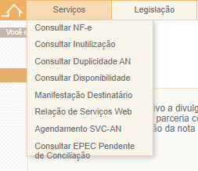
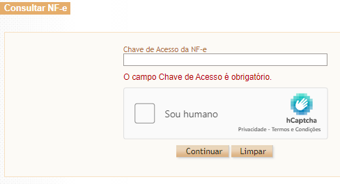
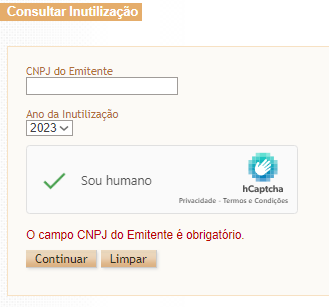

# Avaliação Heurística - Portal da Nota Fiscal Eletrônica

## Introdução

O site [NFE(Nota Fiscal Eletrônica)](https://www.nfe.fazenda.gov.br/portal/principal.aspx), tem como objetivo a divulgação de informações sobre a Nota Fiscal Eletrônica, tendo como finalidade a mudança do sistema atual de emissão da nota fiscal em papel por nota fiscal eletrônica. O site destina-se a todas as pessoas que realizam compras, principalmente na internet, onde a emissão da nota fiscal precisa ser feita de forma online/eletrônica.

## Avaliação Heurística

A avaliação heurística, método escolhido para avaliar o site NFE, consiste na inspeção sistêmica, onde o avaliador coloca-se no lugar do usuário, para encontrar problemas de usabilidade em uma interface, levando em consideração os aspectos que podem impedir que o usuário realize o seu objetivo ou que apresente lentidão na realização da sua tarefa até mesmo uma reação negativa para o usuário.

## Dados Coletados

A avaliação revelou problemas de usabilidade, que estão descritos a seguir.

### Compatibilidade do Sistema com o Mundo Real

| {align=left, width=250} | {align=right, width=300} |
| --------------------- | --------------------- |
| Figura 1 - Menu de navegação (Fonte: <a href="https://www.nfe.fazenda.gov.br/portal/principal.aspx">NFE</a>). | Figura 2 - Área de avisos (Fonte: <a href="https://www.nfe.fazenda.gov.br/portal/principal.aspx">NFE</a>).|

As figuras 1 e 2 ilustram o problema de compatibilidade com a realidade dos usuarios que não são familiarizados com as siglas e palavras utilizadas.

| **Compatibilidade entre o sistema e o mundo real** |     |
| -------------------------------------------------- | --- |
| **Verificação:** O público alvo entende as siglas e palavras utilizadas no site ? |
| **Grau de Severidade:**   [ ] 0 - Sem importância   [ ] 1 - Cosmético   [X] 2 - Simples   [ ] 3 - Grande   [ ] 4 - Catastrófico | **Contexto:** Usuário buscando um serviço porém não consegue identificá-lo. |
| **Natureza do Problema:**    [X] Barreira   [ ] Obstáculo   [ ] Ruído | **Causa:** As nomenclaturas utilizadas não estão de acordo com o repertório cultural do usuário. |
| **Perspectiva do Usuário:**    [X] Geral   [ ] Preliminar   [ ] Especial | **Efeito sobre o usuário:** Desorientação. |
| **Perspectiva da Tarefa:**    [X] Principal   [ ] Secundário | **Efeito sobre a tarefa:** Atraso na execução, trabalho adicional. |
| **Possíveis Correções:**  -> utilizar-se de termos mais comuns para o público geral  -> descrição das siglas ao lado ou ao passar o mouse |

 Tabela 1 - Relato de resultados - Compatibilidade do Sistema com o Mundo Real (Fonte: autor, 2023). 

### Consistência e Padrões

{align=left, width=360}  {align=right, width=320} 

Figura 3 - Formulário nota fiscal (Fonte: <a href="https://www.nfe.fazenda.gov.br/portal/consultaRecaptcha.aspx?tipoConsulta=resumo&tipoConteudo=7PhJ+gAVw2g=">NFE</a>).
 
Figura 4 - Formulário inutilização (Fonte: <a href="https://www.nfe.fazenda.gov.br/portal/consulta.aspx?tipoConsulta=inutilizacao&tipoConteudo=nDmpH/MjKrg=">NFE</a>).

{width=350}

Figura 5 - Formulário Agendamento (Fonte: <a href="https://www.nfe.fazenda.gov.br/AgendamentoSVC/Autenticacao.aspx">NFE</a>).

Nas images acima vemos que, os padrões de disposição e apresentação, das informações e erros não são mantidos por todo o site.

| **Consistência e Padrões** |     |
| -------------------------- | --- |
| **Verificação:** Os padrões se mantêm para fácil identificação do usuário ? |
| **Grau de Severidade:**   [ ] 0 - Sem importância   [ ] 1 - Cosmético   [X] 2 - Simples   [ ] 3 - Grande   [ ] 4 - Catastrófico | **Contexto:** Usuário utilizando algum formulário na plataforma. |
| **Natureza do Problema:**    [ ] Barreira   [ ] Obstáculo   [X] Ruído | **Causa:** Os padrões de disposição, design, informações não estão sendo seguidos em todo o site. |
| **Perspectiva do Usuário:**    [X] Geral   [ ] Preliminar   [ ] Especial | **Efeito sobre o usuário:** Confusão, Estranheza. |
| **Perspectiva da Tarefa:**    [X] Principal   [ ] Secundário | **Efeito sobre a tarefa:** Atraso na execução. |
| **Possíveis Correções:**   -> manter a consistência nos padrões para atividades semelhantes |

 Tabela 2 - Relato de resultados - Consistência e Padrões(Fonte: autor, 2023). 

### Prevenção de Erros

Utilizando-se das imagens na seção de consistência e padrões, também notamos a falta de mensagens e mecanismos para a prevenção de erros do usuário como: preenchimento do CPF e CNPJ deve conter pontuação ou somente números, regras para criação de senha e formato da chave de acesso NF-e.

| **Prevenção de Erros** |     |
| ---------------------- | --- |
| **Verificação:** São fornecidas informações para prevenir erros do usuário ? |
| **Grau de Severidade:**   [ ] 0 - Sem importância   [ ] 1 - Cosmético   [X] 2 - Simples   [ ] 3 - Grande   [ ] 4 - Catastrófico | **Contexto:** Usuário utilizando algum formulário na plataforma. |
| **Natureza do Problema:**    [ ] Barreira   [X] Obstáculo   [ ] Ruído | **Causa:** O sistema não especifica como devem ser preenchidos os campos dos formulários. |
| **Perspectiva do Usuário:**    [X] Geral   [ ] Preliminar   [ ] Especial | **Efeito sobre o usuário:** Sentimento de falta de informações. |
| **Perspectiva da Tarefa:**    [X] Principal   [ ] Secundário | **Efeito sobre a tarefa:** Atraso na execução, trabalho adicional. |
| **Possíveis Correções:**   -> disponibilizar informações para guiar o usuário, prevenindo erros |

 Tabela 3 - Relato de resultados - Prevenção de Erros(Fonte: autor, 2023). 

### Estética e Design Minimalista

{width="100%"}

Figura 6 - Página Inicial (Fonte: <a href="https://www.nfe.fazenda.gov.br/portal/principal.aspx">NFE</a>).

Primeiramente percebemos a quantidade de informações disponíveis que podem acabar confundindo e distraindo o usuário; além disso, o menu, destacado em azul, fica muito apagado quase imperceptível; a área destacada em vermelho tira muita atenção do conteúdo principal da página que deveria ter um grau de importância maior.

| **Estética e Design Minimalista** |     |
| ---------------------- | --- |
| **Verificação:** As informações são fornecidas de acordo com grau de importância e organizadas de maneira agradável e intuitiva ao usuário ? |
| **Grau de Severidade:**   [ ] 0 - Sem importância   [ ] 1 - Cosmético   [X] 2 - Simples   [ ] 3 - Grande   [ ] 4 - Catastrófico | **Contexto:** Usuário se perde no meio de tantas informações na página principal. |
| **Natureza do Problema:**    [ ] Barreira   [ ] Obstáculo   [X] Ruído | **Causa:** Hierarquia de informações não respeitada, disposição não ideal dos elementos, tirando a atenção dos importantes. |
| **Perspectiva do Usuário:**    [X] Geral   [ ] Preliminar   [ ] Especial | **Efeito sobre o usuário:** Confusão, Sobrecarga cognitiva. |
| **Perspectiva da Tarefa:**    [X] Principal   [ ] Secundário | **Efeito sobre a tarefa:** Atraso na execução. |
| **Possíveis Correções:**   -> Destacar os elementos que possuem um grau de importância maior  -> Deixar apenas menus principais que levam para outros com sub-menus, para diminuir os elementos na tela |

 Tabela 4 - Relato de resultados - Estética e Design Minimalista (Fonte: autor, 2023).

## Bibliografia

> [1] MACIEL, C. _et al_. Avaliação Heurística de Sítios na Web. Niterói, RJ: UFF, 2004.

## Histórico de Versão

|  Versão  |   Data   |                      Descrição                      |    Autor(es)   |  Revisor(es)  |
| -------- | -------- | --------------------------------------------------- | -------------- | ------------- |
|  `1.0`   | 07/04/23 | Criação do documento e adição do conteudo           | Carlos Eduardo | Pedro Henrique |