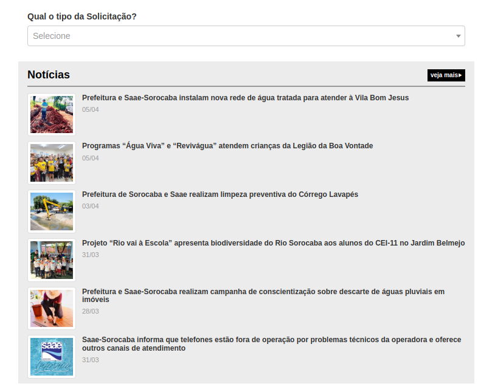
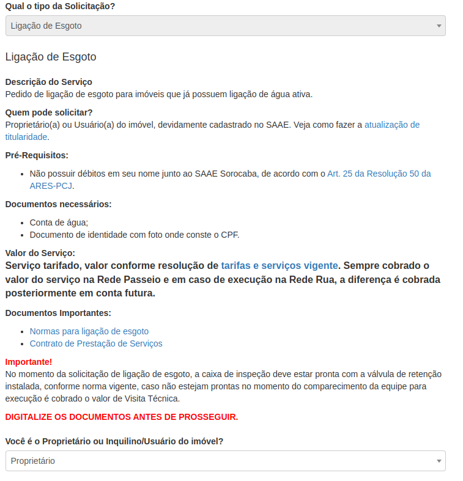
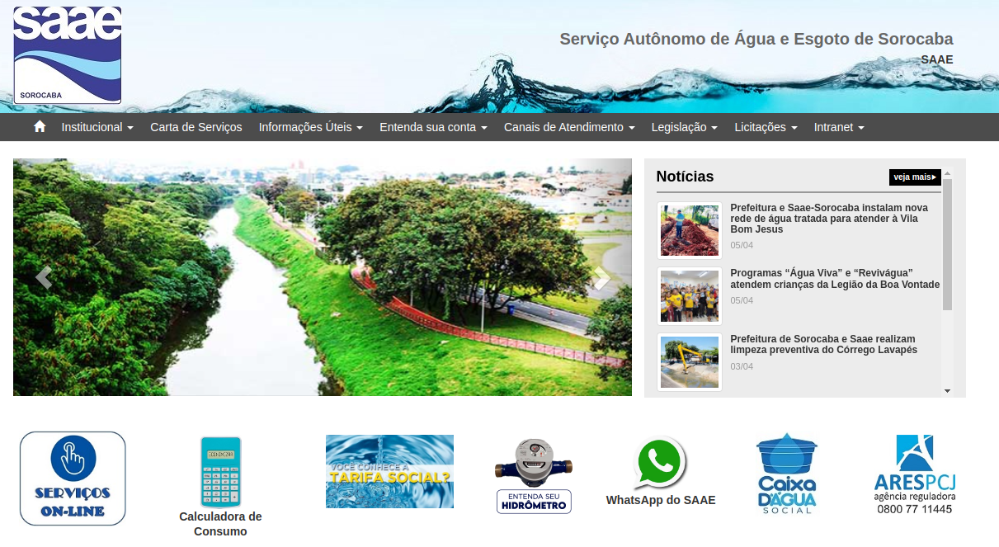
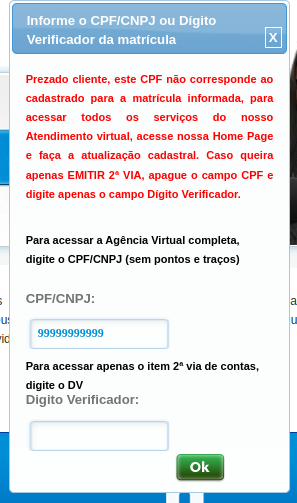
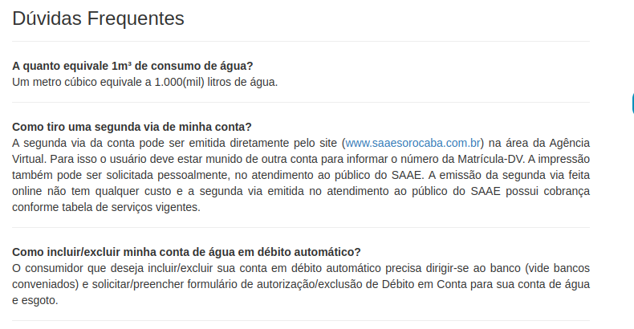

# Avaliação de IHC - SAAE Sorocaba

## 1. Introdução

Este documento tem como objetivo realizar uma avaliação técnica sobre o quesito de usabilidade do sítio pertencente ao [SAAE Sorocaba](https://www.saaesorocaba.com.br/), companhia responsável pela água e esgoto da cidade de Sorocaba-SP. Esta avaliação utiliza o método por inspeção através da formulação de uma avaliação heurística do sítio. Serão avaliados as 10 heurísticas propostas por Nielsen, assim como a tabela de avaliação proposta no artigo “Avaliação Heurística de Sítios na Web”. O planejamento para esta avaliação pode ser encontrado [neste documento](../../assets/SAAE/PlanejamentoSaae.pdf).

## 2. Visibilidade do estado do sistema

O sítio no geral não fornece nenhuma forma de informar ao usuário o caminho percorrido pelo mesmo durante a navegação, porém o mais grave se mostra ao se acessar uma solicitação de serviço, tal qual um pedido de religamento de água, pois o mesmo se abre em outra aba, inutilizando a navegação nativa do navegador e causando confusão ao usuário. A especificação do problema pode ser vista no formulário de avaliação, conforme tabela 1.

|  |  |
| :------------------------------: | :-----------------------------: |
| **(a)** | **(b)** |

**Figura 1: Páginas do SAAE Sorocaba (Fonte: [SAAE Sorocaba](https://www.saaesorocaba.com.br/))**

| **1. Visibilidade do estado do sistema** |
| ---------------------------------------- |
| **Verificação:** O sistema é capaz de informar seu estado atual, assim como maneiras de navegar eficientemente ao usuário? |
| **Grau de severidade:** [ ] 0 - Sem importância [ ] 1 - Cosmético [X] 2 - Simples [ ] 3 - Grave [ ] 4 - Catastrófico |
| **Natureza do problema:** [X] Barreira [ ] Obstáculo [ ] Ruído |
| **Perspectiva do usuário:** [X] Problema Geral [ ] Problema Preliminar [ ] Problema Especial |
| **Perspectiva da tarefa:** [X] Problema Principal [ ] Problema Secundário |
| **Descrição do Problema:**   **Contexto:** O usuário acessou a página “Serviços Online” do sítio (Figura 1a) e logo em seguida clicou na opção “ligação de água e esgoto” (Figura 1b), a qual abriu em uma nova aba do navegador.  **Causa:** Diferentes páginas do mesmo sítio estão abertas em abas diferentes.  **Efeitos sobre o usuário:** Breve confusão ao tentar retornar.  **Efeitos sobre a tarefa:** Nenhum.  **Correção possível:** Certificar-se que páginas do mesmo sítio não sejam abertas em abas diferentes.|

**Tabela 1: Formulário para Avaliação Heurística - Visibilidade do estado do sistema**

## 3. Correspondência entre o sistema e o mundo real
O sítio possui boa correspondência com o mundo real, possui algumas poucas expressões fora do entendimento do público geral. Sendo estas poucas ocorrências presentes em opções e páginas voltadas aos usuários técnicos da instituição. Dito isso, pode-se concluir que o sítio é compatível com o mundo real.

## 4. Controle e liberdade do usuário
O sítio impõe diversas restrições ao usuário, principalmente nas páginas relacionadas à solicitação de serviços, limitando assim sua liberdade de navegação. A especificação do problema pode ser vista no formulário de avaliação, conforme tabela 2.

|  |
| :----------------------------------------------------------------------: |

**Figura 2: Formulário para ligação de água ou esgoto (Fonte: [SAAE Sorocaba](https://www.saaesorocaba.com.br/solicitacao-de-ligacao-de-agua-esgoto/))**

| **3. Controle e liberdade do usuário** |
| ---------------------------------------- |
| **Verificação:** O sistema fornece total controle ao usuário, permitindo que o mesmo faça, desfaça e refaça suas ações? |
| **Grau de severidade:** [ ] 0 - Sem importância [ ] 1 - Cosmético [ ] 2 - Simples [X] 3 - Grave [ ] 4 - Catastrófico |
| **Natureza do problema:** [ ] Barreira [X] Obstáculo [ ] Ruído |
| **Perspectiva do usuário:** [X] Problema Geral [ ] Problema Preliminar [ ] Problema Especial |
| **Perspectiva da tarefa:** [X] Problema Principal [ ] Problema Secundário |
| **Descrição do Problema:**   **Contexto:** O usuário acessou a página “Ligação de água e esgoto” (Figura 1b) e logo em seguida selecionou a opção de solicitação “Ligação de esgoto” (Figura 2). Bloqueando a caixa de opções.  **Causa:** O sítio não permite que o usuário desfaça sua ação ao bloquear a caixa de opções e inutilizar a navegação nativa.  **Efeitos sobre o usuário:** Confusão e frustração ao precisar refazer a tarefa.  **Efeitos sobre a tarefa:** É necessário reiniciar a tarefa do zero.  **Correção possível:** Permitir que o usuário desfaça sua escolha inicial de solicitação. |

**Tabela 2: Formulário para Avaliação Heurística - Controle e liberdade do usuário**

## 5. Consistência e padronização
O sítio não apresenta consistência de padrão entre suas páginas como pode ser observado nas figuras abaixo. A especificação do problema pode ser vista no formulário de avaliação, conforme tabela 3.

|  |  |
| :--------------------------------: | :--------------------------: |
| **(a)** | **(b)** |

**Figura 3: Páginas do SAAE Sorocaba (Fonte: [SAAE Sorocaba](https://www.saaesorocaba.com.br/))**

| **4. Consistência e padronização** |
| ---------------------------------------- |
| **Verificação:** O sistema possui um padrão de formatação consistente e identificável em todas as suas páginas? |
| **Grau de severidade:** [ ] 0 - Sem importância [ ] 1 - Cosmético [X] 2 - Simples [ ] 3 - Grave [ ] 4 - Catastrófico |
| **Natureza do problema:** [ ] Barreira [ ] Obstáculo [X] Ruído |
| **Perspectiva do usuário:** [X] Problema Geral [ ] Problema Preliminar [ ] Problema Especial |
| **Perspectiva da tarefa:** [ ] Problema Principal [X] Problema Secundário |
| **Descrição do Problema:**   **Contexto:** O usuário acessou a página principal do sítio (Figura 3a) e logo em seguida acessou a página “Agência Virtual” (Figura 3b).  **Causa:** O sítio possui padrões diferentes em páginas distintas.  **Efeitos sobre o usuário:** Confusão momentânea.  **Efeitos sobre a tarefa:** Nenhum.  **Correção possível:** Padronizar as páginas do sítio. |

**Tabela 3: Formulário para Avaliação Heurística - Consistência e padronização**

## 6. Reconhecimento em vez de memorização
O sítio não possui muitos elementos visuais, sendo os poucos existentes bem identificados. Ao se utilizar do elemento textual na maioria do conteúdo, o sistema evita se apoiar na memória anterior do usuário, quanto aos formulários presentes no sítio, estes possuem campos bem identificados, que podem ser reconhecidos rapidamente pelo usuário. Dito isso, o sítio não se apoia na memória do usuário, possuindo um bom grau de reconhecimento.

## 7. Flexibilidade e eficiência de uso
O sítio não fornece ao usuário experiente qualquer forma de atalho ou facilitador para realizar tarefas frequentes para o mesmo, tendo que percorrer o mesmo caminho que um novo usuário. A especificação do problema pode ser vista no formulário de avaliação, conforme tabela 4.

|  |
| ---------------------------------------------- |

**Figura 4: Formulário de acesso à Agência Virtual (Fonte: [SAAE Sorocaba](https://sorocabaagvrt.consensotec.com.br/gsan/exibirServicosPortalSaaeSorocabaAction.do?method=servicos))**

| **6. Flexibilidade e eficiência de uso** |
| ---------------------------------------- |
| **Verificação:** O sistema facilita seu uso para usuários experientes através de atalhos e facilitadores? |
| **Grau de severidade:** [X] 0 - Sem importância [ ] 1 - Cosmético [ ] 2 - Simples [ ] 3 - Grave [ ] 4 - Catastrófico |
| **Natureza do problema:** [ ] Barreira [ ] Obstáculo [X] Ruído |
| **Perspectiva do usuário:** [X] Problema Geral [ ] Problema Preliminar [ ] Problema Especial |
| **Perspectiva da tarefa:** [ ] Problema Principal [X] Problema Secundário |
| **Descrição do Problema:**   **Contexto:** O usuário acessou a página da “Agência Virtual” (Figura 3b) e mesmo que já possua uma conta, é necessário que insira sua matrícula para só então ter acesso ao formulário de acesso à agência (Figura 4).  **Causa:** O sítio não possui nenhum tipo de facilitador para usuários experientes.  **Efeitos sobre o usuário:** Perda de tempo.  **Efeitos sobre a tarefa:** Nenhum.  **Correção possível:** Fornecer facilitadores e atalhos para maior eficiência do usuário. |

**Tabela 4: Formulário para Avaliação Heurística - Flexibilidade e eficiência de uso**

## 8. Projeto estético e minimalista
O sítio possui uma interface confusa e sobrecarregada de informações em suas páginas, com destaque à página principal, que possui diversos menus de navegação, todos contendo um grande excesso de opções. A especificação do problema pode ser vista no formulário de avaliação, conforme tabela 5.

| **7. Projeto estético e minimalista** |
| ---------------------------------------- |
| **Verificação:** O sistema possui um design simples? O sistema possui informações irrelevantes? |
| **Grau de severidade:** [ ] 0 - Sem importância [ ] 1 - Cosmético [X] 2 - Simples [ ] 3 - Grave [ ] 4 - Catastrófico |
| **Natureza do problema:** [ ] Barreira [X] Obstáculo [ ] Ruído |
| **Perspectiva do usuário:** [ ] Problema Geral [X] Problema Preliminar [ ] Problema Especial |
| **Perspectiva da tarefa:** [ ] Problema Principal [X] Problema Secundário |
| **Descrição do Problema:**   **Contexto:** O usuário acessou a página principal do sítio (Figura 3a) no intuito de solicitar um religamento, porém acabou por se perder nas opções do menu superior até perceber o caminho correto.  **Causa:** O sítio possui um excesso de informações e conflito na hierarquia.  **Efeitos sobre o usuário:** Perda de tempo e confusão.  **Efeitos sobre a tarefa:** Perda de tempo.  **Correção possível:** Recriar a interface de modo a retirar informações desnecessárias. |

**Tabela 5: Formulário para Avaliação Heurística - Projeto estético e minimalista**

## 9. Prevenção de erros
O sítio não entrega qualquer forma de prevenção a erros para o usuário em seus formulários, optando por aguardar o envio do formulário para informar ao usuário a informação incorreta. A especificação do problema pode ser vista no formulário de avaliação, conforme tabela 6.

| **8. Prevenção de erros** |
| ---------------------------------------- |
| **Verificação:** O sistema é capaz de evitar que o usuário cometa erros no seu uso? |
| **Grau de severidade:** [ ] 0 - Sem importância [X] 1 - Cosmético [ ] 2 - Simples [ ] 3 - Grave [ ] 4 - Catastrófico |
| **Natureza do problema:** [ ] Barreira [ ] Obstáculo [X] Ruído |
| **Perspectiva do usuário:** [X] Problema Geral [ ] Problema Preliminar [ ] Problema Especial |
| **Perspectiva da tarefa:** [ ] Problema Principal [X] Problema Secundário |
| **Descrição do Problema:**   **Contexto:** O usuário acessou a página da “Agência Virtual” (Figura 3b) e mesmo que tenha inserido uma matrícula inexistente, o formulário de acesso à agência (Figura 4) será exibido, com o erro somente sendo exibido após preenchimento e envio deste formulário.  **Causa:** O sítio não possui meios para evitar erros do usuário.  **Efeitos sobre o usuário:** Perda de tempo e frustração.  **Efeitos sobre a tarefa:** Perda de tempo.  **Correção possível:** Formular maneiras de prevenir erros do usuário no decorrer do uso do sítio. |

**Tabela 6: Formulário para Avaliação Heurística - Prevenção de erros**

## 10. Reconhecimento, diagnóstico e recuperação de erros
Por mais que o sítio possua mensagens de erro em seus formulários, estas não são necessariamente precisas, podendo causar confusão ao usuário através de instruções imprecisas. A especificação do problema pode ser vista no formulário de avaliação, conforme tabela 7.

|  |
| ------------------- |

**Figura 5: Mensagem de erro do formulário de acesso à Agência Virtual (Fonte: [SAAE Sorocaba](https://sorocabaagvrt.consensotec.com.br/gsan/exibirServicosPortalSaaeSorocabaAction.do?method=servicos))**

| **9. Reconhecimento, diagnóstico e recuperação de erros** |
| ---------------------------------------- |
| **Verificação:** O sistema é capaz de reconhecer com precisão um erro e permitir que o usuário se recupere do mesmo rapidamente? |
| **Grau de severidade:** [ ] 0 - Sem importância [ ] 1 - Cosmético [ ] 2 - Simples [X] 3 - Grave [ ] 4 - Catastrófico |
| **Natureza do problema:** [X] Barreira [ ] Obstáculo [ ] Ruído |
| **Perspectiva do usuário:** [X] Problema Geral [ ] Problema Preliminar [ ] Problema Especial |
| **Perspectiva da tarefa:** [X] Problema Principal [ ] Problema Secundário |
| **Descrição do Problema:**   **Contexto:** O usuário acessou a página da “Agência Virtual” (Figura 3b) e logo em seguida inseriu sua matrícula, exibindo o formulário de acesso à agência (Figura 4). Após inserir seu CPF, recebeu a mensagem de erro (Figura 5).  **Causa:** O sítio não possui mensagens de erro precisas.  **Efeitos sobre o usuário:** Perda de tempo e frustração ao não saber o que está incorreto.  **Efeitos sobre a tarefa:** Perda de tempo e falha momentânea.  **Correção possível:** Elaborar um melhor reconhecimento de erros para melhor auxílio ao usuário na recuperação dos mesmos. |

**Tabela 7: Formulário para Avaliação Heurística - Reconhecimento, diagnóstico e recuperação de erros**

## 11. Ajuda e documentação
O sítio não possui uma documentação auxiliar detalhada, acessada através da página “Dúvidas Frequentes”, a qual não possui grande detalhamento de como proceder na realização das tarefas pelo site. A especificação do problema pode ser vista no formulário de avaliação, conforme tabela 8.

|  |
| ------------------------------------------------------- |

**Figura 6: Página de Dúvidas Frequentes do SAAE Sorocaba (Fonte: [SAAE Sorocaba](https://www.saaesorocaba.com.br/))**

| **10. Ajuda e documentação** |
| ---------------------------------------- |
| **Verificação:** O sistema possui uma documentação auxiliar detalhada focada nas tarefas do usuário? |
| **Grau de severidade:** [ ] 0 - Sem importância [ ] 1 - Cosmético [ ] 2 - Simples [X] 3 - Grave [ ] 4 - Catastrófico |
| **Natureza do problema:** [X] Barreira [ ] Obstáculo [ ] Ruído |
| **Perspectiva do usuário:** [X] Problema Geral [ ] Problema Preliminar [ ] Problema Especial |
| **Perspectiva da tarefa:** [X] Problema Principal [ ] Problema Secundário |
| **Descrição do Problema:**   **Contexto:** O usuário acessou a página de “Dúvidas Frequentes” (Figura 6), contudo não obteve uma resposta satisfatória para sua dúvida.  **Causa:** O sítio não possui uma documentação auxiliar de qualidade.  **Efeitos sobre o usuário:** Perda de tempo e frustração.  **Efeitos sobre a tarefa:** Falha por falta de conhecimento.  **Correção possível:** Elaborar uma documentação auxiliar detalhada e de alta qualidade. |

**Tabela 8: Formulário para Avaliação Heurística - Ajuda e documentação**

## 12. Conclusão
Por mais que o sítio pertencente ao SAAE Sorocaba possua uma boa consistência com o mundo real e bom reconhecimento, acaba por pecar em diversas características necessárias para uma boa usabilidade. Com destaque ao design sobrecarregado e a falta de auxílio ao usuário que,  ao se considerar o perfil geral de usuário do sítio, sendo este formado por pessoas de idade avançada e com dificuldades, se tornam os maiores agravantes para a falta de usabilidade e acessibilidade do sítio analisado.

## 13. Referências bibliográficas
   > [1] MACIEL, C. et al. Avaliação Heurística de Sítios na Web. [s.d.].

   > [2] Barbosa, S. D. J.; Silva, B. S. da; Silveira, M. S.; Gasparini, I.; Darin, T.; Barbosa, G. D. J. (2021) Interação Humano-Computador e Experiência do usuário. Autopublicação. ISBN: 978-65-00-19677-1.

## 14. Histórico de Versão

|  Versão  |   Data   |                      Descrição                      |    Autor(es)   |  Revisor(es)  |
| -------- | -------- | --------------------------------------------------- | -------------- | ------------- |
|  `1.0`   | 10/04/23 | Criação do documento e adição do conteudo           | Pedro F. | Felipe M. |