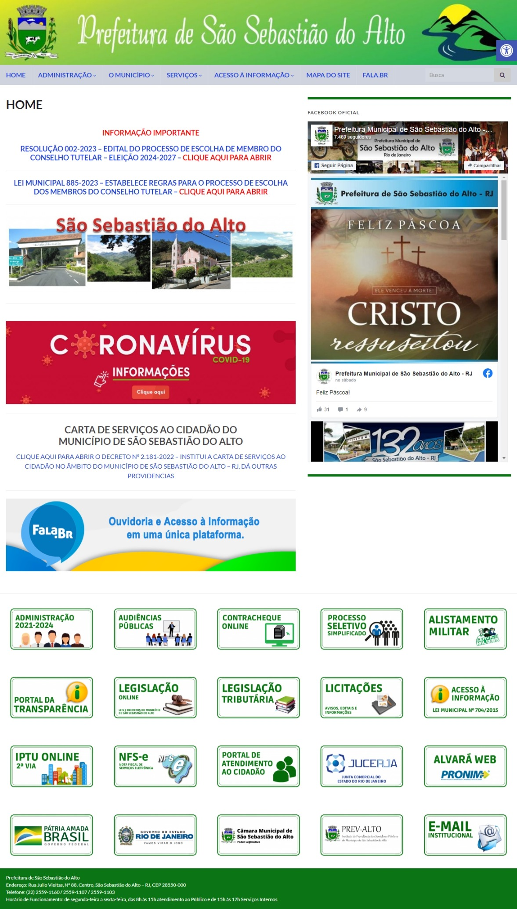
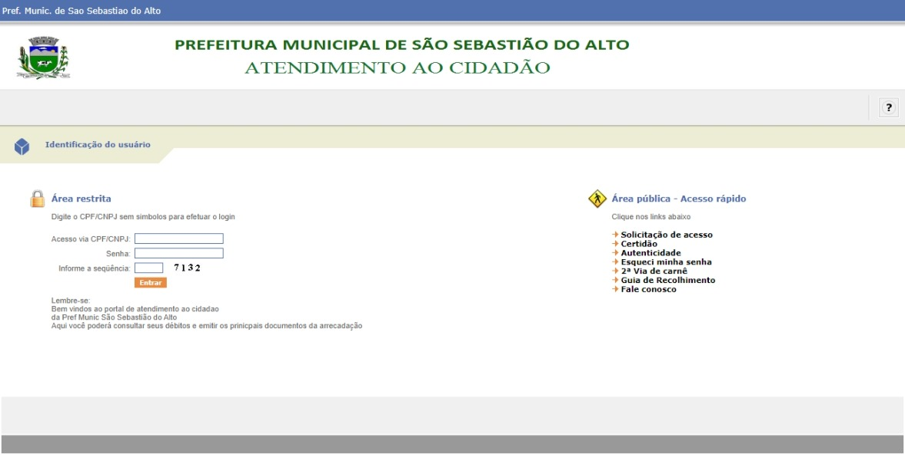

# Avaliação de IHC - Prefeitura de São Sebastião do Alto (SSALTO)

## Introdução

Neste documento temos como objetivo avaliar quesitos de usabilidade do sítio pertencente ao [SSALTO](http://
ssalto.rj.gov.br/), um ambiente responsável pelo acesso a informação do município de São Sebastião do Alto-RJ.
De maneira que avaliaremos por um  método de inspenção através da avaliação heurística do sítio por Nielsen.
Será considerada relevante para a avaliação as 10 heurísticas proposta pelo artigo "Avaliação Heurísticas  de 
Sítios na Web".

**Figura 1: Página principal do sítio do SSALTO (Fonte: [SSALTO](http://ssalto.rj.gov.br/))**

## Objetivos

Como descrito no planejamento (disponível [aqui](../../assets/SSALTO/avaliacaoSSALTO.pdf)), os questionamentos são as seguintes:

* O sítio segue os padrões da empresa?
* O sítio segue os padrões requisitados pelo W3C de acessibilidade?
* O sistema possui clareza para o usuário?
* A interface é agradável ao usuário?
* O usuário consegue atingir seu objetivo de forma mais eficiente?
* Por meio da apropriação da tecnologia é possível oferecer um sistema de forma mais interessante aos usuários?

## Métodos de Avaliação

A avaliação a ser executada usará do modelo descrito no artigo “Avaliação Heurística de Sítios na Web” (MACIEL et al., 2004), modelo que, baseado nas heurísticas de Nielsen, amplia suas definições e cria caminhos específicos para a avaliação de IHC de sítios. O método, por ser de baixo custo comparado a outros métodos de inspeção e não necessitar da presença do usuário como os métodos de observação, é interessante para o contexto da disciplina.

### Visibilidade do estado do sistema

| **1. Visibilidade do estado do sistema** |
| ---------------------------------------- |
| **Verificação:** O sistema possui clareza para o usuário |
| **Grau de severidade:** [ ] 0 - Sem importância [ ] 1 - Cosmético [ ] 2 - Simples [X] 3 - Grave [ ] 4 - 
Catastrófico |
| **Natureza do problema:** [ ] Barreira [X] Obstáculo [ ] Ruído |
| **Perspectiva do usuário:** [ ] Problema Geral [X] Problema Preliminar [ ] Problema Especial |
| **Perspectiva da tarefa:** [X] Problema Principal [ ] Problema Secundário |
| **Descrição do Problema:**   **Contexto:** O usuário acessou o sítio e clicou no botão “Agência 
Virtual”, localizado no canto inferior direito da página. A página da figura 2 foi mostrada ao usuário.
  **Causa:** Há páginas no sítio que não mostram o estado do sistema para o usuário.  **Efeitos 
sobre o usuário:** Desorientação e desconforto ao utilizar o sistema.  **Efeitos sobre a tarefa:** 
Confusão sobre localização dentro de uma tarefa, dificuldade na alternância de tarefas.  **Correção 
possível:** Padronizar as páginas do sítio, mantendo o estado do sistema sempre visível.|

**Figura 3: Página de autenticação do Portal de atendimento ao cidadão - autoatendimento da SSALTO (Fonte: [SSALTO](http://177.155.185.238:7778/cidadao/servlet/br.com.cetil.ar.jvlle.hatendimento))**

### Consistência e padrões

| **4. Consistência e padrões** |
| ---------------------------------------- |
| **Verificação:** O sítio segue o padrão da empresa? |
| **Grau de severidade:** [ ] 0 - Sem importância [X] 1 - Cosmético [ ] 2 - Simples [ ] 3 - Grave [ ] 4 - 
Catastrófico |
| **Natureza do problema:** [ ] Barreira [ ] Obstáculo [X] Ruído |
| **Perspectiva do usuário:** [X] Problema Geral [ ] Problema Preliminar [ ] Problema Especial |
| **Perspectiva da tarefa:** [ ] Problema Principal [X] Problema Secundário |
| **Descrição do Problema:**   **Contexto:** O usuário acessou o sítio e clicou no botão “Segunda via 
da conta”, localizado no canto inferior direito da página. A página de autenticação da Figura 3 foi mostrada 
ao usuário.  **Causa:** Há páginas no sítio que não mostram o estado do sistema para o usuário.
  **Efeitos sobre o usuário:** Confusão e desconforto.  **Efeitos sobre a tarefa:** Nenhum. 
  **Correção possível:** Uniformização do padrão de páginas do sítio.|