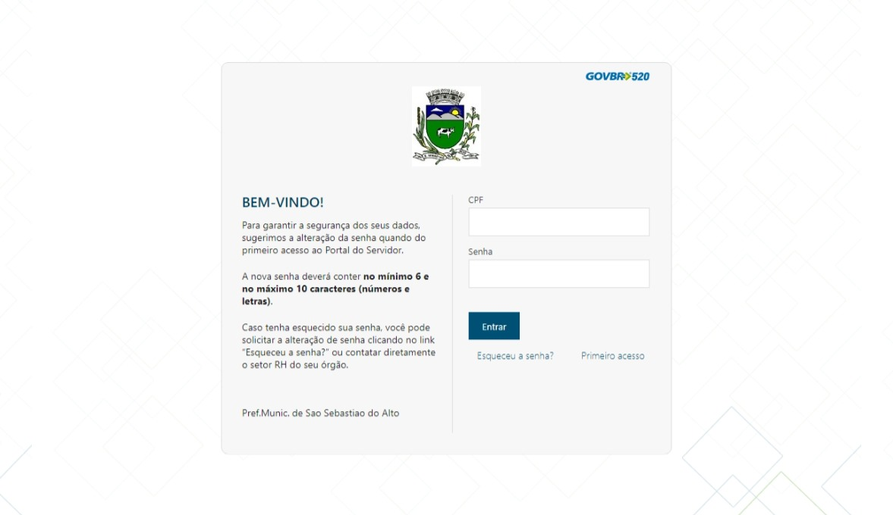

# Avaliação de IHC - Prefeitura de São Sebastião do Alto (SSALTO)

## Introdução

Neste documento temos como objetivo avaliar quesitos de usabilidade do sítio pertencente ao [SSALTO](http://
ssalto.rj.gov.br/), um ambiente responsável pelo acesso a informação do município de São Sebastião do Alto-RJ.
De maneira que avaliaremos por um  método de inspenção através da avaliação heurística do sítio por Nielsen.
Será considerada relevante para a avaliação as 10 heurísticas proposta pelo artigo "Avaliação Heurísticas  de 
Sítios na Web".

**Figura 1: Página principal do sítio do SSALTO (Fonte: [SSALTO](http://ssalto.rj.gov.br/))**

## Objetivos

Como descrito no planejamento (disponível [aqui](../../assets/SSALTO/avaliacaoSSALTO.pdf)), os questionamentos são as seguintes:

* O sítio segue os padrões da empresa?
* O sítio segue os padrões requisitados pelo W3C de acessibilidade?
* O sistema possui clareza para o usuário?
* A interface é agradável ao usuário?
* O usuário consegue atingir seu objetivo de forma mais eficiente?
* Por meio da apropriação da tecnologia é possível oferecer um sistema de forma mais interessante aos usuários?

## Métodos de Avaliação

A avaliação a ser executada usará do modelo descrito no artigo “Avaliação Heurística de Sítios na Web” (MACIEL et al., 2004), modelo que, baseado nas heurísticas de Nielsen, amplia suas definições e cria caminhos específicos para a avaliação de IHC de sítios. O método, por ser de baixo custo comparado a outros métodos de inspeção e não necessitar da presença do usuário como os métodos de observação, é interessante para o contexto da disciplina.

### Visibilidade do estado do sistema

| **1. Visibilidade do estado do sistema** |
| ---------------------------------------- |
| **Verificação:** O sistema possui clareza para o usuário |
| **Grau de severidade:** [ ] 0 - Sem importância [ ] 1 - Cosmético [ ] 2 - Simples [X] 3 - Grave [ ] 4 - 
Catastrófico |
| **Natureza do problema:** [ ] Barreira [X] Obstáculo [ ] Ruído |
| **Perspectiva do usuário:** [ ] Problema Geral [X] Problema Preliminar [ ] Problema Especial |
| **Perspectiva da tarefa:** [X] Problema Principal [ ] Problema Secundário |
| **Descrição do Problema:**   **Contexto:** O usuário acessou o sítio e clicou no botão “Agência 
Virtual”, localizado no canto inferior direito da página. A página da figura 2 foi mostrada ao usuário.
  **Causa:** Há páginas no sítio que não mostram o estado do sistema para o usuário.  **Efeitos 
sobre o usuário:** Desorientação e desconforto ao utilizar o sistema.  **Efeitos sobre a tarefa:** 
Confusão sobre localização dentro de uma tarefa, dificuldade na alternância de tarefas.  **Correção 
possível:** Padronizar as páginas do sítio, mantendo o estado do sistema sempre visível.|

**Figura 2: Página de autenticação do Portal de atendimento ao cidadão - autoatendimento da SSALTO (Fonte: [SSALTO](http://177.155.185.238:7778/cidadao/servlet/br.com.cetil.ar.jvlle.hatendimento))**

### Consistência e padrões

| **4. Consistência e padrões** |
| ---------------------------------------- |
| **Verificação:** O sítio segue o padrão da empresa? |
| **Grau de severidade:** [ ] 0 - Sem importância [X] 1 - Cosmético [ ] 2 - Simples [ ] 3 - Grave [ ] 4 - 
Catastrófico |
| **Natureza do problema:** [ ] Barreira [ ] Obstáculo [X] Ruído |
| **Perspectiva do usuário:** [X] Problema Geral [ ] Problema Preliminar [ ] Problema Especial |
| **Perspectiva da tarefa:** [ ] Problema Principal [X] Problema Secundário |
| **Descrição do Problema:**   **Contexto:** O usuário acessou o sítio e clicou no botão “Segunda via 
da conta”, localizado no canto inferior direito da página. A página de autenticação da Figura 3 foi mostrada 
ao usuário.  **Causa:** Há páginas no sítio que não mostram o estado do sistema para o usuário.
  **Efeitos sobre o usuário:** Confusão e desconforto.  **Efeitos sobre a tarefa:** Nenhum. 
  **Correção possível:** Uniformização do padrão de páginas do sítio.|

**Figura 3: Página de autenticação do Portal de ContraCheque Online - autoatendimento da SSALTO (Fonte: 
[SSALTO](http://177.155.185.238:7777/portalservidor#/))**

| **6. Flexibilidade e eficiência de uso** |
| ---------------------------------------- |
| **Verificação:**  O usuário consegue atingir seu objetivo de forma mais eficiente?|
| **Grau de severidade:** [ ] 0 - Sem importância [ ] 1 - Cosmético [X] 2 - Simples [ ] 3 - Grave [ ] 4 - 
Catastrófico |
| **Natureza do problema:** [ ] Barreira [ ] Obstáculo [X] Ruído |
| **Perspectiva do usuário:** [X] Problema Geral [ ] Problema Preliminar [ ] Problema Especial |
| **Perspectiva da tarefa:** [ ] Problema Principal [X] Problema Secundário |
| **Descrição do Problema:**   **Contexto:** O usuário acessou a página da “Agência Virtual” (Figura 
3b) e mesmo que já possua uma conta, é necessário que insira sua matrícula para só então ter acesso ao 
formulário de acesso à agência (Figura 4).  **Causa:** O sítio não possui nenhum tipo de facilitador 
para usuários experientes.  **Efeitos sobre o usuário:** Perda de tempo.  **Efeitos sobre a 
tarefa:** Nenhum.  **Correção possível:** Fornecer facilitadores e atalhos para maior eficiência do 
usuário. |

**Figura 3: Página de autenticação do Portal de Segunda Via IPTU - autoatendimento da SSALTO (Fonte:
[SSALTO](https://www.seuiptu.com.br/))**

| **6. Reconhecimento ao invés de lembrança** |
| ---------------------------------------- |
| **Verificação:** A interface é insatisfatória?
 |
| **Grau de severidade:** [ ] 0 - Sem importância [] 1 - Cosmético [X] 2 - Simples [ ] 3 - Grave [ ] 4 - 
Catastrófico |
| **Natureza do problema:** [ ] Barreira [X] Obstáculo [ ] Ruído |
| **Perspectiva do usuário:** [X] Problema Geral [ ] Problema Preliminar [ ] Problema Especial |
| **Perspectiva da tarefa:** [ ] Problema Principal [X] Problema Secundário |
| **Descrição do Problema:**   **Contexto:** O usuário acessou a página principal do sítio (Figura 
1). O usuário não sabe onde procurar para realizar tarefas.  **Causa:**  A interface não provê meios 
satisfatórios de indicar onde devem ser realizadas certas tarefas.  **Efeitos sobre o usuário:** 
Desorientação, frustração, insatisfação.  **Efeitos sobre a tarefa:** Nenhum.   **Correção 
possível:** Melhor organização da interface do sítio para mais fácil reconhecimento de tarefas e maior 
satisfação do usuário. |

### Estética e design minimalista

| **8. Estética e design minimalista** |
| ---------------------------------------- |
| **Verificação:** Por meio da apropriação da tecnologia é possível oferecer um sistema de forma mais interessante aos usuários? |
| **Grau de severidade:** [ ] 0 - Sem importância [X] 1 - Cosmético [ ] 2 - Simples [ ] 3 - Grave [ ] 4 - 
Catastrófico |
| **Natureza do problema:** [ ] Barreira [ ] Obstáculo [X] Ruído |
| **Perspectiva do usuário:** [X] Problema Geral [ ] Problema Preliminar [ ] Problema Especial |
| **Perspectiva da tarefa:** [ ] Problema Principal [X] Problema Secundário |
| **Descrição do Problema:**   **Contexto:** O usuário acessou o sítio e clicou no botão “Agência 
Virtual”, localizado no canto inferior direito da página. A página da figura 2 foi mostrada ao usuário.
  **Causa:** A interface da página da figura 2 não tem atributos que guiem o usuário por seu uso.
  **Efeitos sobre o usuário:** Desconforto, frustração.  **Efeitos sobre a tarefa:** Nenhum. 
  **Correção possível:** Criação de nova interface para a página de “Agência Virtual”, mantendo os 
padrões do sítio. |

## Conclusão

Concluímos que ao analisar o sítio, os problemas não são impecílios para a realização de tarefas dentro do mesmo. No entanto, algumas distrações foram encontradas nesta avaliação que acabam criando obstáculos para a finalização das tarefas no sítio, como desfalques cosméticos; como a irregularidade de elementos na tela inicial, determinando uma página sobrecarregada. A falta de atributos que guiem o usuário em determinadas páginas, faz que o sítio se torne pouco intuitivo e com baixa memorização. Estas falhas, no geral, afetam o usuário diretamente pela insatisfação em achar as ferramentas do sítio causando ruídos dentro de determinadas ações na página.

## Referências bibliográficas
   > [1] MACIEL, C. et al. Avaliação Heurística de Sítios na Web. [s.d.].

   > [2] Barbosa, S. D. J.; Silva, B. S. da; Silveira, M. S.; Gasparini, I.; Darin, T.; Barbosa, G. D. J. 
(2021) Interação Humano-Computador e Experiência do usuário. Autopublicação. ISBN: 978-65-00-19677-1.
   > [3]  W3C. CARTILHA DE ACESSIBILIDADE NA WEB: Cartilha de Acessibilidade na Web. Brasil: Creative Commons, 
2009. Disponível em: https://www.w3c.br/pub/Materiais/PublicacoesW3C/
cartilha-w3cbr-acessibilidade-web-fasciculo-I.html. Acesso em: 09 abr. 2023.

## Histórico de versão

|  Versão  |   Data   |                      Descrição                      |    Autor(es)   |  Revisor(es)  |
| -------- | -------- | --------------------------------------------------- | -------------- | ------------- |
|  `1.0`   | 12/04/23 | Criação do documento e adição do conteúdo           | Amanda Noda    |     João Morbeck          |