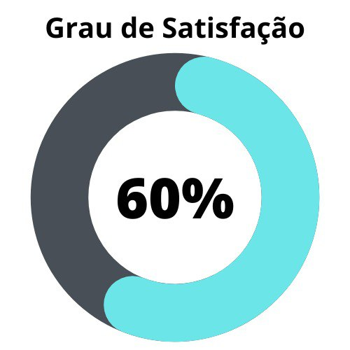
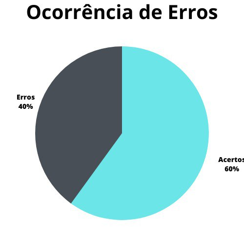

# Análise de Tarefas

## 1. Introdução
O presente artefato tem o intuito relatar os resultados da verificação dos artefatos produzidos durante a realização dos pontos de controle anteriores. Neste artefato, avaliaremos a [Análise de Tarefas](../analise_requisitos/analise_de_tarefas.md)

A [primeira verificação](./analise_tarefas_deprecated.md) teve como objeto a versão 1.3 do documento e foi realizada no dia 8 de maio de 2023. Tendo sido detectada a necessidade de correções na lista desenvolvida, a nova verificação (data de realização da verificação)

## 2. Metodologia
A verificação foi feita com base nos checklists pré-definidos em nosso [Planejamento da Verificação](./teste/planejamentoVerificacao.md) e também na verificação realizada pelo [Grupo 5](https://interacao-humano-computador.github.io/2023.1-Alistamento/) [1]. Abaixo seguem as verificações de conteúdo que foram elaboradas, contendo justificativas para cada uma e também a fonte:

### 2.1 Verificação 1 - O artefato possui metodologia utilizada?

É importante que o artefato deixe claro os métodos utilizados para a obtenção e desenvolvimento do conteúdo apresentado, buscando inteirar o leitor acerca do que é tratado pelo mesmo.

` BARBOSA, Simone; DINIZ, Bruno. Interação Humano-Computador. Editora Elsevier, Rio de Janeiro, 2010. `

### 2.2 Verificação 2 - Pelo menos 2 técnicas foram utilizadas para especificar as tarefas?

É importante que o artefato deixe explícito as técnicas utilizadas na realização das tarefas escolhidas.

` BARBOSA, Simone; DINIZ, Bruno. Interação Humano-Computador. Editora Elsevier, Rio de Janeiro, 2010. `

### 2.3 Verificação 3 - As tarefas foram escolhidas de acordo com o perfil de usuário? 

É importante que o artefato possua ligações entre as tarefas realizadas com os perfis listados dentro do projeto, para que contruímos resultados coerentes com nossa premissa dentro do projeto.

` BARBOSA, Simone; DINIZ, Bruno. Interação Humano-Computador. Editora Elsevier, Rio de Janeiro, 2010. `

### 2.4 Verificação 4 - O fluxo das tarefas está de acordo com o fluxo orgânico realizado pelos usuários na vida real? 

É de extrema importância que o fluxo de tarefas possua correlação com a vida real para que o usuário sinta-se confortável e habituado ao realizar o fluxo apresentado.

` BARBOSA, Simone; DINIZ, Bruno. Interação Humano-Computador. Editora Elsevier, Rio de Janeiro, 2010. `

### 2.5 Verificação 5 - A análise de tarefas está voltada para a análise conceitual do problema em detrimento do funcionamento de telas e menus?

É importante ressaltar a análise conceitual ao relatar problemas no funcionamento das telas e menus.

` BARBOSA, Simone; DINIZ, Bruno. Interação Humano-Computador. Editora Elsevier, Rio de Janeiro, 2010. `

### 2.6 Verificação 6 - As tarefas apresentadas dentro do HTA podem ser definidas em termos de seus objetivos?

Visto que o HTA tem como objetivo providenciar uma análise funcional ao invés de uma descrição comportamental, é importante que se compreenda a razão das ações sem aoenas listar e organizà-las dentro do sistema.

`ANNETT, John. Hierarchical Task Analysis. In: DIAPER, Dan; STANTON, Neville (ed.). THE HANDBOOK OF TASK ANALYSIS FOR HUMAN-COMPUTER INTERACTION. Nova Jersey: Lawrence Erlbaum, 2004.`

### 2.7 Verificação 7 - Os objetivos de mais alto nível são decompostos em subobjetivos no HTA?

A decomposição de objetivos em subobjetivos por meio da identificação de subojetivos dentro de objetivos é capaz de constituir uma forma mais econômica de localizar pontes de erro do sistema 

`ANNETT, John. Hierarchical Task Analysis. In: DIAPER, Dan; STANTON, Neville (ed.). THE HANDBOOK OF TASK ANALYSIS FOR HUMAN-COMPUTER INTERACTION. Nova Jersey: Lawrence Erlbaum, 2004.`

### 2.8 Verificação 8 - Os subobjetivos e as relações entre estes e um objetivo maior são agrupados em planos que especificam as regras de execução de suas suboperações ou subobjetivos no HTA?

Os planos são agrupamentos de subobjetivos que tenham como objetivo atingir um objetivo ao qual estão subordinados. Assim, constituem parte principal da estrutura de um HTA.

`ANNETT, John. Hierarchical Task Analysis. In: DIAPER, Dan; STANTON, Neville (ed.). THE HANDBOOK OF TASK ANALYSIS FOR HUMAN-COMPUTER INTERACTION. Nova Jersey: Lawrence Erlbaum, 2004.`

### 2.9 Verificação 9 - As regras dos planos são de seleção (/), sequência (>) ou paralelismo (+) no HTA?

Os planos definem regras que governam seus subobjetivos, determinando assim a ordem em que deverão ser executadas. Ass regras podem ser: seleção (representada com "/"), em que um ou outro subobjetivo deve ser executado; sequencial (representada com ">"), em que cada subobjetivo deve ser executado na ordem listada; e paralelo (representada com "+"), em que o objetivo não é atingido a menos que os objetivos subordinados sejam atingidos ao mesmo tempo.

`ANNETT, John. Hierarchical Task Analysis. In: DIAPER, Dan; STANTON, Neville (ed.). THE HANDBOOK OF TASK ANALYSIS FOR HUMAN-COMPUTER INTERACTION. Nova Jersey: Lawrence Erlbaum, 2004.`

### 2.10 Verificação 10 - As operações são definidas em termos de inputs, ações e feeedbacks no HTA?

As operações em um HTA são  a unidade fundamental da análise, especificadas a partir de seus objetivos e, mais especificamente, por circunstâncias nas quais o objetivo é ativado (input), as atividades que contribue para atingir o objetivo (ações) e pelas condições que indicam que o objetivo foi atingido (feedback).

`ANNETT, John. Hierarchical Task Analysis. In: DIAPER, Dan; STANTON, Neville (ed.). THE HANDBOOK OF TASK ANALYSIS FOR HUMAN-COMPUTER INTERACTION. Nova Jersey: Lawrence Erlbaum, 2004.`

### 2.11 Verificação 11 - Os subobjetivos definidos são mutuamente exclusivos e exaustivos, não se sobrepondo e satisfazendo o objetivo a que se subordinam no HTA?

Os subobjetivos devem satisfazer um objetivo a que se subordnam completamente (exaustividade), e também, para se considerarem bem definidos, não podem nem mesmo parcialmente realizar uma operação similar, impedindo assim que dois objetivos tratem da mesma coisa (exclusividade mútua).

` BARBOSA, Simone; DINIZ, Bruno. Interação Humano-Computador. Editora Elsevier, Rio de Janeiro, 2010. `

### 2.12 Verificação 12 - As tarefas representadas com o modelo CMN-GOMS são uma descrição procedural do que o usuário deve saber para a realização de tarefas?

Um modelo GOMS está interessado na representação de "como fazer" uma determinada tarefa. Esse conhecimento é necessário a um sistema para a execução de tarefas.

` BARBOSA, Simone; DINIZ, Bruno. Interação Humano-Computador. Editora Elsevier, Rio de Janeiro, 2010. `

### 2.13 Verificação 13 - As análises com o modelo CMN-GOMS consideram que o usuário sabe realizar a tarefa e que só precisa realizá-la?

Visto que os modelos GOMS tem foco maior em formalizar o desempenho da tarefa, as análises GOMS devem pressupor que o usuário que realiza as tarefas já sabe como realizá-las, e só precisa executá-las.

` BARBOSA, Simone; DINIZ, Bruno. Interação Humano-Computador. Editora Elsevier, Rio de Janeiro, 2010. `

### 2.14 Verificação 14 - As tarefas são descritas de modo similar a um pseudocódigo no CMN-GOMS?

O CMN-GOMS é um modelo em que os objetivos devem ser executados a partir de métodos, selecionados a partir de regras de seleção e executados a partir de operadores. Essa esttrutura pode ser delineada com o auxílio de algo similar a um pseudocódigo.

` BARBOSA, Simone; DINIZ, Bruno. Interação Humano-Computador. Editora Elsevier, Rio de Janeiro, 2010. `

### 2.15 Verificação 15 - Os elementos do GOMS são escritos de maneira correta?

O modelo CMN-GOMS possui especificidades quanto à representação de seus elementos que devem ser respeitadas. Objetivos devem ser especificados como "GOAL X: descrição"; métodos devem ser especificados como "METHOD X: descrição", regras de seleção devem ser descritas como "(SEL. RULE: Descrição)" e operações devem ser descritas como "OP. X: descrição".

` BARBOSA, Simone; DINIZ, Bruno. Interação Humano-Computador. Editora Elsevier, Rio de Janeiro, 2010. `

### 2.16 Verificação 16 - A análise geral a partir do CMN-GOMS é executável?

Uma das principais características da análise a partir do CMN-GOMS é a sua representação em forma de programa procedural, significando que uma boa análise CMN-GOMS pode ser executada a partir de qualquer instância da classe de tarefas.

` BARBOSA, Simone; DINIZ, Bruno. Interação Humano-Computador. Editora Elsevier, Rio de Janeiro, 2010. `

### 2.17 Verificação 17 - Os objetivos, no modelo GOMS, representam um estado a ser atingido?

Um objetivo, paara o GOMS, pode ser definido em termos de um estado a ser atingido ao fim da execução,bem como um ponto de memória para o qual o sistema possa retornar em caso de falha ou erro para a obtenção de dados.

`CARD, Stuart K.; MORAN, Thomas P.; NEWELL, Allen. The GOMS moddel of manuscript editing. In: CARD, Stuart K.; MORAN, Thomas P.; NEWELL, Allen. The psychology of human-computer interaction. Hillsdale: Lawrence Erlbaum, 1983.`

### 2.18 Verificação 18 - Operadores são atos necessários para mudanças no ambiente do sistema?

Operadores em GOMS são qualquer tipo de ato cuja execução é necessária para que o estado atual do ambiente do sistemaseja alterado.

`CARD, Stuart K.; MORAN, Thomas P.; NEWELL, Allen. The GOMS moddel of manuscript editing. In: CARD, Stuart K.; MORAN, Thomas P.; NEWELL, Allen. The psychology of human-computer interactionThe psychology of human-computer interaction. Hillsdale: Lawrence Erlbaum, 1983.`

### 2.19 Verificação 19 - Um método descreve um procedimento para atingir um objetivo?

A descrição de um método para um modelo GOMS considera que esses métodos terão sucesso em sua empreitada, sendo eles procedimentos que o usuário já conheçe ao utilizxa r o sistema ao invés de planos que ele venha a definir posteriormente.

`CARD, Stuart K.; MORAN, Thomas P.; NEWELL, Allen. The GOMS moddel of manuscript editing. In: CARD, Stuart K.; MORAN, Thomas P.; NEWELL, Allen. The psychology of human-computer interactionThe psychology of human-computer interaction. Hillsdale: Lawrence Erlbaum, 1983.`

### 2.20 Verificação 20 - As regras de seleção definem condições para a escolha de um método?

Sendo um objetivo capaz de ser atingido por diversos métodos, a fim de se manter a proceduralidade do método CMN-GOMS, as regras de seleção devem descerver quando cada determinado método deve ser executado a aprtir de um nconjunto de regras.

`CARD, Stuart K.; MORAN, Thomas P.; NEWELL, Allen. The GOMS moddel of manuscript editing. In: CARD, Stuart K.; MORAN, Thomas P.; NEWELL, Allen. The psychology of human-computer interactionThe psychology of human-computer interaction. Hillsdale: Lawrence Erlbaum, 1983.`

## 3. Desenvolvimento

As tabelas 1 e 2 apresentam os resultados da verificação do artefato [Análise de Tarefas](../analise_requisitos/analise_de_tarefas.md)

### 3.1 Padronização

| ID | Verificação | Realizado |
|:-:|--|--|
| 1 | Possui ortografia correta e formal? | Sim |
| 2 | Possui introdução? | Sim |
| 3 | Possui links necessários? | Sim |
| 4 | As tabelas e imagens possuem legenda padronizada e chamada no texto? | Sim |
| 5 | As tabelas e imagens estão totalmente em português? | Sim |
| 6 | Possui bibliografia? | Sim |
| 7 | A bibliografia está em ordem alfabética? | Sim |
| 8 | Possui histórico de versão padronizado? | Sim |
| 9 | O histórico de versão possui autor(es) e revisor(es)? | Sim |

Tabela 1:Checklist para padronização do artefato (Fonte: Autor, 2023).

### 3.2 Conteúdo

| ID | Verificação | Ocorrências | Acertos | Erros |
|--|--|--|--|--|
| 1 | O artefato possui metodologia utilizada |  |  |  |
| 2 | Pelo menos 2 técnicas foram utilizadas para especificar as tarefas? |  |  |  |
| 3 | As tarefas foram escolhidas de acordo com o perfil de usuário? |  |  |  |
| 4 | O fluxo das tarefas está de acordo com o fluxo orgânico realizado pelos usuários na vida real? |  |  |  |
| 5 | A análise de tarefas está voltada para a análise conceitual do problema em detrimento do funcionamento de telas e menus? |  |  |  |
| 6 | As tarefas apresentadas dentro do HTA podem ser definidas em termos de seus objetivos? |  |  |  |
| 7 | Os objetivos de mais alto nível são decompostos em subobjetivos no HTA? |  |  |  |
| 8 | Os subobjetivos e as relações entre estes e um objetivo maior são agrupados em planos que especificam as regras de execução de suas suboperações ou subobjetivos no HTA? |  |  |  |
| 9 | As regras dos planos são de seleção (/), sequência (>) ou paralelismo (+) no HTA? |  |  |  |
| 10 | As operações são definidas em termos de inputs, ações e feeedbacks no HTA? |  |  |  |
| 11 | Os subobjetivos definidos são mutuamente exclusivos e exaustivos, não se sobrepondo e satisfazendo o objetivo a que se subordinam no HTA? |  |  |  |
| 12 | As tarefas representadas com o modelo CMN-GOMS são uma descrição procedural do que o usuário deve saber para a realização de tarefas? |  |  |  |
| 13 | As análises com o modelo CMN-GOMS consideram que o usuário sabe realizar a tarefa e que só precisa realizá-la? |  |  |  |
| 14 | As tarefas são descritas de modo similar a um pseudocódigo no CMN-GOMS? |  |  |  |
| 15 | Os elementos do GOMS são escritos de maneira correta? |  |  |  |
| 16 | A análise geral a partir do CMN-GOMS é executável? |  |  |  |
| 17 | Os objetivos, no modelo GOMS, representam um estado a ser atingido? |  |  |  |
| 18 | Operadores são atos necessários para mudanças no ambiente do sistema? |  |  |  |
| 19 | Um método descreve um procedimento para atingir um objetivo? |  |  |  |
| 20 | As regras de seleção definem condições para a escolha de um método? |  |  |  |

Tabela 2: Modelo de checklist para conteúdo (Fonte: Autor, 2023).

## 4. Resultados
Os resultados da verificação da Análise de tarefas podem ser encontrados na tabela 3 abaixo, por maio das figuras 1 e 2, onde foi verificado o grau de satisfação e a ocorrência de erros no artefato verificado. Os resultados em questão só levam em consideração as verificações do conteúdo.

<!--
|     |                   |
| ------------------------------------------------------------------------------ | ------------------------------------------------------------------------- |
| Figura 1: Representação do grau de satisfação do artefato (Fonte: Autor, 2023). | Figura 2: Gráfico de ocorrência de erros no artefato (Fonte: Autor, 2023). |

-->

Tabela 3: Representações gráficas dos resultados da verificação (Fonte: Autor, 2023).

## 5. Problemas encontrados
### 5.1 Problemas Encontrados - Padronização

### 5.2 Problemas Encontrados - Conteúdo

## 6. Acompanhamento
### 6.1 Acompanhamento - Padronização

#### Versão 1.3

##### 6.1.1 Acompanhamento 1 - Possui ortografia correta é formal?

Foram realizadas as correções necessárias dentro do artefato de análise de tarefas

### 6.2 Acompanhamento - Conteúdo

#### Versão 1.3 

O acompanhamento listado nesta seção é baseado em [versão anterior](./analise_tarefas_deprecated.md) deste artefato de verificação.

##### 6.2.1  Acompanhamento 2 - Pelo menos 2 técnicas foram utilizadas para especificar as tarefas? 

Não foi utilizado duas técnicas na resolução do artefado de análise de tarefas como foi proposto na matéria de IHC.

##### 6.2.2  Acompanhamento 3 - As tarefas foram escolhidas de acordo com o perfil de usuário? 

Não houve junção de informações coletadas informadas no perfil de usuário com as informações fornecidas na análise de tarefas

## 7. Referências Bibliográficas

> [1] Agiel, acesso em: 1 de junho de 2023. Para mais informações acesse: <https://www.agiel.com.br/site/>

> [2] ANNETT, John. Hierarchical Task Analysis. In: DIAPER, Dan; STANTON, Neville (ed.). THE HANDBOOK OF TASK ANALYSIS FOR HUMAN-COMPUTER INTERACTION. Nova Jersey: Lawrence Erlbaum, 2004. Cap 3. p. 67-82. Disponível em: http://portalbozp.cz/wp-content/uploads/2014/11/Handbook-of-task-analysis-for-HCI.pdf. Acesso em: 3 jul. 2023.

> [3] CARD, Stuart K.; MORAN, Thomas P.; NEWELL, Allen. The GOMS moddel of manuscript editing. In: CARD, Stuart K.; MORAN, Thomas P.; NEWELL, Allen. The psychology of human-computer interactionThe psychology of human-computer interaction. Hillsdale: Lawrence Erlbaum, 1983. p. 139-192. Disponível em: https://archive.org/details/psychologyofhuma00stua/page/n5/mode/2up. Acesso em: 03 mar. 2023.

> [4] Gerência e Qualidade de Software - Aula 06 - Técnica de revisão – UNIVESP

> [5] KIERAS, David. GOMS Models for Task Analysis. In: DIAPER, Dan; STANTON, Neville (ed.). THE HANDBOOK OF TASK ANALYSIS FOR HUMAN-COMPUTER INTERACTION. Nova Jersey: Lawrence Erlbaum, 2004. Cap. 4. p. 83-116. Disponível em: http://portalbozp.cz/wp-content/uploads/2014/11/Handbook-of-task-analysis-for-HCI.pdf. Acesso em: 3 jul. 2023.

> [6] REINEHR, Sheila. Engenharia de Requisitos. Porto Alegre: Sagah, 2020.

> [7] Repositório Agiel do semestre 2023.1, acesso em: 1 de junho de 2023. Para mais informações acesse: <https://interacao-humano-computador.github.io/2023.1-Agiel/>

> [8] Repositório Alistamento do semestre de 2023.1, acesso em 15 de junho de 2023. Para mais informações acesse: <https://interacao-humano-computador.github.io/2023.1-Alistamento/>

> [9] Repositório Lichess do semestre 2022.2, acesso em: 1 de junho de 2023. Para mais informações acesse: <https://github.com/Requisitos-de-Software/2022.2-Lichess>

> [10] SALES, André Barros. Plano de ensino da disciplina. Disponível em: [https://aprender3.unb.br/pluginfile.php/2523360/mod_resource/content/33/Plano_de_Ensino%20FIHC%20202301%20Turma%202.pdf](https://aprender3.unb.br/pluginfile.php/2523360/mod_resource/content/33/Plano_de_Ensino%20FIHC%20202301%20Turma%202.pdf). Acesso em: 1 de junho de 2023;

## 8. Histórico de versão

| Versão | Data     | Descrição                                        | Autor(es)   | Revisor(es)   |
| ------ | -------- | ------------------------------------------------ | ----------- | ------------- |
| [`1.0`](./analise_tarefas_deprecated.md)  | 16/06/23 | Criação do documento | Amanda N. | Carlos E. |
| `2.0`  | 03/07/23 | Refacção da lista de verificação | Felipe M. | Amanda N. |
