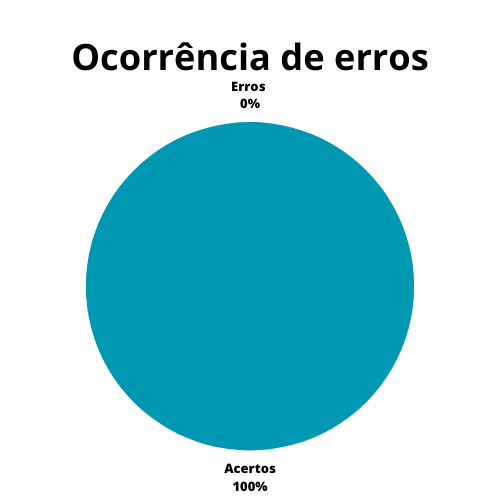

# Aspectos éticos do projeto

## 1. Introdução

Este documento possui a função de verificar o artefato referente aos aspectos éticos do projeto. Os aspectos éticos definem as questões éticas envolvendo a pesquisa com pessoas, a qual será utilizada no projeto.

## 2. Metodologia

A metodologia utilizada neste documento segue o modelo proposto no [planejamento](./planejamentoVerificacao.md)[1] onde serão utilizados dois _checklists_, um para padronização e outro referenciando o conteúdo dos artefatos. Estes _checklists_ consideram o artefato verificado em sua versão 1.0 e foi realizada no dia 17 de junho de 2023. As verificações de conteúdo elaboradas foram:

### 2.1 Verificação 1 - O artefato possui o princípio da autonomia?
É importante deixar claro o consentimento livre e esclarecido dos envolvidos na pesquisa, além da proteção a grupos vulneráveis. Buscando sempre tratar os envolvidos com respeito e dignidade.

`BARBOSA, Simone et al. Identificação de Necessidades dos Usuários e Definição dos Requisitos de IHC: aspectos éticos de pesquisas envolvendo pessoas. In: BARBOSA, Simone et al. Interação Humano-Computador e Experiência do Usuário. Rio de Janeiro: Autopublicação, 2021. Cap. 7. p. 140-143.`

### 2.2 Verificação 2 - O artefato possui o princípio da beneficência?
É importante deixar claro o compromisso da pesquisa em evitar ou reduzir potencias danos e riscos ao usuário, se focando o máximo para trazer benefícios aos envolvidos.

`BARBOSA, Simone et al. Identificação de Necessidades dos Usuários e Definição dos Requisitos de IHC: aspectos éticos de pesquisas envolvendo pessoas. In: BARBOSA, Simone et al. Interação Humano-Computador e Experiência do Usuário. Rio de Janeiro: Autopublicação, 2021. Cap. 7. p. 140-143.`

### 2.3 Verificação 3 - O artefato possui o princípio da não maleficência?
É importante deixar claro o compromisso da pesquisa em evitar a todo custo o causamento de danos previsiveis aos envolvidos.

`BARBOSA, Simone et al. Identificação de Necessidades dos Usuários e Definição dos Requisitos de IHC: aspectos éticos de pesquisas envolvendo pessoas. In: BARBOSA, Simone et al. Interação Humano-Computador e Experiência do Usuário. Rio de Janeiro: Autopublicação, 2021. Cap. 7. p. 140-143.`

### 2.4 Verificação 4 - O artefato possui o princípio da justiça e equidade?
É importante garantir o compromisso da pesquisa em fornecer a maior vantagem possível para os participantes, enquanto reduz ao máximo os ônus para participantes vulneráveis.

`BARBOSA, Simone et al. Identificação de Necessidades dos Usuários e Definição dos Requisitos de IHC: aspectos éticos de pesquisas envolvendo pessoas. In: BARBOSA, Simone et al. Interação Humano-Computador e Experiência do Usuário. Rio de Janeiro: Autopublicação, 2021. Cap. 7. p. 140-143.`

### 2.5 Verificação 5 - O artefato deixa explícito a gravação de vídeo ou aúdio?
É importante que se tenha a autorização explícita do participante para que o mesmo seja gravado, seja por áudio ou vídeo, buscando evitar complicações futuras.

`BARBOSA, Simone et al. Identificação de Necessidades dos Usuários e Definição dos Requisitos de IHC: aspectos éticos de pesquisas envolvendo pessoas. In: BARBOSA, Simone et al. Interação Humano-Computador e Experiência do Usuário. Rio de Janeiro: Autopublicação, 2021. Cap. 7. p. 140-143.`

### 2.6 Verificação 6 - O artefato detalha o termo de consentimento assinado pelos participantes?

É importante deixar explícito o termo de consentimento a ser assinado pelos participantes, de forma a sumarizar todos os aspectos éticos envolvendo a pesquisa.

`BARBOSA, Simone et al. Identificação de Necessidades dos Usuários e Definição dos Requisitos de IHC: aspectos éticos de pesquisas envolvendo pessoas. In: BARBOSA, Simone et al. Interação Humano-Computador e Experiência do Usuário. Rio de Janeiro: Autopublicação, 2021. Cap. 7. p. 140-143.`

### 2.7 Verificação 7 - O artefato deixa explícito os objetivos da pesquisa?
É importante deixar explícito aos participantes todos os objetivos principais da pesquisa, além de deixar claro o que irá ocorrer em cada etapa do processo de coleta de dados.

`BARBOSA, Simone et al. Identificação de Necessidades dos Usuários e Definição dos Requisitos de IHC: aspectos éticos de pesquisas envolvendo pessoas. In: BARBOSA, Simone et al. Interação Humano-Computador e Experiência do Usuário. Rio de Janeiro: Autopublicação, 2021. Cap. 7. p. 140-143.`

### 2.8 Verificação 8 - O artefato deixa explicíto a confidencialidade, privacidade e anonimato dos envolvidos na pesquisa?
Após a análise de dados, os resultados devem ser divulgados de forma a manter os participantes anônimos, evitando complicações a partir da participação dos mesmos.

`BARBOSA, Simone et al. Identificação de Necessidades dos Usuários e Definição dos Requisitos de IHC: aspectos éticos de pesquisas envolvendo pessoas. In: BARBOSA, Simone et al. Interação Humano-Computador e Experiência do Usuário. Rio de Janeiro: Autopublicação, 2021. Cap. 7. p. 140-143.`

### 2.9 Verificação 9 - O artefato deixa explicíto o direito do participante de abandonar a pesquisa a qualquer momento?
Uma pesquisa com pessoas deve ocorrer apenas com o consentimento livre e esclarecido dos participantes, portanto, deve-se deixar claro o direito dos mesmos de abandonar a pesquisa a qualquer momento.

`BARBOSA, Simone et al. Identificação de Necessidades dos Usuários e Definição dos Requisitos de IHC: aspectos éticos de pesquisas envolvendo pessoas. In: BARBOSA, Simone et al. Interação Humano-Computador e Experiência do Usuário. Rio de Janeiro: Autopublicação, 2021. Cap. 7. p. 140-143.`

## 3. Verificação

Abaixo se encontram as verificações realizadas, na tabela 1 se encontram as verificações de padronização, enquanto na tabela 2 estão as verificações de conteúdo, tais verificações foram obtidas a partir do plano de ensino da disciplina[4] e do livro de Interação Humano Computador de Simone Barbosa[2].

### 3.1 Padronização

| ID  | Verificação                                                          | Realizado |
| --- | -------------------------------------------------------------------- | ----------- |
| 1   | Possui ortografia correta e formal?                                  |    Sim       |
| 2   | Possui introdução?                                                   |    Sim      |
| 3   | Possui links necessários?                                            | Sem necessidade          |
| 4   | As tabelas e imagens possuem legenda padronizada e chamada no texto? |  Sem necessidade          |
| 5   | As tabelas e imagens estão totalmente em português?                  | Sem necessidade  |
| 6   | Possui bibliografia?                                                 | Sim           |
| 7   | A bibliografia está em ordem alfabética?                             | Sim           |
| 8   | Possui histórico de versão padronizado?                              | Sim           |
| 9   | O histórico de versão possui autor(es) e revisor(es)?                | Sim         |

Tabela 1: Verificações de padronização (Fonte: Autor, 2023).

### 3.2 Conteúdo

| ID | Verificação | Ocorrências | Acertos | Erros |
|--|--|--|--|--|
| 1 | O artefato possui o princípio da autonomia? | 1 |  1  | 0 |
| 2 | O artefato possui o princípio da beneficência? | 1 |  1  | 0 |
| 3 | O artefato possui o princípio da não maleficência? | 1 |  1  | 0 |
| 4 | O artefato possui o princípio da justiça e equidade? | 1 |  1  | 0 |
| 5 | O artefato deixa explícito a gravação de vídeo ou aúdio? | 1 | 1 | 0 |
| 6 | O artefato detalha o termo de consentimento assinado pelos participantes? | 1 | 1 | 0 |
| 7 | O artefato deixa explícito os objetivos da pesquisa? | 1 | 1 | 0 |
| 8 | O artefato deixa explicíto a confidencialidade, privacidade e anonimato dos envolvidos na pesquisa? | 1 | 1 | 0 |
| 9 | O artefato deixa explicíto o direito do participante de abandonar a pesquisa a qualquer momento? | 1 | 1 | 0 |

Tabela 2: Verificações de conteúdo (Fonte: Autor, 2023).

## 4. Resultados

Os resultados da verificação de aspectos éticos podem ser encontrados na tabela 3 abaixo, onde podem ser verificados o grau de satisfação e a ocorrência de erros no artefato verificado. Estes resultados levam em conta apenas a verificação do conteúdo.

|                                              |                                        |
| ------------------------------------------------------------------------------- | -------------------------------------------------------------------------- |
| Figura 1: Representação do grau de satisfação do artefato (Fonte: Autor, 2023). | Figura 2: Gráfico de ocorrência de erros no artefato (Fonte: Autor, 2023). |

Tabela 3: Representações gráficas dos resultados da verificação (Fonte: Autor, 2023).

## 5. Problemas encontrados

Não foram encontrados problemas de padronização ou conteúdo no artefato atual.

## 6. Acompanhamento

Como não foram encontrados problemas ou erros durante a verificação, não foram necessárias correções.

## 5. Referências Bibliográficas

> [1] Artefato de planejamento da verificação, acesso em: 5 de junho de 2023. Para mais informações acesse: [link](./planejamentoVerificacao.md)

> [2] Barbosa, S. D. J.; Silva, B. S. da; Silveira, M. S.; Gasparini, I.; Darin, T.; Barbosa, G. D. J. (2021) Interação Humano-Computador e Experiência do usuário. Autopublicação. ISBN: 978-65-00-19677-1.

> [3] Repositório Agiel do semestre 2023.1, acesso em: 5 de junho de 2023. Para mais informações acesse: <https://interacao-humano-computador.github.io/2023.1-Agiel/>

> [4] SALES, André Barros. Plano de ensino da disciplina. Disponível em: [https://aprender3.unb.br/pluginfile.php/2523360/mod_resource/content/33/Plano_de_Ensino%20FIHC%20202301%20Turma%202.pdf](https://aprender3.unb.br/pluginfile.php/2523360/mod_resource/content/33/Plano_de_Ensino%20FIHC%20202301%20Turma%202.pdf). Acesso em: 5 de junho de 2023;

## 6. Histórico de versão

|  Versão  |   Data   |                      Descrição                      |    Autor(es)   |  Revisor(es)  |
| -------- | -------- | --------------------------------------------------- | -------------- | ------------- |
|  `1.0`   | 05/06/23 | Criação do documento e adição do conteudo           | Pedro Muniz | Felipe Correa |
