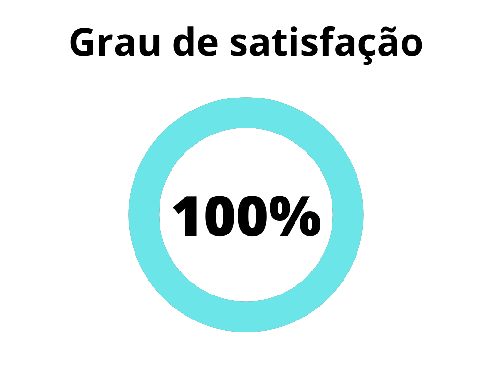
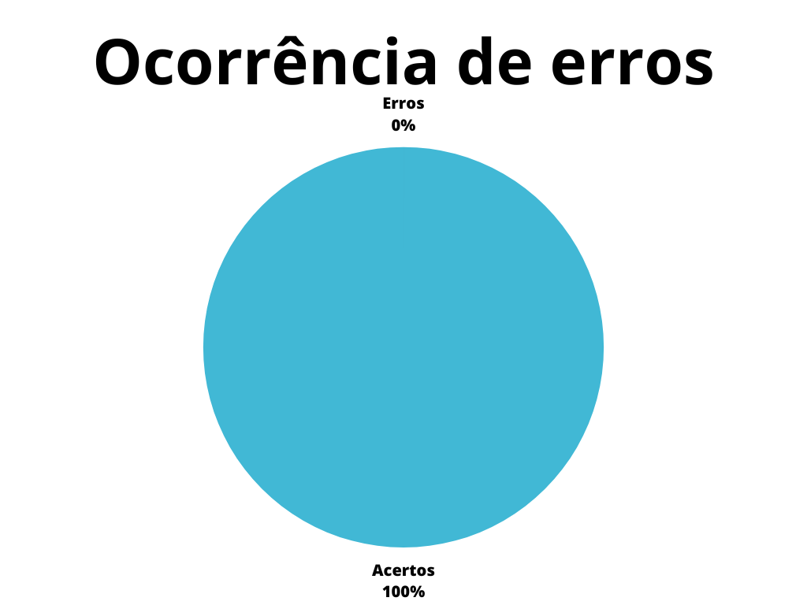

# Verificação de Aspectos gerais

## 1. Introdução

Os aspectos gerais do projeto dizem respeito aos artefatos básicos do projeto, isto é, artefatos que devem estar presentes em todos os projetos como páginas de reunião, de gravação de apresentações e a página principal do projeto. Assim, este artefato compila os resultados da verificação destes artefatos8

## 2. Metodologia

A verificação a seguir segue a metodologia proposta no planejamento[1], onde serão utilizados checklists para a verificação dos conteúdos presentes no artefato, buscando encontrar erros e elementos faltantes no mesmo, as verificações foram escolhidas com base no plano de ensino da disciplina[2] e a verificação de artefatos feita pela Equipe 05, encontrado no [link](https://interacao-humano-computador.github.io/2023.1-Alistamento/verificacao/verificacao_6/etapa1/verificacao_entrega1/).

Abaixo seguem as verificações de conteúdo elaboradas, contendo a justificativa de cada uma além de sua fonte:

### 2.1 Verificação 1 - Existe uma página com os integrantes?

Os integrantes devem estar listados e identificados na página inicial do projeto, para garantir a identificação para os integrantes do site.

> Sales, André Barros. Plano de ensino da disciplina. Página 6.

### 2.2 Verificação 2 - A lista de participantes possui identificação(nome e foto) sem matrícula?

Os integrantes devem estar identificáveis e sem a matrícula da UnB, para facilitar a identificação e não prover informação desnecessária.

> Sales, André Barros. Plano de ensino da disciplina. Página 6.

### 2.3 Verificação 3 - Existe uma página para cada reunião com sua ata?

Cada reunião deve ter uma página com os conteúdos de cada reunião, principalmente a ata da reunião, para que possa entender o que foi acordado na reunião.

> Sales, André Barros. Plano de ensino da disciplina. Página 6.

### 2.4 Verificação 4 - As atas de reunião possuem: data, duração, participantes, objetivo e atividades definidas?

As atas devem estar padronizadas e com informações sobre a reunião, é preciso entender o contexto e os objetivos da reunião e ter as atividades de cada integrante declarada.

> Sales, André Barros. Plano de ensino da disciplina. Página 6.

### 2.5 Verificação 5 - As atas de reunião possuem a gravação da reunião?

Todas as reuniões devem ser gravadas e ter sido disponibilizadas para acesso a partir da página do projeto.

> Sales, André Barros. Plano de ensino da disciplina. Página 6.

### 2.6 Verificação 6 - Existem uma página para cada apresentação com a gravação da mesma?

Para se obter uma organização e acesso eficiente, é importante que cada reunião tenha uma página própria, com a ata e a gravação.

> Sales, André Barros. Plano de ensino da disciplina. Página 6.

### 2.7 Verificação 7 - Os vídeos das reuniões e apresentações estão na categoria “não listado” no Youtube?

Todos as gravações, seja da reunião ou da apresentação, devem estar na categoria não listado, apesar do acesso à documentação do projeto ser público, é importante que tenha noção do contexto do projeto para acompanhar as gravações e este é encontrado ao fazer a leitura da página.

> Sales, André Barros. Plano de ensino da disciplina. Página 6.

## 3. Desenvolvimento

### 3.1 Checklist de padronização

Na tabela 1, se encontra o _[checklist]_ de padronização preenchido após a realização da verificação.

| ID | Verificação                                                         | Realizado       |
|---|----------------------------------------------------------------------|-----------------|
| 1 | Possui ortografia correta e formal?                                  | Sim             |
| 2 | Possui introdução?                                                   | Sim             |
| 3 | Possui links necessários?                                            | Sim             |
| 4 | As tabelas e imagens possuem legenda padronizada e chamada no texto? | Sim             |
| 5 | As tabelas e imagens estão totalmente em português?                  | Sim             |
| 6 | Possui bibliografia?                                                 | Sim             |
| 7 | A bibliografia está em ordem alfabética?                             | Sim             |
| 8 | Possui histórico de versão padronizado?                              | Sim             |
| 9 | O histórico de versão possui autor(es) e revisor(es)?                | Sim             |

Tabela 1 _[checklist]_ de padronização (fonte: autor, 20238

### 8.2 Checklist de conteúdo

Na tabela 2, se encontra o _[checklist]_. https://interacao-humano-computador.github.io/2023.1-Alistamento/verificacao/verificacao_6/etapa1/verificacao_entrega1/ de conteúdo preenchido após a realização da verificação. As verificações foram definidas com base no plano de ensino da disciplina[2] e sobre a verificação de artefatos feita pela equipe 05 Equipe 05, Artefato de verificação dos artefatos da entrega 1, acesso em 18 de junho de 2023.

| ID | Verificação                                                                                | Ocorrências | Acertos | Erros |
|----|--------------------------------------------------------------------------------------------|-------------|---------|-------|
| 1  | Existe uma página com os integrantes?                                                      | 1           | 1       | 0     |
| 2  | A lista de participantes possui identificação(nome e foto) sem matrícula?                  | 6           | 6       | 0     |
| 3  | Existe uma página para cada reunião com sua ata?                                           | 7           | 7       | 0     |
| 4  | As atas de reunião possuem: data, duração, participantes, objetivo e atividades definidas? | 35          | 35      | 0     |
| 5  | As atas de reunião possuem a gravação da reunião?                                          | 7           | 7       | 0     |
| 6  | Existem uma página para cada apresentação com a gravação da mesma?                         | 7           | 7       | 0     |
| 7  | Os vídeos das reuniões e apresentações estão na categoria “não listado” no Youtube?        | 7           | 7       | 0     |

Tabela 2 _[checklist]_ de conteúdo (fonte: autor, 2023)

## 4. Resultados

|  |  |
| ------------------------------------------------------------------------------- | -------------------------------------------------------------------------- |
| Figura 1: Representação do grau de satisfação do artefato (Fonte: Autor, 2023). | Figura 2: Gráfico de ocorrência de erros no artefato (Fonte: Autor, 2023). |

Tabela 3: Representações gráficas dos resultados da verificação (Fonte: Autor, 2023).

## 5. Problemas encontrados

Não foi encontrado nenhum problema através da metodologia de verificação dos artefatos, todos os documentos foram bem construídos e seguem o padrão estipulado, porém é notado que em relação aos outros documentos, falta a numeração de tópicos nos documentos das apresentações.

## 6. Acompanhamento

As correções citadas anteriormente já foram efetuadas e o os documentos se encontram completos e padronizados.

## 7. Referências Bibliográficas

> [1] Artefato de planejamento da verificação, acesso em 18 de junho de 2023. Para mais informações acesse: [link](../verificacao/planejamentoVerificacao.md)

> [2] SALES, André Barros. Plano de ensino da disciplina. Disponível em: [link](https://aprender3.unb.br/pluginfile.php/2523005/mod_resource/content/27/Plano_de_Ensino%20RE%20202301%20Turma%202.pdf). Acesso em: 18 de junho de 2023;

> [3] Equipe 05, Artefato de verificação dos artefatos da entrega 1, acesso em 18 de junho de 2023. Disponível em: [link](https://interacao-humano-computador.github.io/2023.1-Alistamento/verificacao/verificacao_6/etapa1/verificacao_entrega1/)

## 8. Histórico de versão

|  Versão  |   Data   |                 Descrição                         |    Autor(es)   |  Revisor(es)  |
| -------- | -------- | ------------------------------------------------- | -------------- | ------------- |
|  `1.0`   | 19/06/23 | Primeira versão da verificação de aspectos gerais | João M.        | Felipe M.     |
