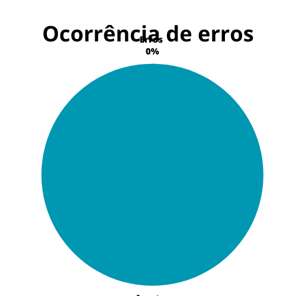

# Guia de Estilo

## 1. Introdução
O presente artefato tem o intuito relatar os resultados da verificação dos artefatos produzidos durante a realização dos pontos de controle anteriores. Neste artefato, avaliaremos o [Guia de Estilo](../analise_requisitos/guia_estilo.md)

A verificação teve como objeto a versão 1.2 do documento e foi realizada no dia 1 de junho de 2023.

## 2. Metodologia
A verificação foi feita com base nos checklists pré-definidos em nosso [Planejamento da Verificação](./teste/planejamentoVerificacao.md) e também na verificação realizada pelo [Grupo 5](https://interacao-humano-computador.github.io/2023.1-Alistamento/) [6]. Abaixo seguem as verificações de conteúdo que foram elaboradas, contendo justificativas para cada uma e também a fonte:

### 2.1 Verificação 1 - O ambiente de trabalho é definido e analisado?

É importante que o artefato deixe claro os métodos utilizados para a obtenção e desenvolvimento do conteúdo apresentado, buscando inteirar o leitor acerca do que é tratado pelo mesmo.

` BARBOSA, Simone; DINIZ, Bruno. Interação Humano-Computador. Editora Elsevier, Rio de Janeiro, 2010. `

### 2.2 Verificação 2 - São apresentados os elementos de layout?

É importante que o artefato deixe explícito a demonstração do layout, tais como cores, fonte dos textos, figuras etc.

` BARBOSA, Simone; DINIZ, Bruno. Interação Humano-Computador. Editora Elsevier, Rio de Janeiro, 2010. `

### 2.3 Verificação 3 - As cores e a tipografia utilizadas são analisadas?

É importante que o artefato possua ligações entre tipografias e mecanismos interativos e também sua paleta de cores.
` BARBOSA, Simone; DINIZ, Bruno. Interação Humano-Computador. Editora Elsevier, Rio de Janeiro, 2010. `

### 2.4 Verificação 4 - São definidos e separados os elementos de interface, interação e ação?

É importante definir interface do sistema, interação usuário-sistema e ação realizada pelo usuário, para que não ocorra ruídos nas tarefas realizadas.

` BARBOSA, Simone; DINIZ, Bruno. Interação Humano-Computador. Editora Elsevier, Rio de Janeiro, 2010. `

### 2.5 Verificação 5 - São analisadas as teclas de atalho e os botões do site?

É importante a padronização de atalhos e botões do sítio, para que não ocorra confusões entre usuário-sistema, assim aumentando o índice de memorização do usuário ao usar o sistema.

` BARBOSA, Simone; DINIZ, Bruno. Interação Humano-Computador. Editora Elsevier, Rio de Janeiro, 2010. `

### 2.6 Verificação 6 -A disposição do layout é mostrado tanto na versão para computador, quanto para a versão mobile?

É necessário ressaltar a importância da acessibilidade em um sistema em plena desenvoltura, onde podemos evidenciar a responsividade do sistema e também as cores acessíveis para o mesmo.

` BARBOSA, Simone; DINIZ, Bruno. Interação Humano-Computador. Editora Elsevier, Rio de Janeiro, 2010. `

### 2.7 Verificação 7 - Foi feita a análise dos diálogos com o usuário?

É importante moostrar como o usuário reage ao uso do sistema, evidenciando o diálogo usuário-sistema.

` BARBOSA, Simone; DINIZ, Bruno. Interação Humano-Computador. Editora Elsevier, Rio de Janeiro, 2010. `

## 3. Desenvolvimento

As tabelas 1 e 2 apresentam os resultados da verificação do artefato [Guia de Estilo](../analise_requisitos/guia_estilo.md)

### 3.1 Padronização

| ID | Verificação | Realizado |
|:-:|--|--|
| 1 | Possui ortografia correta e formal? | Sim |
| 2 | Possui introdução? | Sim |
| 3 | Possui links necessários? | Sim |
| 4 | As tabelas e imagens possuem legenda padronizada e chamada no texto? | Sim |
| 5 | As tabelas e imagens estão totalmente em português? | Sim |
| 6 | Possui bibliografia? | Sim |
| 7 | A bibliografia está em ordem alfabética? | Sim |
| 8 | Possui histórico de versão padronizado? | Sim |
| 9 | O histórico de versão possui autor(es) e revisor(es)? | Sim |

Tabela 2: Modelo de checklist para padronização 
(Fonte: Autor, 2023).

### 3.2 Conteúdo

| ID | Verificação | Ocorrências | Acertos | Erros |
| :-: | ------- | -------- | -------- | ------ |
| 1 | O ambiente de trabalho é definido e analisado? | 1 | 1 | 0 |
| 2 | São apresentados os elementos de layout? | 1 | 1 | 0|
| 3 | As cores e a tipografia utilizadas são analisadas? | 1 | 1 | 0 |
| 4 | São definidos e separados os elementos de interface, interação e ação? | 1 | 1 | 0 |
| 5 | São analisadas as teclas de atalho e os botões do site? | 1 | 1 | 0 |
| 6 | A disposição do layout é mostrado tanto na versão para computador, quanto para a versão mobile? | 1 | 1 | 0 |
| 7 | Foi feita a análise dos diálogos com o usuário? | 1 | 1 | 0 |

Tabela 3: Modelo de checklist para conteúdo (Fonte: 
Autor, 2023).

## 4. Resultados
Os resultados da verificação do Guia de estilo podem ser encontrados na tabela 3 abaixo, por maio das figuras 1 e 2, onde foi verificado o grau de satisfação e a ocorrência de erros no artefato verificado. Os resultados em questão só levam em consideração as verificações do conteúdo.

|               |                                 |
| ------------------------------------------------------------------------------- | -------------------------------------------------------------------------- |
| Figura 1: Representação do grau de satisfação do artefato (Fonte: Autor, 2023). | Figura 2: Gráfico de ocorrência de erros no artefato (Fonte: Autor, 2023). |

Tabela 3: Representações gráficas dos resultados da verificação (Fonte: Autor, 2023).

## 5. Problemas encontrados
### 5.1 Problemas Encontrados - Padronização

#### 5.1.1 Verificação 1 - Possui ortografia correta e formal?

O artefato possui alguns erros de ortografia, como palavras com acentuação incorreta e frases incompletas.

## 6. Acompanhamento
### 6.1 Acompanhemento - Padronização

#### 6.1.1 Acompanhemento 1 - Possui ortografia correta e formal?

Foi realizado as correções necessárias dentro do artefato de análise de tarefas

## 7. Referências Bibliográficas

> [1] Agiel, acesso em: 1 de junho de 2023. Para mais informações acesse: <https://www.agiel.com.br/site/>

> [2] Gerência e Qualidade de Software - Aula 06 - Técnica de revisão – UNIVESP

> [3] REINEHR, Sheila. Engenharia de Requisitos. Porto Alegre: Sagah, 2020.

> [4] Repositório Agiel do semestre 2023.1, acesso em: 1 de junho de 2023. Para mais informações acesse: <https://interacao-humano-computador.github.io/2023.1-Agiel/>

> [5] Repositório Lichess do semestre 2022.2, acesso em: 1 de junho de 2023. Para mais informações acesse: <https://github.com/Requisitos-de-Software/2022.2-Lichess>

> [6] Repositório Alistamento do semestre de 2023.1, acesso em 15 de junho de 2023. Para mais informações acesse: <https://interacao-humano-computador.github.io/2023.1-Alistamento/>

> [7] SALES, André Barros. Plano de ensino da disciplina. Disponível em: [https://aprender3.unb.br/pluginfile.php/2523360/mod_resource/content/33/Plano_de_Ensino%20FIHC%20202301%20Turma%202.pdf](https://aprender3.unb.br/pluginfile.php/2523360/mod_resource/content/33/Plano_de_Ensino%20FIHC%20202301%20Turma%202.pdf). Acesso em: 1 de junho de 2023;

## 8. Histórico de versão

| Versão | Data     | Descrição                                        | Autor(es)   | Revisor(es)   |
| ------ | -------- | ------------------------------------------------ |----------- | ------------- |
| `1.0`  | 16/06/23 | Criação do documento | Amanda Noda | Carlos Eduardo |
