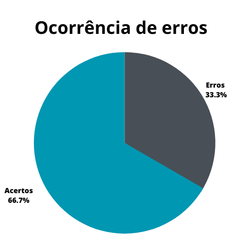
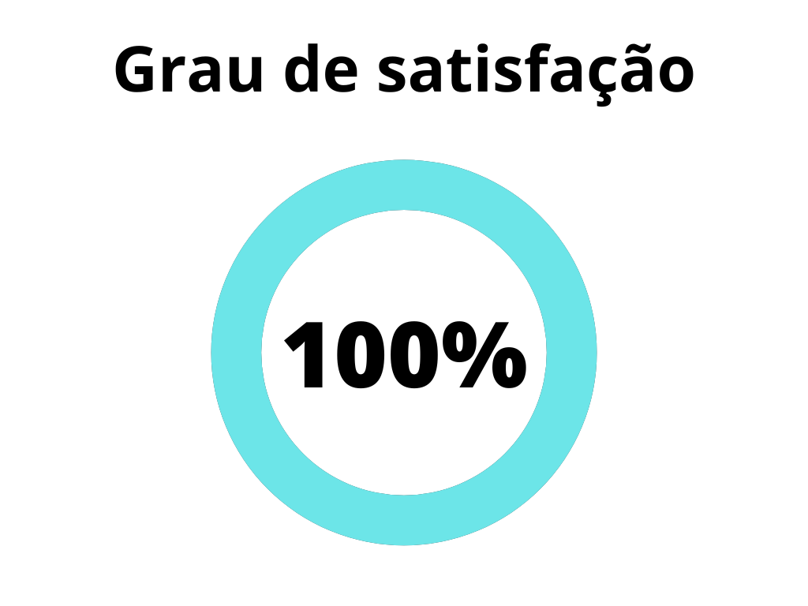
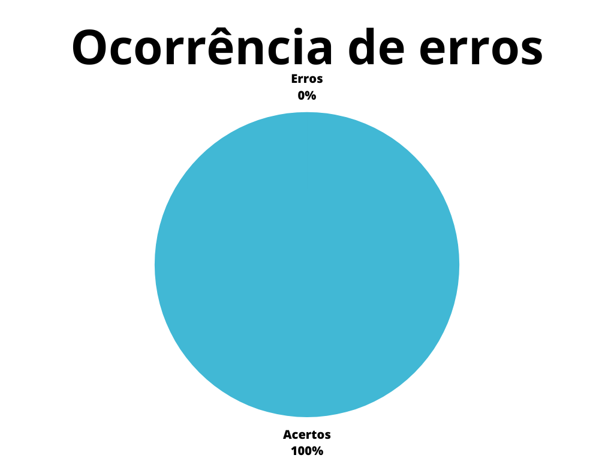

# Verificação - Planejamento da Avaliação - Protótipo de Papel

## 1. Introdução

O método de prototipação em papel (Snyder, 2003) avalia a usabilidade de um design de IHC
representado em papel, através de simulações de uso com a participação de potenciais usuários[2]. 

Assim, a avaliação do protótipo de papel tem como objetivo definir as tarefas para os participantes executarem, o perfil dos participantes e recrutá-los, criar protótipos em papel da interface para executar as tarefas e executar um teste-piloto[2]. 

Tudo isso está incluso no planejamento da avaliação, que envolve planejar como as atividades básicas da avaliação vão ser realizadas. Essas atividades são: a preparação, coleta de dados, interpretação, consolidação e relato dos resultados[3].

Este documento tem como objetivo verificar o artefato referente ao planejamento da avaliação de protótipo de papel realizado por nosso grupo da disciplina de interação humano computador.

## 2. Metodologia

A metodologia utilizada neste documento segue o modelo proposto no planejamento[1] onde serão utilizados dois checklists, um para padronização e outro referenciando o conteúdo dos artefatos. Estes checklists consideram o conjunto dos artefatos verificados presentes no repositório de nosso grupo.

Abaixo seguem as verificações de conteúdos elaborados contendo a justificativa de cada uma além da sua fonte:

### 2.1 Verificação 1 - O artefato apresenta questões práticas da avaliação?

É preciso que o artefato apresente essas questões como prazos, horários definidos para as atividades e como cada prática vai ser proposta com o objetivo de orientar os responsáveis por realizar a avaliação.

`BARBOSA, Simone et al. Planejamento da Avaliação de IHC: Como Avaliar? e O Framework DECIDE In: BARBOSA, Simone et al. Interação Humano-Computador e Experiência do Usuário. Rio de Janeiro: Autopublicação, 2021. Cap. 11. p. 273-279.`

### 2.2 Verificação 2 - O artefato apresenta e descreve as tarefas que serão analisadas no documento?

O artefato deve apresentar as tarefas com o objetivo de condizir o planejamento da avaliação com o elemento de avaliação que é o protótipo de papel.

`BARBOSA, Simone et al. Métodos de Avaliação de IHC: Avaliação de IHC através de Observação - Prototipação em Papel. In: BARBOSA, Simone et al. Interação Humano-Computador e Experiência do Usuário. Rio de Janeiro: Autopublicação, 2021. Cap. 12. p. 301-319.`

### 2.3 Verificação 3 - O artefato apresenta os objetivos da avaliação do protótipo de papel?

O artefato deve deixar claro os objetivos da avaliação para compreensão e entendimento sobre o que o elemento avaliativo, que neste caso é o protótipo de papel, busca atingir com essa realização.

`BARBOSA, Simone et al. Métodos de Avaliação de IHC: Avaliação de IHC através de Observação - Prototipação em Papel. In: BARBOSA, Simone et al. Interação Humano-Computador e Experiência do Usuário. Rio de Janeiro: Autopublicação, 2021. Cap. 12. p. 301-319.`

### 2.4 Verificação 4 - O artefato apresenta e descreve alguma metodologia para o planejamento da avaliação?

É importante que o artefato seja desenvolvido por meio de uma metodologia com o objetivo de orientar o planejamento da avaliação.

`BARBOSA, Simone et al. Planejamento da Avaliação de IHC: Como Avaliar? e O Framework DECIDE In: BARBOSA, Simone et al. Interação Humano-Computador e Experiência do Usuário. Rio de Janeiro: Autopublicação, 2021. Cap. 11. p. 273-279.`

### 2.5 Verificação 5 - O artefato explica e detalha como a metodologia vai ser utilizada e aplicada para o planejamento da avaliação?

O artefato precisa seguir o que a metodologia descreve, aplicando os conceitos que a mesma apresenta. Então se for utilizado um *framework* como o DECIDE, é preciso que esteja descrito cada uma de suas etapas.

`BARBOSA, Simone et al. Planejamento da Avaliação de IHC: Como Avaliar? e O Framework DECIDE In: BARBOSA, Simone et al. Interação Humano-Computador e Experiência do Usuário. Rio de Janeiro: Autopublicação, 2021. Cap. 11. p. 273-279.`

### 2.6 Verificação 6 - O artefato segue algum modelo de planejamento de avaliação estabelecido?

Por se tratar de um planejamento de avaliação, o modelo proposto para o mesmo deve ser seguido com o objetivo de padronizar a forma como a avaliação deve ser feita e planejada.

`BARBOSA, Simone et al. Planejamento da Avaliação de IHC: Como Avaliar? e O Framework DECIDE In: BARBOSA, Simone et al. Interação Humano-Computador e Experiência do Usuário. Rio de Janeiro: Autopublicação, 2021. Cap. 11. p. 273-279.`

## 3. Desenvolvimento
### 3.1 Padronização

Na tabela 1, se encontra o _[checklist]_ de padronização preenchido após a realização da verificação.

| ID | Verificação | Realizado |
|--|--|--|
| 1 | Possui ortografia correta e formal? | Não |
| 2 | Possui introdução? | Sim |
| 3 | Possui links necessários? | Sim |
| 4 | As tabelas e imagens possuem legenda padronizada e chamada no texto? | Sim |
| 5 | As tabelas e imagens estão totalmente em português? | Sim |
| 6 | Possui bibliografia? | Sim |
| 7 | A bibliografia está em ordem alfabética? | Não |
| 8 | Possui histórico de versão padronizado? | Sim |
| 9 | O histórico de versão possui autor(es) e revisor(es)? | Sim |

Tabela 1 _[checklist]_ de padronização (fonte: autor, 2023)

### 3.2 Conteúdo

Na tabela 2, se encontra o _[checklist]_ de conteúdo preenchido após a realização da verificação. As verificações realizadas foram obtidas a partir dos capítulos 11 e 12, do livro Interação Humano Computador de Simone Barbosa[2, 3].

| ID | Verificação | Ocorrências | Acertos | Erros |
|--|--|--|--|--|
| 1 | O artefato apresenta questões práticas da avaliação?[3] | 1 | 1 | 0 |
| 2 | O artefato apresenta e descreve as tarefas que serão analisadas no documento?[2] | 1 | 1 | 0 |
| 3 | O artefato apresenta os objetivos da Avaliação do Protótipo de Papel?[2]  | 1 | 1 | 0 |
| 4 |O artefato apresenta e descreve alguma metodologia para o planejamento da avaliação?[3] | 1 | 0 | 1 |
| 5 | O artefato explica e detalha como a metodologia vai ser utilizada e aplicada para o planejamento da avaliação?[3] | 1 | 1 | 0 |
| 6 | O artefato segue algum modelo de planejamento de avaliação estabelecido?[3] | 1 | 0 | 1 |

Tabela 2 _[checklist]_ de conteúdo (fonte: autor, 2023)

## 4. Problemas Encontrados
### 4.1 Problemas encontrados - Padronização

#### 4.1.1 Verificação 1 - Possui ortografia correta e formal?

O artefato apresenta alguns erros de ortografia, como alguns pequenos erros de pontuação.

#### 4.1.2 Verificação 7 - A bibliografia está em ordem alfabética?

O artefato apresenta uma incoerência na ordem da blbliografia dos itens 2 e 3.
### 4.2 Problemas encontrados - Conteúdo

#### 4.2.1 Verificação 5 - O artefato segue algum modelo de planejamento de avaliação estabelecido?

O artefato em questão não apresenta nenhum modelo de planejamento que é seguido por outros artefatos de planejamento de avaliação.

## 5. Resultados
Os resultados da verificação do processo de design podem ser encontrados na tabela 3 abaixo, por meio das figuras 1 e 2, onde podem ser verificados o grau de satisfação e a ocorrência de erros no artefato verificado. Estes resultados levam em conta apenas a verificação do conteúdo.

|                                              |                                        |
| ------------------------------------------------------------------------------- | -------------------------------------------------------------------------- |
| Figura 1: Representação do grau de satisfação do artefato (Fonte: Autor, 2023). | Figura 2: Gráfico de ocorrência de erros no artefato (Fonte: Autor, 2023). |

Tabela 3: Representações gráficas dos resultados da verificação (Fonte: Autor, 2023).

## 6. Acompanhamento

Os problemas relatados na seção "4. Problemas Encontrados" foram corrigidos e na tabela 4 temos o novo grau de satisfação, figura 3, e ocorrência de erros, figura 4, após as mudanças. Além disso o artefato verificado no momento(17/06/23) está na versão 1.1.

|  |  |
| :-: | :-: |
| Figura 3: Representação do grau de satisfação do artefato (Fonte: Autor, 2023). | Figura 4: Gráfico de ocorrência de erros no artefato (Fonte: Autor, 2023). |

Tabela 4: Representações gráficas dos resultados da verificação (Fonte: Autor, 2023).

## 7. Referências bibliográficas

> [1] Artefato de planejamento da verificação, acesso em 13 de junho de 2023. Para mais informações acesse: [link](../verificacao/planejamentoVerificacao.md)

> [2] BARBOSA, Simone et al. Métodos de Avaliação de IHC: Avaliação de IHC através de Observação - Prototipação em Papel. In: BARBOSA, Simone et al. Interação Humano-Computador e Experiência do Usuário. Rio de Janeiro: Autopublicação, 2021. Cap. 12. p. 301-319.

> [3] BARBOSA, Simone et al. Planejamento da Avaliação de IHC: Como Avaliar? e O Framework DECIDE In: BARBOSA, Simone et al. Interação Humano-Computador e Experiência do Usuário. Rio de Janeiro: Autopublicação, 2021. Cap. 11. p. 273-279.

## 8. Histórico de versão
| Versão | Data | Descrição | Autor(es) | Revisor(es) |
|--|--|--|--|--|
| `1.0` | 17/06/23 | Criação do documento e adição do conteúdo | Pedro Henrique | João Morbeck |
