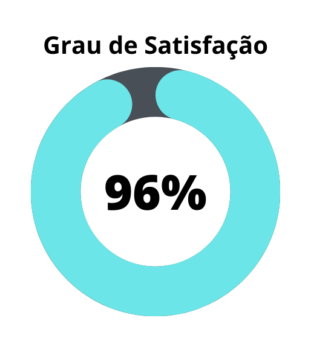
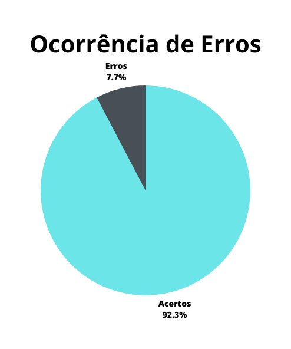
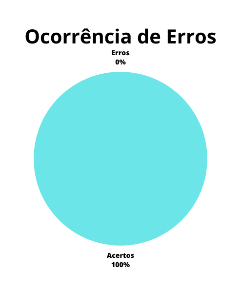

# Verificação - Planejamento da Avaliação dos Storyboards

## 1. Introdução

Este documento possui a função de verificar o artefato de “Planejamento da Avaliação - Storyboards” do projeto do grupo 6 - DetranGO. O planejamento da avaliação dos storyboards visa estabelecer as características da avaliação como: objetivos, metodologia, atividades e materiais.

A verificação teve como objeto a versão 1.1 do artefato e "Planejamento da Avaliação - Storyboards” e foi realizada em 16 de junho de 2023.

## 2. Metodologia

A metodologia utilizada neste documento segue o modelo proposto no planejamento[1] onde serão utilizados dois checklists, um para padronização e outro referenciando o conteúdo dos artefatos. Estes checklists consideram os artefatos verificados presentes no repositório do nosso grupo.

Abaixo seguem as verificações de conteúdo elaboradas, contendo a justificativa de cada uma além de sua fonte:

### 2.1. Verificação 1 - O planejamento da avaliação segue o framework DECIDE ?
Sharp, Rogers e Preece (2007) propõem um framework chamado DECIDE para orientar o planejamento, a execução e a análise de uma avaliação de IHC. As atividades do framework são interligadas e executadas interativamente, à medida que o avaliador articula os objetivos da avaliação, os dados e recursos disponíveis.

`BARBOSA, Simone et al. Interação Humano-Computador e Experiência do Usuário. Rio de Janeiro: Autopublicação, 2021. Cap. 9. Seção 9.8`

### 2.2. Verificação 2 - Foi definido os objetivos da avaliação ?
O avaliador deve determinar os objetivos gerais da avaliação e identificar por que e para quem tais objetivos são importantes. Pois o relato dos resultados é orientado por esses objetivos.

`BARBOSA, Simone et al. Interação Humano-Computador e Experiência do Usuário. Rio de Janeiro: Autopublicação, 2021. Cap. 9. Seção 9.7.5`

### 2.3. Verificação 3 - Foi definido as perguntas a serem respondidas ?
Devem ser elaboradas perguntas a serem respondidas tanto para elaborar melhor os objetivos quanto para que os objetivos sejam atingidos.

`BARBOSA, Simone et al. Interação Humano-Computador e Experiência do Usuário. Rio de Janeiro: Autopublicação, 2021. Cap. 9. Seção 9.2`

### 2.4. Verificação 4 - Foi definido os métodos de avaliação a serem utilizados ?
Existem vários métodos para avaliar a qualidade de uso propostos na literatura. Cada método atende melhor a certos objetivos de avaliação, orienta explícita ou implicitamente quando e onde os dados devem ser coletados, como eles devem ser analisados, e quais critérios de qualidade de uso.

`BARBOSA, Simone et al. Interação Humano-Computador e Experiência do Usuário. Rio de Janeiro: Autopublicação, 2021. Cap. 9. Seção 9.6`

### 2.5. Verificação 5 - As questões práticas foram identificadas e conduzidas ?
Existem muitas questões práticas envolvidas numa avaliação de IHC, como, por exemplo, o recrutamento dos usuários que participarão da avaliação, a preparação e o uso dos equipamentos necessários, os prazos e o orçamento disponíveis, além da mão-de-obra necessária para conduzir a avaliação.

`BARBOSA, Simone et al. Interação Humano-Computador e Experiência do Usuário. Rio de Janeiro: Autopublicação, 2021. Cap. 9. Seção 9.8`

### 2.6. Verificação 6 - Foi decidido como lidar com as questões éticas ?
Sempre que usuários são envolvidos numa avaliação, o avaliador deve tomar os cuidados éticos necessários. Os participantes da avaliação devem ser respeitados e não podem ser prejudicados direta ou indiretamente, nem durante os experimentos, nem após a divulgação dos resultados da avaliação.

`BARBOSA, Simone et al. Interação Humano-Computador e Experiência do Usuário. Rio de Janeiro: Autopublicação, 2021. Cap. 9. Seção 9.8`

### 2.7. Verificação 7 - Possui cronograma de entrevistas e teste piloto ?
Como tanto o teste-piloto quanto a coleta de informações também fazem parte da avaliação é necessário que esteja detalhada no planejamento suas datas, participantes.

`BARBOSA, Simone et al. Interação Humano-Computador e Experiência do Usuário. Rio de Janeiro: Autopublicação, 2021. Cap. 9. Seção 9.6`

### 2.8. Verificação 8 - As questões éticas foram respeitadas ?
Quando se realiza pesquisas com pessoas as questões éticas devem ser seguidas para o bem de todos os participantes, portanto o relato deve dizer se todas as questões éticas estabelecidas foram seguidas.

`BARBOSA, Simone et al. Interação Humano-Computador e Experiência do Usuário. Rio de Janeiro: Autopublicação, 2021. Cap. 9. Seção 9.7.5`

### 2.9. Verificação 9 - Existe 1 Storyboard para cada membro da equipe ?
Para que possamos abordar e avaliar a maior quantidade de atividades e contexto é ideal que tenha um storyboard por integrante do grupo.

`SALES, André Barros. Plano de ensino da disciplina - Avaliação da Entrega 4`

## 3. Desenvolvimento

### 3.1 Padronização

Na tabela 1, se encontra o _[checklist]_ de padronização preenchido após a realização da verificação.

| ID | Verificação | Realizado |
|--|--|--|
| 1 | Possui ortografia correta e formal ? | Sim |
| 2 | Possui introdução ? | Sim |
| 3 | Possui links necessários ? | Sim |
| 4 | As tabelas e imagens possuem legenda padronizada e chamada no texto ? | Parcialmente |
| 5 | As tabelas e imagens estão totalmente em português ? | Sim |
| 6 | Possui bibliografia ? | Sim |
| 7 | A bibliografia está em ordem alfabética ? | Sim |
| 8 | Possui histórico de versão padronizado ? | Sim |
| 9 | O histórico de versão possui autor(es) e revisor(es) ? | Sim |

Tabela 1: _[checklist]_ de padronização (fonte: autor, 2023)

### 3.2 Conteúdo

A tabela 2 marca as verificações de conteúdo dos artefatos. Os critérios considerados para a verificação foram obtidos a partir do plano de ensino da disciplina[3] e do livro de Interação Humano Computador de Simone Barbosa[2].

| ID | Verificação | Ocorrências | Acertos | Erros |
|--|--|--|--|--|
| 10 | O planejamento da avaliação segue o framework DECIDE ? | 1 | 1 | 0 |
| 11 | Foi definido os objetivos da avaliação ? | 1 | 1 | 0 |
| 12 | Foi definido as perguntas a serem respondidas ? | 1 | 1 | 0 |
| 13 | Foi definido os métodos de avaliação a serem utilizados ? | 1 | 1 | 0 |
| 14 | As questões práticas foram identificadas e conduzidas ? | 1 | 1 | 0 |
| 15 | Foi decidido como lidar com as questões éticas ? | 1 | 1 | 0 |
| 16 | Possui cronograma de entrevistas e teste piloto ? | 1 | 0 | 1 |
| 17 | Existe 1 Storyboard para cada membro da equipe ? | 6 | 6 | 0 |

Tabela 2: _[checklist]_ de conteúdos (fonte: autor, 2023)

## 4. Resultados

Os resultados da verificação dos artefatos de planejamento podem ser encontrados na tabela 3, onde podem ser verificados o grau de satisfação e a ocorrência de erros nos artefatos verificados. Estes resultados levam em conta apenas a verificação do conteúdo destes artefatos.

|  |  |
| :-: | :-: |
| Figura 1: Representação do grau de satisfação do artefato (Fonte: Autor, 2023). | Figura 2: Gráfico de ocorrência de erros no artefato (Fonte: Autor, 2023). |

Tabela 3: Representações gráficas dos resultados da verificação (Fonte: Autor, 2023).

## 5. Problemas Encontrados

### 5.1. Verificação 16 - Possui cronograma de entrevistas e teste piloto ?

- O artefato não apresenta cronograma para o teste piloto e da avaliação definitiva.

## 6. Acompanhamento

Os problemas relatados na seção "5. Problemas Encontrados" foram corrigidos e na tabela 4 temos o novo grau de satisfação, figura 3, e ocorrência de erros, figura 4, após as mudanças. Além disso o artefato verificado no momento(17/06/23) está na versão 1.2.

|  |  |
| :-: | :-: |
| Figura 3: Representação do grau de satisfação do artefato (Fonte: Autor, 2023). | Figura 4: Gráfico de ocorrência de erros no artefato (Fonte: Autor, 2023). |

Tabela 4: Representações gráficas dos resultados da verificação (Fonte: Autor, 2023).

## 7. Referências bibliográficas

> [1] Artefato de planejamento da verificação, acesso em: 15 de junho de 2023. Para mais informações acesse: [link](planejamentoVerificacao.md)

> [2] Barbosa, S. D. J.; Silva, B. S. da; Silveira, M. S.; Gasparini, I.; Darin, T.; Barbosa, G. D. J. (2021) Interação Humano-Computador e Experiência do usuário. Autopublicação. ISBN: 978-65-00-19677-1.

> [3] SALES, André Barros. Plano de ensino da disciplina. Disponível em: [link](https://aprender3.unb.br/pluginfile.php/2523360/mod_resource/content/33/Plano_de_Ensino%20FIHC%20202301%20Turma%202.pdf). Acesso em: 15 de junho de 2023;

## 8. Histórico de versão

| Versão | Data | Descrição | Autor(es) | Revisor(es) |
|--|--|--|--|--|
| `1.0` | 16/06/23 | Criação do artefato | Carlos E. | Pedro H. |

