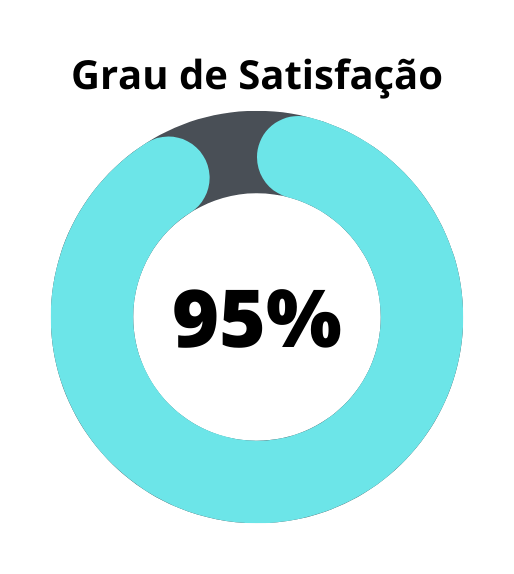
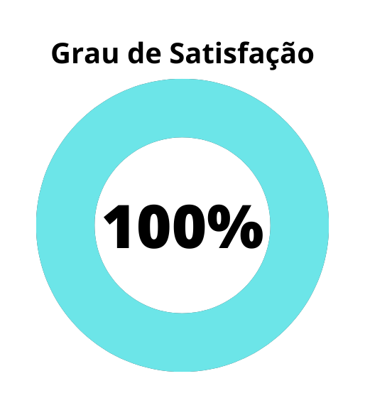

# Verificação - Planejamento da Avaliação da Análise de Tarefas

## 1. Introdução

Este documento possui a função de verificar o artefato de “Planejamento da Avaliação da Análise de Tarefas” do projeto do grupo 6 - DetranGO. O planejamento da avaliação da análise de tarefas visa estabelecer as características da avaliação como: objetivos, metodologia, atividades e materiais.

A verificação teve como objeto a versão 1.1 do artefato e "Planejamento da Avaliação da Análise de Tarefas” e foi realizada em 15 de junho de 2023.

## 2. Metodologia

A metodologia utilizada neste documento segue o modelo proposto no planejamento[1] onde serão utilizados dois checklists, um para padronização e outro referenciando o conteúdo dos artefatos. Estes checklists consideram os artefatos verificados presentes no repositório do nosso grupo.

Abaixo seguem as verificações de conteúdo elaboradas, contendo a justificativa de cada uma além de sua fonte:

### 2.1. Verificação 1 - Existe um artefato para o planejamento da Análise de tarefas ?
O planejamento da avaliação se faz necessário para estabelecer coisas como objetivos, metodologia, ferramentas, participantes, atividades, etc. Portanto, é importante ter um planejamento da avaliação da análise de tarefas.

`SALES, André Barros. Plano de ensino da disciplina - Avaliação da Entrega 4`

### 2.2. Verificação 2 - O artefato deixa claro os objetivos da avaliação ?
Além de servir para guiar nossa avaliação, a definição de objetivos é parte de uma etapa do framework DECIDE.

`BARBOSA, Simone et al. Interação Humano-Computador e Experiência do Usuário. Rio de Janeiro: Autopublicação, 2021. Cap. 9. Seção 9.2`

### 2.3. Verificação 3 - Foi definido pelo menos uma pergunta para cada objetivo definido ?
Devem ser elaboradas perguntas a serem respondidas tanto para elaborar melhor os objetivos quanto para que os objetivos sejam atingidos.

`BARBOSA, Simone et al. Interação Humano-Computador e Experiência do Usuário. Rio de Janeiro: Autopublicação, 2021. Cap. 9. Seção 9.2`

### 2.4. Verificação 4 - O artefato demonstra os métodos de avaliação a serem utilizados ?
Existem vários métodos para avaliar a qualidade de uso propostos na literatura. Cada método atende melhor a certos objetivos de avaliação, orienta explícita ou implicitamente quando e onde os dados devem ser coletados, como eles devem ser analisados, e quais critérios de qualidade de uso.

`BARBOSA, Simone et al. Interação Humano-Computador e Experiência do Usuário. Rio de Janeiro: Autopublicação, 2021. Cap. 9. Seção 9.6`

### 2.5. Verificação 5 - O artefato demonstra o termo de consentimento elaborado ?
Para se realizar uma avaliação com pessoas é necessário tratarmos de questões éticas além das práticas, portanto é importante termos um termo de consentimento que será utilizado na avaliação.

`BARBOSA, Simone et al. Interação Humano-Computador e Experiência do Usuário. Rio de Janeiro: Autopublicação, 2021. Cap. 5. Seção 5.4`

### 2.6. Verificação 6 - O artefato deixa claro o objetivo do teste piloto ?
O objetivo deste teste é avaliar o próprio planejamento, e analisar se a avaliação, tal como planejada, produz os dados necessários para responder a questões e objetivos do estudo.

`BARBOSA, Simone et al. Interação Humano-Computador e Experiência do Usuário. Rio de Janeiro: Autopublicação, 2021. Cap. 9. Seção 9.7.2`

### 2.7. Verificação 7 - O artefato deixa explícito o cronograma planejado para a coleta de informações ?
Como a coleta de informações também faz parte da avaliação é necessário que esteja detalhada no planejamento sua data, participantes e resultados.

`BARBOSA, Simone et al. Interação Humano-Computador e Experiência do Usuário. Rio de Janeiro: Autopublicação, 2021. Cap. 9. Seção 9.6`

## 3. Desenvolvimento

### 3.1 Padronização

Na tabela 1, se encontra o _[checklist]_ de padronização preenchido após a realização da verificação.

| ID | Verificação | Realizado |
|--|--|--|
| 1 | Possui ortografia correta e formal ? | Sim |
| 2 | Possui introdução ? | Sim |
| 3 | Possui links necessários ? | Sim |
| 4 | As tabelas e imagens possuem legenda padronizada e chamada no texto ? | Sim |
| 5 | As tabelas e imagens estão totalmente em português ? | Sim |
| 6 | Possui bibliografia ? | Sim |
| 7 | A bibliografia está em ordem alfabética ? | Sim |
| 8 | Possui histórico de versão padronizado ? | Sim |
| 9 | O histórico de versão possui autor(es) e revisor(es) ? | Sim |

Tabela 1: _[checklist]_ de padronização (fonte: autor, 2023)

### 3.2 Conteúdo

A tabela 2 marca as verificações de conteúdo dos artefatos. Os critérios considerados para a verificação foram obtidos a partir do plano de ensino da disciplina[3] e do livro de Interação Humano Computador de Simone Barbosa[2].

| ID | Verificação | Ocorrências | Acertos | Erros |
|--|--|--|--|--|
| 10 | Existe um artefato para o planejamento da Análise de tarefas ? | 1 | 1 | 0 |
| 11 | O artefato deixa claro os objetivos da avaliação ? | 3 | 3 | 0 |
| 12 | Foi definida pelo menos uma pergunta para cada objetivo definido ? | 3 | 3 | 0 |
| 13 | O artefato demonstra os métodos de avaliação a serem utilizados ? | 1 | 1 | 0 |
| 14 | O artefato demonstra o termo de consentimento elaborado ? | 1 | 1 | 0 |
| 15 | O artefato deixa claro o objetivo do teste piloto ? | 1 | 1 | 0 |
| 16 | O artefato deixa explícito o cronograma planejado para a coleta de informações ? | 1 | 1 | 0 |
| 17 | É definido quais são as tarefas a serem avaliadas ? | 1 | 0 | 1 |

Tabela 2: _[checklist]_ de conteúdos (fonte: autor, 2023)

## 4. Resultados

Os resultados da verificação dos artefatos de planejamento podem ser encontrados na tabela 3, onde podem ser verificados o grau de satisfação e a ocorrência de erros nos artefatos verificados. Estes resultados levam em conta apenas a verificação do conteúdo destes artefatos.

|  |  |
| :-: | :-: |
| Figura 1: Representação do grau de satisfação do artefato (Fonte: Autor, 2023). | Figura 2: Gráfico de ocorrência de erros no artefato (Fonte: Autor, 2023). |

Tabela 3: Representações gráficas dos resultados da verificação (Fonte: Autor, 2023).

## 5. Problemas Encontrados

### 5.1. Verificação 17 - É definido quais são as tarefas a serem avaliadas ?

- As tarefas a serem avaliadas que estão contidas na análise de tarefas não foram explicitamente citadas no artefato.

## 6. Acompanhamento

Os problemas relatados na seção "5. Problemas Encontrados" foram corrigidos e na tabela 4 temos o novo grau de satisfação, figura 3, e ocorrência de erros, figura 4, após as mudanças. Além disso o artefato verificado no momento(17/06/23) está na versão 1.2.

|  |  |
| :-: | :-: |
| Figura 3: Representação do grau de satisfação do artefato (Fonte: Autor, 2023). | Figura 4: Gráfico de ocorrência de erros no artefato (Fonte: Autor, 2023). |

Tabela 4: Representações gráficas dos resultados da verificação (Fonte: Autor, 2023).

## 7. Referências bibliográficas

> [1] Artefato de planejamento da verificação, acesso em: 15 de junho de 2023. Para mais informações acesse: [link](planejamentoVerificacao.md)

> [2] Barbosa, S. D. J.; Silva, B. S. da; Silveira, M. S.; Gasparini, I.; Darin, T.; Barbosa, G. D. J. (2021) Interação Humano-Computador e Experiência do usuário. Autopublicação. ISBN: 978-65-00-19677-1.

> [3] SALES, André Barros. Plano de ensino da disciplina. Disponível em: [link](https://aprender3.unb.br/pluginfile.php/2523360/mod_resource/content/33/Plano_de_Ensino%20FIHC%20202301%20Turma%202.pdf). Acesso em: 15 de junho de 2023;

## 8. Histórico de versão

| Versão | Data | Descrição | Autor(es) | Revisor(es) |
|--|--|--|--|--|
| `1.0` | 15/06/23 | Criação do artefato | Carlos E. | Pedro H. |

