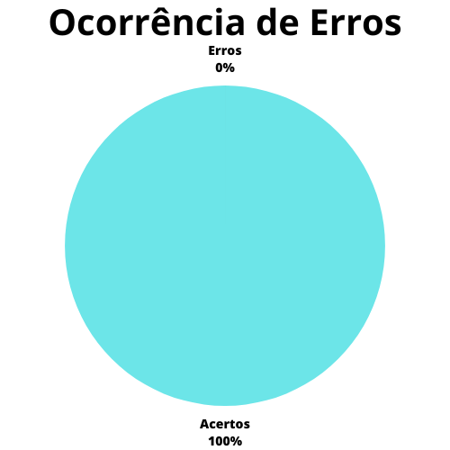

# Verificação - Planejamento do relato de resultados da avaliação do protótipo de papel

## 1. Introdução

O planejamento do relato dos resultados é essencial para uma boa definição do artefato de relato dos resultados e para a orientação dos avaliadores ao discorrer sobre os dados aferidos na avaliação.

O presente artefato busca marcar a verificação do artefato de planejamento do relato dos resultados da avaliação do storyboard, que na data da verificação (19/06/2023) tinha como versão mais atual a versão `1.1` de 19/06/2023.

## 2. Metodologia

A presente verificação acompanha os métodos definidos no [planejamento da verificação](./planejamento.md), com a utilização de checklists elaborados a partir da bibliografia disponível sobre o assunto e com o uso de um cálculo numérico para a aferição do grau de satisfação do artefato.

O checklist conterá as verificações descritas abaixo.

### 2.1 Verificação 1 - O artefato marca claramente os elementos que serão contidos no relato de resultados?

Um relato de resultados possui elementos definidos que aparecem usualmente em sua escrita. Esses elementos, portanto, devem ser descritos no planejamento do relato dos resultados para que sua presença no relato seja devidamente implementada.

`SALES, André Barros. Plano de ensino da disciplina. Página 11.`

`Barbosa, S. D. J.; Silva, B. S. da; Silveira, M. S.; Gasparini, I.; Darin, T.; Barbosa, G. D. J. (2021) Interação Humano-Computador e Experiência do usuário. Autopublicação. Página 279.`

### 2.2 Verificação 2 - O artefato marca a necessidade de delinear o objetivo da avaliação no relato? 

Dos diversos elementos que podem estar presentes em um relato de resultados, o objetivo da avaliação é principal, sua presença garantindo que a avaliação tenha um alvo claro a ser atingido com a avaliação.

`Barbosa, S. D. J.; Silva, B. S. da; Silveira, M. S.; Gasparini, I.; Darin, T.; Barbosa, G. D. J. (2021) Interação Humano-Computador e Experiência do usuário. Autopublicação. Página 279.`

### 2.3 Verificação 3 - O artefato marca a necessidade de delinear o método de avaliação utilizado no relato? 

O método de avaliação deve ser definido no relato de resultados para registro definido e verificável de técnicas e elementos da avaliação.

`Barbosa, S. D. J.; Silva, B. S. da; Silveira, M. S.; Gasparini, I.; Darin, T.; Barbosa, G. D. J. (2021) Interação Humano-Computador e Experiência do usuário. Autopublicação. Página 279.`

### 2.4 Verificação 4 - O artefato marca a necessidade de delinear o cronograma real da avaliação no relato, com o número de participantes e avaliadores? 

O planejamento do relato dos resultados deve marcar a necessidade de registrar os horários reais, plataforma de realização, participantes da avaliação e avaliadores planejados a fim de temporalizar e espacializar as avaliações.

`Barbosa, S. D. J.; Silva, B. S. da; Silveira, M. S.; Gasparini, I.; Darin, T.; Barbosa, G. D. J. (2021) Interação Humano-Computador e Experiência do usuário. Autopublicação. Página 279.`

### 2.5 Verificação 5 - O artefato marca a necessidade de uma seção para os registros gravados das avaliações?

Os registros da avaliação são necessários para a consulta e verificação da mesma. Para tanto, uma seção para os mesmos deve existir no relato.

`Barbosa, S. D. J.; Silva, B. S. da; Silveira, M. S.; Gasparini, I.; Darin, T.; Barbosa, G. D. J. (2021) Interação Humano-Computador e Experiência do usuário. Autopublicação. Página 271.`

### 2.6 Verificação 6 - O artefato marca a necessidade de uma seção para a interpretação e análise dos dados encontrados de maneira organizada?

A interpretação dos dados encontrados deve ter uma seção própria, mostrando os resultados obtidos com a avaliação de acordo com o planejamento da avaliação e permitindo conjecturas sobre esses resultados.

`Barbosa, S. D. J.; Silva, B. S. da; Silveira, M. S.; Gasparini, I.; Darin, T.; Barbosa, G. D. J. (2021) Interação Humano-Computador e Experiência do usuário. Autopublicação. Página 279.`

### 2.7 Verificação 7 -  O artefato marca a necessidade de uma seção para a listagem de problemas encontrados de maneira organizada? 

Os problemas encontrados com a avaliação devem ter uma seção própria, com a definição de métodos para seu registro, seja por tabelas, listas ou outros.

`Barbosa, S. D. J.; Silva, B. S. da; Silveira, M. S.; Gasparini, I.; Darin, T.; Barbosa, G. D. J. (2021) Interação Humano-Computador e Experiência do usuário. Autopublicação. Página 279.`

## 3. Desenvolvimento

### 3.1 Checklist de padronização

A tabela 1 apresenta o checklist de padronização para o artefato de Planejamento do relato de resultados da avaliação do storyboard.

| ID | Verificação | Realizado | 
|:-:|:-:|:-:|
| 1 | Possui ortografia correta e formal? | Sim | 
| 3 | Possui links necessários? | Não há necessidade |
| 4 | As tabelas e imagens possuem legenda padronizada e chamada no texto? | Não há tabelas ou imagens | 
| 5 | As tabelas e imagens estão totalmente em português? | Não há tabelas ou imagens |
| 6 | Possui bibliografia? 	| Sim |
| 7 | A bibliografia está em ordem alfabética? | Sim |
| 8 | Possui histórico de versão padronizado? |	Sim |
| 9 | O histórico de versão possui autor(es) e revisor(es)? | Sim |

Tabela 1: Checklist de padronização do planejamento do relato dos resultados da avaliação do protótipo de papel (Fonte: Autor, 2023).

### 3.2 Checklist de conteúdo

A tabela 2 contém os itens definidos na seção de metodologia para a realização de um checklist de conteúdo, bem como os números a ele associados.

| ID | Verificação | Ocorrências | Acertos | Erros |
|:-:|:-:|:-:|:-:|:-:|
| 10 | O artefato marca claramente os elementos que serão contidos no relato de resultados? | 1 | 1 | 0 | 
| 11 | O artefato marca a necessidade de delinear o objetivo da avaliação no relato?  | 1 | 1 | 0 |
| 12 | O artefato marca a necessidade de delinear o método de avaliação no relato? | 1 | 1 | 0 |
| 13 | O artefato marca a necessidade de delinear o cronograma da avaliação no relato, com o número de participantes e avaliadores? | 1 | 1 | 0 |
| 14 | O artefato marca a necessidade de organizar os dados encontrados de maneira clara, com gráficos, enumerações empíricas e outros? | 1 | 1 | 0 |
| 15 | O artefato marca a necessidade de uma seção para a interpretação e análise dos dados encontrados de maneira organizada? | 1 | 1 | 0 |
| 16 | O artefato marca a necessidade de uma seção para a listagem de problemas encontrados de maneira organizada? | 1 | 1 | 0 |

Tabela 2: Checklist de conteúdo do planejamento do relato dos resultados da avaliação do protótipo de papel (Fonte: Autor, 2023).

## 4. Resultados

Seguindo aquilo que foi definido no [planejamento da verificação](./planejamentoVerificacao.md), e utilizando-se unicamente do checklist de conteúdo desenvolvido para este artefato, é possível desenvolver os gráficos mostrados nas figuras 1 e 2, que delineiam o grau de satisfação deste artefato e a porcentagem de erros do mesmo.

|                                              |                                        |
| ------------------------------------------------------------------------------- | -------------------------------------------------------------------------- |
| Figura 1: Representação do grau de satisfação do artefato (Fonte: Autor, 2023). | Figura 2: Gráfico de ocorrência de erros no artefato (Fonte: Autor, 2023). |

Como mostrado nas figuras, o grau de satisfação deste artefato é de **100%** e a porcentagem de erros está em **0%**.

## 5. Problemas encontrados

Este artefato não teve problemas encontrados.

## 6. Acompanhamento

O acompanhamento deste artefato não faz-se necessário, visto que o artefato apresentou um grau de satisfação de 100%.

## 7. Referências bibliográficas

> [1] Barbosa, S. D. J.; Silva, B. S. da; Silveira, M. S.; Gasparini, I.; Darin, T.; Barbosa, G. D. J. (2021) Interação Humano-Computador e Experiência do usuário. Autopublicação. ISBN: 978-65-00-19677-1. Acesso em: 17 jun. 2023. 

> [2] SALES, André Barros. Plano de ensino da disciplina. Disponível em: https://aprender3.unb.br/pluginfile.php/2523360/mod_resource/content/34/Plano_de_Ensino%20FIHC%20202301%20Turma%202.pdf. Acesso em: 17 de junho de 2023; 

## 8. Histórico de versão

|  Versão  |   Data   |                 Descrição               |    Autor(es)   |  Revisor(es)  |
| -------- | -------- | --------------------------------------- | -------------- | ------------- |
|  `1.0`   | 19/06/23 | Primeira versão da verificação do planejamento do relato do protótipo de papel | Felipe M. | Pedro M.  |
