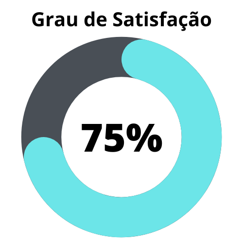
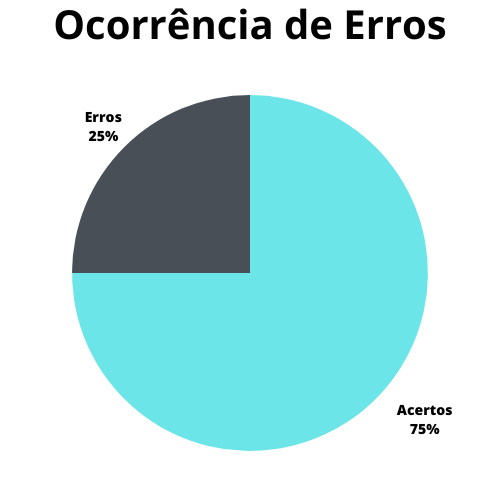

# Planejamento do Relato da Análise de Tarefas

## 1. Introdução
O presente artefato tem o intuito relatar os resultados da verificação dos artefatos produzidos durante a realizaçãodos pontos de controle anteriores. Neste artefato, avaliaremos o [Planejamento do Relato dos resultados da Análise de Tarefas](../design_avaliacao/nivel1/analise_tarefas/planejamento_relato_resultados.md)

A verificação teve como objeto a versão 1.1 do documento e foi realizada no dia 21 de maio de 2023.

## 2. Metodologia
A verificação foi feita com base nos checklists pré-definidos em nosso [Planejamento da Verificação](./teste/planejamentoVerificacao.md) e também na verificação realizada pelo [Grupo 5](https://interacao-humano-computador.github.io/2023.1-Alistamento/) [6]. Abaixo seguem as verificações de conteúdo que foram elaboradas, contendo justificativas para cada uma e também a fonte:

### 2.1 Verificação 1 - O planejamento do relatório é coerente com o planejamento da avaliação?

É importante que o artefato deixe claro os métodos utilizados para a obtenção e desenvolvimento do conteúdo apresentado, buscando inteirar o leitor acerca do que é tratado pelo mesmo.

` BARBOSA, Simone; DINIZ, Bruno. Interação Humano-Computador. Editora Elsevier, Rio de Janeiro, 2010. `

### 2.2 Verificação 2 - O grupo planeja disponibilizar algum tipo de registro da avaliação?

É importante que o artefato deixe explícito todos os registros a serem feitos e disponibilizá-los no projeto.

` BARBOSA, Simone; DINIZ, Bruno. Interação Humano-Computador. Editora Elsevier, Rio de Janeiro, 2010. `

### 2.3 Verificação 3 - O grupo planeja disponibilizar algum tipo de registro do teste piloto?

É importante que o artefato possua uma abordagem ao demonstrar os testes a serem feitos dentro do projeto.

` BARBOSA, Simone; DINIZ, Bruno. Interação Humano-Computador. Editora Elsevier, Rio de Janeiro, 2010. `

### 2.4 Verificação 4 - O grupo planeja relatar se os objetivos da avaliação foram alcançados?

É importante deixar claro o método escolhido a ser avaliado para que os resultados a serem encontrados sejam coerentes com a premissa do projeto.

` BARBOSA, Simone; DINIZ, Bruno. Interação Humano-Computador. Editora Elsevier, Rio de Janeiro, 2010. `

### 2.5 Verificação 5 - O grupo planeja relatar como a metodologia foi implementada na avaliação?

É importante deixar claro todo a metodologia que será usada dentro da premissa do projeto.

` BARBOSA, Simone; DINIZ, Bruno. Interação Humano-Computador. Editora Elsevier, Rio de Janeiro, 2010. `

### 2.6 Verificação 6 - O grupo planeja relatar as respostas das perguntas a serem respondidas com a avaliação?

É importante relatar dos dados obtidos a partir das perguntas realizadas dentro da avaliação.

` BARBOSA, Simone; DINIZ, Bruno. Interação Humano-Computador. Editora Elsevier, Rio de Janeiro, 2010. `

### 2.7 Verificação 7 - O grupo planeja disponibilizar os dados que foram coletados?

É importante deixar claro os dados coletados a partir das perguntas realizadas dentro da avaliação para aumentar a coerência das informações fornecidas no projeto.

` BARBOSA, Simone; DINIZ, Bruno. Interação Humano-Computador. Editora Elsevier, Rio de Janeiro, 2010. `

### 2.8 Verificação 8 - O grupo planeja relatar os problemas enfrentados durante a avaliação e suas possíveis soluções?

É importante deixar explícito os problemas que foram evidenciados a partir da avaliação realizada.

` BARBOSA, Simone; DINIZ, Bruno. Interação Humano-Computador. Editora Elsevier, Rio de Janeiro, 2010. `

## 3. Desenvolvimento

As tabelas 1 e 2 apresentam os resultados da 
verificação do artefato anteriores. Neste artefato, avaliaremos o [Planejamento do Relato dos resultados da Análise de Tarefas](../design_avaliacao/nivel1/analise_tarefas/planejamento_relato_resultados.md)

### 3.1 Padronização

| ID | Verificação | Realizado |
|:-:|--|--|
| 1 | Possui ortografia correta e formal? | Sim |
| 2 | Possui introdução? | Sim |
| 3 | Possui links necessários? | Sim |
| 4 | As tabelas e imagens possuem legenda padronizada e chamada no texto? | Sim |
| 5 | As tabelas e imagens estão totalmente em português? | Sim |
| 6 | Possui bibliografia? | Sim |
| 7 | A bibliografia está em ordem alfabética? | Sim |
| 8 | Possui histórico de versão padronizado? | Sim |
| 9 | O histórico de versão possui autor(es) e revisor(es)? | Sim |

Tabela 2: Modelo de checklist para padronização 
(Fonte: Autor, 2023).

### 3.2 Conteúdo

| ID | Verificação | Ocorrências | Acertos | Erros |
| :-: | ------- | -------- | -------- | ------ |
| 1 | O planejamento do relatório é coerente com o planejamento da avaliação? | 1 | 1 | 0 |
| 2 | O grupo planeja disponibilizar algum tipo de registro da avaliação?	 | 1 | 1 | 0|
| 3 | O grupo planeja disponibilizar algum tipo de registro do teste piloto? | 1 | 0 | 1 |
| 4 | O grupo planeja relatar se os objetivos da avaliação foram alcançados? | 1 | 1 | 0 |
| 5 | O grupo planeja relatar como a metodologia foi implementada na avaliação? | 1 | 1 | 0 |
| 6 | O grupo planeja relatar as respostas das perguntas a serem respondidas com a avaliação? | 1 | 0 | 1 |
| 7 | O grupo planeja disponibilizar os dados que foram coletados? | 1 | 1 | 0 |
| 8 | O grupo planeja relatar os problemas enfrentados durante a avaliação e suas possíveis soluções? | 1 | 1 | 0 |

Tabela 3: Modelo de checklist para conteúdo (Fonte: 
Autor, 2023).

## 4. Resultados
Os resultados da verificação do Planejamento do Relato de Resultados de tarefas podem ser encontrados na tabela 3 abaixo, por maio das figuras 1 e 2, onde foi verificado o grau de satisfação e a ocorrência de erros no artefato verificado. Os resultados em questão só levam em consideração as verificações do conteúdo.

|       |                          |
| ------------------------------------------------------------------------------ | -------------------------------------------------------------------------- |
|Figura 1: Representação do grau de satisfação do artefato (Fonte: Autor,2023). | Figura 2: Gráfico de ocorrência de erros no artefato (Fonte: Autor, 2023). |

Tabela 3: Representações gráficas dos resultados da verificação (Fonte: Autor, 2023).

## 5. Problemas encontrados
### 5.1 Problemas Encontrados - Padronização

#### 5.1.1 Verificação 1 - Possui ortografia correta e formal?

O artefato possui alguns erros de ortografia, como palavras com acentuação incorreta e frases incompletas.

### 5.2 Problemas Encontrados - Conteúdo

#### 5.2.3 Verificação 3 - O grupo planeja disponibilizar algum tipo de registro do teste piloto?

Não foi mencionado a disponibilização do teste piloto.

#### 5.2.6 Verificação 6 - O grupo planeja relatar as respostas das perguntas a serem respondidas com a avaliação?

Não foi mencionado como as respostas das perguntas a serem respondidas serão relatadas.

## 6. Acompanhamento
### 6.1 Acompanhemento - Padronização

#### 6.1.1 Acompanhamento 1 - Possui ortografia correta e formal?

Foi realizado as correções necessárias dentro do artefato do planejamento do relato do resultado da análise de tarefas.

### 6.2 Acompanhamento - Conteúdo

#### 6.2.3 Acompanhamento 3 - O grupo planeja disponibilizar algum tipo de registro do teste piloto?

Não foi mencionado o a disponibilização do teste piloto.

#### 6.2.6 Acompanhamento 6 - O grupo planeja relatar as respostas das perguntas a serem respondidas com a avaliação?

Foi corrigido o problema listado.

## 7. Referências Bibliográficas

> [1] Agiel, acesso em: 1 de junho de 2023. Para mais informações acesse: <https://www.agiel.com.br/site/>

> [2] Gerência e Qualidade de Software - Aula 06 - Técnica de revisão – UNIVESP

> [3] REINEHR, Sheila. Engenharia de Requisitos. Porto Alegre: Sagah, 2020.

> [4] Repositório Agiel do semestre 2023.1, acesso em: 1 de junho de 2023. Para mais informações acesse: <https://interacao-humano-computador.github.io/2023.1-Agiel/>

> [5] Repositório Lichess do semestre 2022.2, acesso em: 1 de junho de 2023. Para mais informações acesse: <https://github.com/Requisitos-de-Software/2022.2-Lichess>

> [6] Repositório Alistamento do semestre de 2023.1, acesso em 15 de junho de 2023. Para mais informações acesse: <https://interacao-humano-computador.github.io/2023.1-Alistamento/>

> [7] SALES, André Barros. Plano de ensino da disciplina. Disponível em: [https://aprender3.unb.br/pluginfile.php/2523360/mod_resource/content/33/Plano_de_Ensino%20FIHC%20202301%20Turma%202.pdf](https://aprender3.unb.br/pluginfile.php/2523360/mod_resource/content/33/Plano_de_Ensino%20FIHC%20202301%20Turma%202.pdf). Acesso em: 1 de junho de 2023;

## 8. Histórico de versão

| Versão | Data     | Descrição                                        | Autor(es)   | Revisor(es)   |
| ------ | -------- | ------------------------------------------------ | ----------- | ------------- |
| `1.0`  | 16/06/23 | Criação do documento | Amanda Noda | Carlos Eduardo |

