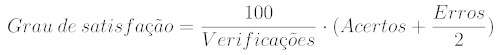
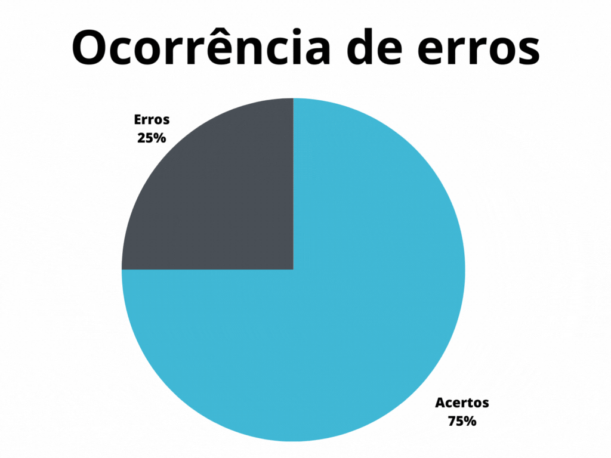

# Planejamento da verificação

## 1. Introdução

A fase de análise de requisitos é de extrema importância para que um produto de software possua uma boa qualidade, no caso dos requisitos uma boa análise impede que erros cometidos durante a manipulação dos requisistos se alastrem para o desenvolvimento, criando grandes obstáculos nas etapas mais adiante no processo, o que pode gerar retrabalhos custosos. Na engenharia de requisitos, a análise pode ser dividida em duas áreas, verificação e validação. Enquanto a verificação atua para analisar se os documentos de requisitos estão em conformidade com os padrões do projeto, a validação busca analisar se todas as necessidades do cliente foram especificadas na forma de requisitos[3].

Este artefato detalha o planejamento da verificação para este projeto, apresentando a metodologia, estruturas e padrões que serão utilizados para verificar a estrutura do projeto realizado até então. Este documento possui como inspiração o artefato de planejamento da verificação do repositório [Lichess do semestre 2022.2](https://github.com/Requisitos-de-Software/2022.2-Lichess)[5] da disciplina de Requisitos de software.

## 2. Metodologia

Para a verificação do projeto, será utilizado o método de inspeção. Que consiste na utilização de _checklists_ para verificar os padrões especificados, assim como a presença correta de elementos e conceitos nos artefatos analisados. Para a elaboração do _checklist_, foi utilizada a proposta de Fagan[2], onde o _checklist_ deve ponderar os erros mais comuns identificados em projetos semelhantes. Por fim, para que a verificação do projeto fosse realizada de forma correta, foi executado um teste piloto onde foi verificada a estrutura e conteúdo do projeto realizado pelo [grupo 7 da disciplina](https://www.agiel.com.br/site/)[4], o qual é responsável pela análise do site da [Agiel](https://interacao-humano-computador.github.io/2023.1-Agiel/)[1].

Através dos dados coletados pelo método do _checklist_, pode-se calcular numericamente o grau de satisfação com os padrões propostos, sendo este cálculo descrito pela fórmula presente na figura 1, a representação gráfica do grau de satisfação será realizada atráves de um anel de progresso, como o apresentado na figura 2. Além do grau de satisfação, pode-se calcular a porcentagem de ocorrência de erros, que deve ser representado em cada verificação por um gráfico de pizza, assim como o representado pela figura 3.

<center>



Figura 1: Equação para o cálculo do grau de satisfação (Fonte: Autor, 2023).

|                |                  |
| ----------------------------------------------------------------------------------------------------- | ------------------------------------------------------------------------------------------------ |
| Figura 2: Modelo de representação do grau de satisfação (Fonte: Autor, 2023). | Figura 3: Modelo de gráfico de ocorrência de erros (Fonte: Autor, 2023). |

Tabela 1: Modelos para representação gráfica (Fonte: Autor, 2023).

</center>

## 3. _Checklist_

Para a verificação de cada artefato, serão utilizados dois _checklists_ distintos, onde um será responsável pelos parâmetros de padronização para cada artefato, sendo este idêntico para cada documento, as informações coletadas por esse checklists não entram no cálculo para o grau de satisfação. O segundo _checklist_ será exclusivo para cada artefato, e analisará o documento de acordo com as necessidades previstas no plano de ensino da disciplina[6]. A tabela 2 abaixo, demonstra a estrutura do _checklist_ de padronização que será utilizado. A tabela 3 detalha os elementos que a _checklist_ de conteúdo deve conter.

Após a realização do teste piloto, foram identificados problemas na estrutura das _checklists_ desenvolvidas anteriormente, portanto, a estrutura inicial dos _checklists_ foi alterada para melhor se adequar às verificações. A primeira versão dos _checklists_ se encontram no artefato de [planejamento do teste piloto](./teste/planejamentoVerificacao.md).

<center>

| ID | Verificação | Realizado |
|:-:|--|--|
| 1 | Possui ortografia correta e formal? | - |
| 2 | Possui introdução? | - |
| 3 | Possui links necessários? | - |
| 4 | As tabelas e imagens possuem legenda padronizada e chamada no texto? | - |
| 5 | As tabelas e imagens estão totalmente em português? | - |
| 6 | Possui bibliografia? | - |
| 7 | A bibliografia está em ordem alfabética? | - |
| 8 | Possui histórico de versão padronizado? | - |
| 9 | O histórico de versão possui autor(es) e revisor(es)? | - |

Tabela 2: Modelo de checklist para padronização (Fonte: Autor, 2023).

</center>

<center>

| ID | Verificação | Ocorrências | Acertos | Erros |
| :-: | ------- | -------- | -------- | ------ |
| USX | Descrição | Qtd. de verificações | Qtd. de acertos | Qtd. de erros |

Tabela 3: Modelo de checklist para conteúdo (Fonte: Autor, 2023).

</center>

## 4. Estrutura dos documentos
Os documentos referentes à verificação dos artefatos deve seguir uma estrutura pré-definida, tal estrutura pode ser encontrada abaixo:

### 4.1 Introdução
Nesta seção deve ser feita uma pequena introdução acerca do artefato verificado, além de conter informações sobre a versão do artefato e data da verificação.

### 4.2 Metodologia
Nesta seção devem ser detalhadas todas as verificações de conteúdo elaboradas, contendo uma breve descrição e critérios para a escolha da mesma, além de sua fonte.

### 4.3 Desenvolvimento
Nesta seção devem ser apresentadas as duas _checklists_ de verificação do artefato preenchidas com os dados obtidos da verificação.

### 4.4 Resultados
Nesta seção devem ser apresentadas as representações gráficas do grau de satisfação e ocorrência de erros calculados a partir dos dados obtidos da verificação.

### 4.5 Problemas encontrados
Nesta seção devem ser apresentados os erros e problemas encontrados na verificação de forma detalhada. Além de propostas de correções para os problemas apresentados.

### 4.6 Acompanhamento
Nesta seção devem ser apresentadas as correções necessárias, além de informar quais problemas foram corrigidos.

## 5. Padrões do projeto

Para verificar se o projeto segue um padrão consiso em todos os seus artefatos, segue abaixo o padrão adotado para legenda, bibliografia e histórico de versão.
´
### 5.1 Legenda

Todas as tabelas e imagens presentes no projeto, além de serem chamadas de forma coesa pelo texto, devem possuir a legnda padronizada. Tal padrão pode ser encontrado abaixo.

Para tabelas:

```html
<center>
Tabela X: Descrição da tabela (Fonte: Autor, XXXX).
</center>
```

Para imagens:

```html
<center>
Figura X: Descrição da figura (Fonte: Autor, XXXX).
</center>
```

### 5.2 Bibliografia

A bibliografia de cada artefato deve estar em ordem alfabética e identificada com numeração crescente. Abaixo se encontra um exemplo de bibliografia

> [1] Referência A

> [2] Referência B

> [3] Referência C

### 5.3 Histórico de versão

Abaixo se encontra o padrão de histórico de versão adotado no projeto.

<center>

| Versão | Data     | Descrição | Autor(es) | Revisor(es) |
| ------ | -------- | --------- | --------- | ----------- |
| `1.0`  | XX/XX/XX | Descrição | Autor(es) | Revisor(es) |

Tabela 4: Padrão para histórico de versão (Fonte: Autor, 2023).

</center>

## 6. Teste piloto

Para que a verificação fosse feita de forma correta, primeiramente foi executado um teste piloto, onde foram analisados os artefatos criados pelo [grupo 7](https://interacao-humano-computador.github.io/2023.1-Agiel/)[4], na tabela 4 apresentada abaixo se encontram os artefatos que foram analisados, assim como o responsável por cada verificação.

<center>

| Artefato                                                         | Revisor      |
|------------------------------------------------------------------|--------------|
| Planejamento(Escolha do site, cronograma, reuniões, ferramentas) | Felipe M.    |
| Aspectos gerais(Atas de reuniões, apresentações)                 | Pedro Muniz  |
| Processo de design                                               | Felipe M.    |
| Perfil de usuário                                                | Pedro Muniz  |
| Personas                                                         | Pedro Muniz  |
| Aspectos éticos                                                  | Pedro Muniz  |
| Análise de tarefas                                               | Felipe M.    |
| Metas de usabilidade                                             | Pedro H.     |
| Caract. da Plataforma                                            | Amanda N     |
| Princípios gerais de projeto                                     | Amanda N     |
| Guia de estilo                                                   | João Morbeck |
| Planejamento da avaliação - Análise de tarefas                   | Amanda N     |
| Planejamento do relato - Análise de tarefas                      | Felipe M.    |
| Relato - Análise de tarefas                                      | Amanda N     |
| Planejamento da avaliação - Storyboard                           | João Morbeck |
| Planejamento do relato - Storyboard                              | João Morbeck |
| Relato - Storyboard                                              | Pedro H.     |
| Planejamento da avaliação - Protótipo de papel                   | Pedro H.     |
| Planejamento do relato - Protótipo de papel                      | Pedro H.     |

Tabela 5: Artefatos a verificados no teste piloto (Fonte: Autor, 2023).

</center>

## 7. Verificação
Na tabela 6 se encontram os responsáveis pela verificação dos artefatos desenvolvidos pela equipe.

<center>

| Artefato                                                         | Responsável |
|------------------------------------------------------------------|-------------|
| Planejamento(Escolha do site, cronograma, reuniões, ferramentas) | Carlos E.   |
| Aspectos gerais(Atas de reuniões, apresentações)                 | João M.     |
| Processo de design                                               | Pedro H.    |
| Perfil de usuário                                                | Felipe M.   |
| Personas                                                         | Pedro H.    |
| Aspectos éticos                                                  | Pedro M.    |
| Análise de tarefas                                               | Amanda      |
| Metas de usabilidade                                             | Pedro H.    |
| Caract. da Plataforma                                            | Felipe M.   |
| Princípios gerais de projeto                                     | Carlos E.   |
| Guia de estilo                                                   | Amanda      |
| Planejamento da avaliação - Análise de tarefas                   | Carlos E.   |
| Planejamento do relato - Análise de tarefas                      | Amanda      |
| Relato - Análise de tarefas                                      | Carlos E.   |
| Planejamento da avaliação - Storyboard                           | Carlos E.   |
| Planejamento do relato - Storyboard                              | Felipe M.   |
| Relato - Storyboard                                              | Felipe M,   |
| Planejamento da avaliação - Protótipo de papel                   | Pedro H.    |
| Planejamento do relato - Protótipo de papel                      | Felipe M.   |
| Relato - Protótipo de papel                                      | Amanda      |
| Planejamento da avaliação - Protótipo de alta fidelidade         | Pedro H.    |
| Planejamento do relato - Protótipo de alta fidelidade            | Amanda      |

Tabela 6: Artefatos a verificados no teste piloto (Fonte: Autor, 2023).

</center>

## 8. Referências Bibliográficas

> [1] Agiel, acesso em: 1 de junho de 2023. Para mais informações acesse: <https://www.agiel.com.br/site/>

> [2] Gerência e Qualidade de Software - Aula 06 - Técnica de revisão – UNIVESP

> [3] REINEHR, Sheila. Engenharia de Requisitos. Porto Alegre: Sagah, 2020.

> [4] Repositório Agiel do semestre 2023.1, acesso em: 1 de junho de 2023. Para mais informações acesse: <https://interacao-humano-computador.github.io/2023.1-Agiel/>

> [5] Repositório Lichess do semestre 2022.2, acesso em: 1 de junho de 2023. Para mais informações acesse: <https://github.com/Requisitos-de-Software/2022.2-Lichess>

> [6] SALES, André Barros. Plano de ensino da disciplina. Disponível em: [https://aprender3.unb.br/pluginfile.php/2523360/mod_resource/content/33/Plano_de_Ensino%20FIHC%20202301%20Turma%202.pdf](https://aprender3.unb.br/pluginfile.php/2523360/mod_resource/content/33/Plano_de_Ensino%20FIHC%20202301%20Turma%202.pdf). Acesso em: 1 de junho de 2023;


## 9. Histórico de versão

| Versão | Data     | Descrição                                        | Autor(es)   | Revisor(es)   |
| ------ | -------- | ------------------------------------------------ | ----------- | ------------- |
| `1.0`  | 15/06/23 | Criação da página de planejamento da verificação | Pedro Muniz | Carlos eduardo |
