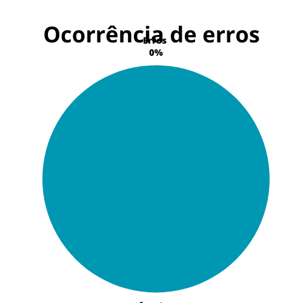

# Protótipo de alta fidelidade

## 1. Introdução

O intuito de um protótipo de alta fidelidade é representar ideias de uma interface através de imagens e interação com os elementos gráficos, um protótipo é uma representação de interface mais próxima do que será o produto final, com ela é possível entender qual é a aparência do software e como o usuário irá interagir com ele, seu conceito é muito próximo ao protótipo de papel, a principal diferença é que o protótipo de alta fidelidade é feito utilizando um software próprio para isso. Para avaliar um protótipo de alta fidelidade, usaremos conceitos de protótipo de papel e sobre os principais aspectos avaliados ao se utilizar um método de avaliação de IHC.

## 2. Metodologia

A presente verificação acompanha os métodos definidos no [planejamento da verificação](./planejamento.md), com a utilização de checklists elaborados a partir da bibliografia disponível sobre o assunto e com o uso de um cálculo numérico para a aferição do grau de satisfação do artefato.

O checklist conterá as verificações descritas abaixo.

### 2.1 Verificação 1 - O protótipo de alta fidelidade segue o padrão visual definido no guia de estilo?

Para a interface ser de fácil uso, ela precisa seguir um padrão e este padrão é definido em um guia de estilo.

`BARBOSA, Simone et al. Interação Humano-Computador e Experiência do Usuário. Rio de Janeiro: Autopublicação, 2021. Cap. 11.2.`

### 2.2 Verificação 2 - O protótipo de alta fidelidade segue um padrão visual por toda a interface?

É necessário que o protótipo de papel esteja em conformidade com um padrão, este padrão deve ser cumprido em toda a interface, desde telas principais e de interação à telas de auxílio.

`BARBOSA, Simone et al. Interação Humano-Computador e Experiência do Usuário. Rio de Janeiro: Autopublicação, 2021. Cap. 11.2.`

### 2.3 Verificação 3 - O protótipo de alta fidelidade possui problemas de interação na interface?

Para uma boa interface, é necessário que não haja problemas de interação, que são aspectos da interface que impedem o usuário de realizar uma tarefa ou piore a experiência do usuário no sistema.

`BARBOSA, Simone et al. Interação Humano-Computador e Experiência do Usuário. Rio de Janeiro: Autopublicação, 2021. Cap. 11.2.`

### 2.4 Verificação 4 - O protótipo de alta fidelidade apresenta tarefas definidas para os usuários executarem?

É necessário ter definido quais são as tarefas que os usuários deverão realizar no protótipo, ou seja, apresentar as interfaces necessárias para que o usuário possa completar a tarefa que lhe foi designado.

`BARBOSA, Simone et al. Interação Humano-Computador e Experiência do Usuário. Rio de Janeiro: Autopublicação, 2021. Cap. 12.2.3.`

### 2.5 Verificação 5 - O protótipo de alta fidelidade apresenta um fluxo definido para as tarefas que o usuário deve realizar?

Deve existir um fluxo definido para as tarefas de forma que o usuário possa utiliza-lo para realizar a tarefa.

`BARBOSA, Simone et al. Interação Humano-Computador e Experiência do Usuário. Rio de Janeiro: Autopublicação, 2021. Cap. 12.2.3.`

### 2.6 Verificação 6 - O protótipo de alta fidelidade apresenta informações dispostas de forma adequada?

O protótipo de alta fidelidade deve conter em suas interfaces, informações que auxiliem o usuário a compreender a interface, satisfazer a experiência do usuário e auxiliar na realização da tarefa

`BARBOSA, Simone et al. Interação Humano-Computador e Experiência do Usuário. Rio de Janeiro: Autopublicação, 2021. Cap. 12.2.3.`

### 2.7 Verificação 7 - O protótipo de alta fidelidade apresenta as funcionalidades definidas para a realização das tarefas?

O protótipo de alta fidelidade deve apresentar todas as funcionalidades necessárias para o usuário concluir a tarefa.

`BARBOSA, Simone et al. Interação Humano-Computador e Experiência do Usuário. Rio de Janeiro: Autopublicação, 2021. Cap. 12.2.3.`

## 3. Desenvolvimento

### 3.1 Checklist de padronização

A tabela 1 apresenta o checklist de padronização para o artefato protótipo de alta fidelidade.

| ID | Verificação | Realizado |
|:-:|:-:|:-:|
| 1 | Possui ortografia correta e formal? | Sim |
| 2 | Possui introdução? | Sim |
| 3 | Possui links necessários? | Sim |
| 4 | As tabelas e imagens possuem legenda padronizada e chamada no texto? | Não |
| 5 | As tabelas e imagens estão totalmente em português? | Sim |
| 6 | Possui bibliografia? | Sim |
| 7 | A bibliografia está em ordem alfabética? | Sim |
| 8 | Possui histórico de versão padronizado? | Sim |
| 9 | O histórico de versão possui autor(es) e revisor(es)? | Sim |

Tabela 1: Checklist de padronização do planejamento do relato dos resultados da avaliação do protótipo de papel (Fonte: Autor, 2023).

### 3.2 Checklist de conteúdo

A tabela 2 contém os itens definidos na seção de metodologia para a realização de um checklist de conteúdo, bem como os números a ele associados.

| ID | Verificação | Ocorrências | Acertos | Erros |
| :-: | ------- | -------- | -------- | ------ |
| 1 | O protótipo de alta fidelidade segue o padrão visual definido no guia de estilo? | 1 | 1 | 0 |
| 2 | O protótipo de alta fidelidade segue um padrão visual por toda a interface? | 1 | 1 | 0 |
| 3 | O protótipo de alta fidelidade possui problemas de interação na interface? | 1 | 1 | 0 |
| 4 | O protótipo de alta fidelidade apresenta tarefas definidas para os usuários executarem? | 3 | 3 | 0 |
| 5 | O protótipo de alta fidelidade apresenta um fluxo definido para as tarefas que o usuário deve realizar? | 3 | 3 | 0 |
| 6 | O protótipo de alta fidelidade apresenta informações dispostas de forma adequada? | 1 | 1 | 0 |
| 7 | O protótipo de alta fidelidade apresenta as funcionalidades definidas para a realização das tarefas? | 1 | 1 | 0 |

## 4. Resultados

Seguindo aquilo que foi definido no [planejamento da verificação](./planejamentoVerificacao.md), e utilizando-se unicamente do checklist de conteúdo desenvolvido para este artefato, é possível desenvolver os gráficos mostrados nas figuras 1 e 2, que delineiam o grau de satisfação deste artefato e a porcentagem de erros do mesmo.

|            |      |
| ------------------------------------------------------------------------------- | -------------------------------------------------------------------------- |
| Figura 1: Representação do grau de satisfação do artefato (Fonte: Autor, 2023). | Figura 2: Gráfico de ocorrência de erros no artefato (Fonte: Autor, 2023). |

Como mostrado nas figuras, o grau de satisfação deste artefato é de **100%** e a porcentagem de erros está em **0%**.

## 5. Problemas encontrados

Não foi encontrado erros com relação aos checklists de conteúdo utilizado no planejamento, no checklist de padronização foi verificado alguns problemas de padronização nas legendas das imagens porém pode haver um erro não encontrado através dos checklists, para isso é ideal manter o acompanhamento na seção 6.

## 6. Acompanhamento

As legendas foram corrigidas e mais nenhum problema foi encontrado.

## 7. Referências bibliográficas

> [1] BARBOSA, Simone et al. Interação Humano-Computador e Experiência do Usuário. Rio de Janeiro: Autopublicação, 2021.

## 8. Histórico de versão

|  Versão  |   Data   |                 Descrição               |    Autor(es)   |  Revisor(es)  |
| -------- | -------- | --------------------------------------- | -------------- | ------------- |
|  `1.0`   | 02/07/23 | Primeira versão da verificação do protótipo de alta fidelidade | João M. | Amanda N.  |
|  `1.1`   | 04/07/23 | Verificação do protótipo de alta fidelidade | João M. | Amanda N.  |

