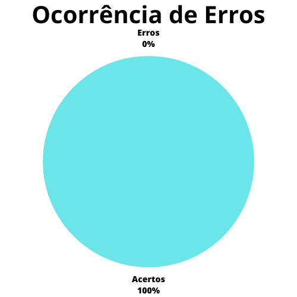

# Verificação - Planejamento do relato de resultados da avaliação do protótipo de papel

## 1. Introdução

O protótipo de papel apresenta uma metodologia (Snyder, 2003) que avalia a usabilidade de um design de IHC representado em papel. Isso é feito por meio de simulações de uso com a participação de potenciais usuários. Simular o uso em papel é um modo rápido e barato de identificar problemas de usabilidade antes mesmo de construir
uma solução de IHC executável.

O presente artefato busca marcar a verificação do artefato de planejamento do protótipo de papel, que na data da verificação (30/06/2023) tinha como versão mais atual a versão `1.0` de 30/06/2023.

## 2. Metodologia

A presente verificação acompanha os métodos definidos no [planejamento da verificação](./planejamento.md), com a utilização de checklists elaborados a partir da bibliografia disponível sobre o assunto e com o uso de um cálculo numérico para a aferição do grau de satisfação do artefato.

O checklist conterá as verificações descritas abaixo.

### 2.1 Verificação 1 - O protótipo de papel apresenta tarefas definidas para os usuários executarem?

O protótipo de papel deve ter definido as tarefas que os usuários devem realizar, ou seja, apresentar nas interfaces as tarefas que os usuários devem realizar no sistema.

`BARBOSA, Simone et al. Avaliação de IHC através de Observação: Prototipação em Papel. In: BARBOSA, Simone et al. Interação Humano-Computador e Experiência do Usuário. Rio de Janeiro: Autopublicação, 2021. Cap. 12.2.3. p. 316-319.`

### 2.2 Verificação 2 - O protótipo de papel apresenta um fluxo definido para as tarefas que o usuário deve realizar?

O protótipo de papel deve apresentar um fluxo definido para as tarefas de forma a alcançar a realização das tarefas que o usuário deseja realizar no sistema.

`BARBOSA, Simone et al. Avaliação de IHC através de Observação: Prototipação em Papel. In: BARBOSA, Simone et al. Interação Humano-Computador e Experiência do Usuário. Rio de Janeiro: Autopublicação, 2021. Cap. 12.2.3. p. 316-319.`

### 2.3 Verificação 3 - O protótipo de papel apresenta informações dispostas de forma adequada?

O protótipo de papel deve apresenta informações e elementos na interface para satisfazer a experiência do usuário e a realização das suas tarefas.

`BARBOSA, Simone et al. Avaliação de IHC através de Observação: Prototipação em Papel. In: BARBOSA, Simone et al. Interação Humano-Computador e Experiência do Usuário. Rio de Janeiro: Autopublicação, 2021. Cap. 12.2.3. p. 316-319.`

### 2.4 Verificação 4 - O protótipo de papel apresenta as funcionalidades definidas para a realização das tarefas?

O protótipo de papel deve apresentar funcionalidades do sistema que vão ser utilizadas para a realização das tarefas do usuário.

`BARBOSA, Simone et al. Avaliação de IHC através de Observação: Prototipação em Papel. In: BARBOSA, Simone et al. Interação Humano-Computador e Experiência do Usuário. Rio de Janeiro: Autopublicação, 2021. Cap. 12.2.3. p. 316-319.`

## 3. Desenvolvimento

### 3.1 Checklist de padronização

A tabela 1 apresenta o checklist de padronização para o artefato de Planejamento do relato de resultados da avaliação do storyboard.

| ID | Verificação | Realizado | 
|:-:|:-:|:-:|
| 1 | Possui ortografia correta e formal? | Não | 
| 3 | Possui links necessários? | Não há necessidade |
| 4 | As tabelas e imagens possuem legenda padronizada e chamada no texto? | Não | 
| 5 | As tabelas e imagens estão totalmente em português? | Sim |
| 6 | Possui bibliografia? 	| Sim |
| 7 | A bibliografia está em ordem alfabética? | Sim |
| 8 | Possui histórico de versão padronizado? |	Sim |
| 9 | O histórico de versão possui autor(es) e revisor(es)? | Sim |

Tabela 1: Checklist de padronização do planejamento do relato dos resultados da avaliação do protótipo de papel (Fonte: Autor, 2023).

### 3.2 Checklist de conteúdo

A tabela 2 contém os itens definidos na seção de metodologia para a realização de um checklist de conteúdo, bem como os números a ele associados.

| ID | Verificação | Ocorrências | Acertos | Erros |
|:-:|:-:|:-:|:-:|:-:|
| 10 | O protótipo de papel apresenta tarefas definidas para os usuários executarem? | 3 | 3 | 0 | 
| 11 | O protótipo de papel apresenta um fluxo definido para as tarefas que o usuário deve realizar?  | 3 | 3 | 0 |
| 12 | O protótipo de papel apresenta informações dispostas de forma adequada? | 3 | 3 | 0 |
| 13 | O protótipo de papel apresenta as funcionalidades definidas para a realização das tarefas? | 3 | 3 | 0 |

Tabela 2: Checklist de conteúdo do planejamento do relato dos resultados da avaliação do protótipo de papel (Fonte: Autor, 2023).

## 4. Resultados

Seguindo aquilo que foi definido no [planejamento da verificação](./planejamentoVerificacao.md), e utilizando-se unicamente do checklist de conteúdo desenvolvido para este artefato, é possível desenvolver os gráficos mostrados nas figuras 1 e 2, que delineiam o grau de satisfação deste artefato e a porcentagem de erros do mesmo.

|                                              |                                        |
| ------------------------------------------------------------------------------- | -------------------------------------------------------------------------- |
| Figura 1: Representação do grau de satisfação do artefato (Fonte: Autor, 2023). | Figura 2: Gráfico de ocorrência de erros no artefato (Fonte: Autor, 2023). |

Como mostrado nas figuras, o grau de satisfação deste artefato é de **87.5%** e a porcentagem de erros está em **25%**.

## 5. Problemas encontrados

### 5.1 Problemas encontrados - Padronização
#### 5.1.1 Verificação 1 - Possui ortografia correta e formal?

O artefato apresenta erros de ortografia e coesão textual no texto da introdução.

#### 5.1.2 Verificação 4 - As tabelas e imagens possuem legenda padronizada e chamada no texto?

O artefato apresenta na figura 18 a descrição do passo sendo referenciado como passo 2 ao invés de passo 7. Fora isso, no tópico 3.3 que indica a emissão de CRLV, as legendas das figuras apresentam o nome como "Solicitação de CRLV" ao invés de "Emissão de CRLV". Por fim, as chamadas no texto não são coerentes o suficiente para entendimento do fluxo das tarefas apresentadas pelo protótipo de papel.

### 5.2 Problemas encontrados - Conteúdo
Em questão de conteúdo, os protótipos de papel estão de acordo e o que se espera ver em um protótipo de papel para o desenvolvimento das atividades de IHC.

## 6. Acompanhamento

Os problemas relatados na seção "5. Problemas Encontrados" foram corrigidos e em questão de conteúdo, não há necessidade de ajuste no grau de satisfação e nem na ocorrencia de erros do artefato. Ou seja, só foi necessário correções de padronização. Além disso, o artefato verificado no momento (04/07/23) está na versão 2.0.

## 7. Referências bibliográficas

> [1] BARBOSA, Simone et al. Avaliação de IHC através de Observação: Prototipação em Papel. In: BARBOSA, Simone et al. Interação Humano-Computador e Experiência do Usuário. Rio de Janeiro: Autopublicação, 2021. Cap. 12.2.3. p. 316-319.

> [2] Artefato de planejamento da verificação, acesso em 04 de julho de 2023. Para mais informações acesse: [link](../verificacao/planejamentoVerificacao.md)

## 8. Histórico de versão

|  Versão  |   Data   |                 Descrição               |    Autor(es)   |  Revisor(es)  |
| -------- | -------- | --------------------------------------- | -------------- | ------------- |
|  `1.0`   | 30/06/23 | Primeira versão da verificação do protótipo de papel | Pedro H. | Felipe M.  |
