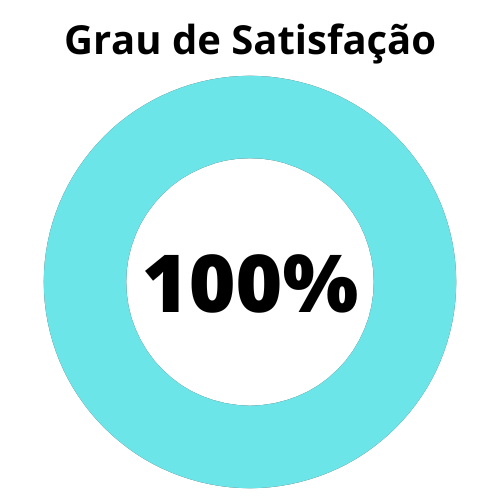
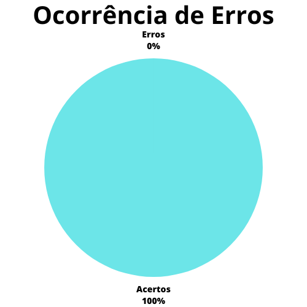

# Verificação - Relato dos resultados da avaliação do Storyboard

## 1. Introdução

O relato dos resultados da avaliação do Storyboard complia os resultados extraídos a partir da avaliação dos storyboards, bem como elementos relacionados a essa avaliação definidos em planejamento anterior.

O presente artefato busca marcar a verificação do artefato de relato dos resultados da avaliação do storyboard, que na data da verificação (18/06/2023) tinha como versão mais atual a versão `1.1` de 29/05/2023.

## 2. Metodologia

A presente verificação acompanha os métodos definidos no [planejamento da verificação](./planejamento.md), com a utilização de checklists elaborados a partir da bibliografia disponível sobre o assunto e com o uso de um cálculo numérico para a aferição do grau de satisfação do artefato.

O checklist conterá as verificações descritas abaixo.

### 2.1 Verificação 1 - O artefato é estruturado como demarcado pelo artefato de planejamento? 

A estrutura do artefato de relato de resultados deve ser tal qual a estrutura definida em seu projeto, a fim de manter a integridade do mesmo. 

`Barbosa, S. D. J.; Silva, B. S. da; Silveira, M. S.; Gasparini, I.; Darin, T.; Barbosa, G. D. J. (2021) Interação Humano-Computador e Experiência do usuário. Autopublicação. Página 279.`

### 2.2 Verificação 2 - O artefato marca o objetivo da avaliação no relato?

O objetivo da avaliação é principal a um relato de resultados, demarcando o alvo e as expectativas que deveriam ser atendidas com as avaliações ocorridas.

`Barbosa, S. D. J.; Silva, B. S. da; Silveira, M. S.; Gasparini, I.; Darin, T.; Barbosa, G. D. J. (2021) Interação Humano-Computador e Experiência do usuário. Autopublicação. Página 279.`

### 2.3 Verificação 3 - O artefato marca o método de avaliação no relato? 

O método de avaliação deve ser definido no relato de resultados para registro definido e verificável de técnicas e elementos da avaliação.

`Barbosa, S. D. J.; Silva, B. S. da; Silveira, M. S.; Gasparini, I.; Darin, T.; Barbosa, G. D. J. (2021) Interação Humano-Computador e Experiência do usuário. Autopublicação. Página 279.`

### 2.4 Verificação 4 - O artefato marca o cronograma real da avaliação no relato, com o número de participantes e avaliadores?

O relato dos resultados deve registrar os horários reais, a plataforma de realização, os participantes da avaliação e avaliadores a fim de temporalizar e espacializar as avaliações ocorridas.

`Barbosa, S. D. J.; Silva, B. S. da; Silveira, M. S.; Gasparini, I.; Darin, T.; Barbosa, G. D. J. (2021) Interação Humano-Computador e Experiência do usuário. Autopublicação. Página 279.`

### 2.6 Verificação 6 - O artefato contém uma seção para os registros gravados das avaliações?

Os registros da avaliação devem ser presentes no relato dos resultados para consulta futura e verificação da mesma.

`Barbosa, S. D. J.; Silva, B. S. da; Silveira, M. S.; Gasparini, I.; Darin, T.; Barbosa, G. D. J. (2021) Interação Humano-Computador e Experiência do usuário. Autopublicação. Página 279.`

### 2.7 Verificação 7 - O artefato possui uma seção para a interpretação e análise dos dados encontrados de maneira organizada?

O artefato deve conter uma seção de interpretação de dados que mostre os resultados de acordo com o planejado no artefato de [planejamento da avaliação]() e permitindo conjecturas sobre esses dados a fim de verificar se os objetivos foram atingidos.

`Barbosa, S. D. J.; Silva, B. S. da; Silveira, M. S.; Gasparini, I.; Darin, T.; Barbosa, G. D. J. (2021) Interação Humano-Computador e Experiência do usuário. Autopublicação. Página 271.`

### 2.8 Verificação 8 - O artefato contém uma seção para a listagem de problemas encontrados de maneira organizada? 

Os problemas encontrados com a avaliação devem ter uma seção própria, com a definição de métodos para seu registro, seja por tabelas, listas ou outros.

`Barbosa, S. D. J.; Silva, B. S. da; Silveira, M. S.; Gasparini, I.; Darin, T.; Barbosa, G. D. J. (2021) Interação Humano-Computador e Experiência do usuário. Autopublicação. Página 279.`

## 3. Desenvolvimento

### 3.1 Checklist de padronização

A tabela 1 apresenta o checklist de padronização para o artefato de Perfil de usuário.

| ID | Verificação | Realizado |
|:-:|:-:|:-:|
| 1 | Possui ortografia correta e formal? | Não | 
| 2 | Possui introdução? | Sim |
| 3 | Possui links necessários? | Sim |
| 4 | As tabelas e imagens possuem legenda padronizada e chamada no texto? | Não |
| 5 | As tabelas e imagens estão totalmente em português? | Sim |
| 6 | Possui bibliografia? 	| Sim |
| 7 | A bibliografia está em ordem alfabética? | Sim |
| 8 | Possui histórico de versão padronizado? |	Sim |
| 9 | O histórico de versão possui autor(es) e revisor(es)? | Sim |

Tabela 1: Checklist de padronização doo relato dos resultados da avaliação do storyboard (Fonte: Autor, 2023).

### 3.2 Checklist de conteúdo

| ID | Verificação | Ocorrências | Acertos | Erros |
|:-:|:-:|:-:|:-:|:-:|
| 10 | O artefato é estruturado como demarcado pelo artefato de planejamento?  | 1 | 0 | 1 |
| 11 | O artefato marca o objetivo da avaliação no relato? | 1 | 1 | 0 |
| 12 | O artefato marca o método de avaliação no relato?   | 1 | 1 | 0 |
| 13 | O artefato marca o cronograma real da avaliação no relato, com o número de participantes e avaliadores? | 1 | 1 | 0 |
| 14 | O artefato contém uma seção para os registros gravados das avaliações? | 1 | 1 | 0 |
| 15 | O artefato possui uma seção para a interpretação e análise dos dados encontrados de maneira organizada? | 1 | 0 | 1 |
| 16 | O artefato contém uma seção para a listagem de problemas encontrados de maneira organizada? | 1 | 1 | 0 |

Tabela 2: Checklist de conteúdo do relato dos resultados da avaliaçãodo storyboard (Fonte: Autor, 2023).

## 4. Resultados

Seguindo aquilo que foi definido no [planejamento da verificação](./planejamentoVerificacao.md), e utilizando-se unicamente do checklist de conteúdo desenvolvido para este artefato, é possível desenvolver os gráficos mostrados nas figuras 1 e 2, que delineiam o grau de satisfação deste artefato e a porcentagem de erros do mesmo.

Figura 1: Grau de satisfação do artefato do relato dos resultados da avaliação do storyboard (Fonte: Autor, 2023).

Figura 2: Porcentagem de erros do artefato do relato dos resultados da avaliação do storyboard (Fonte: Autor, 2023).

Como mostrado nas figuras, o grau de satisfação deste artefato é de **85,7%** e a porcentagem de erros está em **28,6%**.

## 5. Problemas encontrados

### 5.1 Verificação 1 - Possui ortografia correta e formal?

O artefato em questão possui diversos erros de concordância e ortografia espalhados pelo artefato. Pode-se listar, por exemplo, o uso de "[...] na qual foi realizada de acordo com o planejamento dos storyboards" na seção 4, onde a concordância está equivocada, bem como um erro sismlar na seção 7.

### 5.2 Verificação 4 - As tabelas e imagens possuem legenda padronizada e chamada no texto?

Os vídeos apresentados não são chamados no texto e não possuem legendas de acordo com o padrão.

### 5.3 Verificação 10 - O artefato é estruturado como demarcado pelo artefato de planejamento? 

Há divergências quanto a estruturação do artefato de relato dos resultados em relação ao seu planejamento. Por exemplo, as informações e a gravação do teste piloto está localizada em seção própria e em parte diferente do documento.

### 5.4 Verificação 15 - O artefato possui uma seção para a interpretação e análise dos dados encontrados de maneira organizada?

Não é definida uma seção de interpretação de dados no relato dos resultados da avaliação do storyboard, o que impede uma análise mais concreta dos mesmos.

## 6. Acompanhamento

Esta seção do artefato dedica-se às correções que forem realizadas no artefato a partir da disponibilização desta verificação no GitHub Pages da disciplina. 

### 6.1 Versão 1.2

O artefato sofreu mudanças que corrigiram as pendências mostradas no checklist de conteúdo. Para tanto, ambos os gráficos atualmente estão em **100%**. As figuras 3 e 4 mostram ambos os gráficos.

Figura 3: Grau de satisfação do artefato do relato dos resultados da avaliação do storyboard versão 1.2 (Fonte: Autor, 2023).

Figura 4: Porcentagem de erros do artefato do relato dos resultados da avaliação do storyboard versão 1.2 (Fonte: Autor, 2023).

## 7. Referências bibliográficas

> [1] Barbosa, S. D. J.; Silva, B. S. da; Silveira, M. S.; Gasparini, I.; Darin, T.; Barbosa, G. D. J. (2021) Interação Humano-Computador e Experiência do usuário. Autopublicação. ISBN: 978-65-00-19677-1. Acesso em: 17 jun. 2023. 

## 8. Histórico de versão

|  Versão  |   Data   |                 Descrição               |    Autor(es)   |  Revisor(es)  |
| -------- | -------- | --------------------------------------- | -------------- | ------------- |
|  `1.0`   | 18/06/23 | Primeira versão da verificação do relato do storyboard | Felipe M. | Pedro M.  |