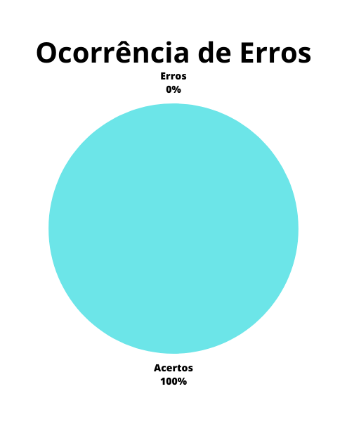

# Verificação - Relato de Resultados da Análise de Tarefas

## 1. Introdução

Este documento possui a função de verificar o artefato de [Relato de Resultados da Análise de Tarefas](../design_avaliacao/nivel1/analise_tarefas/relato_resultados_tarefas.md) do projeto do grupo 6 - DetranGO. O relato da análise de tarefas demonstra de forma clara como ocorreu a execução das tarefas planejadas previamente no projeto.

A verificação teve como objeto a versão 1.1 do artefato e "Relato de Resultados da Análise de Tarefas” e foi realizada em 16 de junho de 2023.

## 2. Metodologia

A metodologia utilizada neste documento segue o modelo proposto no planejamento[1] onde serão utilizados dois checklists, um para padronização e outro referenciando o conteúdo dos artefatos. Estes checklists consideram os artefatos verificados presentes no repositório do nosso grupo.

Abaixo seguem as verificações de conteúdo elaboradas, contendo a justificativa de cada uma além de sua fonte:

### 2.1. Verificação 1 - Existe um artefato para o relato da Análise de tarefas ?
Uma vez concluída a interpretação individual dos dados coletados, seja das previsões dos avaliadores ou das observações das experiências de uso dos participantes, os resultados individuais são consolidados e analisados em conjunto.

`BARBOSA, Simone et al. Interação Humano-Computador e Experiência do Usuário. Rio de Janeiro: Autopublicação, 2021. Cap. 9. Seção 9.7.5`

### 2.2. Verificação 2 - O artefato deixa claro como foi realizada a pesquisa ?
Na consolidação dos resultados, os avaliadores devem novamente endereçar as questões que motivaram o estudo, buscando respondê-las ou justificar por que alguma resposta não foi encontrada.

`BARBOSA, Simone et al. Interação Humano-Computador e Experiência do Usuário. Rio de Janeiro: Autopublicação, 2021. Cap. 9. Seção 9.7.5`

### 2.3. Verificação 3 - Os resultados foram separados em subcategorias para a análise ?
Para serem definidos e relatados com maior clareza e detalhes é ideal separar em subcategorias para maior entendimento dos dados coletados.

`BARBOSA, Simone et al. Interação Humano-Computador e Experiência do Usuário. Rio de Janeiro: Autopublicação, 2021. Cap. 9. Seção 9.7.5`

### 2.4. Verificação 4 - O artefato deixa seu objetivo claro ?
O avaliador deve determinar os objetivos gerais da avaliação e identificar por que e para quem tais objetivos são importantes. Pois o relato dos resultados é orientado por esses objetivos.

`BARBOSA, Simone et al. Interação Humano-Computador e Experiência do Usuário. Rio de Janeiro: Autopublicação, 2021. Cap. 9. Seção 9.7.5`

### 2.5. Verificação 5 - O artefato demonstra quais participantes foram definidos ?
O relato de resultados deve conter o número e o perfil de usuários e avaliadores que participaram da avaliação.

`BARBOSA, Simone et al. Interação Humano-Computador e Experiência do Usuário. Rio de Janeiro: Autopublicação, 2021. Cap. 9. Seção 9.7.5`

### 2.6. Verificação 6 - O artefato demonstra através de visualização gráfica e de fácil análise dos resultados obtidos ?
O relato deve incluir um sumário dos dados coletados, incluindo tabelas e gráficos para maior entendimento dos resultados obtidos.

`BARBOSA, Simone et al. Interação Humano-Computador e Experiência do Usuário. Rio de Janeiro: Autopublicação, 2021. Cap. 9. Seção 9.7.5`

### 2.7. Verificação 7 - O artefato possui uma conclusão plausível seguindo o rumo dos fatos previamente apresentados ?
O artefato deve apresentar uma conclusão que vá de acordo com o que foi desenvolvido e pensado desde o planejamento da avaliação até o contraste com os dados coletados.

`Elaboração Própria`

### 2.8. Verificação 8 - OAs questões éticas foram respeitadas ?
Quando se realiza pesquisas com pessoas as questões éticas devem ser seguidas para o bem de todos os participantes, portanto o relato deve dizer se todas as questões éticas estabelecidas foram seguidas.

`BARBOSA, Simone et al. Interação Humano-Computador e Experiência do Usuário. Rio de Janeiro: Autopublicação, 2021. Cap. 9. Seção 9.7.5`

### 2.9. Verificação 9 - As referências bibliográficas estão corretas ?
As referências bibliográficas devem estar de acordo com o que foi apresentado no conteúdo do artefato.

`Elaboração Própria`

## 3. Desenvolvimento

### 3.1 Padronização

Na tabela 1, se encontra o _[checklist]_ de padronização preenchido após a realização da verificação.

| ID | Verificação | Realizado |
|--|--|--|
| 1 | Possui ortografia correta e formal ? | Sim |
| 2 | Possui introdução ? | Sim |
| 3 | Possui links necessários ? | Não |
| 4 | As tabelas e imagens possuem legenda padronizada e chamada no texto ? | Parcialmente |
| 5 | As tabelas e imagens estão totalmente em português ? | Sim |
| 6 | Possui bibliografia ? | Não |
| 7 | A bibliografia está em ordem alfabética ? | Não |
| 8 | Possui histórico de versão padronizado ? | Sim |
| 9 | O histórico de versão possui autor(es) e revisor(es) ? | Sim |

Tabela 1: _[checklist]_ de padronização (fonte: autor, 2023)

### 3.2 Conteúdo

A tabela 2 marca as verificações de conteúdo dos artefatos. Os critérios considerados para a verificação foram obtidos a partir do plano de ensino da disciplina[3] e do livro de Interação Humano Computador de Simone Barbosa[2].

| ID | Verificação | Ocorrências | Acertos | Erros |
|--|--|--|--|--|
| 10 | Existe um artefato para o relato da Análise de tarefas ? | 1 | 1 | 0 |
| 11 | O artefato deixa claro como foi realizada a pesquisa ? | 1 | 1 | 0 |
| 12 | Os resultados foram separados em subcategorias para a análise ? | 3 | 3 | 0 |
| 13 | O artefato deixa seu objetivo claro ? | 1 | 1 | 0 |
| 14 | O artefato demonstra quais participantes foram definidos ? | 1 | 1 | 0 |
| 15 | O artefato demonstra através de visualização gráfica e de fácil análise dos resultados obtidos ? | 1 | 1 | 0 |
| 16 | O artefato possui uma conclusão plausível seguindo o rumo dos fatos previamente apresentados ? | 1 | 1 | 0 |
| 17 | As questões éticas foram respeitadas ? | 1 | 1 | 0 |
| 18 | As referências bibliográficas estão corretas ? | 1 | 0 | 1 |

Tabela 2: _[checklist]_ de conteúdos (fonte: autor, 2023)

## 4. Resultados

Os resultados da verificação dos artefatos de planejamento podem ser encontrados na tabela 3, onde podem ser verificados o grau de satisfação e a ocorrência de erros nos artefatos verificados. Estes resultados levam em conta apenas a verificação do conteúdo destes artefatos.

|  |  |
| :-: | :-: |
| Figura 1: Representação do grau de satisfação do artefato (Fonte: Autor, 2023). | Figura 2: Gráfico de ocorrência de erros no artefato (Fonte: Autor, 2023). |

Tabela 3: Representações gráficas dos resultados da verificação (Fonte: Autor, 2023).

## 5. Problemas Encontrados

### 5.1. Verificação 3 - Possui links necessários ?

- O artefato não possui links para o planejamento da avaliação e do relato de resultados.

### 5.2. Verificação 4 - As tabelas e imagens possuem legenda padronizada e chamada no texto ?

- A tablea 2 não possui chamada no texto.

### 5.3. Verificação 6 - Possui bibliografia ?

- O artefato não apresenta bibliografia

## 6. Acompanhamento

Os problemas relatados na seção "5. Problemas Encontrados" foram corrigidos e na tabela 4 temos o novo grau de satisfação, figura 3, e ocorrência de erros, figura 4, após as mudanças. Além disso o artefato verificado no momento(17/06/23) está na versão 1.2.

|  |  |
| :-: | :-: |
| Figura 3: Representação do grau de satisfação do artefato (Fonte: Autor, 2023). | Figura 4: Gráfico de ocorrência de erros no artefato (Fonte: Autor, 2023). |

Tabela 4: Representações gráficas dos resultados da verificação (Fonte: Autor, 2023).

## 7. Referências bibliográficas

> [1] Artefato de planejamento da verificação, acesso em: 15 de junho de 2023. Para mais informações acesse: [link](planejamentoVerificacao.md)

> [2] Barbosa, S. D. J.; Silva, B. S. da; Silveira, M. S.; Gasparini, I.; Darin, T.; Barbosa, G. D. J. (2021) Interação Humano-Computador e Experiência do usuário. Autopublicação. ISBN: 978-65-00-19677-1.

> [3] SALES, André Barros. Plano de ensino da disciplina. Disponível em: [link](https://aprender3.unb.br/pluginfile.php/2523360/mod_resource/content/33/Plano_de_Ensino%20FIHC%20202301%20Turma%202.pdf). Acesso em: 15 de junho de 2023;

## 8. Histórico de versão

| Versão | Data | Descrição | Autor(es) | Revisor(es) |
|--|--|--|--|--|
| `1.0` | 16/06/23 | Criação do artefato | Carlos E. | Pedro H. |

