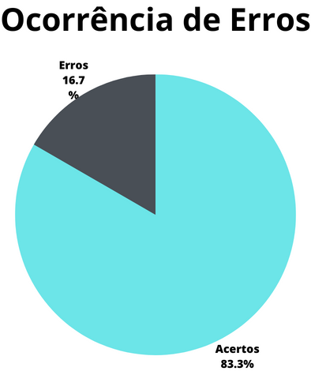

# Verificação - Storyboards

## 1. Introdução

A verificação dos Storyboards compila os resultados extraídos a partir da avaliação dos storyboards, definindo o que, elementos, se cumprem suas tarefas e como devem ser avaliados.

O presente artefato busca marcar a verificação do artefato do storyboard, que na data da verificação (03/07/2023) tinha como versão mais atual a versão `1.1` de 02/07/2023.

## 2. Metodologia

A presente verificação acompanha os métodos definidos no [planejamento da verificação](./planejamentoVerificacao.md), com a utilização de checklists elaborados a partir da bibliografia disponível sobre o assunto e com o uso de um cálculo numérico para a aferição do grau de satisfação do artefato.

O checklist conterá as verificações descritas abaixo.

### 2.1. Verificação 1 - Os storyboards seguem a estrutura padrão da bibliografia(sequência de quadros que contam uma história) ?

A estrutura do artefato de relato de resultados deve ser tal qual a estrutura definida em seu projeto, a fim de manter a integridade do mesmo.

`Maurício Vianna... [et al.]. Design thinking : inovação em negócios. Rio de Janeiro : MJV Press, 2012. P. 69.`

### 2.2. Verificação 2 - Os Storyboards apresentam uma ou mais pessoas que venham a utilizar uma interface ?

Os storyboards precisam demonstrar a utilização do sistema no contexto real de utilização pelos usuários finais.

`Storyboards, Paper Prototypes and Mockups - Scott Klemmer / Univ. Califórnia em Berkeley (Coursera), minuto 2:26.`

### 2.3. Verificação 3 - Os storyboards acompanham como um usuário realiza a tarefa proposta ?

Os storyboards devem demonstrar como o usuário irá realizar a utilização do sistema, principalmente seu contexto durante a execução.

`Maurício Vianna... [et al.]. Design thinking : inovação em negócios. Rio de Janeiro : MJV Press, 2012. P. 263.`

### 2.4. Verificação 4 - Os storyboards possuem as características de uma prototipação de baixa fidelidade?(Baixo custo, tempo de produção e facilidade de alteração).

Os storyboards devem ser algo fácil, simples e prático para que possamos analisar e ter um contexto inicial da aplicação e do usuário, portanto, como é algo inicial precisamos que seja facilmente alterado de baixo custo e tempo de produção.

`Maurício Vianna... [et al.]. Design thinking : inovação em negócios. Rio de Janeiro : MJV Press, 2012. P. 262.`

### 2.5. Verificação 5 - Os storyboards apresentam um objetivo que deve ser comprimido a partir da tarefa executada ?

Os storyboards devem possuir objetivos para que se entenda melhor as atividades e verificar se o objetivo foi atingido ao final do storyboard..

`Storyboards, Paper Prototypes and Mockups - Scott Klemmer / Univ. Califórnia em Berkeley (Coursera), minuto 3:30.`

### 2.6. Verificação 6 - Os storyboards demonstram o que motiva pessoas a usarem o sistema representado pelo mesmo ?

Os storyboards devem apresentar as motivações pelas quais a pessoa foi levada a utilizar o sistema proposto.

`Storyboards, Paper Prototypes and Mockups - Scott Klemmer / Univ. Califórnia em Berkeley (Coursera), minuto 4:50.`

### 2.7. Verificação 7 - Os storyboards seguem as etapas propostas pela bibliografia(Configuração, Sequência e Conclusão) ?

Os storyboards devem possuir etapas para uma melhor análise do contexto, das atividades e dos objetivos.

`Storyboards, Paper Prototypes and Mockups - Scott Klemmer / Univ. Califórnia em Berkeley (Coursera), minuto 5:00.`

### 2.8. Verificação 8 - Na etapa de configuração o storyboard apresenta: personagens, ambiente e tarefas da narrativa ?

Os storyboards devem apresentar personagens, condizentes com o perfil de usuários, ambiente para análise de contexto do usuário e as tarefas realizadas para análise do sistema.

`Storyboards, Paper Prototypes and Mockups - Scott Klemmer / Univ. Califórnia em Berkeley (Coursera), minuto 5:00.`

### 2.9. Verificação 9 - Na etapa de sequência o storyboard apresenta: motivação para o uso do sistema, a tarefa ilustrada e os passos para satisfação desta tarefa ?

A motivação para o uso do sistema é importante para entendermos as necessidades dos usuários, e os passos para realizar a tarefa para entender o fluxo de realização de uma tarefas.

`Storyboards, Paper Prototypes and Mockups - Scott Klemmer / Univ. Califórnia em Berkeley (Coursera), minuto 5:05.`

### 2.10. Verificação 10 - Na etapa de conclusão o storyboard apresenta: a necessidade que o sistema supre assim como isto se conecta com a motivação do usuário ?

A motivação para o uso do sistema é importante para entendermos as necessidades dos usuários, e os passos para realizar a tarefa para entender o fluxo de realização de uma tarefas.

`Storyboards, Paper Prototypes and Mockups - Scott Klemmer / Univ. Califórnia em Berkeley (Coursera), minuto 5:05.`

## 3. Desenvolvimento

### 3.1 Checklist de padronização

Na tabela 1, se encontra o [checklist] de padronização preenchido após a realização da verificação.

| ID  | Verificação | Realizado |
| :-: | :-: | :-: |
|  1  | Possui ortografia correta e formal ? | Sim |
|  2  | Possui introdução ? | Sim |
|  3  | Possui links necessários ? | Sim |
|  4  | As tabelas e imagens possuem legenda padronizada e chamada no texto ? | Sim |
|  5  | As tabelas e imagens estão totalmente em português ? | Sim |
|  6  | Possui bibliografia ? | Sim |
|  7  | A bibliografia está em ordem alfabética ? | Sim |
|  8  | Possui histórico de versão padronizado ? | Sim |
|  9  | O histórico de versão possui autor(es) e revisor(es) ? | Sim |

Tabela 1: Checklist de padronização (Fonte: Autor, 2023).

### 3.2 Checklist de conteúdo

A tabela 2 marca as verificações de conteúdo dos artefatos. Os critérios considerados para a verificação foram obtidos a partir dos materiais disponibilizados para a disciplina sobre o assunto abordado.

| ID  | Verificação | Ocorrências | Acertos | Erros |
| :-: | :-: | :-: | :-: | :-: |
| 10  | Os storyboards seguem a estrutura padrão da bibliografia(sequência de quadros que contam uma história) ? | 6 | 6 | 0 |
| 11  | Os storyboards apresentam uma ou mais pessoas que venham a utilizar uma interface ? | 6 | 6 | 0 |
| 12  | Os storyboards acompanham como um usuário realiza a tarefa proposta ? | 6 | 2 | 4 |
| 13  | Os storyboards possuem as características de uma prototipação de baixa fidelidade ?(Baixo custo, tempo de produção e facilidade de alteração). | 6 | 6 | 0 |
| 14  | Os storyboards apresentam um objetivo que deve ser comprimido a partir da tarefa executada ? | 6 | 4 | 2 |
| 15  | Os storyboards demonstram o que motiva pessoas a usarem o sistema representado pelo mesmo ?| 6 | 6 | 0 |
| 16  | Os storyboards seguem as etapas propostas pela bibliografia(Configuração, Sequência e Conclusão) ?  | 6 | 6 | 0 |
| 17  | Na etapa de configuração o storyboard apresenta: personagens, ambiente e tarefas da narrativa ? | 6 | 2 | 4 |
| 18  | Na etapa de sequência o storyboard apresenta: motivação para o uso do sistema, a tarefa ilustrada e os passos para a satisfação desta tarefa ? | 6 | 6 | 0 |
| 19  | Na etapa de conclusão o storyboard apresenta: a necessidade que o sistema supre assim como isto se conecta com a motivação do usuário ?| 6 | 6 | 0 |

Tabela 2: Checklist de conteúdo (Fonte: Autor, 2023).

## 4. Resultados

Os resultados da verificação dos artefatos de planejamento podem ser encontrados na tabela 3, onde podem ser verificados o grau de satisfação e a ocorrência de erros nos artefatos verificados. Estes resultados levam em conta apenas a verificação do conteúdo destes artefatos.

|  |  |
| :---: | :---: |
| Figura 1: Representação do grau de satisfação dos storyboards (Fonte: Autor, 2023). |  Figura 2: Gráfico de ocorrência de erros nos storyboards (Fonte: Autor, 2023). |

Tabela 3: Representações gráficas dos resultados da verificação (Fonte: Autor, 2023).

## 5. Problemas encontrados

- Verificação 12 - Os storyboards acompanham como um usuário realiza a tarefa proposta ?

    Os storyboards de agendar atendimento, consulta de cnh, solicitar cnh e transferencia de veiculo não mostram um fluxo de realização da atividade no sistema.

- Verificação 14 - Os storyboards apresentam um objetivo que deve ser comprimido a partir da tarefa executada ?

    Os storyboards de consulta de cnh e transferencia de veiculo é possível determinar o objetivo mas não tão claro.

- Verificação 17 - Na etapa de configuração o storyboard apresenta: personagens, ambiente e tarefas da narrativa ?

    Os storyboards de consulta de veículo, consulta de cnh, solicitar cnh e transferencia de veiculo não apresentam legenda para identificação dos elementos.

## 6. Acompanhamento

- Ainda não foram feitas as correções relatadas nesta verificação.

## 7. Referências bibliográficas

> [1] BARBOSA, Simone et al. INTERAÇÃO HUMANO-COMPUTADOR E EXPERIÊNCIA DO USUÁRIO. Rio de Janeiro: Autopublicação, 2021.

> [2] VIANNA, Maurício et al. Design Thinking: inovação em negócios. Rio de Janeiro: Mjv Press, 2012.

> [3] STORYBOARDS, Paper Prototypes and Mockups. Berkeley: Univ. Califórnia, 2021. (6 min.), Vídeo, son., color. Legendado. Disponível em: https://www.youtube.com/watch?v=h2H3oIQtddU. Acesso em: 02 jul. 2023.

## 8. Histórico de versão

| Versão | Data | Descrição | Autor(es) | Revisor(es) |
| ------ | -------- | ------------------- | --------- | ----------- |
| `1.0`  | 03/07/23 | Criação do artefato | Carlos E. | João M.     |
