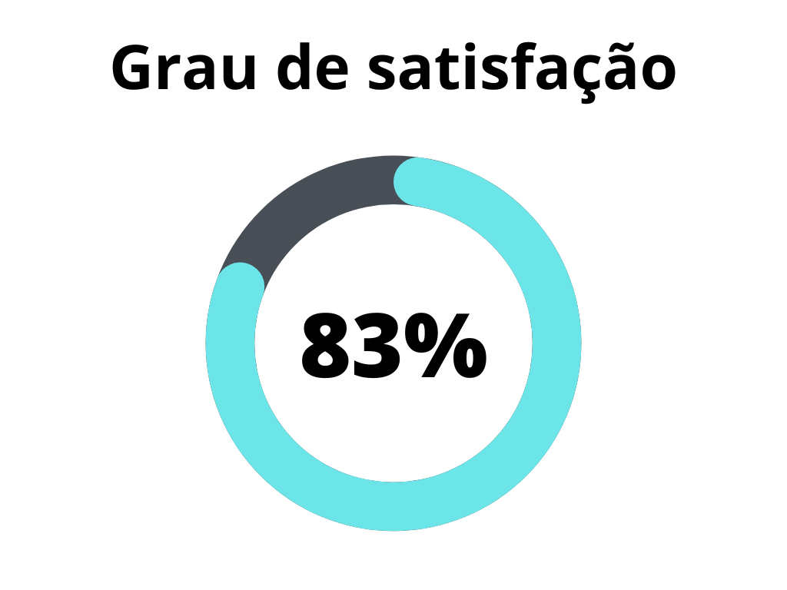
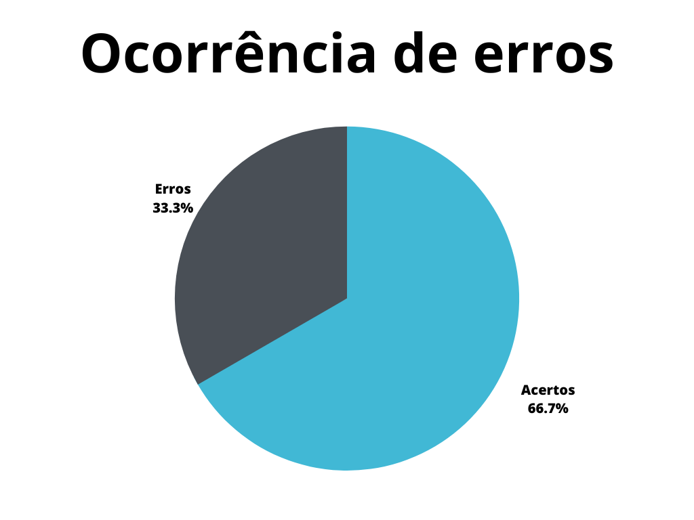

# Análise de tarefas

## 1. Introdução

Este documento possui a função de verificar o artefato referente à análise de tarefas do projeto do [grupo 7 - Agiel](https://interacao-humano-computador.github.io/2023.1-Agiel/)[3]. A análise de tarefas é usada para a compreensão das tarefas do usuário em um sistema, e por isso é pedra angular para o desenvolvimento futuro do projeto.

## 2. Metodologia

A metodologia utilizada neste documento segue o modelo proposto no [planejamento](./planejamentoVerificacao.md)[1] onde serão utilizados dois _checklists_, um para padronização e outro referenciando o conteúdo do artefato. Estes _checklists_ consideram o artefato verificado presente no repositório do [grupo 7 - Agiel](https://interacao-humano-computador.github.io/2023.1-Agiel/)[3].

## 3. Verificação

Abaixo se encontram as verificações realizadas. A tabela 1 marca a verificação de padronização, enquanto a tabela 2 marca a verificação de conteúdo do artefato. Os critérios considerados para verificação foram obtidas a partir do plano de ensino da disciplina[4] e do livro de Interação Humano Computador de Simone Barbosa[2].

### 3.1. Verificação de padronização

| ID | Verificação | Ocorrências | Acertos | Erros | Possíveis correções |
|--|--|--|--|--|--|
| 1 | Possui ortografia correta e formal? | 1 | 1 | 0 | - |
| 2 | Possui introdução? | 1 | 1 | 0 | - |
| 3 | Possui links necessários? | - | - | - | - |
| 4 | As tabelas e imagens possuem legenda padronizada e chamada no texto? | 4 | 1 | 3 | Correção da numeração da figura 1 (numerada como figura 2), chamada das figuras e tabelas no texto |
| 5 | As tabelas e imagens estão totalmente em português? | 4 | 4 | 0 | - |
| 6 | Possui bibliografia? | 1 | 1 | 0 | Padronizar bibliografia entre artefatos |
| 7 | A bibliografia está em ordem alfabética? | 1 | 1 | 0 | - |
| 8 | Possui histórico de versão padronizado? | 1 | 1 | 0 | - |
| 9 | O histórico de versão possui autor(es) e revisor(es)? | 1 | 1 | 0 | - |

Tabela 1: Verificação de padronização do artefato de análise de tarefas (Fonte: Autor, 2023).

### 3.2. Verificação de conteúdo do artefato

| ID | Verificação | Ocorrências | Acertos | Erros | Possíveis correções |
|--|--|--|--|--|--|
| 10 | A metodologia utilizada é especificada? | 1 | 1 | 0 | Separar a metodologia em seção designada |
| 11 | A análise é feita com ao menos duas técnicas diferentes (Um HTA e ao menos um GOMS definido nos modelos: KLM, CMN-GOMS, CPM-GOMS, CTT)? | 1 | 1 | 0 | - |
| 12 | É utilizada uma técnica de especificação de tarefas? | 1 | 1 | 0 | - |
| 13 | As análises de tarefas estão de acordo com as definições apresentadas na fonte consultada? | 2 | 1 | 1 | HTA não especifica se os elementos do diagrama são objetivos ou operações, não especifica se subobjetivos são sequenciais, paralelos ou de seleção |
| 14 | Se utiliizada mais de uma técnica para a análise de tarefas, esta técnica é especificada devidamente? | 1 | 0 | 1 | Não é especificada a técnica GOMS utilizada (o avaliador reconheceu com o CMN-GOMS) |

Tabela 2: Verificação de conteúdo do artefato de análise de tarefas (Fonte: Autor, 2023).

## 4. Resultados

Os resultados da verificação do processo de design podem ser encontrados na tabela 3 abaixo, onde podem ser verificados o grau de satisfação e a ocorrência de erros no artefato verificado. Estes resultados levam em conta apenas a verificação do conteúdo.

|                                              |                                        |
| ------------------------------------------------------------------------------- | -------------------------------------------------------------------------- |
| Figura 1: Representação do grau de satisfação do artefato (Fonte: Autor, 2023). | Figura 2: Gráfico de ocorrência de erros no artefato (Fonte: Autor, 2023). |

Tabela 3: Representações gráficas dos resultados da verificação (Fonte: Autor, 2023).

## 5. Referências Bibliográficas

> [1] Artefato de planejamento da verificação, acesso em: 5 de junho de 2023. Para mais informações acesse: [link](./planejamentoVerificacao.md)

> [2] Barbosa, S. D. J.; Silva, B. S. da; Silveira, M. S.; Gasparini, I.; Darin, T.; Barbosa, G. D. J. (2021) Interação Humano-Computador e Experiência do usuário. Autopublicação. ISBN: 978-65-00-19677-1.

> [3] Repositório Agiel do semestre 2023.1, acesso em: 5 de junho de 2023. Para mais informações acesse: <https://interacao-humano-computador.github.io/2023.1-Agiel/>

> [4] SALES, André Barros. Plano de ensino da disciplina. Disponível em: [https://aprender3.unb.br/pluginfile.php/2523360/mod_resource/content/33/Plano_de_Ensino%20FIHC%20202301%20Turma%202.pdf](https://aprender3.unb.br/pluginfile.php/2523360/mod_resource/content/33/Plano_de_Ensino%20FIHC%20202301%20Turma%202.pdf). Acesso em: 5 de junho de 2023;

## 6. Histórico de versão

| Versão | Data | Descrição | Autor(es) | Revisor(es) |
|--|--|--|--|--|
| `1.0` | 05/06/23 | Criação do documento e adição do conteudo | Felipe Corrêa | Pedro Muniz |