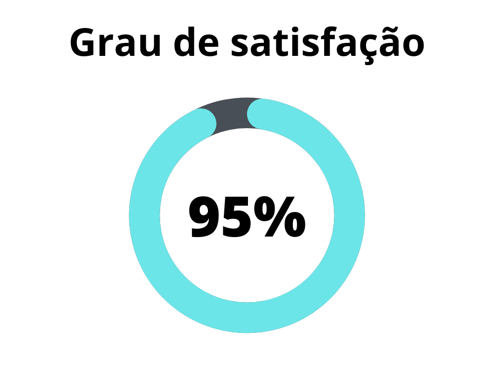
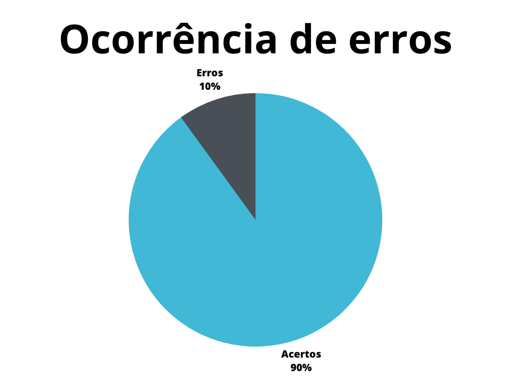

# Aspectos éticos do projeto

## 1. Introdução

Este documento possui a função de verificar o artefato referente aos aspectos éticos do projeto do [grupo 7 - Agiel](https://interacao-humano-computador.github.io/2023.1-Agiel/)[3]. Os aspectos éticos definem as questões éticas envolvendo a pesquisa com pessoas, a qual será utilizada no projeto.

## 2. Metodologia

A metodologia utilizada neste documento segue o modelo proposto no [planejamento](../planejamento.md)[1] onde serão utilizados dois _checklists_, um para padronização e outro referenciando o conteúdo dos artefatos. Estes _checklists_ consideram o artefato verificado presente no repositório do [grupo 7 - Agiel](https://interacao-humano-computador.github.io/2023.1-Agiel/)[3].

## 3. Verificação

Abaixo se encontram as verificações realizadas, na tabela 1 se encontram as verificações de padronização, enquanto na tabela 2 estão as verificações de conteúdo, tais verificações foram obtidas a partir do plano de ensino da disciplina[4] e do livro de Interação Humano Computador de Simone Barbosa[2].

### 3.1 Padronização

| ID  | Verificação                                                          | Ocorrências | Acertos | Erros | Possíveis correções                        |
| --- | -------------------------------------------------------------------- | ----------- | ------- | ----- | ------------------------------------------ |
| 1   | Possui ortografia correta e formal?                                  | 1           | 1       | 0     | -                                          |
| 2   | Possui introdução?                                                   | 1           | 1       | 0     | -                                          |
| 3   | Possui links necessários?                                            | 0           | 0       | 0     | -                                          |
| 4   | As tabelas e imagens possuem legenda padronizada e chamada no texto? | 0           | 0       | 0     | -                                          |
| 5   | As tabelas e imagens estão totalmente em português?                  | 0           | 0       | 0     | -                                          |
| 6   | Possui bibliografia?                                                 | 1           | 1       | 0     | -                                          |
| 7   | A bibliografia está em ordem alfabética?                             | 1           | 0       | 1     | Bibliografia não está em ordem alfabética. |
| 8   | Possui histórico de versão padronizado?                              | 1           | 1       | 0     | -                                          |
| 9   | O histórico de versão possui autor(es) e revisor(es)?                | 1           | 1       | 0     | -                                          |

Tabela 1: Verificações de padronização (Fonte: Autor, 2023).

### 3.2 Conteúdo

| ID | Verificação | Ocorrências | Acertos | Erros | Possíveis correções |
|--|--|--|--|--|--|
| 1 | Existe um artefato para os aspectos éticos?[4] | 1 | 1 | 0 | - |
| 2 | O artefato possui os 4 princípios(autonomia, beneficência, não maleficência, justiça e equidade)?[4] | 4 | 4 | 0 | - |
| 3 | O artefato deixa explícito a gravação de vídeo ou aúdio?[4] | 1 | 0 | 1 | O termo de consentimento não possui referências a gravação de vídeo ou áudio do participante. |
| 4 | O artefato detalha o termo de consetimento assinado pelos participantes?[4] | 1 | 1 |  | - |
| 5 | O artefato deixa explícito os objetivos da pesquisa?[2] | 1 | 1 |  | - |
| 6 | O artefato deixa explicíto a confidencializada, privacidade e anonimato dos envolvidos na pesquisa?[2] | 1 | 1 |  | - |
| 7 | O artefato deixa explicíto o direito do participante de abandonar a pesquisa a qualquer momento?[2] | 1 | 1 |  | - |                                                          |

Tabela 2: Verificações de conteúdo (Fonte: Autor, 2023).

## 4. Resultados

Os resultados da verificação de aspectos éticos podem ser encontrados na tabela 3 abaixo, onde podem ser verificados o grau de satisfação e a ocorrência de erros no artefato verificado. Estes resultados levam em conta apenas a verificação do conteúdo.

|                                              |                                        |
| ------------------------------------------------------------------------------- | -------------------------------------------------------------------------- |
| Figura 1: Representação do grau de satisfação do artefato (Fonte: Autor, 2023). | Figura 2: Gráfico de ocorrência de erros no artefato (Fonte: Autor, 2023). |

Tabela 3: Representações gráficas dos resultados da verificação (Fonte: Autor, 2023).

## 5. Referências Bibliográficas

> [1] Artefato de planejamento da verificação, acesso em: 5 de junho de 2023. Para mais informações acesse: [link](../planejamento.md)

> [2] Barbosa, S. D. J.; Silva, B. S. da; Silveira, M. S.; Gasparini, I.; Darin, T.; Barbosa, G. D. J. (2021) Interação Humano-Computador e Experiência do usuário. Autopublicação. ISBN: 978-65-00-19677-1.

> [3] Repositório Agiel do semestre 2023.1, acesso em: 5 de junho de 2023. Para mais informações acesse: <https://interacao-humano-computador.github.io/2023.1-Agiel/>

> [4] SALES, André Barros. Plano de ensino da disciplina. Disponível em: [https://aprender3.unb.br/pluginfile.php/2523360/mod_resource/content/33/Plano_de_Ensino%20FIHC%20202301%20Turma%202.pdf](https://aprender3.unb.br/pluginfile.php/2523360/mod_resource/content/33/Plano_de_Ensino%20FIHC%20202301%20Turma%202.pdf). Acesso em: 5 de junho de 2023;

## 6. Histórico de versão

|  Versão  |   Data   |                      Descrição                      |    Autor(es)   |  Revisor(es)  |
| -------- | -------- | --------------------------------------------------- | -------------- | ------------- |
|  `1.0`   | 05/06/23 | Criação do documento e adição do conteudo           | Pedro Muniz | Felipe Correa |
