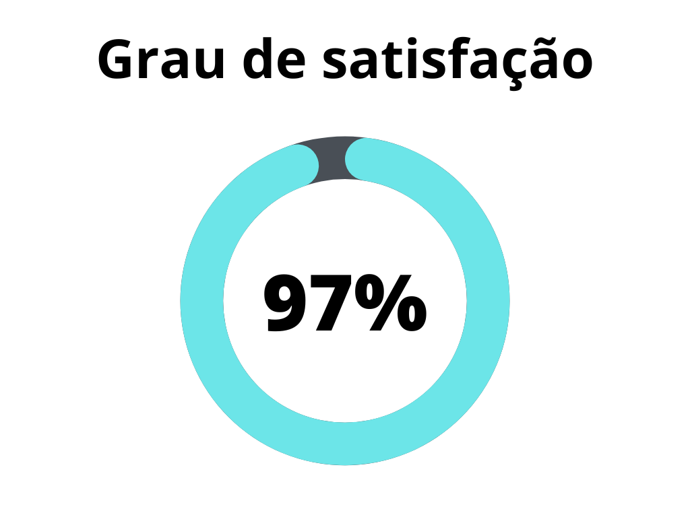
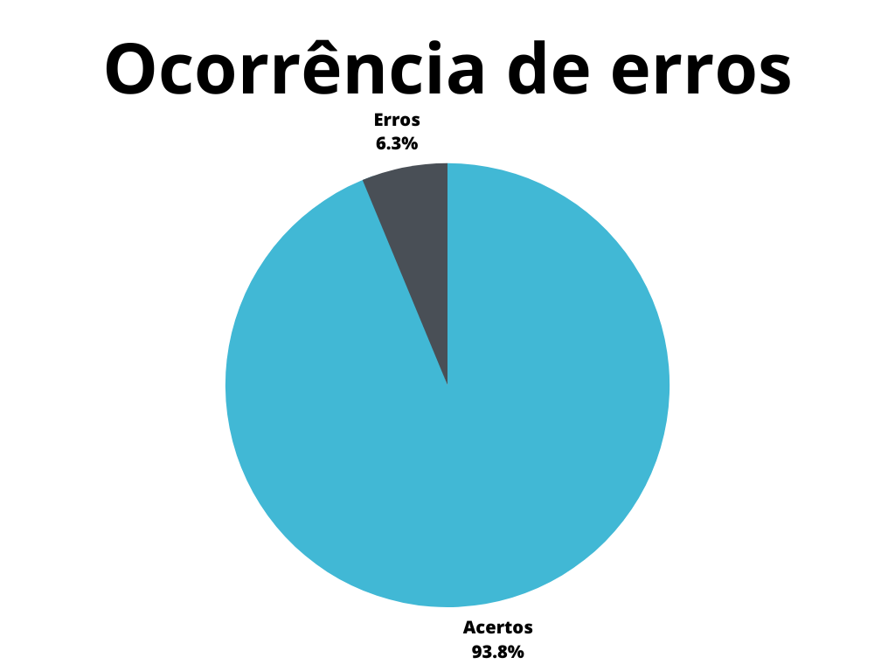

# Aspectos gerais do projeto

## 1. Introdução
Este documento possui a função de verificar alguns dos artefatos necessários para o projeto, segundo o plano de ensino da disciplina[3]. Sendo estes artefatos: página com os participantes da equipe, páginas para as atas de reunião e páginas para as apresentações da equipe.

## 2. Metodologia
A metodologia utilizada neste documento segue o modelo proposto no [planejamento](./planejamentoVerificacao.md)[1] onde serão utilizados dois _checklists_, um para padronização e outro referenciando o conteúdo dos artefatos. Estes _checklists_ consideram o conjunto dos artefatos verificados presentes no repositório do [grupo 7 - Agiel](https://interacao-humano-computador.github.io/2023.1-Agiel/)[2].

## 3. Verificação
Abaixo se encontram as verificações realizadas, na tabela 1 se encontram as verificações de padronização, enquanto na tabela 2 estão as verificações de conteúdo, tais verificações foram obtidas totalmente a partir do plano de ensino da disciplina[3].

### 3.1 Padronização

| ID | Verificação | Ocorrências | Acertos | Erros | Possíveis correções |
|--|--|--|--|--|--|
| 1 | Possui ortografia correta e formal? | 9 | 9 | 0 | - |
| 2 | Possui introdução? | 9 | 8 | 1 | A introdução da reunião 02 está incorreta, pois foi copiada da ata da primeira reunião. |
| 3 | Possui links necessários? | 9 | 9 | 0 | - |
| 4 | As tabelas e imagens possuem legenda padronizada e chamada no texto? | 5 | 1 | 4 | As tabelas presentes na ata não possuem legenda. |
| 5 | As tabelas e imagens estão totalmente em português? | 5 | 5 | 0 | - |
| 6 | Possui bibliografia? | 5 | 5 | 0 | - |
| 7 | A bibliografia está em ordem alfabética? | 5 | 0 | 5 | Nenhuma das bibliografias está em ordem alfabética, além da dificíl leitura por conta da falta de quebras de linha. |
| 8 | Possui histórico de versão padronizado? | 9 | 6 | 3 | Os históricos de versão das atas estão fora do padrão. |
| 9 | O histórico de versão possui autor(es) e revisor(es)? | 9 | 6 | 3 | Os históricos de versão das atas não possuem revisor. |

Tabela 1: Verificações de padronização (Fonte: Autor, 2023).

### 3.2 Conteúdo

| ID | Verificação                                                                               | Ocorrências | Acertos | Erros | Possíveis correções                                                |
|----|-------------------------------------------------------------------------------------------|-------------|---------|-------|--------------------------------------------------------------------|
| 1  | Existe uma página com os integrantes?                                                     | 1           | 1       | 0     | -                                                                  |
| 2  | A lista de participantes possui identificação(nome e foto) sem matrícula?                 | 1           | 1       | 0     | -                                                                  |
| 3  | Existe uma página para cada reunião com sua ata?                                          | 3           | 3       | 0     | -                                                                  |
| 4  | As atas de reunião possuem: data, duração, paricipantes, objetivo e atividades definidas? | 3           | 2       | 1     | A ata da reunião 02 não possui as atividades definidas na reunião. |
| 5  | As atas de reunião possuem a gravação da reunião?                                         | 3           | 3       | 0     | -                                                                  |
| 6  | Existem uma página para cada apresentação com a gravação da mesma?                        | 5           | 5       | 0     | -                                                                  |

Tabela 2: Verificações de conteúdo (Fonte: Autor, 2023).

## 4. Resultados
Os resultados da verificação de aspectos gerais podem ser encontrados na tabela 3 abaixo, onde podem ser verificados o grau de satisfação e a ocorrência de erros nos artefatos verificados. Estes resultados levam em conta apenas a verificação do conteúdo.

|                |                  |
| ----------------------------------------------------------------------------------------------------- | ------------------------------------------------------------------------------------------------ |
| Figura 1: Representação do grau de satisfação dos artefatos (Fonte: Autor, 2023). | Figura 2: Gráfico de ocorrência de erros nos artefatos (Fonte: Autor, 2023). |

Tabela 3: Representações gráficas dos resultados da verificação (Fonte: Autor, 2023).

## 5. Referências Bibliográficas

> [1] Artefato de planejamento da verificação, acesso em: 5 de junho de 2023. Para mais informações acesse: [link](./planejamentoVerificacao.md)

> [2] Repositório Agiel do semestre 2023.1, acesso em: 5 de junho de 2023. Para mais informações acesse: <https://interacao-humano-computador.github.io/2023.1-Agiel/>

> [3] SALES, André Barros. Plano de ensino da disciplina. Disponível em: [https://aprender3.unb.br/pluginfile.php/2523360/mod_resource/content/33/Plano_de_Ensino%20FIHC%20202301%20Turma%202.pdf](https://aprender3.unb.br/pluginfile.php/2523360/mod_resource/content/33/Plano_de_Ensino%20FIHC%20202301%20Turma%202.pdf). Acesso em: 5 de junho de 2023;

## 6. Histórico de versão

|  Versão  |   Data   |                      Descrição                      |    Autor(es)   |  Revisor(es)  |
| -------- | -------- | --------------------------------------------------- | -------------- | ------------- |
|  `1.0`   | 05/06/23 | Criação do documento e adição do conteudo           | Pedro Muniz | Felipe Correa |