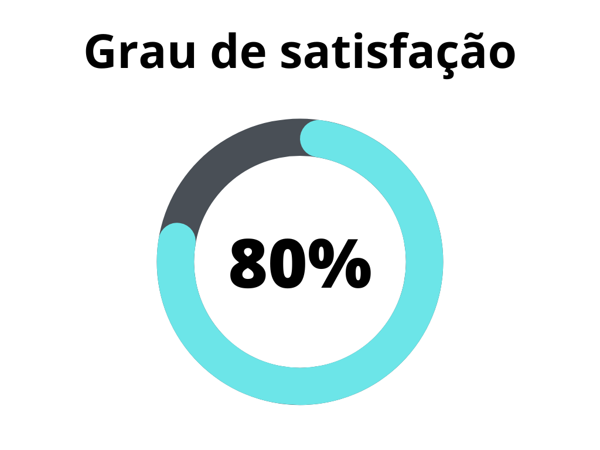
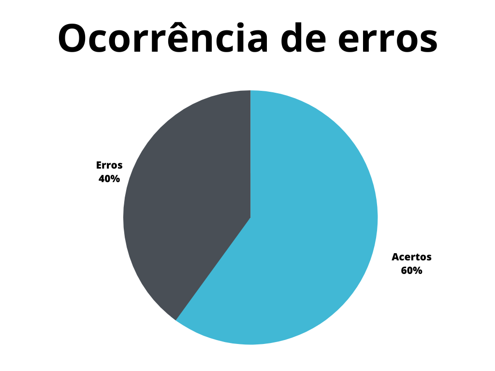

# Perfil de usuário do projeto

## 1. Introdução
Este documento possui a função de verificar o artefato referente ao perfil de usuário do projeto do [grupo 7 - Agiel](https://interacao-humano-computador.github.io/2023.1-Agiel/)[2]. O perfil de usuário é de extrema importância pois guia o desenvolvimento de diversos artefatos posteriores, como as personas.

## 2. Metodologia
A metodologia utilizada neste documento segue o modelo proposto no [planejamento](../planejamento.md)[1] onde serão utilizados dois _checklists_, um para padronização e outro referenciando o conteúdo dos artefatos. Estes _checklists_ consideram o artefato verificado presente no repositório do [grupo 7 - Agiel](https://interacao-humano-computador.github.io/2023.1-Agiel/)[2].

## 3. Verificação
Abaixo se encontram as verificações realizadas, na tabela 1 se encontram as verificações de padronização, enquanto na tabela 2 estão as verificações de conteúdo, tais verificações foram totalmente obtidas a partir do plano de ensino da disciplina[3].

### 3.1 Padronização

| ID | Verificação                                                          | Ocorrências | Acertos | Erros | Possíveis correções                                    |
|----|----------------------------------------------------------------------|-------------|---------|-------|--------------------------------------------------------|
| 1  | Possui ortografia correta e formal?                                  | 1           | 1       | 0     | -                                                      |
| 2  | Possui introdução?                                                   | 1           | 1       | 0     | -                                                      |
| 3  | Possui links necessários?                                            | 1           | 0       | 1     | Não possui um link para o artefato de aspectos éticos. |
| 4  | As tabelas e imagens possuem legenda padronizada e chamada no texto? | 1           | 0       | 1     | O dashboard apresentado não possui chamada no texto.   |
| 5  | As tabelas e imagens estão totalmente em português?                  | 1           | 1       | 0     | -                                                      |
| 6  | Possui bibliografia?                                                 | 1           | 0       | 1     | A bibliografia se encontra fora do padrão.             |
| 7  | A bibliografia está em ordem alfabética?                             | 1           | 1       | 0     | -                                                      |
| 8  | Possui histórico de versão padronizado?                              | 1           | 1       | 0     | -                                                      |
| 9  | O histórico de versão possui autor(es) e revisor(es)?                | 1           | 1       | 0     | -                                                      |

Tabela 1: Verificações de padronização (Fonte: Autor, 2023).

### 3.2 Conteúdo

| ID | Verificação                                                                                | Ocorrências | Acertos | Erros | Possíveis correções                                                                                              |
|----|--------------------------------------------------------------------------------------------|-------------|---------|-------|------------------------------------------------------------------------------------------------------------------|
| 1  | Existe um artefato para o perfil de usuário?                                               | 1           | 1       | 0     | -                                                                                                                |
| 2  | O artefato faz referência aos aspéctos éticos definidos?                                   | 1           | 1       | 0     | -                                                                                                                |
| 3  | O perfil do usuário segue os atributos de (Hackos e Redish, 1998; Courage e Baxter, 2005)? | 1           | 0       | 1     | O artefato não segue todos os atributos propostos.                                                               |
| 4  | O perfil de usuário define os grupos apresentados por (Barbosa, 2021)?                     | 1           | 0       | 1     | O artefato não define grupos, nem demonstra um resultado detalhado e unificado a partir das técnicas utilizadas. |
| 5  | Foram utilizadas ao menos 2 técnicas para a elicitação dos requisitos?                     | 1           | 1       | 0     | -                                                                                                                |

Tabela 2: Verificações de conteúdo (Fonte: Autor, 2023).

## 4. Resultados
Os resultados da verificação de aspectos gerais podem ser encontrados na tabela 3 abaixo, onde podem ser verificados o grau de satisfação e a ocorrência de erros no artefato verificado. Estes resultados levam em conta apenas a verificação do conteúdo.

|                |                  |
| ----------------------------------------------------------------------------------------------------- | ------------------------------------------------------------------------------------------------ |
| Figura 1: Representação do grau de satisfação do artefato (Fonte: Autor, 2023). | Figura 2: Gráfico de ocorrência de erros no artefato (Fonte: Autor, 2023). |

Tabela 3: Representações gráficas dos resultados da verificação (Fonte: Autor, 2023).

## 5. Referências Bibliográficas

> [1] Artefato de planejamento da verificação, acesso em: 5 de junho de 2023. Para mais informações acesse: [link](../planejamento.md)

> [2] Repositório Agiel do semestre 2023.1, acesso em: 5 de junho de 2023. Para mais informações acesse: <https://interacao-humano-computador.github.io/2023.1-Agiel/>

> [3] SALES, André Barros. Plano de ensino da disciplina. Disponível em: [https://aprender3.unb.br/pluginfile.php/2523360/mod_resource/content/33/Plano_de_Ensino%20FIHC%20202301%20Turma%202.pdf](https://aprender3.unb.br/pluginfile.php/2523360/mod_resource/content/33/Plano_de_Ensino%20FIHC%20202301%20Turma%202.pdf). Acesso em: 5 de junho de 2023;

## 6. Histórico de versão

|  Versão  |   Data   |                      Descrição                      |    Autor(es)   |  Revisor(es)  |
| -------- | -------- | --------------------------------------------------- | -------------- | ------------- |
|  `1.0`   | 05/06/23 | Criação do documento e adição do conteudo           | Pedro Muniz | Felipe Correa |