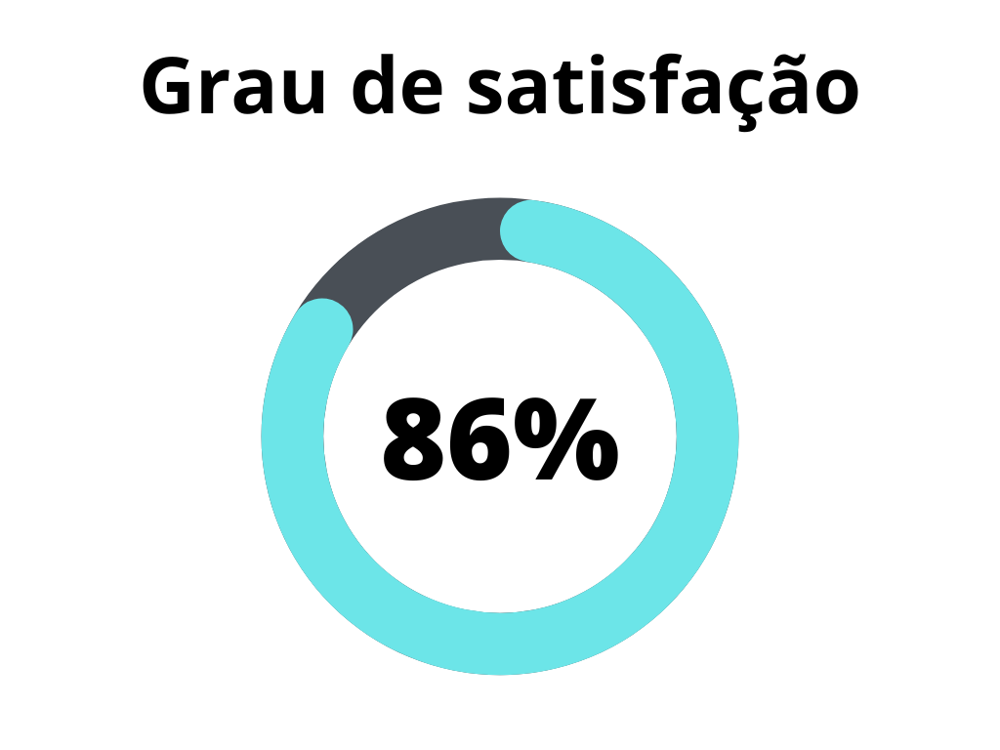
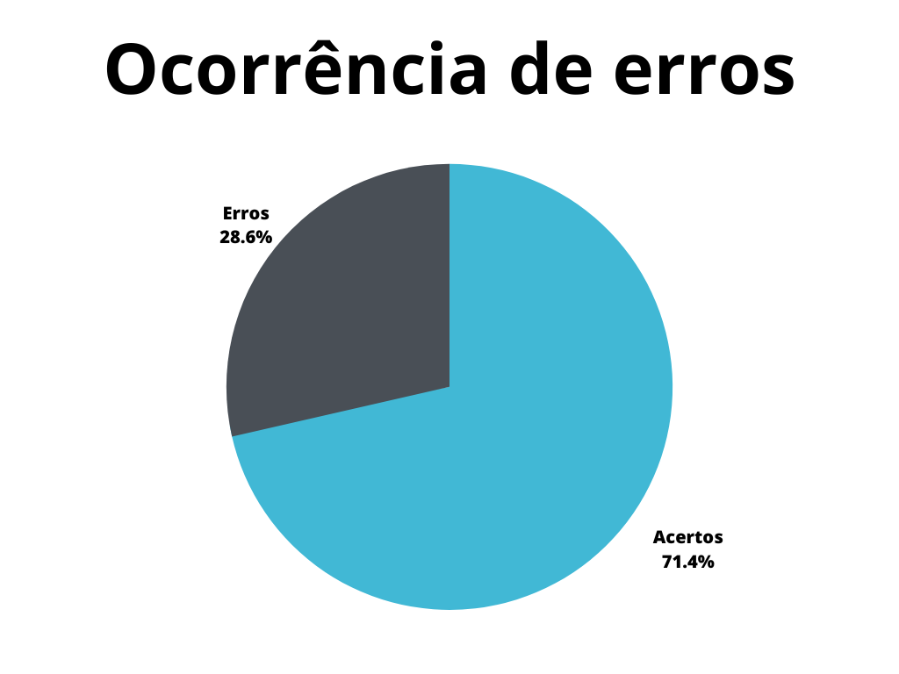

# Planejamento do projeto

## 1. Introdução

Este documento possui a função de verificar os artefatos referentes ao planejamento do projeto do [grupo 7 - Agiel](https://interacao-humano-computador.github.io/2023.1-Agiel/)[3]. O planejamento (aqui delineado pelos artefatos de escolha do site, cronogramas, reuniões e ferramentas) do projeto é essencial para o seu desenvolvimento futuro e deve sofre alterações quando necessário (especialmente os cronogramas) a fim de refletir mudanças nas condições do grupo.

## 2. Metodologia

A metodologia utilizada neste documento segue o modelo proposto no [planejamento](../planejamento.md)[1] onde serão utilizados dois _checklists_, um para padronização e outro referenciando o conteúdo dos artefatos. Estes _checklists_ consideram os artefatos verificados presentes no repositório do [grupo 7 - Agiel](https://interacao-humano-computador.github.io/2023.1-Agiel/)[3].

## 3. Verificação

Abaixo se encontram as verificações realizadas. A tabela 1 marca as verificações de padronização, enquanto a tabela 2 marca as verificações de conteúdo dos artefatos. Os critérios considerados para verificação foram obtidas a partir do plano de ensino da disciplina[4] e do livro de Interação Humano Computador de Simone Barbosa[2].

### 3.1. Verificações de padronização

| ID | Verificação | Ocorrências | Acertos | Erros | Possíveis correções |
|--|--|--|--|--|--|
| 1 | Possui ortografia correta e formal? | 5 | 4 | 1 | Revisão ortográfica no artefato de escolha do site |
| 2 | Possui introdução? | 5 | 5 | 0 | - |
| 3 | Possui links necessários? | 43 | 41 | 2 | Disponibilização da avaliação Instituto Federal de Goiás (IFG) e Secretaria de Saúde do Distrito Federal (SES) |
| 4 | As tabelas e imagens possuem legenda padronizada e chamada no texto? | 16 | 0 | 16 | Tabelas e imagens devem ter título adequado, legenda com autor, fonte e data adequados, além de serem chamadas no texto anteriormente ao seu uso/aparição. |
| 5 | As tabelas e imagens estão totalmente em português? | 16 | 16 | 0 | - |
| 6 | Possui bibliografia? | 5 | 4 | 1 | Adição de bibliografia no artefato de escolha do site, padronização das datas das bibliografias |
| 7 | A bibliografia está em ordem alfabética? | 4 | 3 | 1 | Organizar a bibliografia do artefato de ferramentas em ordem alfabética |
| 8 | Possui histórico de versão padronizado? | 5 | 3 | 2 | Divisão da seção de histórico de versão no artefato de reuniões, adição de histórico de versão no artefato de ferramentas |
| 9 | O histórico de versão possui autor(es) e revisor(es)? | 4 | 4 | 0 | - |

Tabela 1: Verificações de padronização dos artefatos de planejamento (Fonte: Autor, 2023).

### 3.2. Verificações de conteúdo dos artefatos

| ID | Verificação | Ocorrências | Acertos | Erros | Possíveis correções |
|--|--|--|--|--|--|
| 10 | O artefato de cronograma planejado contempla todas as etapas e todas as atividades, marcando data de início e fim de entrega, data de revisão, autores e revisores? | 9 | 9 | 0 | - |
| 11 | O cronograma planejado possui um período para a gravação da apresentação? | 9 | 9 | 0 | - |
| 12 | O cronograma planejado possui um período para a revisão dos apontamentos do professor? | 9 | 0 | 9 | Adicionar um período planejado para revisão dos apontamentos do professor |
| 13 | As ferramentas são condizentes com o desenvolvimento do projeto? | 1 | 0 | 1 | Há ferramentas utilizadas não discriminadas no artefato |
| 14 | O artefato de reunião deixa claro o horário definido, a priori, para as reuniões do grupo? | 1 | 0 | 1 | Deixar claro o horário definido pelo grupo para a realização das reuniões |
| 15 | O cronograma executado contém as datas reais de execução e entrega do artefato, com os autores e revisores reais? | 5 | 5 | 0 | Disponibilização da avaliação Instituto Federal de Goiás (IFG) e Secretaria de Saúde do Distrito Federal (SES) |
| 16 | O artefato de escolha do site contém as avaliações e seus planejamentos? | 14 | 12 | 2 | Disponibilização da avaliação Instituto Federal de Goiás (IFG) e Secretaria de Saúde do Distrito Federal (SES) |
| 17 | Os cronogramas anteriores, se sinalizados com alterações significantes nos históricos de versão, foram salvos em artefato de cronogramas legados? | 1 | 0 | 1 | Disponibilização de cronogramas planejados legados anteriores à versão 1.1 |

Tabela 2: Verificações de conteúdo dos artefatos de planejamento (Fonte: Autor, 2023).

## 4. Resultados

Os resultados da verificação dos artefatos de planejamento podem ser encontrados na tabela 3 abaixo, onde podem ser verificados o grau de satisfação e a ocorrência de erros nos artefatos verificados. Estes resultados levam em conta apenas a verificação do conteúdo destes artefatos.

|                                              |                                        |
| ------------------------------------------------------------------------------- | -------------------------------------------------------------------------- |
| Figura 1: Representação do grau de satisfação do artefato (Fonte: Autor, 2023). | Figura 2: Gráfico de ocorrência de erros no artefato (Fonte: Autor, 2023). |

Tabela 3: Representações gráficas dos resultados da verificação (Fonte: Autor, 2023).

## 5. Referências Bibliográficas

> [1] Artefato de planejamento da verificação, acesso em: 5 de junho de 2023. Para mais informações acesse: [link](../planejamento.md)

> [2] Barbosa, S. D. J.; Silva, B. S. da; Silveira, M. S.; Gasparini, I.; Darin, T.; Barbosa, G. D. J. (2021) Interação Humano-Computador e Experiência do usuário. Autopublicação. ISBN: 978-65-00-19677-1.

> [3] Repositório Agiel do semestre 2023.1, acesso em: 5 de junho de 2023. Para mais informações acesse: <https://interacao-humano-computador.github.io/2023.1-Agiel/>

> [4] SALES, André Barros. Plano de ensino da disciplina. Disponível em: [https://aprender3.unb.br/pluginfile.php/2523360/mod_resource/content/33/Plano_de_Ensino%20FIHC%20202301%20Turma%202.pdf](https://aprender3.unb.br/pluginfile.php/2523360/mod_resource/content/33/Plano_de_Ensino%20FIHC%20202301%20Turma%202.pdf). Acesso em: 5 de junho de 2023;

## 6. Histórico de versão

| Versão | Data | Descrição | Autor(es) | Revisor(es) |
|--|--|--|--|--|
| `1.0` | 05/06/23 | Criação do documento e adição do conteudo | Felipe Corrêa | Pedro Muniz |