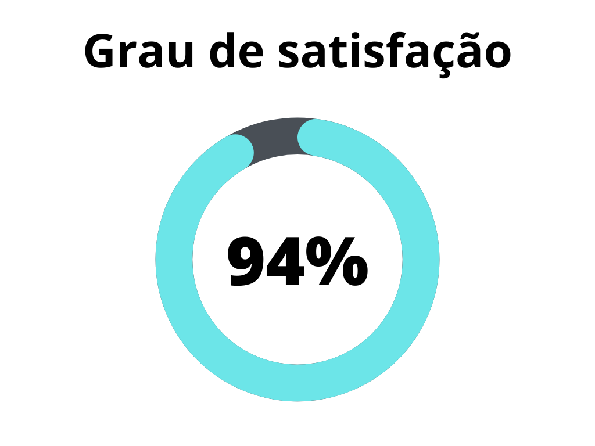
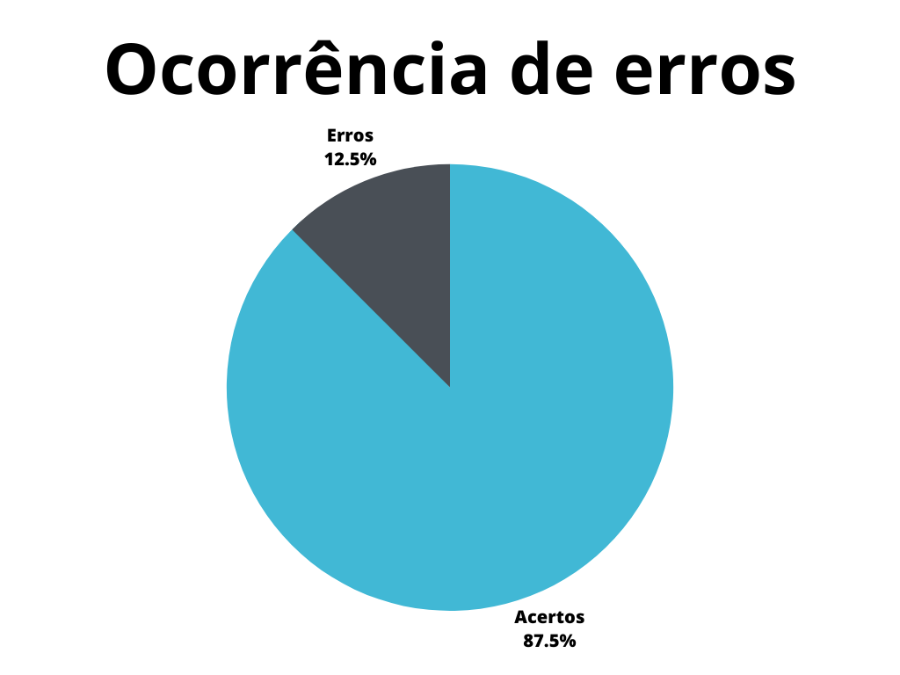

# Planejamento do Relato dos Resultados da Avaliação da Análise de Tarefas

## 1. Introdução

Este documento possui a função de verificar o artefato referente ao planejamento do relato dos resultados da avaliação da análise de tarefas do projeto do [grupo 7 - Agiel](https://interacao-humano-computador.github.io/2023.1-Agiel/)[3]. Sendo a análise de tarefas de grande importância para o desenvolvimento do projeto, sua avaliação deve ser planejada com cuidado.

## 2. Metodologia

A metodologia utilizada neste documento segue o modelo proposto no [planejamento](./planejamentoVerificacao.md)[1] onde serão utilizados dois _checklists_, um para padronização e outro referenciando o conteúdo do artefato. Estes _checklists_ consideram o artefato verificado presente no repositório do [grupo 7 - Agiel](https://interacao-humano-computador.github.io/2023.1-Agiel/)[3].

## 3. Verificação

Abaixo se encontram as verificações realizadas. A tabela 1 marca a verificação de padronização, enquanto a tabela 2 marca a verificação de conteúdo do artefato. Os critérios considerados para verificação foram obtidas a partir do livro de Interação Humano Computador de Simone Barbosa[2].

### 3.1. Verificação de padronização

| ID | Verificação | Ocorrências | Acertos | Erros | Possíveis correções |
|--|--|--|--|--|--|
| 1 | Possui ortografia correta e formal? | 1 | 1 | 0 | - |
| 2 | Possui introdução? | 1 | 1 | 0 | - |
| 3 | Possui links necessários? | 1 | 0 | 1 | Corrigir o link não funcional |
| 4 | As tabelas e imagens possuem legenda padronizada e chamada no texto? | - | - | - | - |
| 5 | As tabelas e imagens estão totalmente em português? | - | - | - | - |
| 6 | Possui bibliografia? | 1 | 1 | 0 | - |
| 7 | A bibliografia está em ordem alfabética? | 1 | 1 | 0 | - |
| 8 | Possui histórico de versão padronizado? | 1 | 1 | 0 | - |
| 9 | O histórico de versão possui autor(es) e revisor(es)? | 1 | 1 | 0 | - |

Tabela 1: Verificação de padronização do artefato de planejamento do relato de resultados da avaliação da análise de tarefas (Fonte: Autor, 2023).

### 3.2. Verificação de conteúdo do artefato

| ID | Verificação | Ocorrências | Acertos | Erros | Possíveis correções |
|--|--|--|--|--|--|
| 10 | O artefato detalha todos os elementos costumeiros de um relato de resultados? | 7 | 6 | 1 | Não é detalhado um tópico de análise dos dados encontrados |
| 11 | É definido um tópico para as gravações da aplicação das avaliações? | 1 | 1 | 0 | - |

Tabela 2: Verificação de conteúdo do artefato de planejamento do relato de resultados da avaliação da análise de tarefas (Fonte: Autor, 2023).

## 4. Resultados

Os resultados da verificação do planejamento do relato dos resultados da avaliação da análise de tarefas podem ser encontrados na tabela 3 abaixo, onde podem ser verificados o grau de satisfação e a ocorrência de erros no artefato verificado. Estes resultados levam em conta apenas a verificação do conteúdo.

|                                              |                                        |
| ------------------------------------------------------------------------------- | -------------------------------------------------------------------------- |
| Figura 1: Representação do grau de satisfação do artefato (Fonte: Autor, 2023). | Figura 2: Gráfico de ocorrência de erros no artefato (Fonte: Autor, 2023). |

Tabela 3: Representações gráficas dos resultados da verificação (Fonte: Autor, 2023).

## 5. Referências Bibliográficas

> [1] Artefato de planejamento da verificação, acesso em: 5 de junho de 2023. Para mais informações acesse: [link](./planejamentoVerificacao.md)

> [2] Barbosa, S. D. J.; Silva, B. S. da; Silveira, M. S.; Gasparini, I.; Darin, T.; Barbosa, G. D. J. (2021) Interação Humano-Computador e Experiência do usuário. Autopublicação. ISBN: 978-65-00-19677-1.

> [3] Repositório Agiel do semestre 2023.1, acesso em: 5 de junho de 2023. Para mais informações acesse: <https://interacao-humano-computador.github.io/2023.1-Agiel/>

## 6. Histórico de versão

| Versão | Data | Descrição | Autor(es) | Revisor(es) |
|--|--|--|--|--|
| `1.0` | 05/06/23 | Criação do documento e adição do conteudo | Felipe Corrêa | Pedro Muniz |