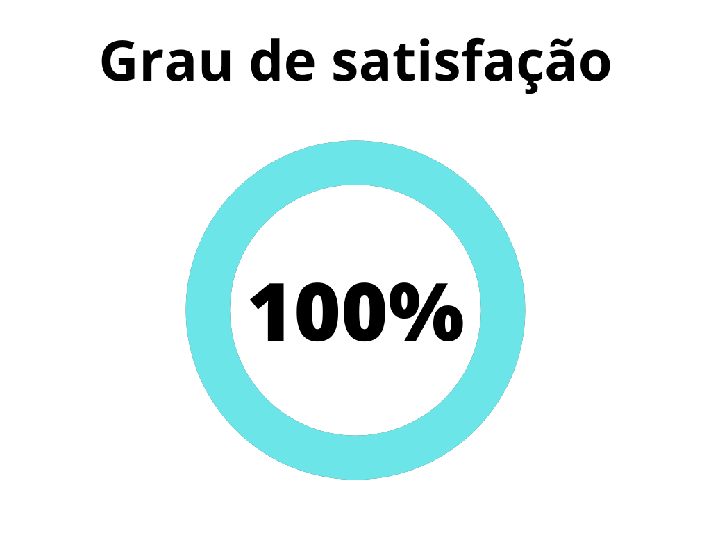
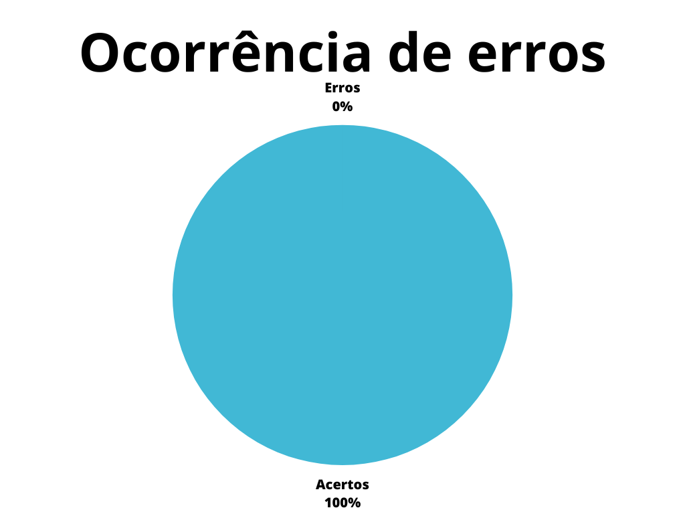

# Relato de Resultados da Avaliação de Storyboards do projeto

## 1. Introdução

Este documento possui a função de verificar o artefato referente ao relato dos storyboards do projeto do [grupo 7 - Agiel](https://interacao-humano-computador.github.io/2023.1-Agiel/)[3]. O relato dos storyboards busca documentar os resultados que foram obtidos da avaliação sobre os storyboards.

## 2. Metodologia

A metodologia utilizada neste documento segue o modelo proposto no [planejamento](../planejamento.md)[1] onde serão utilizados dois _checklists_, um para padronização e outro referenciando o conteúdo dos artefatos. Estes _checklists_ consideram o artefato verificado presente no repositório do [grupo 7 - Agiel](https://interacao-humano-computador.github.io/2023.1-Agiel/)[3].

## 3. Verificação

Abaixo se encontram as verificações realizadas, na tabela 1 se encontram as verificações de padronização, enquanto na tabela 2 estão as verificações de conteúdo, tais verificações foram obtidas a partir do plano de ensino da disciplina[4] e do livro de Interação Humano Computador de Simone Barbosa[2].

### 3.1 Padronização

| ID  | Verificação                                                          | Ocorrências | Acertos | Erros | Possíveis correções                        |
| --- | -------------------------------------------------------------------- | ----------- | ------- | ----- | ------------------------------------------ |
| 1   | Possui ortografia correta e formal?                                  | 1           | 1       | 1     | Consertar no terceiro período do tópico Metodologia, inserir entrevistas: "Nessas entrevistas, os storyboards...". No tópico **Entrevista 2** não ficou claro se no 3. o número 4 se refere ao número do storyboard em si. Acrescentar no tópico "Problemas encontrados e sugestões" o conectivo "Ou seja" para que o último período seja: "Ou seja, não há..."                                         |
| 2   | Possui introdução?                                                   | 1           | 1       | 0     | -                                          |
| 3   | Possui links necessários?                                            | 3           | 1       | 0     | -                                          |
| 4   | As tabelas e imagens possuem legenda padronizada e chamada no texto? | 1           | 1       | 1     | Não há chamadas no texto                                         |
| 5   | As tabelas e imagens estão totalmente em português?                  | 0           | 0       | 0     | -                                          |
| 6   | Possui bibliografia?                                                 | 1           | 1       | 0     | -                                          |
| 7   | A bibliografia está em ordem alfabética?                             | 1           | 1       | 0     | - |
| 8   | Possui histórico de versão padronizado?                              | 1           | 1       | 0     | -                                          |
| 9   | O histórico de versão possui autor(es) e revisor(es)?                | 1           | 1       | 0     | -                                          |

Tabela 1: Verificações de padronização (Fonte: Autor, 2023).

### 3.2 Conteúdo

| ID | Verificação | Ocorrências | Acertos | Erros | Possíveis correções |
|--|--|--|--|--|--|
| 1 | Existe um artefato para relato de resultados da avaliação de storyboards[2] | 1 | 1 | 0 | - |
| 2 | O artefato apresenta os objetivos e escopo da avaliação?[2] | 1 | 1 | 0 | - |
| 3 | O artefato apresenta a forma como a avaliação foi realizada (método de avaliação empregado)?[2] | 1 | 1 | 0 | - |
| 4 | O artefato apresenta o número e o perfil de usuários e avaliadores que participaram da avaliação?[2]| 1 | 1 | 0 | - |
| 5 | O artefato apresenta um sumário dos dados coletados, incluindo tabelas e gráficos?[2] | 0 | 0 | 0 | - |
| 6 | O artefato apresenta um relato da interpretação e análise dos dados?[2] | 1 | 1 | 0 | - |
| 7 | O artefato apresenta uma lista dos problemas encontrados?[2] | 1 | 1 | 0 | - |
| 8 | O artefato apresenta um planejamento para o reprojeto do sistema?[2] | 0 | 0 | 0 | - |                                                         
| 

Tabela 2: Verificações de conteúdo (Fonte: Autor, 2023).

## 4. Resultados

Os resultados da verificação do relato dos resultados da avaliação do storyboard podem ser encontrados na tabela 3 abaixo, onde podem ser verificados o grau de satisfação e a ocorrência de erros no artefato verificado. Estes resultados levam em conta apenas a verificação do conteúdo.

|                                              |                                        |
| ------------------------------------------------------------------------------- | -------------------------------------------------------------------------- |
| Figura 1: Representação do grau de satisfação do artefato (Fonte: Autor, 2023). | Figura 2: Gráfico de ocorrência de erros no artefato (Fonte: Autor, 2023). |

Tabela 3: Representações gráficas dos resultados da verificação (Fonte: Autor, 2023).

## 5. Referências Bibliográficas

> [1] Artefato de planejamento da verificação, acesso em: 5 de junho de 2023. Para mais informações acesse: [link](../planejamento.md)

> [2] Barbosa, S. D. J.; Silva, B. S. da; Silveira, M. S.; Gasparini, I.; Darin, T.; Barbosa, G. D. J. (2021) Interação Humano-Computador e Experiência do usuário. Autopublicação. ISBN: 978-65-00-19677-1.

> [3] Repositório Agiel do semestre 2023.1, acesso em: 5 de junho de 2023. Para mais informações acesse: <https://interacao-humano-computador.github.io/2023.1-Agiel/>

> [4] SALES, André Barros. Plano de ensino da disciplina. Disponível em: [https://aprender3.unb.br/pluginfile.php/2523360/mod_resource/content/33/Plano_de_Ensino%20FIHC%20202301%20Turma%202.pdf](https://aprender3.unb.br/pluginfile.php/2523360/mod_resource/content/33/Plano_de_Ensino%20FIHC%20202301%20Turma%202.pdf). Acesso em: 5 de junho de 2023;
## 6. Histórico de versão

|  Versão  |   Data   |                      Descrição                      |    Autor(es)   |  Revisor(es)  |
| -------- | -------- | --------------------------------------------------- | -------------- | ------------- |
|  `1.0`   | 05/06/23 | Criação do documento e adição do conteúdo           | Pedro Henrique | Carlos Eduardo |
