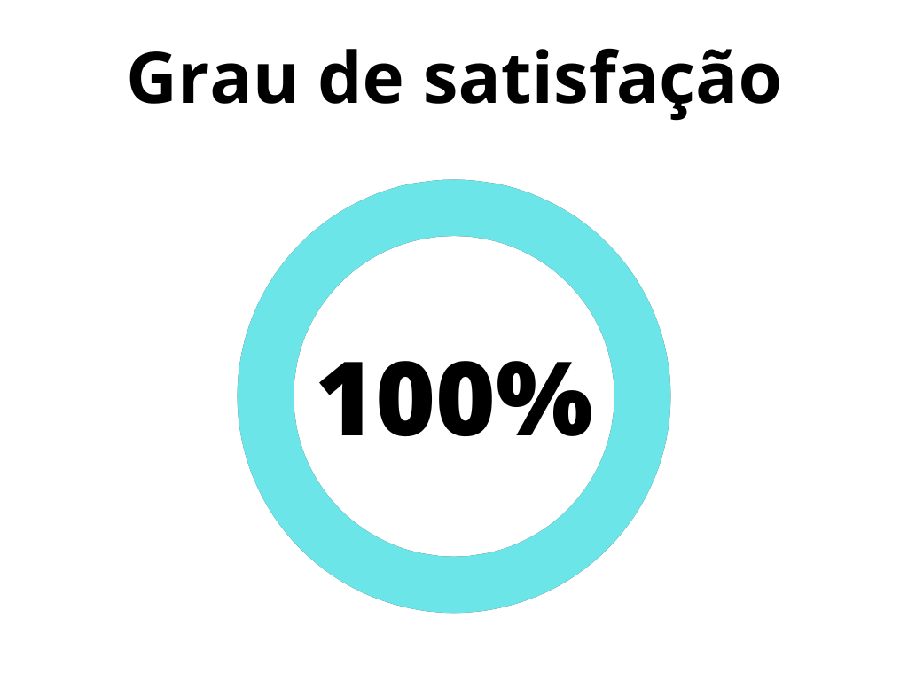
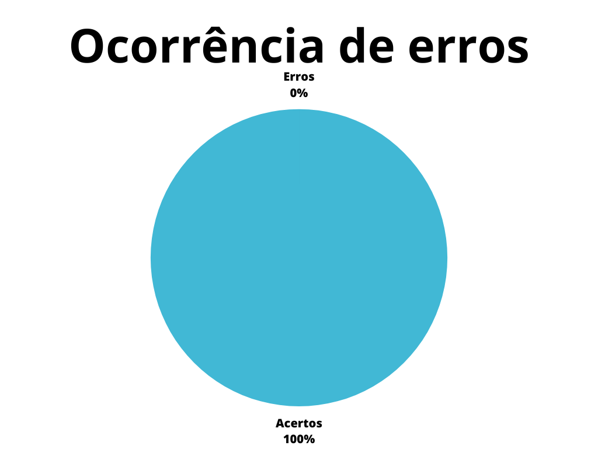

# Verificação - Relato Análise de Tarefas

## 1. Introdução

Este documento possui a função de verificar o artefato referente ao Relato da Análise de tarefas do 
projeto do [grupo 7 - Agiel](https://interacao-humano-computador.github.io/2023.1-Agiel/)[3]. O Relato da análise de tarefas demonstra de forma clara como ocorreu a execução das tarefas planejadas previamente no projeto

## 2. Metodologia

Será utilizado o método de "Checklist" proposto no [planejamento](./planejamentoVerificacao.md)[1] , no qual as 
perguntas que tem como base nas referências da análise de tarefas, sendo assim, quando a pergunta não for 
atendida pelo artefato o documento terá uma 
demonstração de ocorrências de erros e acertos através de uma tabela padronizada pelo planejamento da 
verificação de artefatos do [grupo 7 - Agiel](https://interacao-humano-computador.github.io/2023.1-Agiel/)[3]

## 3. Verificação

Abaixo demonstramos através de duas tabelas as verificações realizadas no artefato escolhido. Na tabela 1, 
avaliamos a padronização do projeto, enquanto na tabela 2, se encontram verificações obtidas através dos 
conhecimentos obtidos  partir do plano de ensino da disciplina[4] e do livro de Interação Humano Computador 
de Simone Barbosa[2].

### 3.1 Padronização

| ID | Verificação | Ocorrências | Acertos | Erros | Possíveis correções |
|:-:|--|--|--|--|--|
| 1 | Possui ortografia correta e formal? | 1 | 1 | 0 | - |
| 2 | Possui introdução? | 1 | 1 | 0 | - |
| 3 | Possui links necessários? | 0 | 0 | 0 | - |
| 4 | As tabelas e imagens possuem legenda padronizada e chamada no texto? | 0 | 0 | 0 | - |
| 5 | As tabelas e imagens estão totalmente em português? | 0 | 0 | 0 | - |
| 6 | Possui bibliografia? | 1 | 1 | 0 | - |
| 7 | A bibliografia está em ordem alfabética? | 1 | 1 | 0 | - |
| 8 | Possui histórico de versão padronizado? | 1 | 1 | 0 | - |
| 9 | O histórico de versão possui autor(es) e revisor(es)? | 1 | 1 | 0 | - |

Tabela 2: Modelo de checklist para padronização (Fonte: Autor, 2023).

### 3.2 Conteúdo

| ID | Verificação | Ocorrências | Acertos | Erros | Possíveis correções |
| :-: | ------- | -------- | -------- | ------ | -------- |
| 1 | Existe um artefato para o relato da Análise de tarefas? | 1 | 1 | 0 | - |
| 2 | O artefato deixa claro como foi realizada a pesquisa? | 1 | 1 | 0 | - |
| 3 | Os resultados foram separados em subcategorias para a análise? | 1 | 1 | 0 | - |
| 4 | O artefato deixa seu objetivo claro? | 1 | 1 | 0 | - |
| 5 | O artefato demonstra quais participantes foram definidos? | 1 | 1 | 0 | - |
| 6 | O artefato demonstra através de visualização gráfica e de fácil análise dos resultados obtidos? | 0 | 0 | 0 | - |
| 7 | O artefato possui uma conclusão plausível seguindo o rumo dos fatos previamente apresentados? | 1 | 1 | 0 | - |
| 8 | As questões éticas foram respeitadas? | 1 | 1 | 0 | - |
| 9 | As referências bibliograficas estão corretas? | 1 | 1 | 0 | - |

Tabela 3: Modelo de checklist para relato análise de tarefas (Fonte: Autor, 2023).

## 4. Resultados
Os resultados da verificação do relato dos resultados da avaliação da análise de tarefas podem ser encontrados na tabela 3 abaixo, onde podem ser verificados o grau de satisfação e a ocorrência de erros no artefato verificado. Estes resultados levam em conta apenas a verificação do conteúdo.

|                                              |                                        |
| ------------------------------------------------------------------------------- | -------------------------------------------------------------------------- |
| Figura 1: Representação do grau de satisfação do artefato (Fonte: Autor, 2023). | Figura 2: Gráfico de ocorrência de erros no artefato (Fonte: Autor, 2023). |

Tabela 3: Representações gráficas dos resultados da verificação (Fonte: Autor, 2023).

## 5. Referências Bibliográficas

> [1] Agiel, acesso em: 1 de junho de 2023. Para mais informações acesse: <https://www.agiel.com.br/site/>

> [2] Gerência e Qualidade de Software - Aula 06 - Técnica de revisão – UNIVESP

> [3] REINEHR, Sheila. Engenharia de Requisitos. Porto Alegre: Sagah, 2020.

> [4] Repositório Agiel do semestre 2023.1, acesso em: 1 de junho de 2023. Para mais informações acesse: 
<https://interacao-humano-computador.github.io/2023.1-Agiel/>

> [5] SALES, André Barros. Plano de ensino da disciplina. Disponível em: [https://aprender3.unb.br/pluginfile
php/2523360/mod_resource/content/33/Plano_de_Ensino%20FIHC%20202301%20Turma%202.pdf](https://aprender3.unb.br
pluginfile.php/2523360/mod_resource/content/33/Plano_de_Ensino%20FIHC%20202301%20Turma%202.pdf). Acesso em: 1
de junho de 2023;

## 6. Histórico de versão

| Versão | Data     | Descrição                                        | Autor(es)   | Revisor(es)   |
| ------ | -------- | ------------------------------------------------ | ----------- | ------------- |
| `1.0`  | 05/06/23 | Criação do documento | Amanda N. | Carlos E. |

